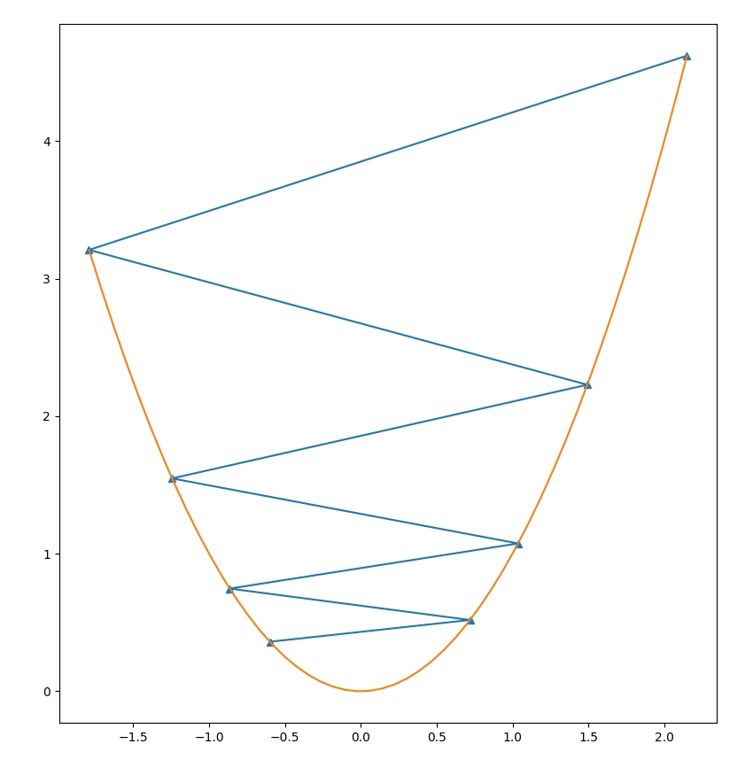
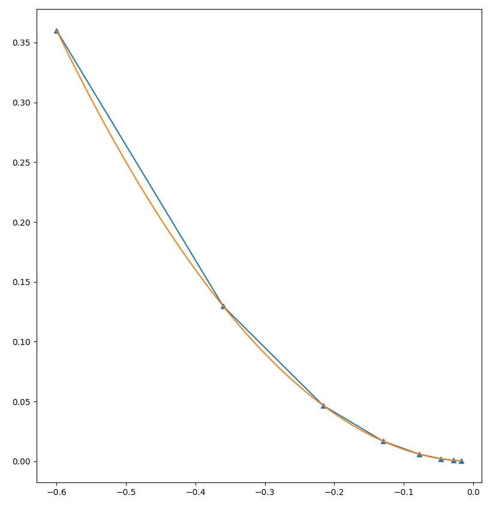
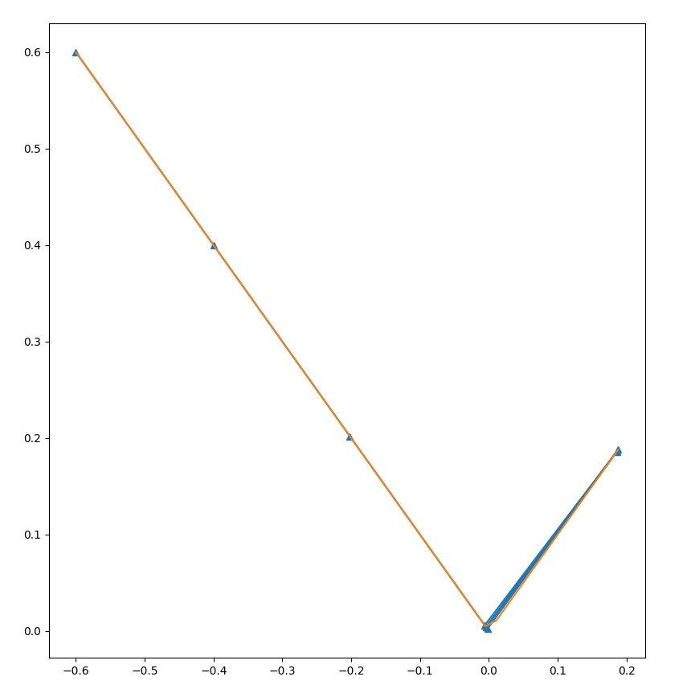

+++
title = "Automatic Differentiation in Bril"
extra.author = "Horace He & Qian Huang"
extra.latex = true
extra.bio = """
    Horace He is a senior undergraduate studying CS & Math. He's interested
    in the intersection of machine learning and compilers. This past summer,
    he worked on PyTorch at Facebook, as well as automatically scheduling
    Halide programs.

    Qian Huang is a junior undergraduate studying CS & Math. She's mostly
    interested in machine learning and algorithms, and was partially roped
    into the class by Horace. She's curious about the compiler optimizations
    people perform in practice.
"""
+++

Our goal was to add *automatic differentiation* to Bril. Automatic
Differentiation is a technique to calculate the derivative for arbitrary
computer programs. Say we wanted to calculate the derivative of some
arbitrarily complex function, say `f(x, y) = (x*y + y)/(x*x)`. One _could_
manually derive the partial derivatives of x and y... or we could simply
apply automatic differentiation. :)

The central observation of automatic differentiation is that even the most
complicated equation can be split into a composition of primitives
(like add, multiply, or trigonometric functions). Then, through the magic of
the chain rule, we can compose the derivatives together arbitrarily to get
the derivative of our complicated function.

In the ML community, this is often known as *autograd*. This is somewhat of a
misnomer - Autograd is actually the name of a [popular Python
package](https://github.com/HIPS/autograd), and several popular ML libraries
made confusions of
[terminology](https://twitter.com/soumithchintala/status/925700439450030082).

## Background / Design Overview

There are two primary ways of doing automatic differentiation. The first is
known as "forward-mode automatic differentiation", the second as
"reverse-mode automatic differentiation" (i.e, backpropagation). In reality,
these are simply different orders to apply the chain-rule, but they have
far-reaching consequences.

Take the function composition (example taken from Wikipedia).
$$
y = f(g(h(x))) = f(g(h(w_0))) = f(g(w_1))= f(w_2) = w_3
$$
$$
w_0 = x
$$
$$
w_1 = h(w_0)
$$
$$
w_2 = g(w_1)
$$
$$
w_3 = f(w_2) = y
$$

Then, through an application of the chain rule, we obtain that $\frac{dy}{dx} =
\frac{dy}{dw_2} \frac{dw_2}{dw_1} \frac{dw_1}{dx}$. Note that this application of the chain rule may
not look like the standard form you were taught ($\frac{dz}{dx} = \frac{dz}{dy} \frac{dy}{dx}$ vs
$f(g(x))' = f'(g(x))g'(x)$). However, they are fundamentally the same,
assuming that $z = f(y)$ and $y = g(x)$.

Substituting $\frac{dz}{dy}$ with $f'(y)$ and substituting $\frac{dy}{dx}$ with $g'(x)$, we get:

$$
\frac{dz}{dy} \frac{dy}{dx} = f'(y)g'(x) = f'(g(x))g'(x)
$$

Now, back to automatic differentiation.

Given $\frac{dy}{dx} = \frac{dy}{dw_2} \frac{dw_2}{dw_1} \frac{dw_1}{dx}$, there are two ways we can decompose
this expression into functions. We could compute $\frac{dy}{dx} = \left(\frac{dy}{dw_2}\right)
\left(\frac{dw_2}{dw_1} \frac{dw_1}{dx}\right)$ or we could compute $\frac{dy}{dx} = \left(\frac{dy}{dw_2} \frac{dw_2}{dw_1}\right)
\left(\frac{dw_1}{dx}\right)$. The first one is forward-mode automatic differentiation, the
second one is reverse-mode.

When we have only one input and one output, these don't differ in a
meaningful manner. Mathematically, these will result in the same values as
well. The only difference is in the complexity of these 2 methods - we'll
cover that in a later portion.

Despite the fact that this mathematical symmetry is pretty nifty, it doesn't
provide much intuition about how these automatic differentiation methods work
in practice. How does one translate actual code into this abstract
mathematical expression?

Take this code:
```
f(x, y):
    a = x * y
    b = x + a
```
Applying the chain rule, we obtain:
```
f(x, y):
    a = x * y
    da = y * dx + x * dy # We calculate da after calculating a.
    b = x + a
    db = dx + da # We can calculate db after calculating b.
```
Now, let `dx=1` and `dy=0` to find any of these derivative wrt x. This is *forward-mode automatic differentiation*.

#### Q: What does setting `dx=1` even mean?

A: One common formulation is to treat your input variables as being
differentiated wrt some arbitrary variable $t$. One can think of this $t$ as
a variable that controls which direction in your input space you're taking
the derivative along. So setting $\frac{dx}{dt}=1$ and $\frac{dy}{dt}=0$ gets you the
derivative wrt moving $x$ positively. Setting $\frac{dx}{dt}=0$ and $\frac{dy}{dt}=1$ gets
you the derivative wrt moving along $y$. One could even imagine setting
$\frac{dx}{dt}=1$ and $\frac{dy}{dt}=1$ to get the derivative wrt moving diagonally in input
space.

#### Q: What we wrote after applying the chain rule looks awfully close to actual code. Can we generate code that generates a function that generates derivatives?

A: Yes! This is a cool method of doing automatic differentiation, recently
popularized by [Julia](https://arxiv.org/abs/1810.07951). In practice, this
is a lot more difficult than my example may make it seem. Handling
expressions is relatively straight-forward, but doing a source to source
transformation that preserves control flow, state, and other such things is
substantially more difficult. The primary pitch for doing things this way is
that we can then take advantage of all the compiler optimizations we usually
apply on our code.

#### Q: Isn't this pretty ... basic?

A: I'd say so. Forward-mode automatic differentiation is a fairly intuitive
technique. We just let our code run as normal and keep track as derivatives
as we go. For example, in the above code,


## Forward-Mode Implementation

There's a neat trick for implementing forward-mode automatic differentiation,
known as dual numbers. Dual numbers are in the form `a + bε`, and look an
awful lot like complex numbers (so `(a+bε) + (c+dε) = (a+c) + (b+d)ε`),
with the important difference that `ε^2 = 0`. So, to perform automatic
differentiation, we replace all numbers in our program with dual numbers.

Then, the derivative we want of a given number wrt to the input is simply
given by its epsilon term. So, in the addition example, the derivative of the
addition of two numbers is equal to the sum of their derivatives. For
multiplication `(a+bε) * (c+dε)`, it's equal to `(a*b + c*d)`.

So, what is this epsilon term? One (not entirely inaccurate) way of
interpreting it is as an infinitesimal. Squaring an infinitesimal makes it
disappear, but otherwise, it's somewhat similar to numerical differentiation.

We implemented forward-mode in this fashion. The primary work was done in the
`brili` interpreter, where we simply interpreted every integer as a floating
point number, and then augmented it to be a dual number. Then, we simply
augmented every single operation to either operate on dual numbers (addition,
multiplication, etc.) or kill the derivatives (conditionals).

When we come to conditionals, the derivatives no longer flow through the
program, as they're not directly involved in the output.

For example, take:
```
if (y > 0)
    return x;
else
    return 0;
```
The output of the function has no derivative wrt `y`.

## Reverse-Mode Automatic Differentiation

Reverse-mode automatic differentiation is less intuitive than forward-mode.
So why do we need reverse-mode in the first place? Forward-mode allows us
to compute arbitrary derivatives, but notice that in order to get how the
output varied with the 2 input variables, we needed to apply the
auto-differentiation algorithm twice. In particular, forward-mode
auto-differentiation requires computation equivalent to `O(N)` evaluations of
a function `f: R^N -> R^M` in order to calculate all the derivatives.

This kind of function shows up a lot in machine learning, where we're often
optimizing for a single loss. In that case, we often want `f:R^(millions of
parameters) -> R^1`. Needing to evaluate the function millions of times to
just perform a single step of gradient descent is too difficult.

To resolve this, we use reverse-mode automatic differentiation. At a high
level, if forward-mode is asking the question "How are all the output
variables affected by my current input variable?", then reverse-mode is
asking the question "How do all the input variables affect my current output
variable?". In some sense, we're flipping the forward-mode differentiation
algorithm on its head.

This allows us to compute an output variable wrt arbitrarily many input
variables in merely a single pass through the function. That is, we need
`O(M)` evaluations of a function `f: R^N -> R^M` (as opposed to `O(N)` for
forward-mode).

Implementing this is a bit trickier than implementing forward-mode. We can no
longer tie our gradient computation to our actual computation, we must
construct a graph that allows us to *replay* our derivatives after all of our
computation is finished.

We implemented this by constructing a `RevADNode` for every computation we
perform. This `RevADNode` is pushed onto the children of the inputs to this
computation. In this way, our entire computation is saved as a graph in
memory, while no gradients are computed. At each point, we simply need to
store the value of the expression, as well as its portion of the derivative.

The result is a dataflow graph, where each node corresponds to a value that
was computed during the normal interpretation of the program. For example, if
there's a loop that runs `N` times with `M` instructions in the body, this
will result in `N*M` `RevADNode`s.

Once we've finished all of our computation, we can finally traverse our entire graph to calculate all of our gradients. This is the key code that performs the computation.

Reverse-mode auto-differentiation requires us to calculate all of the
dependencies from the output to the value we're calculating the gradient of.
To do so, we recursively calculate the gradient of all the node's children,
and then calculate the gradient using the chain rule + the values that were
stored at that point.

```
  grad(): number {
    if (!this.gradValue) {
      this.gradValue = 0;
      for (const val of this.children) {
        const [num, node] = val;
        this.gradValue += num * node.grad();
      }
    }
    return this.gradValue!;
  }
  ```

A couple notes:
- While previously, we needed to manually set the initial gradient of the inputs, we now need to set the initial gradient of the outputs.
- Explicitly constructing a node and pointers to its children is very memory inefficient. Typical implementations often do it in a "tape-based" manner, also known as a Wengert List. This is a mere constant factor optimization - the core idea is the same as the one presented above.

### Reverse-Mode vs Forward-Mode

It may seem that, in typical contexts, reverse-mode automatic differentiation
is strictly superior. It's far more common to see a "many to one" function
than a "one to many" function. And that is true! Most automatic
differentiation frameworks (i.e: ML frameworks) only implement reverse-mode
(PyTorch, TensorFlow, MxNet, etc.).

However, there are still instances where forward-mode automatic
differentiation is very useful: computing the Hessian of `f(x)`
multiplied by a vector `v` - a Hessian vector product - is one instance. The typical algorithm
for this requires [both forward-mode and reverse-mode automatic
differentiation](https://github.com/pytorch/pytorch/issues/10223#issuecomment-413935344).
If one only has one of these implemented, we must perform at least `O(N)`
evaluations of the function.

### Automatic differentiation in the presence of control flow

One notable absence from all this discussion has been control flow. We
haven't discussed how gradients flow through control flow, nor mentioned
control flow at all.

Put simply, control flow can be treated as a static construct. Remember that
we're taking derivatives, which ask for how our function changes if we add
epsilon to an input. In that model, our control flow will not change at all,
and our derivative can be calculated with the exact same operations that we
performed when evaluating the function.

This is limiting in certain instances, and may not correspond with what we
believe *should* be the gradient. For example, take
```
if m > 0:
    return x
else:
    return 1000 * x
```

If our goal is optimize the function, then perhaps there should be some kind
of gradient through `m`. Differentiable relaxations of common control flow
constructs is an ongoing area of research.

# Notable Challenges

One issue for us is that automatic differentiation is typically applied to
functions. But, Bril doesn't have functions... :'( What we did was add a
representation to the Bril JSON format that specified input variables as well
as initial values for those input variables. As such, much of the usage of
the auto-differentiation must be done outside of the Bril language itself.
One thing that would be interesting future work would be to integrate the
function call work of one the other groups with Bril syntax so that we could
use auto-differentiation from within Bril.

Another issue that we had was in separating out the different
auto-differentiation systems. While in other languages, AD systems can often
be implemented through a combination of custom objects + operator
overloading, Bril doesn't have either one of these concepts. As such, we
simply shoved everything inside of the interpreter.

Finally, we had difficulties scaling our automatic differentiation systems
automatically, as Bril lacks arrays. Without arrays, we're naturally bounded
in how many input variables we can have. We could have written some code-gen
to write much larger Bril programs, but we decided not to.

## Evaluation

Our primary evaluation was to run Bril as an AD engine through the command
line, for the purposes of optimizing some function within Python.

For this purpose, we wrote an `opt.py`, which simply compiles a TypeScript
file, sets the parameters, and repeatedly runs our AD engine for the purposes
of gradient descent.

For all of the below examples, we ran with both forward-mode and reverse-mode to ensure they both worked.

Let's take a simple function:
```
y = x * x
```
With a high learning rate, our optimization process diverges! Oh no!



However, with a suitably low learning rate, we see that we converge to our desired minima.


Let's take a function with some control flow.
```
if (x>0) {
    y = x;
} else {
    y = 0-x;
}
```

We see that unlike when our function was nice and convex, we constantly oscillate in this setting.

We also tested it on functions with multiple input variables and output variables. Unluckily, those a bit more difficult to visualize. However, we can report some results. :)

For example, optimizing the function:
```
var a = x0 - x1;
var b = a - 2;
y = b * a;
```
Gives the results of `x0 = 0.7`, and `x1=-0.3`, for a minimum value of `-1`. The first several steps of the optimization process are shown here.
```
f(x):   [x0, x1]:
[5.76] [-0.6  1. ]
[-0.7296] [ 0.44 -0.04]
[-0.98830141] [ 0.64592 -0.24592]
[-0.9994546] [ 0.68832305 -0.28832305]
[-0.99997269] [ 0.69738716 -0.29738716]
```

We did not end up verifying the scaling properties of forward-mode vs reverse-mode for 2 reasons.
1. From the implementation, these properties are fairly obvious.
2. It's difficult to verify these properties in a meaningful way without arrays.
