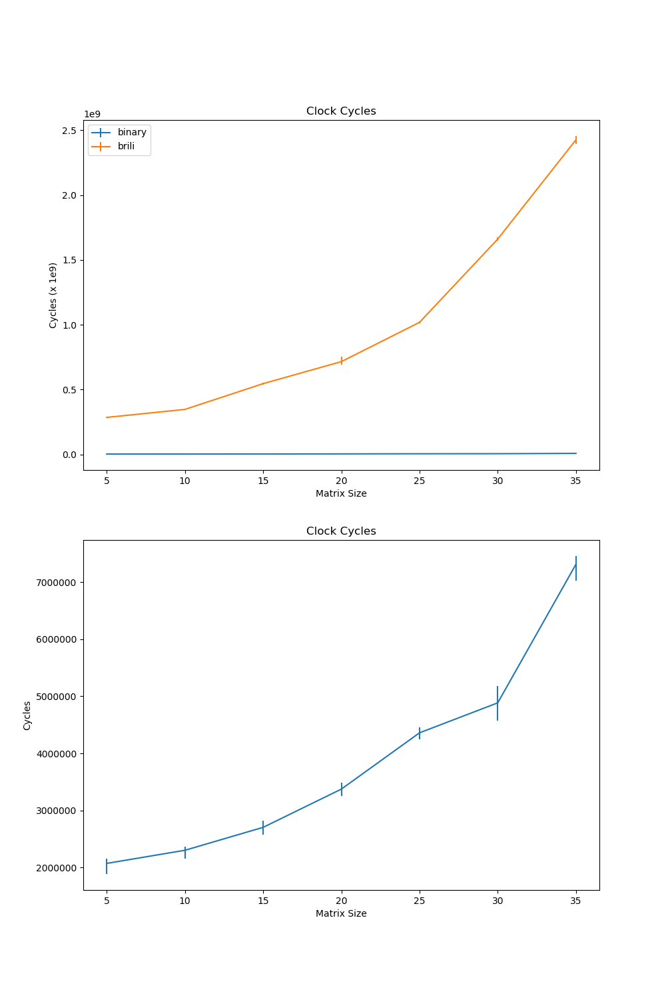
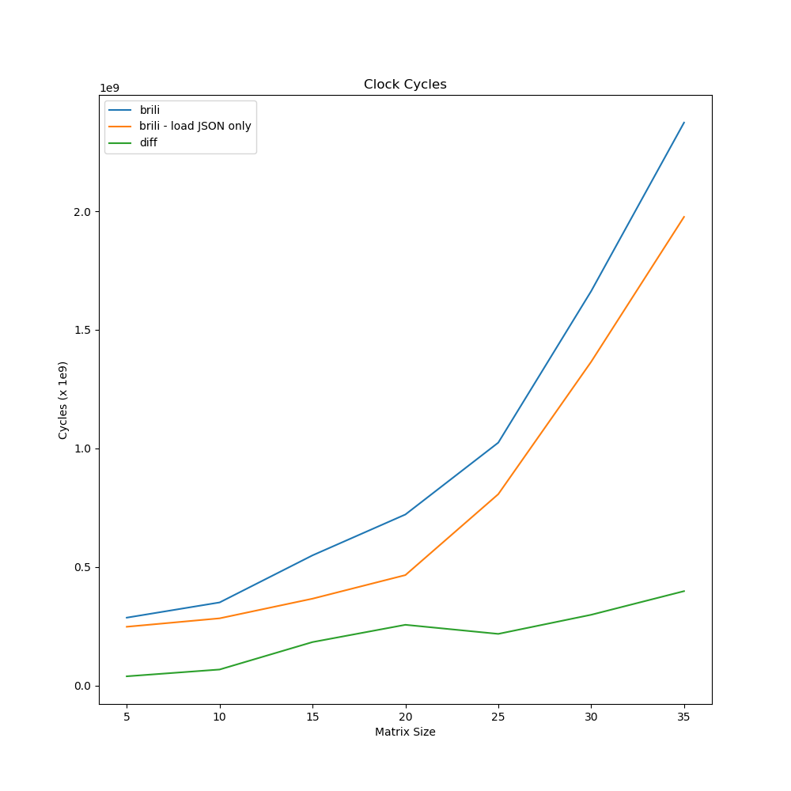

+++
title = "Run Bril on Raspberry Pi Natively"
extra.author = "Hongbo Zhang"
extra.author_link = "https://www.cs.cornell.edu/~hongbo/"
extra.bio = """Hongbo Zhang is a first PhD student in computer science. He is interested in systems and computer architectures. He is also okay archer shooting recurve bow."""
+++

[Bril][] comes with a reference interpreter `brili`, 
which allows any platform that supports Node.js to run Bril code.
The downside of using an interpreter is that
the performance is usually not as good as a native binary.
Therefore, it would be more efficient (and cool) if Bril could be run natively on a ARMv8 processor.
In this project, I am going to build a code translator that
translate Bril to AArch64 assembly,
so that it can run on a 64-bit Raspberry Pi (Raspberry Pi 2B v1.2 or later versions)
or any other 64-bit ARM devices with the AArch64 architecture.

[bril]: https://github.com/sampsyo/bril

## Design and Implementation

This section will discuss how the translator is designed and implemented.
Although there are almost one-to-one mappings between Bril instructions and AArch64 assembly,
there are still some details that needs to be carefully designed to support
current and future functions of Bril.

### Types

Currently there are two values types in Bril:

* `int`: 64-bit two's complement signed integer type. 
It is equivalent to the `int64_t` type in C.
It will occupy 8 bytes of memory and fit in a single 64-bit register of 64-bit ARM processors.
* `bool`: Boolean value that could be either `true` or `false`.
It is equivalent to the `bool` type in C.
It will occupy one whole byte in memory. 

### Variables and Stack Allocation

Currently, Bril only has local variables with the scope of entire function.
Similar to the local variables in C, all local variables are stored on the 
stack frame of the current function.

```
|--frame pointer---|
| local variables  |
|------------------|
| callee-save regs |
|------------------|
```

Unlike C, where variables needs to be explicitly declared, 
Bril instruction with a `dest` opcode will implicitly declare a variable.
In order to build the symbol table and allocate stack space for all variables,
it needs to scan all instructions in the function and add all `dest` variables to 
the symbol table.

ARMv8 requires that the stack pointer is 16-byte aligned.
One easy solution for stack allocation is that each variable occupies one
16-byte stack frame.
However, this is very inefficient since current supported types have size of
8 bytes or less.

The better solution is to keep track of fragmented space on stack. 
When adding a new variable to the stack, 
it will check if there is any fragmented stack space is big enough for the 
variable.
It will only increase the stack size by 16 bytes if there is no enough space.

For example, the following Bril program:

```
main {
    a:int = const 1;
    b:bool = const true;
    c:int = const 1;
    d:bool = const false;
}
```
will have stack allocation like this:

|variable|offset|
|--------|------|
|a       |0x0000|
|b       |0x0008|
|c       |0x0010|
|d       |0x0009|

with free stack space `0x000A~0x000F` and `0x0018~0x001F`.

### Program and Functions

Each Bril file contains one program, which is the top-level object.
Therefore, each Bril file can be translated into one AArch64 assembly file.
Similarly, `main` function is the entry point for the program.

A function in AArch64 assembly consists a label as the function name and a sequence of instructions.
```assembly
func-name:
    instr1
    instr2
    ...
```

At the beginning of a function, it will first push all callee-save registers
onto the stack, including the frame pointer (`x29`) and the link register (`x30`).
Then it will build the symbol table for the current function 
and move the stack pointer and frame pointer accordingly to leave enough space
for all variables.

At the end of a function, there is a label indicating the return point.
Before the process returns to the address in link register by `ret`, 
it needs to pop out all local variables by moving the stack pointer back
   and restore all saved register values.

With this design, function calls could be added easily with minor changes
for passing parameters.

### Arithmetic and Logic Operations

Arithmetic, logic, and comparison operations are easy to translate.

|Bril |AArch64|
|-----|-------|
|`add`|`add`  |
|`sub`|`sub`  |
|`mul`|`mul`  |
|`div`|`sdiv` |
|`and`|`and`  |
|`or` |`orr`  |
|`not`|`not`  |
|`lt` |`lt`   |
|`le` |`le`   |
|`gt` |`gt`   |
|`ge` |`ge`   |
|`eq` |`eq`   |

The difference between Bril and AArch64 is the addressing model.
AArch64 does the operation directly on the register data.
Bril does the operation on variables on the stack, 
     which should be accessed by memory operations.

For example, the Bril instruction `c:int = add a b` will be compiled to the
following sequence of AArch64 instructions:

1. load data `a` to `x8` by `ldr`
2. load data `b` to `x9` by `ldr`
3. `add x8, x8, x9`
4. store `x9` back to the space for `c`

Currently, it does not have register allocation for local variables,
so it needs to load and store data between registers and memory for each instruction. It is slow but fine for now. Optimizations could be done in future works.

## Other Instructions

Other Bril instructions are relatively straight-forward to translate:

* `a:int = const 1;`: store value `1` to the stack location 
of variable `a` by `str`
* `a:int = id b;`: load the value of `b` by `ldr` 
and store to the stack location of `a` by `str`
* `br cond label1 label2`: 
    1. load the value of boolean variable `cond` to `x8`
    2. `cbnz x8, label1` if the value is not zero (true), branch to `label1`
    3. `b   label2` otherwise branch to `label2`
* `jmp label`: `b label` branch to `label`
* `ret`: branch to the return point (stored link register) of current function
* `print`: calling the `printf` function in C. 
There is a small generated function called `printbool` 
to print `true` or `false` strings.

## Evaluation

### Experimental Setup

The experiment is done on a Raspberry Pi 3B+, 
which has a quad-core 1.2GHz Broadcom BCM2837 64-bit processor
and 1GB LPDDR2 SDRAM.
Generated AArch64 assembly programs are aseembled and linked by gcc version 8.3.0.

In order to evaluate the performance of Bril interpreter and 
native binary programs,
both approaches are tested on an n-by-n matrix multiplication workload,
which has `O(n^2)` space usage, `O(n^3)` arithmetic operations, 
      and `O(n^3)` memory accesses.

The benchmark Bril program is generated by a Python script
and translated into JSON format for Bril interpreter, 
so that the translation to JSON will not be counted in performance evaluation.
The `perf` tool is used to report total clock cycles.

Each experiment runs for 10 times to report average and 
variance of experiment data.

### Result

The experiment runs matrix multiplications from 5 by 5 to 40 by 40, with step
size 5.



The first plot shows the comparison of clock cycles between the Bril interpreter
and native binary programs. 
The second plot zooms in to show the trend of clock cycles of binary programs.
The native binary program runs much faster than Brili interpreter
on the matrix multiplication of the same size.

### Analysis

So "where have all my cycles gone?"


By removing the `evalProg` function from the Bril interpreter,
it will only load and parse the JSON file.
The experiment is re-run to obtain the average cycles spent on loading.



By comparing the blue line and orange line in the plot,
it shows that on average most of the cycles are spent on parsing JSON input.
The average cycles spent on evaluating programs, 
    by taking the difference of blue and orange line,
    are shown as the green line.

Let's take a look at the file sizes. 

|n|5|10|15|20|25|30|35|
|---|---|---|---|---|---|---|---|
|binary size|18K|46K|126K|282K|530|902K|1.4M|
|JSON size|54K|374K|1.2M|2.8M|5.3M|9.1M|15M|


One of the reasons is that the Bril code file gets too large to do simple tasks
because current Bril lacks of basic language features.
For example, Bril does not have arrays yet,
so it is not possible to do matrix multiplication with loops.
Therefore, each multiplication instruction is explicitly generated,
    which means the source code increases cubically.

## Conclusion

Native binary Bril programs runs much faster than the Bril interpreter on ARMv8 
processor.
Currently, loading and paring the JSON-format Bril code dominates the execution 
time of Bril interpreter. 
