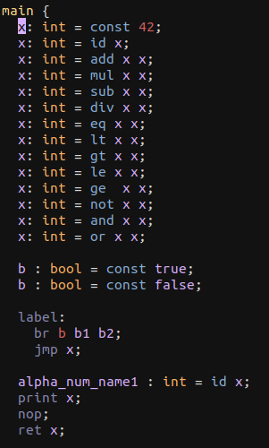

+++
title = "Bril Syntax Highlighting for Vim"
extra.author = "Edwin Peguero"
+++

This project aimed to provide syntax highlighting for Bril in the Vim text editor, with the goal of learning about the implementation process underlying this ubiquitous category of tools. Until now I've taken for granted this tooling across various editing environemnts and programming languages; so I felt that the ability to support my language design efforts might prove useful and interesting.

 

As the project evolved, I quickly discovered the task of *syntax highlighting* to be more open-ended than expected. Ideally, we want the appearance of program text to reflect syntactic structure, but:
- Maintaining a constantly changing syntax tree for an entire program can be slow, and
- The nature of editing is that program text does not always represent a well-formed syntax tree.

This fundamental limitation is acknowledged at the start of Vim's documentation for `syntax`, the collection of syntax highlighting commands:
> Syntax highlighting enables Vim to show parts of the text in another font or color. Those parts can be specific keywords or text matching a pattern.  Vim doesn't parse the whole file (to keep it fast), so the highlighting has its limitations.  Lexical highlighting might be a better name, but since everybody calls it syntax highlighting we'll stick with that.

Even though *syntax* highlighting implies the output of a parsing operation, the reality is closer to *lexing*. However, Vim's powerful regular expressions, in conjunction with the features available through some `syntax` commands, facilitate highlighting that appears more complex than simply highlighting tokens.

### Anatomy of a Vim Syntax Highlighter
The basic structure of a Vim syntax highlighter is designed to separate the concerns of textual appearance from textual extraction of syntactic units. 
A colorscheme will map a language's *syntax groups* to a set of generic *highlight groups* provided by Vim. 
Each highlight group is named after a generic syntax unit, such as `Comment` or `Identifier`, and defines its appearance. 
Thus, the development efforts of language and colorscheme designers are independent, as seen in the implementation of `bril-syntax`: 
```
highlight default link brilComment Comment
highlight default link brilLabel Label
highlight default link brilVariable Identifier
highlight default link brilMain Function
highlight default link brilType Type
highlight default link brilValueOp Operator
highlight default link brilEffectOp Keyword
highlight default link brilNumber Number
highlight default link brilBool Boolean
highlight default link brilCondVariable Boolean
```
My task was simply to define each of the above `bril-` syntax groups.

It's interesting to observe that although this scheme works well for most programming languages, it does not work for any arbitrary formal language, since the baseline set of highlight groups makes an assumption about the 'top' level of syntactic categories. From the `syntax` docs:
> ... a syntax group and a highlight group are similar. For a highlight group you will have given highlight attributes. These attributes will be used for the syntax group with the same name.

To resolve this, one might create new highlight groups, as follows:
```
highlight MyHighlightGroup gui=bold ctermbg=NONE cterm=bold ...
```
However, doing so conflates the roles of language designer and colorscheme designer. To maintain this separation of concerns for more exotic languages, a new set of highlight groups would need to be exposed for colorscheme designers.

Since Bril's syntax fits nicely into the base set of highlight groups, this was not a problem. 
I'll admit, though, that I really wanted to italicize at least one syntax group, and although it's possible to minimally override a colorscheme in this way, any implementation is error prone, possibly version-dependent, and hard to understand and maintain (as is much of **Vimscript**).
Thus, I focused my efforts on designing the needed collection of `bril-` syntax groups.

#### Syntax Groups and Regions
The most basic syntax group is a keyword, defined using the `syntax keyword` command.
It takes two arguments: a name for the syntax group and a set of language keywords.
For example, value ops are defined as follows (ignore the `contained` option, for now):
```
syntax keyword brilValueOp contained
  \ id
  \ const
  \ add
  ...
```

At the next level of generality, we can define syntax groups using regular expressions via the `syntax match` command. For example, Bril comments are defined as follows:
```
syntax match brilComment "\#.*$"
```

Vim provides one final level of generality with the notion of *syntax regions*.
A syntax region is a region of text, delimited by regular expressions on both sides:

```
syntax region regionName start=startRegexp end=endRegexp contains=synGroup1,synGroup2,...
```

When the *start* expression is detected, only those syntax groups *contained* in a region are checked. 
The `contained` option removes top-level visibility from a syntax group, so that they are only parsed when their parent syntax region is parsed. 
Together, these two mechanisms allow for hierarchical parsing of 'syntax-tree-like' syntax groups. 
Besides its effectiveness as a design pattern for organizing syntax groups, regions made it easier to identify the branch condition as a `brilCondVariable`:
```
syntax region brilBranchInstr start='br' end=';' 
  \ oneline contained contains=brilCondVariable,brilVariable,brilEffectOp
```

#### Incremental Parsing via `sync` points
When scrolling through a file or making an edit, Vim needs to figure out the most fitting syntax groups in the corresponding line. Since syntax groups may lie within a syntax region, Vim needs to find the most accurate *syntax state* for the new line:
>Vim wants to be able to start redrawing in any position in the document.  To make this possible it needs to know the syntax state at the position where redrawing starts.

A robust, but slow syntax highlighter can recalculate syntax state across the entire file as needed. 
To improve performance, Vim introduces mechanisms for defining a *sync point* around which syntax state is remembered.
Vim allows for defining a sync point relative to screen and cursor details, including the cursor line number, the lines that have currently been drawn on screen, and user defined look-behind parameters. 
Additionally, Vim provides a mechanism for locally 'guessing' the current syntax region using regular expressions as hints. Although, this requires some parsing several lines, it might be preferable than parsing the entire file.
 
`bril-syntax` uses the `syntax sync fromstart`, which, as the name implies, sets the sync point at the start of the file. Thus, the entire file is parsed with each new line.

## Evaluation
The correctness of `bril-syntax` can be defined by its ability to correctly highlight well-formed Bril code. 
To this end, I highlighted a small Bril file (`test.bril`) containing all base Bril constructs and observed consistent coloring of syntax groups. 
Armed with a [helpful Vim script](https://stackoverflow.com/questions/9464844/how-to-get-group-name-of-highlighting-under-cursor-in-vim), I was able to manually confirm that `bril-syntax` correctly identifies the nested syntax group structures at every cursor position in `test.bril`.

A quantitative evaluation of a syntax highlighter measures its performance in terms of resource utilization under worst-case stress loads, such as when recomputing large, nested syntax regions. The largest syntax region defined in `bril-syntax` spans an entire function definition and contains syntax regions representing the different kinds of instructions. 
I tested performance of `bril-syntax` on an Intel Core i7-6700 by repeatedly destroying and reconstructing the function syntax region on a Bril file containing ~200k instructions, all while observing `htop` in a `tmux` panel. This load had an unnoticeable effect on CPU and memory usage.

A qualitative evaluation observes how smoothly and effectively `bril-syntax` integrates into a Bril workflow. From the results of the quantitative evaluation, it is unsurprising to find that highlighting when scrolling, adding labels and instructions, and destroying and reconstructing syntax regions is immediate, without slowing down file navigation. 
If Bril was heavily used, a user study could assess how the particular choice and arrangement of syntax groups affects usability. For example, in the current `bril-syntax` implementation, the syntax groups contained in instruction regions, such as op names, are only highlighted once a semicolon is typed; it's unclear whether this peculiarity is significant. In either case, changing it would not be difficult.


#### Limitations of Vimscript
Despite its powerful features for syntax highlighting, Vimscript itself is rife with language issues that severely hinder its reliability and maintainability.

References to old variable bindings remain active between executions of a script, a fact I often only realized after restarting Vim.

Regular expressions are powerful, but possibly too powerful; for instance, the ``\ze`` regex atomdrops all matches regexes on both sides, keeping only the match on the left one. Such a regex is easy to express, but is computationally inefficient, potentially encouraging poor implementations.

Finally, [metaprogramming](http://learnvimscriptthehardway.stevelosh.com/chapters/28.html) is idiomatic in Vimscript. 
This is useful, since it allows us to factor out and reuse regexes from syntax group definitions into meta-strings. 
However, since Vimscript makes a distinction between *strings* and *literal strings*, reasoning about "meta-strings" and "meta-literal-strings" can lead to hard to detect bugs.

Semantically, a Vimscript string consists of a list of characters and characters 'escaped' by a backslash. (hence "\" is an invalid string; it is a malformed character escape).
On the other hand, a literal string simply consists of the literal characters in the string.
If we attempt to factor out a regexp as a string, any escaped characters will be stored as 'escaped', rather than as characters.
Splicing this faulty regexp into a program string will generate a faulty program string containing escaped characters.

We can solve this by *escaping each 'escaping' backslash with a backslash, except for those backslashes that escape backlashes.* (It's no wonder the leading Vimscript tutorial recommends [beer](http://learnvimscriptthehardway.stevelosh.com/chapters/08.html) to accompany some of the exercises.)
To avoid backslash hell, we can instead store regexps as literal strings, which can never escape characters.
Later on, these can be spliced with program fragments that are also represented as string literals, rather than strings, to avoid escaping any hard-coded regexps.

Once I dealt with the frustrations and mysterious bugs, I found Vimscript to be pretty fun, in part due to its flexibility,
and I enjoyed pondering the feedback problem of language design for language tooling.

### Design Considerations and Future Work
As I've described it, a syntax highlighter's principal job is to give a meaningful visual presentation to an evolving syntax tree.
In reality, developers have come to expect much more from a syntax highlighter, including:
- Syntactically-aware code editing and navigation, such as automatic indentation, folding, variable renaming, etc.
- Type checking and type information lookup
- Code linting
- etc.


All of these tasks benefit from Vimscript's prowess at text manipulation and syntax extraction, and represent
additional opportunities to explore different concerns in the space of language design for language tooling.

It's unfortunate that these efforts benefit only Vim users; an editor-agnostic approach would be ideal.
[LSP](https://microsoft.github.io/language-server-protocol/) and [Tree-sitter](https://tree-sitter.github.io/tree-sitter/) provide editor-agnostic languages to support these tasks, though a cursory reading of the state-of-the-art reveals that no current tool can accomplish all syntax-sensitive editing features adequately.

For now, I hope you enjoy `bril-syntax`!
