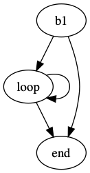

+++
title = "Vril! Vector Bril"
extra.author = "Helena Caminal, Sachille Atapattu and Tuan Ta"
+++

Why Vectors are cool to have!
---------------------------

### High-level idea
In principle vectors are just one-dimensional arrays. An array is a collection of elements that can be accessed by index. However, there are lot of applications where you would perform the same operation on each and every element of an array. This is what is called data-level parallelism (DLP). Some architectures are able to exploit this DLP by encapsulating several operations to different elements of one array into one vector operation. By doing that, they release the pressure in the front-end of the processor because they fetch and decode only once and then they can execute many identical operations concurrently. One of the challenges is for the workloads to exhibit sufficient data-level parallelism to achieve full utilization.

There are three popular options to program for vector architectres, a.k.a. *vectorization*:
- manual vectorization: Explicitly using vector operations in assembly or intrinsics.
- user annotations or [pragmas](https://info.ornl.gov/sites/publications/files/Pub69214.pdf): Help the compiler find the *vectorizable* regions of code and inform the compiler about lack of dependences and other situations that would typically restrict the vectorization.
- auto-vectorization: Rely directly on the compiler vectorizer. In the case of [gcc](https://www.gnu.org/software/gcc/projects/tree-ssa/vectorization.html), it is typically enabled by the flag `-ftree-vectorize` and by default at `-O3`.

Manual vectorization allows explicit control, but usually becomes architecture specific and assumes vector-like programming from the programmer.

Auto-vectorization aims to improve the programmer's productivity by performing a compiler pass to automatically generate vector instructions in a given program. However, in practice help from the programmer is needed to achieve competitive vectorized codes, either fully manual or with the user annotations.

An additional benefit of auto-vectorization and most user annotations is decoupling the program specification and underlying execution which is architecture-specific. The vectorizable source will be portable to different architectures and the compiler will dictate if it can be vectorized or how well it can exploit the program's DLP in order to generate the architecture-specific vector instructions.

This project is aiming at having these general vector specifications at the compiler-level which:
- permits intrinsics or vector assembly instructions to be translated into Bril IR
- permits architecture specific backend to easily generate an executable
- naturally expose opportunities for vector optimizations at Bril
- offer to the compiler (automatic) vectorizer the possibility of generating Bril IR vector operations that can later be mapped into ISA vector instructions

### Link to project
[Vril](https://github.com/sa2257/vril) is our public repository.

Arrays
------------------

### Arrays in Vril
Vril includes a new type `array` to the language. The definition of an array in Vril is a sequence of elements of any type, which includes arrays (no type checking carried out) and the length being any Bril literal. 

### Initializing arrays in Vril
Vril extends Bril to support arrays by adding an `init` operator to initialize an array of length `l` and set its elements to 0 as follows:
```
array_name : array = init l
```

Vril adds array operations to Bril of the form,
```
variable: type = aop args
```
### Supported array operations
Vril can operate on arrays in two ways: 1) We can perform *scalar* accesses to arrays by moving one element of the array to a variable and performing any arithmetic or logic operation that are already supported in the original Bril, and 2) we can perform *vector* accesses to the arrays by using new vector operations that take arrays as arguments directly.

In order to move data from an element of an array `arr[idx]` to a variable `var`, we can use `a2v` op:
```
var: int = a2v array_name idx
```
Similarly, we can move a value stored in a variable `var` into one of the array's element `arr[idx]`:
```
array_name: int = v2a var index
```

Constants are inserted to arrays through variables, just like the original Bril.

Vector ops
----------------------------

### Vector ops in Vril
There are two types of vector ops in Vril: configuration ops and arithmetic/logic ops. Vector arithmetic or logic operations take arrays as arguments and produce an array or a scalar value as a result. Configuration ops are used to adjust the amount of data parallelism needed by the program to the resources that the micro-architecture offers. For example, in a for-loop that has no inter-iteration dependences we could potentially run all iterations in parallel if we had enough hardware resources. Otherwise, we would run it in groups of iterations in parallel that the hardware can handle.

### Adding vector ops to Vril
For now there is only one configuration op: `setvl`, which is based on the [RISC-V V vector extension](https://github.com/riscv/riscv-v-spec).
```
vl: int = setvl val
```
which requests `val` elements to the hardware and returns the `vl`, which is the actual number of elements that the hardware can support. The pseudo-code of this instruction is: 
```
vl := (val <= max_vl)? val:max_vl;
```
where `max_vl` is the maximum amount of lanes or array elements that the micro-architecture can process in parallel.

We have also implemented only one arithmetic vector op `vadd` as a proof of concept:
```
arr3: array = vadd arr1 arr2 idx
```
Which takes two arrays as arguments and performs element-wise vector addition to `vl` elements starting at element `idx`, and stores it into a third array. For now, if `arr1`, `arr2`, and `arr3` have different lengths, as long as elements in indices `i:i+vl-1` are valid for the three arrays (two sources and destination), the operation is valid. 

### Other types on arrays
We have not implemented any array type checking on arrays. While we expect the programmer to only use integer values on array elements; there may not be any error thrown if they stored other types. Vector arithmetic or logic operations have undefined behavior for these cases. We left type checking for future work. 

### Simulating vector ops in Vrili (Vril interpreter)
We have extended Brili to interpret vector operations.
It should be noted that this Vrili implementation is not simulating a vector processor, but allows us to evaluate functionality of Vril and extract performance information.
Vrili executes for loops across the different elements of the array operands in order to produce the correct result. This functionally emulates what a vector microarchitecture would do concurrently with a single fetch-decode effort.
However, Vrili still still assumes the same underlying machine Brili did. This is done by generating separate variables for each array element, i.e. an array `arr` of size 2 will generate variables `arr[0]` and `arr[1]`. Subsequent array element accesses are simply variable accesses. Similar to Brili, Vrili does not impose any access checking, therefore the programmer should take precautions only to access array elements defined by array initialization.

Evaluation
----------------------------

Vril makes two major additions to Bril, adding Arrays and extending Bril operations with vector operations. This section describes how we evaluate each of these.

We take three approaches to evaluate arrays and vector operation `vadd`,
- evaluating integration to Bril and qualitative justification
- evaluating functionality
- evaluating performance

### Qualitative evaluation by inspection.
We ran tests to generate JSON representation of Bril from text format and vice-versa to evaluate whether the array specificationi and vector operations are expressible in both available formats. This also allowed us to manually inspect Bril IR. These tests reside in `vtest/parse` and `vtest/print` directories.

Arrays provide a convenient method to use loops in Bril. To add two groups of 10 numbers, conventional Brili required 43 lines of code, 20 of which would define the 20 numbers and 10 to add them. Vril required 50 lines of code, 20 of which were still used to define two arrays element by element and 6 lines to add them in a loop body. It is observed that as the size of the arrays grow, conventional Bril would need correspondingly more lines of code where as Vril would still use 6 lines of code in the loop body.

### Functional evaluation of arrays and `vadd`.
We first wrote a simple test to initialize an array, store a value to an array and read a value from an array. 
A second test described a loop which would add two array elements and save it in a third array.
Both these tests generated the expected result from the interpreter. These tests reside in `vtest/interp` directory. 

We wrote a program with `vadd` and ran this test in `vrili` with different values for `maxvl` which represents the size of vector length of the backend. The test generated expected results. This is included in `vtest/interp/array_vector.bril`.

#### Performance of `vadd` with arrays.
The initial motivation for Vril is to reduce hop counts (hop counts are the number of basic blocks traversed) by having vector operators in Bril. This aspect is tested by comparing the dynamic instruction count, hop count, and lines of code for a loop executed in a scalar manner and a vector operation. We assume an architectural vector length greater than 10 for this experiment. 

| Program           | Lines of code | Dynamic instructions | Hop count |
|-------------------|---------------|----------------------|-----------|
| Conventional Bril | 43            | 41                   | 1         |
| Scalar Array      | 50            | 109                  | 12        |
| Vector Array      | 48            | 44                   | 3         |

Given that the length of array is N=10 and vector length selected by Vrili at execution is k, and compensating for the start and the end block as shown in the figure, scalar operation iterates N times and vector operation iterates N/k times.

CFG for scalar array operation  | CFG for vector array operation
:-------------------------:|:-------------------------:
 |  

As underscored in the code inspection, array initialization overhead is sizable which requires many lines of code. However, scalar arrays allow concise representation of the computation albeit with an overhead in dynamic instructions. Using vector operations in arrays reduces these dynamic instructions by reducing the number of loop iterations (reflected as less hop counts), i.e. doing more computations with one instruction.

Conclusion
--------------------------------------
We have extended Bril to support array types. We have added two new operations to move data in and out of the arrays so that we can emulate data movements between an array and what it would be a scalar register. We have also extended Bril to support vector operations of two types: configuration and arithmetic. Configuration operations allow programs to modify a vector state and arithmetic operations perform operations on array arguments.

The goal of this exercise was to understand how much an IR needs to change in order to express data-parallel operations. For that, we extended Bril to be able to express vector operations and to compare their potential against a traditional scalar set of operations. For that we wrote a benchmark for vector-vector add (vvadd), which adds the elements of two arrays and stores their results into a third array in two versions: a scalar code and a vector code. The end goal is to verify that the CFG generated is very similar for both codes: it should contain the same number of basic blocks (BB). However, the vector code hops on the BB involved in the `for-loop` statement *vector length* times less than the scalar code. 

[cs6120]: @/_index.md
