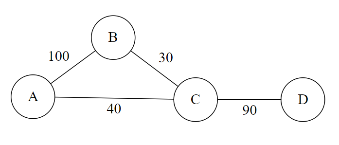
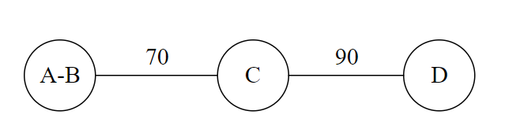
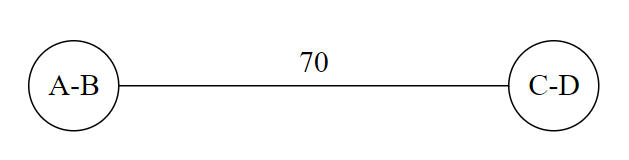
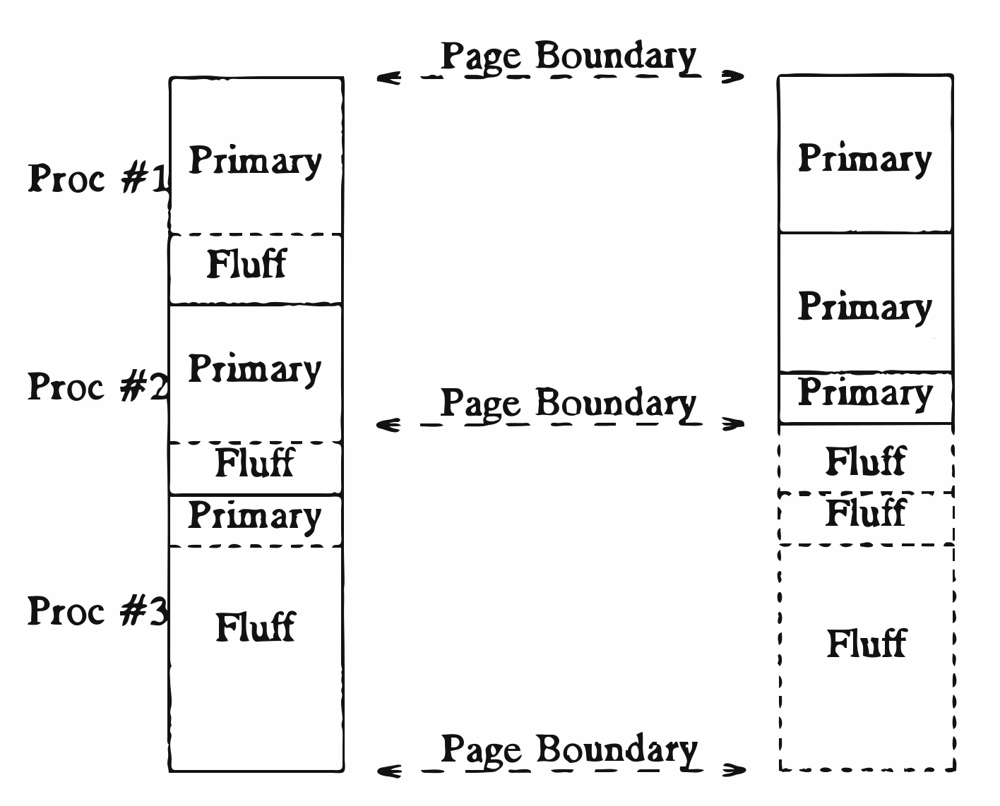
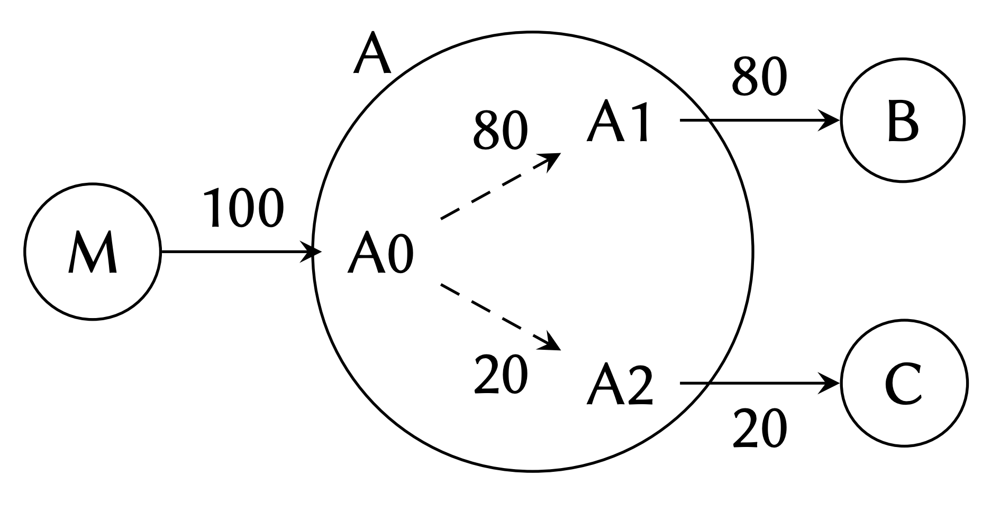
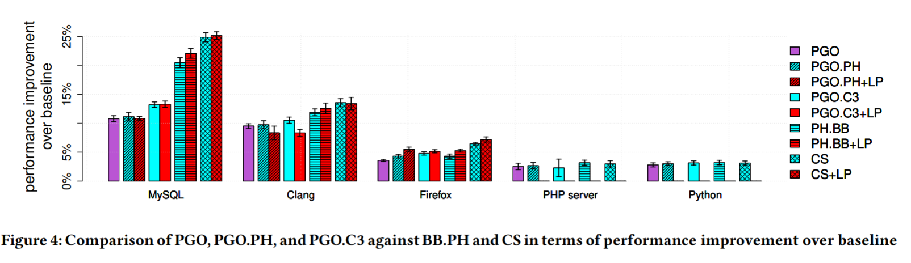
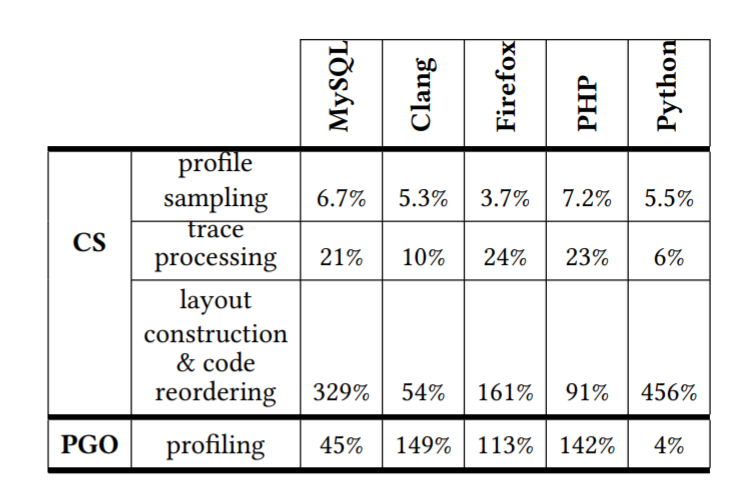

+++
title = "Codestitcher: Inter-procedural Basic Block Layout Optimization"
extra.bio = """
Eashan Garg is an undergraduate studying CS and English.
Gautam Mekkat is an undergraduate studying CS and ECE.
"""
extra.author = "Eashan Garg and Gautam Mekkat"
+++

Programs have dramatically increased in size over the years. Eliminating unnecessary code via traditional optimizations such as dead code elimination, copy propagation, and constant propagation can only do so much. Meanwhile, the capacities of memory units like L1 caches and the TLB haven't grown to account for larger program sizes. One reason for this is that as cache size increases, latency increases. Because of this, we want to optimally order instructions to maximize cache utilization and minimize cache misses. Code layout is critical here. In this post we will discuss this paper's approach to code layout.

## Background: Optimizing Code Layout

Before we get too far in, let's consider how modern compilers approach code layout, specifically function placement. Since 1990, [Pettis and Hansen's code reordering method](https://dl.acm.org/citation.cfm?id=93550) has been the de facto approach, used by LLVM, HHVM, and other compiler infrastructures. Recent function layout techniques, such as call-chain clustering, attempt to improve upon the Pettis-Hansen method by addressing some of its limitations.

### Pettis-Hansen Method
Informally, given a program, the Pettis-Hansen method (hereafter referred to as PH for brevity) works as follows.

1. Generate an undirected call graph, where nodes are functions and edges represent calls from functions to other functions. More formally, a function A and a function B would have an edge between each other if A calls B or B calls A.
2. Run a benchmark workload on this program, keeping track of what calls are made.
3. Generate a weighted call graph, where edge weights are proportional to the frequency of calls between the two corresponding functions.
4. Go through the edges in decreasing weight, joining the nodes connected by the edge. When nodes join, their edges combine, summing weights when necessary. Node names are also concatenated, denoting the corresponding function order.
    - The node names concatenate to maximize the sum of the weights between consecutive nodes. This can involve reversing node names.
6. After this process is complete, no edges will remain in the graph, and the order in which nodes are joined denote the function order.

Let's go through a brief example. Suppose the weighted call graph is as follows.

From the above graph, we see that *A* calls *B* 100 times, *B* calls *C* 30 times, and so on. In the first iteration of the algorithm (step 4), we pick the edge with the largest weight. That's *AB*. We then combine nodes *A* and *B* to arrive at the following graph.

We then combine *C* and *D*.

Here, we obviously combine *A-B* and *C-D*, but recall the rule about concatenating node names. There are four ways to coalesce the nodes:
- *A-B-C-D*: Here, *BC* has a weight of 30.
- *A-B-D-C*: *BD* has a weight of 0 (no edge), so this is worse than the above ordering.
- *B-A-C-D*: *AC* has a weight of 90, which is now the best ordering.
- *B-A-D-C*: *AD* has a weight of 0.

Based on the above, *B-A-C-D* is the optimal ordering, since it maximizes the weight between the coalesced nodes.

### Basic block reordering
PH also works at the basic block level. PH conducts basic block reordering based on "hot" and "cold" portions of code to maximize spatial locality of the program. This is done by moving the basic blocks that run the most frequently to the top of the procedure. Below is a diagram showing how this works. "Primary" refers to "hot" code while "Fluff" refers to "cold" code.

As we reorder blocks, we will need to insert additional jumps to preserve the control flow. Therefore, we wish to order basic blocks in a way that minimizes these unconditional jumps. This is to prevent unnecessary instruction pointer moves during the execution of the program.

### Shortcomings of PH
We have a method for reordering entire functions, but this method does not consider the relationship between individual basic blocks and functions. Consider the following call graph presented in the Codestitcher paper, in which function *A* has three basic blocks, *A0*, *A1*, and *A2*:

Using PH, a viable block layout would be *M-A-B-C*, which we expand to *M-A0-A1-A2-B-C*. If we add up the weights of consecutive blocks (hereafter referred to as control flow transfers), we arrive at 180 (100 for *M-A0* and 80 for *A0-A1*). This is far from optimal, as we can generate the layout *M-A0-A1-B-A2-C* with 280 control flow transfers, an improvement of over 50% from before. Note that we use this metric because it tells us how often code will "fall-through." We want to maximize fall-throughs as this improves spatial locality.

Another drawback of PH is that it uses an undirected call graph. As a result, in the eyes of PH, function *A* calling *B* is the same as *B* calling *A*, and PH treats ordering *A* before *B* as the same as ordering *B* before *A*. However, this is clearly not the case. Let's say *A* calls *B* 100 times, and *B* calls *A* 0 times. Then, if we order *A* before *B*, assuming the call occurs in the middle of *A*, the instruction pointer will have to jump *len(A)/2* instructions to the top of *B*, where *len(A)* denotes the number of instructions in *A*. Alternatively, if *B* was placed before *A*, then *A* would on average jump *len(B) + len(A)/2* instructions. Because of this discrepancy, it is important to take into account the caller and callee relations in the call graph.

### Call-chain clustering
[Call-chain clustering (C3)](https://research.fb.com/publications/optimizing-function-placement-for-large-scale-data-center-applications-2/) is a recent function layout optimization developed at Facebook Research that addresses the issue with using undirected call graphs. We do not discuss its internal details in this post, but a simplified way of thinking about C3 is that it is PH but with a directed call graph. In this way, it improves spatial locality by considering caller-callee relations.

## Codestitcher

This brings us to Codestitcher, an optimizer that integrates basic block reordering and function reordering to improve upon the PH model. Below is a high-level overview of the steps taken in Codestitcher to generate the optimized code layout, given an input program.

1. Using input profile data, generate a weighted CFG with frequencies as edge weights. Using this weighted CFG, perform basic block chaining, ordering basic blocks in a way to minimize jumps.
2. Perform hierarchical code collocation, ordering these basic block chains to form higher-level layouts. Here, the *d*-close partial layout algorithm works to build layouts to maximize spatial locality.

### Profiling
In order to build our weighted CFG for layout analysis, we need to collect data about "control flow transfers" (when control transfers between CFG nodes). Luckily, most Intel CPUs come with a "last branch record", or LBR--- storing recently executed instructions such as jumps, branches, and calls. With the Linux `perf` tool, this data can be gathered and used to generate a weighted CFG for optimizing program layout.

### Basic Block Chaining
We define a basic block chain as a directed sequence of basic blocks where no jumps can occur until the end of the last basic block. Generating a maximum-cardinality set of these chains would constitute the fewest number of unconditional jumps required. The authors denote this problem the *fall-through maximization problem*. This problem is the same as the maximum path cover problem, which is **NP-hard**. PH uses a greedy heuristic to approach this but does not provide a theoretical guarantee of how close to optimal the generated solution is.

There *is* is a 1/2-approximation algorithm for this problem guarantees that the weight of the path cover is within *1/2* of the optimal solution. The authors tested this algorithm on one test machine and found its performance to be only 0.03% over PH's heuristic, which makes it unclear whether this algorithm is really useful. Codestitcher uses a hybrid of PH's method and the approximation algorithm, which provides better results than either algorithm run individually.

### Hierarchical Code Collocation

Coming up with a framework to integrate intraprocedural and interprocedural ordering optimizations while taking *layout distance* (the distance between two instructions) into account is difficult. We will first try to formalize this problem.

#### *d*-Close Partial Layout

It would help if we could formally define what layout distance really means. The paper's definition is quite intuitive: the number of bytes between two basic blocks. To take advantage of spatial locality, we want to ensure that related instructions that are executed frequently have as few bytes between them as possible. This is because when an instruction is loaded into the cache, the entire cache line (which consists of adjacent instructions) is loaded.

Given a specific distance value *d*, we can try to lay out our program to maximize the number of times control is transferred between two basic blocks within *d* bytes of each other. However, this is not enough. We need to optimize over many different *d* values to account for hierarchical memory systems with multiple cache levels. Our goal is to find the *finest grain* layout that maximizes control transfers across all combinations of basic blocks, across multiple distances.

How do we solve this? The paper suggests a greedy approach that encodes the problem as a graph of basic block sequences, with edges weighted by the number of control flow transfers within *d* bytes. Nodes of the graph are iteratively coalesced in order of descending weight, and this is used to build up a function ordering. We output this ordering after all nodes are coalesced and no edges remain.

### Finishing the Codestitcher layout optimization

In the *d*-close partial layout problem, edge weights between basic blocks are a function of the number of *d*-close transfers. However, basic blocks with more instructions will clearly have more *d*-close transfers to other basic blocks---they have more instructions. Codestitcher accounts for this by normalizing each edge weight by the sum of the binary sizes of the two corresponding basic blocks. This layout is then used to recompile an optimized version of the original program.

# Evaluation
The authors evaluate Codestitcher by running it against LLVM's default profile-guided optimization as well as PH's basic block reordering method.

**Note:** Only one test machine is used in the evaluation of Codestitcher. This immediately raises some red flags. Much of Codestitcher's performance improvements depends upon the memory units such as the instruction cache, unified cache, and TLB. Using multiple machines with different cache configurations and architectures is necessary for a thorough evaluation of Codestitcher as compared to other code layout optimization methods. The machine that was used runs Ubuntu 16.04 on two quad-core 3.60 GHz i7-7700 Kaby-Lake processors. It has a 32 KB L1 instruction cache and 256 KB L2 unified cache.

To test Codestitcher, the authors benchmark five programs with large codebases:
- MySQL cluster 7.4.12 with the non-transactional read-only test (oltp_simple)
- Firefox 50.0 with the tp5o benchmark
- Clang 3.9 with LLVM's multisource benchmark test suite
- PHP 7.0 (with httpd 2.4) with WP-Test
- Python 2.7.15 with the apps benchmark group from the Unladen Swallow suite

For each application, the authors compile the binaries and run various benchmarks. The specific compilation configurations used are:
- PGO: LLVM's default profile-guided optimization
- PGO.PH: PGO with PH's reordering algorithm applied on top
- PGO.C3: PGO with call-chain clustering applied on top
- PH.BB: Baseline binary with PH applied on top
- CS: Baseline binary with CS applied on top

To do the actual testing, the authors generate profiles over multiple runs of each distinct method, then take the average time improvement for each code layout optimization technique over ten runs.

Here are the results when testing the programs:

Based on their evaluation, Codestitcher has a visible performance benefit on three of the programs (MySQL, Clang, and Firefox), while PHP and Python show little to no improvement. In fact, most of the code layout optimization methods followed a similar trend. Why is that?

The authors provide an analysis of the MPKI (misses per thousand instructions) on the instruction cache and TLB:

| Application | Instruction cache MPKI | Instruction TLB MPKI |
|-------------|------------------------|----------------------|
| MySQL       | 62.44                  | 9.35                 |
| Clang       | 8.14                   | 1.01                 |
| Firefox     | 9.16                   | 1.54                 |
| PHP Server  | 7.63                   | 0.96                 |
| Python      | 3.40                   | 0.19                 |

As expected, when the load on both the cache and TLB increase, code layout optimization is more effective---this is evidence that these optimization methods in general are taking advantage of the processor's memory units to improve performance. However, we are not convinced that this is enough evidence to conclude that Codestitcher is superior to PH's method, especially because this is only evaluated on one specific processor.

## Other Metrics

While a high-level analysis of the performance of Codestitcher is helpful, the diversity of methods evaluated allows a deeper dive into the specific claims that govern Codestitcher.

1. Function reordering as applied to PGO had little to no impact on performance, with a maximum improvement of 4.1% for instruction cache miss rates. The paper claims that block-based reordering offers significant improvement but uses the performance of CS as a point of comparison. We were somewhat wary of this---perhaps comparing PGO-PH and PGO with some sort of block-based reordering technique would be a more fair analysis of their differences in performance.
2. Large pages universally increase instruction cache miss rate.
3. The authors admit that Codestitcher's performance is somewhat ambiguous with regards to the TLB. While it performs well on MySQL compared to other techniques, the miss rate for the instruction TLB is much higher on Firefox, Python, and PHP.

## Overhead

One final axis that the paper decided to evaluate Codestitcher against was performance overhead of the actual optimization methods:
1. Overhead due to profiling
2. Overhead to construct the weighted CFG
3. Overhead to actual reorder and compute an optimal layout

While the profiling overhead is much lower for CS, the added costs from building the weighted CFG and engaging in code reordering are important to keep into mind when making this comparison. For example, their basic block chaining method has a worse time complexity than that of PH, since it incorporates the approximation algorithm which is slower than PH's greedy heuristic. We think it would have been interesting to also do an overhead comparison to PGO-PH and PGO-C3, which would have had a more fair comparison with regards to layout construction and trace processing overhead.

## Conclusion

The authors discuss a novel method of reordering basic blocks by considering both basic blocks and function-level layouts when reordering code segments. Intuitively, it makes sense that this would lead to "better" layouts, as we have more data to move around. However, we are a little hesitant to accept the authors' claim that Codestitcher is actually better than existing methods. Namely, their evaluation strategy uses only one test machine, and as a result, only runs Codestitcher on a single instruction cache layout. It would have been interesting to see a graph comparing instruction cache size to Codestitcher's benefits, as this would help show the benefits of the *d*-close partial layout stage of the optimizer.

Ultimately, this paper explores a very interesting technique for optimizing code layout, but its evaluation does not do a great job of convincing us that Codestitcher provides substantial benefits over other code layout optimizers.
