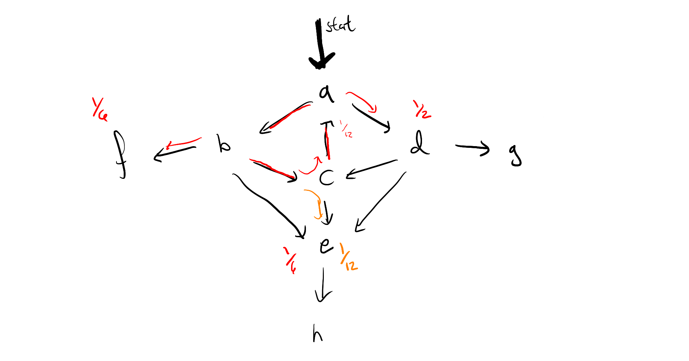
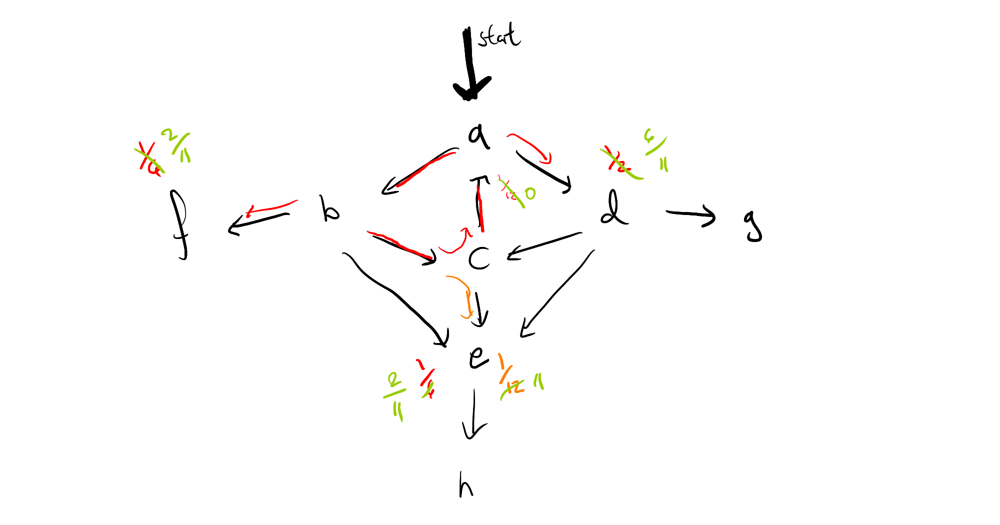

+++
title = "Probabril"
[extra]
latex = true
bio = """
Oliver is a CS PhD student in theory at Cornell, who does decision theory, category theory, and
 spends far too much time on assignments after the due date.
"""
[[extra.authors]]
name = "Oliver Richardson"
link = "https://www.cs.cornell.edu/~oli/"
[[extra.authors]]
name = "Michael Roberts"
+++


# Introduction

Often one would like to represent a non-deterministic process as a combination of operations. Such a representation is often much more compact and often much more clearly represents the process you have in mind, and is easier to edit; a probabilistic program is one such way of representing such a program. All that was needed to do to turn `bril` into a probabilistic programming language is to add a source of randomness --- in our simple case, a coin flip operation. Running such a program, gives you a sample from the distribution.

Of course, having the source code, we can do much more than running programs.

## The Goal: An Exact Solver

The main bit of the project was to write an abstract interpreter that solves for the exact distribution that a probabilistic program represents. For instance, the program below flips two coins:

```
  x : bool = flip;
  y : bool = flip;
  ret
```
we should be able to see represents the distribution

$$ p \left(\begin{matrix} x \land y  \\\\
x \land \lnot y  \\\\
\lnot x \land y \\\\
\lnot x \land \lnot y  \end{matrix}\right)
 = \left(\begin{matrix} .25 \\\\ .25 \\\\ .25 \\\\ .25 \end{matrix}\right)$$

By repeatedly running a program and recording the frequencies of resulting environments (Monte Carlo sampling), one can get a rough approximation of the distribution, but this can be less than satisfying for a number of reasons:

- The resulting distribution is only _likely_ to be _approximately_ correct
- This distribution will likely be very distorted in regions that are unlikely
- It can require exponentially many samples to resolve events
- Equally likely paths are likely to be close, but almost guaranteed not to have exactly the same mass estimate. Worse, no sampling method will ever be able to conclude that $p(x \land y) \not> p(x \land \lnot y)$ with high probability, regardless of the number of samples.

Instead, we can interpret the code as branching into two worlds on a flip, each tracking the exact correct amount of mass. While this works for straight line code, such as the program above, any loop which could run an unbounded number of times will cause the program to run forever. At this point, we have removed the probabilistic component, and we now have a deterministic approximation which will converge to the answer we would like. This alleviates the msot pressing of our issues, but it is midly annoying that we will never terminate when evaluating a program with possibly unbounded iteration, even if the limit point is obvious. For instance, this program which repeatedly flips two coins until one of them lands tails:


```
start:
  x : bool = flip;
  y : bool = flip;
  z : bool = and x y;
  br z start end;
end:
  ret
```
which one can easily see results in the distribution

$$
p \left(\begin{matrix}x \land y \land \lnot z \vphantom{\frac{1}{3}} \\\\
x \land \lnot y \land \lnot z \vphantom{\bigg|} \\\\
\lnot x \land y \land \lnot z \vphantom{\frac{1}{3}}  \end{matrix}\right)
 = \left(\begin{matrix} ~\frac{1}{3}~ \\\\ ~\frac{1}{3}~\vphantom{\bigg|} \\\\ ~\frac{1}{3}~  \end{matrix}\right)
$$
... will never terminate if we just split worlds on flips, because there's there's always non-zero mass on some run which has not terminated, even though the patern is clear, and the same computation has already been done in each iteration. 

The goal is to design an algorithm which soundly deals with issues like this, which exactly computes distributions over any program with finite state space in a finite number of steps.

    
<!-- I was also hoping to implement the [the R2 paper](https://www.microsoft.com/en-us/research/project/r2-a-probabilistic-programming-system/), which more explicitly makes use of Metropolis-Hastings algorithm. -->


# What I Did
I built an abstract interpreter which exactly (to reiterate: neither approximately, nor probabilistically) solves for the distribution of any program with finite state space, together with tools for generating random programs for evaluation, as well as some tools for observing and looping programs. To the best of my knowledge, everything like this that already exists is an iterative approximation of the fixed point, rather


## Design

To the language specification I have added three instructions,

 - `flip` : an instruction which stores a random boolean in its target destination
 - `obv` : an observe primative, used for conditioning, which can be thought of as an assert---if it fails, the world and any mass on it are destroyed, netting a sub-distribution. If one thinks of programs as being normalized distributions (that is, conditioned on a program finishing), then this mass is re-distributed to the other runs, and this instruction is equivalent to a restart of the program.
 - `clear` : clears the environment variables. `obv` can be compiled to a branch which restarts the program, with a `clear`. 

### Background on Exact Inference

There are at least two canonical ways of approaching this problem: one from programming languages, and one from ergodic theory. In both cases, a program $P$ can be thoguht of as a weighted graph $(\mathcal S, T)$, where the vertices 
$$ \mathcal S := \mathrm{Instructions} \times \mathrm{Env}  $$

are pairs consisting of the program counter and the environment state, and the weight $T_{s_1, s_2}$ of the edge between states $s_1$ and $s_2$ is the probability of transitioning from state $s_2$ from state $s_1$. Note that this graph is incredibly sparse, as each state can only move to one or two other states. 
 
#### [ 1 ]  Abstract Interpretation and Jacobi Iterates
The first thing we can do is in the same spirit as information flow analysis: we interpret programs abstractly --- that is, run them by keeping track of some some restricted information that necessarily must be true about each variable, rather than its exact value.  

Consider the abstract domain $\mathcal D = ({\Delta \mathcal S}, \preceq, s, \oplus)$ of sets of distributions over states, which we will call $\Delta \mathcal S$, can be endowed with a natural order $\preceq$ on wich $T$ is monotonic, making it a complete partial order (CPO), i.e., an ordered set with arbitrary superema. Because it is a CPO and $f$ is monotonic, there is a least fixed point of $x$ of $f$ such that $x \succeq s$ for any $s \in \mathcal S$, computed by

$$ x := \mathrm {lfp}^{\preceq} (f,s) =  \lim_{n \to \infty} f^{n} (s) $$

The values obtained by stopping at any given point are called the Jacobi iterates, and are the basis of Cousot style abstract interpretation. However, even if the state space $\mathcal S$ is finite, the set of distributions over them is decidedly not --- and this procedure will not terminate. In practice, to get termination people sacrifice completeness to get a sound, terminating abstract interpreter, pulling tricks such as [widening](https://en.wikipedia.org/wiki/Widening_(computer_science)#Use_in_Abstract_Interpretation). In this setting, this corresponds to giving up on the exact probability distribution, and instead reporting an upper probability.

The distribution of interest is the restriction of this fixedpoint $x$ to the program points that are return values, renormalized if thought of as a distribution rather than a sub-distribution.

#### [ 2 ]  Stationary Distributions on Markov Chains
The second common view of a probabilistic program is as a Markov chain. In a very clear way, a program describes exactly the data required to transition from one state (including both the environment variables and the program counter) to a distribution over next states. In particular, the transition $\mathbf T_{i,j}$ is the probability of transitioning to state $j$ given that you're in state $i$. For a deterministic program, for instance, $\mathbf T_{i,j}$ is a function, and therefore has exactly a single one in each row, and zeros elsewhere. A fixed point here is a stationary distribution for the matrix $\mathbf T$ --- that is, an eigenvector associated to eigenvalue 1. 

<!--Because segments of the program which  contracting map with respect to entropy, the Banach fixpoint theorem tells use that a fixed point exists, and it can be calculated by iteratively applying the matrix $T$ to any point in our space --->

##### Projecion into Eigenspaces
Given an oracle for computing the eigenvectors of this transition matrix $\mathbf T$, the right thing to do is clear:

$$ \lim_{n \to \infty}  \mathbf T^n \vec s  = \lim_{n \to \infty}  \mathbf U \Sigma^n \mathbf V^T \vec s 
    = \mathbf U_k \Sigma^n \mathbf V_k^T \vec s $$

where $\mathbf U \Sigma \mathbf V^T$ is the singular decomposition of $\mathbf T$ --- that is, $\mathbf U$ and $\mathbf V$ are unitary and $\Sigma$ is a diagonal matrix of the singular values of $\mathbf T$. Because we know $\mathbf T$ is a (sub)stochastic matrix, we know that it can have no eigenvalue greater than 1, and if the program has any chance of returning, the return statement corresponds to an eigenvector that does in fact have corresponding eigenvalue 1. It is easy to see that any singular value that is less than 1 will ultimately go to zero, and so really we are just projecting the start state $\vec s$ into the eigenspace associated to the eigenvalue 1. If there are $k$ dimension of this eigenspace, we can write the previous equation as

$$\lim_{n \to \infty}  \mathbf T^n \vec s   = \mathbf U_k \mathbf V_k^T \vec s$$

where $\mathbf U_k$ and $\mathbf V_k$ are the first $k$ left and right eigenvectors of $\mathbf T$, respectively. This process is widely considered the standard solution to problems like ours.

However, there are a number of drawbacks of just implementing the algorithm like this:

 1. it requires having fully explored the graph
 2. Calculations of SVD and eigendecomposition do not benefit much from sparsity.
 3. We already know most of the eigenvectors associated to eigenvalue 1: the `ret` statements. (the others correspond to infinite loops).
 4. Eigenvectors / eigenvalues must themselves be computed iteratively rather than exactly, due to the [Abel-Ruffini theorem](https://en.wikipedia.org/wiki/Abel%E2%80%93Ruffini_theorem): in general, a matrix could have an arbitrary characteristic polynomial, and solving for eignenvalues means giving roots of this polynomial --- and therefore eigenvalues cannot be calculated with algebraic operations in general so long as $| \mathcal S | > 5$. 
 5. and most importantly: Typescript, where the interpreter is written and will be extended, does not have fast linear algebra libraries

<!--hr/-->
### Algorithm

The key insight is that the limits point of a single cycle can be computed the moment you spot the cycle, and know where all of the "off-ramps" are. For instance, if your program looks like this:



then the moment you've seen the path $a \to b \to c$, and realized that the probability mass has dropped from $1$ to $\frac{1}{8}$ by going around the circle, we see that that we will ultiately end up with a geometric series

$$ 1 + \frac{1}{12} + \frac{1}{12^2} + \frac{1}{12^3} + \cdots  =  \frac{1}{1 - \frac{1}{12}} $$ 

That is, we can immediately pass to a limit, by removing all weight at the origin of the cycle, and multiplying the probability masses which branch off by $\frac{12}{11}$, which means the resulting graph looks like this:



If we repeat this process for the left cycle in the graph, we'll see that we suddenly have mass back on node $a$ again, and so it may look as though all of this work hasn't really helped us after all, if we have multiple interacting cycles. This too can be overcome, by saving our work, in the form of a distribution frontier for each node, so that we can circumvent any duplicate calculations. I can use this intuition to give a rough sketch of a proof that algorithm will terminate (again, only for finite state space), but I have not yet investigated whether we can guarantee polynomial time. 

In any case, here is the algorithm:

  - let $\texttt{best} : \text{Map}\langle \mathcal S, \Delta \mathcal S \rangle$ be initially a default dict with $(i,\text{env}) \mapsto \text{execInst}_i(\text{env})$
  - Initialize a queue $Q := []$.
  - repeat while $|Q| > 0$:
      - Dequeue $p := (i, \text{env}) \leftarrow Q$ from $Q$.
      - set $\texttt{best}[p] := \Big[\texttt{best}[p] / \texttt{best}[\textit{support}(\texttt{best}[p])]\Big]$; that is, extend the frontier of the distribution associated to $p$ by one level (or equiuvalently, use the monad multiplication $\mu$ to collapse $\texttt{best} \circ \texttt{best}$ to a distribution)
      - if  $\text{weight}_p(\texttt{best}[p]) > 0$, i.e., if there is a cycle in $\texttt{best}[p]$:
          - $\texttt{best}[p] \leftarrow \texttt{best}[p] * \dfrac{1}{1 - \text{weight}_p(\texttt{best}[p])}$
          - $\text{weight}(\texttt{best}[p]) := 0$
      - append $\textit{support}(\texttt{best}[p])$ to $Q$; if this is non-empty, also append $p$.

#### What this looks like in terms of Power Iteration

If $\mathbf T = \Big[ t_{i,j} \Big]$, then we are only updating one line at once, and changing $\mathbf T$ at each iteration. To start off, we have a collection of matrics that look like this, for each $i$, which we plan on applying sequentially to $\vec s$:

$$ \begin{bmatrix}1 &  & \cdots & & 0 \\\\  & 1 &&& \\\\   \Big[\text{---} & \text{---} & t_{i,j} & \text{---} & \text{---}\Big] \\\\ &&&1 & \\\\ 0 &  & \cdots && 1
    \end{bmatrix} $$

At each iteration, we combine adjacent ones together into a larger matrix via substitution / matrix multiplication, and save the result as the new vector $[- ~t_{i,j}~- ]$. Every time there is a cycle, i.e., positive mass in $t_{i,i}$ for some $i$, we pass immediately to the limit by redistributing the weight in $t_{i,i}$ to each of the other $t_{i,j}$ in proportion to their existing mass.

#### How is this possible given Abel-Ruffini?

While probabilistic bril programs are not deterministic, they are far from being arbitrary matrices --- because they're probablistic transition matrices $A$ must have $\sum_{i} A_{i,j} = 1$ for all $j \in \mathcal S$. Moreover, because we already know the eigenvalues and even most of the eigenvectors we care about, there is no need to do some of this computation. 


## Implementation

This algorithm has been implemented in a file called `xbrili`, next to the normal interpreter `brili`. There are several additional features of note in the implemented version beyond what has already been discussed. First, the more major ellided details and extensions:

- I have also implemented an extension of this algorithm which backs off of finite space assumptions, by specifying a tolerance $t$. When the mass of a state $u$ from the state state $s$ drops off enough, $\Pr(u \mid \vec{s}) < t$, we stop keeping track of the run entirely. It was actually rather hard to get this part right, because 
- I have also implemented a utility called `random-bril.py` which generates random bril programs, with a mechanism for making sure that the distribution of different kinds of instructions is fairly even. There are a lot of parameters, so they are hard-coded. The parameters have been tuned to make things that look like reasonable programs to me, but of course do not reflect any real distribution of instructions, and there may be programs which are impossible to generate with it. Also, due to jumps, it is possible to generate programs that refer to variables before they are defined. We throw out any programs that generate errors like this.

And also some more minor or more technical details that may be of interest:
 
 - `brili` now interprets `flip` as random, `obv` as a restart, and `xbrili` introduces new actions for world splitting. 
 - printing is now delayed until the end of the execution and saved in the buffer, so that observations truly can totally undo everything and allow for a restart.
 - there are options for removing the printing instructions entirely, and dumping environment variables at the end, for both interpreters, so that we can automatically test the correctness of the two against one another via `random-bril`.
 - I have also added quite a bit to `util.ts`, including a way of indexing typescript Maps by other typescript Maps by means of stringification.
 
 

## Difficulties

This took me a long time, and I was trying to figure out whether the algorithm I had in mind was sound, and how to get it to terminate, particularly once I didn't want to assume that my state space as finite right at the beginning. 

# Evaluation


## Example Programs

There are more examples in `/test/prob/`, for those interested. We will highlight two important ones:

### Thirds
Consider the program we wrote earlier:
```
main {
start : 
  x: bool = flip;
  y: bool = flip;
  z: bool = and x y;
  br z start end;
end:
  ret;
}
```

This outputs our desired thirds distribution, immediately and exactly:

```
[ 'done', Map { 'x' => true, 'y' => false, 'z' => false } ] 0.3333333333333333
[ 'done', Map { 'x' => false, 'y' => true, 'z' => false } ] 0.3333333333333333
[ 'done', Map { 'x' => false, 'y' => false, 'z' => false } ] 0.3333333333333333
```


We can also consider the de-looped version of this, where we use an `obv` instruction instead of a branch, explicitly killing mass and representing a sub-distribution:

```
main {
  a3: bool = flip;
  a2: bool = flip;
  print a3 a2;

  a1: bool = or a3 a2;
  obv a1;
  print a1;
}
```

this results in the following output:

```    
[ 'done', Map { 'a3' => true, 'a2' => true, 'a1' => true } ] 0.25
[ 'done', Map { 'a3' => true, 'a2' => false, 'a1' => true } ] 0.25
[ 'done', Map { 'a3' => false, 'a2' => true, 'a1' => true } ] 0.25
```

which can easily be re-normalized to $\frac{1}{3}$ in each case if necessary, but reflects the fact that some of the mass was killed rather than looped. The difference will become important if we integrate probabril with functions --- the exact place that you restart to, and when you renormalize, make a big difference, and if there are many places one could return to, there may be multiple natural choices.


### Backing Off of Finite State Space

The following program, which has a counter, could have an unbounded number of states. 

```
main {
  one : int = const 1;
  y : int = const 0;
reflip:
  x : bool = flip;
  y : int = add y one;
  br x reflip end;
end:
  ret;
}
```

Below is its output (with the constant field removed so that it fits more cleanly on the screen). Note that we have again solved for the exact distribution for every run that has a probability of more than $10^{-7}$, and also where the remaining program mass is after pushing the program this far. 

```
[ 2, Map { 'y' => 24n, 'x' => true } ] 5.960464477539063e-8
[ 6, Map { 'y' => 24n, 'x' => false } ] 5.960464477539063e-8
[ 'done', Map { 'y' => 23n, 'x' => false } ] 1.1920928955078125e-7
[ 'done', Map { 'y' => 22n, 'x' => false } ] 2.384185791015625e-7
[ 'done', Map { 'y' => 21n, 'x' => false } ] 4.76837158203125e-7
[ 'done', Map { 'y' => 20n, 'x' => false } ] 9.5367431640625e-7
[ 'done', Map { 'y' => 19n, 'x' => false } ] 0.0000019073486328125
[ 'done', Map { 'y' => 18n, 'x' => false } ] 0.000003814697265625
[ 'done', Map { 'y' => 17n, 'x' => false } ] 0.00000762939453125
[ 'done', Map { 'y' => 16n, 'x' => false } ] 0.0000152587890625
[ 'done', Map { 'y' => 15n, 'x' => false } ] 0.000030517578125
[ 'done', Map { 'y' => 14n, 'x' => false } ] 0.00006103515625
[ 'done', Map { 'y' => 13n, 'x' => false } ] 0.0001220703125
[ 'done', Map { 'y' => 12n, 'x' => false } ] 0.000244140625
[ 'done', Map { 'y' => 11n, 'x' => false } ] 0.00048828125
[ 'done', Map { 'y' => 10n, 'x' => false } ] 0.0009765625
[ 'done', Map { 'y' => 9n, 'x' => false } ] 0.001953125
[ 'done', Map { 'y' => 8n, 'x' => false } ] 0.00390625
[ 'done', Map { 'y' => 7n, 'x' => false } ] 0.0078125
[ 'done', Map { 'y' => 6n, 'x' => false } ] 0.015625
[ 'done', Map { 'y' => 5n, 'x' => false } ] 0.03125
[ 'done', Map { 'y' => 4n, 'x' => false } ] 0.0625
[ 'done', Map { 'y' => 3n, 'x' => false } ] 0.125
[ 'done', Map { 'y' => 2n, 'x' => false } ] 0.25
[ 'done', Map { 'y' => 1n, 'x' => false } ] 0.5
```

Even though there is still some symmetry left to be desired (a more satisfying solution could be given by widening perhaps), note that assembling a picture like this via Monte Carlo would take an insane number of samples. Effectively we have done power iteration, but for a space which we did not know was finite beforehand.


## Random Testing

Due to the number of parameters and computing time required to make the random testing reasonable, this bit of the evaluation is less conclusive than I was hoping it would be. Nonetheless, the infrastructure is all there.  `probabril/random-tester.py` generates a program, `xbrili`, and then many instances of `brili --noprint --envdump`, doing a $\chi^2$ test on the resulting output frequencies of environment variables.

Here is a sample output of 10 random programs, with 100 samples. The first number is the $\chi^2$ statistic, then the $p$-value, and then the expected and observed frequencies.

```
chi2 0.36 p 0.5485 	 (50, 50) (47, 53)
chi2 4.0 p 0.26146 	 (25, 25, 25, 25) (20, 20, 30, 30)
chi2 0.0 p nan 	 (100,) (100,)
chi2 1.20 p 0.7530	 (25, 25, 25, 25) (23, 26, 22, 29)
chi2 3.52 p 0.3181 	 (25, 25, 25, 25) (21, 23, 23, 33)
chi2 0.64 p 0.4237 	 (50, 50) (54, 46)
chi2 0.24 p 0.970 	 (25, 25, 25, 25) (23, 26, 26, 25)
chi2 0.64 p 0.423 	 (50, 50) (46, 54)
chi2 4.88 p 0.180 	 (25, 25, 25, 25) (19, 34, 23, 24)
chi2 18.6 p 0.0092 	 (12, 12, 12, 12, 12, 12, 12, 12) (4, 14, 19, 8, 9, 13, 12, 21)
chi2 1.96 p 0.1615 	 (50, 50) (57, 43)
chi2 2.72 p 0.2564 	 (50, 24, 24) (53, 29, 18)


random programs that could not be executed by xbrili due to undefined variables: 3 
```

Low $p$-values are bad, because they suggest that the expected distribution is different from the observed one. However, when this happens there are a few explanations for this --- not only are the sample sizes very low, but also I had to set a very aggressive timeout for the interpreter to avoid the numerous infinite loops, which results in a count of zero for some programs which may have terminated.

Nonetheless, one can see that the expected frequencies mirror the expected ones. One might worry that this sample does not include many interesting programs with control flow that generates things with more than powers of two --- and this is largely true, but every once in a while it does happen, and anecdotally `xbrili` still gets them right.
