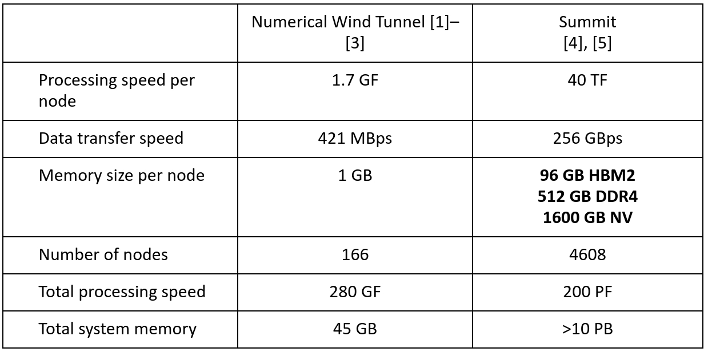
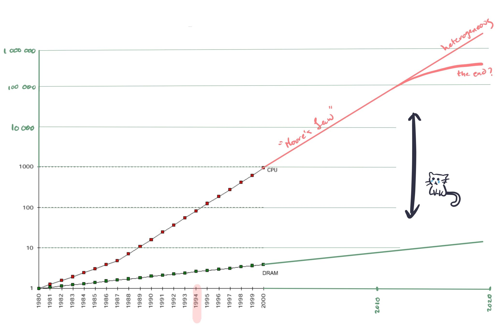
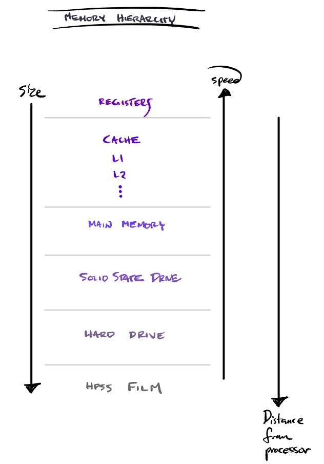
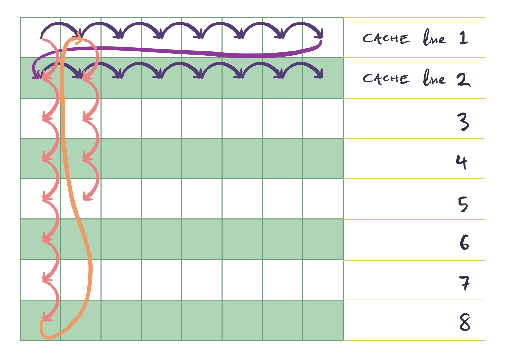
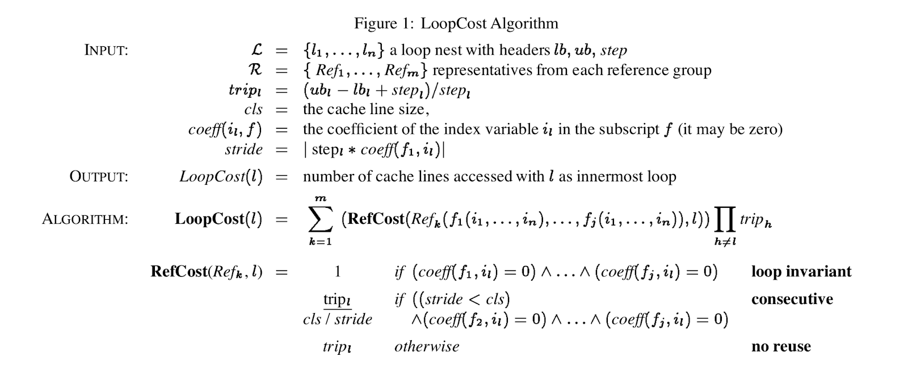
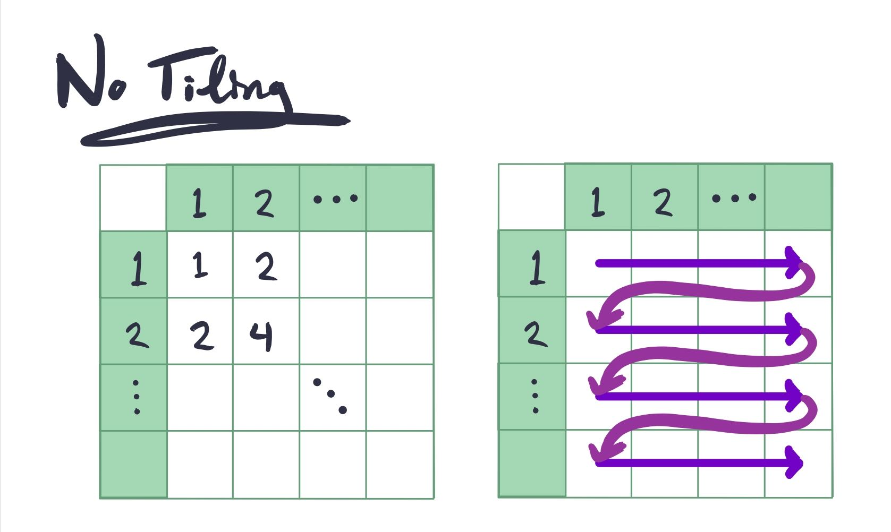
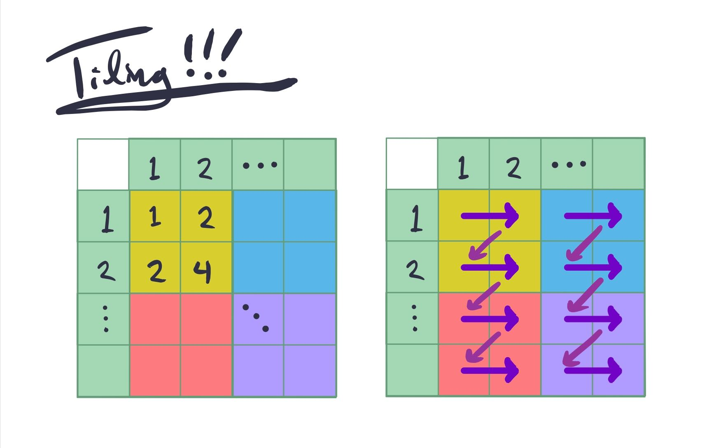

+++
title = "Compiler Optimizations for Improving Data Locality"
[extra]
latex = true
bio = """
Horace He
Gabriela C. Correa
"""
author = "Horace He and Gabriela C. Correa"
+++

Processing speed has long surpassed that of memory in modern computation.
Applications today deal with a massive amount of information that must at
some point be held in memory. The overhead cost of transferring data
continues to inhibit implementations if many applications. Furthermore, this
task is becoming increasingly complex as computers depart from von Neumann
towards heterogeneous architectures, inducing additional data transfer.

*Compiler Optimizations for Improving Data Locality* by Carr, McKinley, and
Tseng tackles this problem by suggesting this is a task for the compiler to
combat. This paper focuses on improving the order of memory access. Table 1
illustrates the differences in a computers circa this paper, and today. The
problems faced in 1994 are very much present today: data transfer is the main
limiting factor in computation.



This table shows the fastest computer from when this paper was written (1994) and from today (2019).



This figure shows how CPU performance has outpaced memory performance, and
how this gap shows no signs of closing. As a result of this massive
difference in CPU performance and memory performance, more and more kinds and
levels of caches have been introduced. This preponderance of caches has led
to cache locality becoming a central factor in program performance.

# Background!
#### Memory Hierarchy
*Data locality* takes advantage of smaller, faster, volatile cache memories, by
keeping data close at hand for computation. Reusing lines of cache—both
spatially and temporally—allow for computation to proceed without waiting
excessive periods of time for the data to arrive. Large and increasingly
complex memory hierarchies are implemented for a variety of reasons. Sadly,
not everything is fast cache 💸.

As opposed to a single central memory, a variety of technologies are used to
store information and prepare it for computation by CPUs, GPUs, or TPUs. Each
processing unit has registers at the cliff of computations. They are
typically the fastest, largely due to their close proximity to the logic unit
that performs computation. After registers, comes caches. These are also very
fast, yet limited in size—largely to take advantage of locality.

Beyond the physical memory storage are the interconnects between all
components. Slowest transfer speeds are found in the cheaper and more robust
main memory, solid state drives, hard disks, and long term tape system
storage. The further the data gets from the processing units, the less we
want to access it. It’s too far for the data to walk.



This figure shows a typical memory hierarchy. In considering memory speeds,
we must take into account the time it takes to get between storage, caches,
registers, processors—in addition to how much data can sit at each point on
the way.

#### Data Dependence

There exists data dependence between two statements A and B if there is a path between the two, and both access the same memory location. Here we have a tree of making a peanut butter and jelly sandwich. In order to spread jelly on the bread, you need the bread; the two steps are dependent on each other. This extends to operations accessing memory locations, and thus we can build a data dependence tree.


# Loop Optimizations
#### Loop Permutation
Loop Permutation is perhaps the most straightforward loop optimization.
Iterating over arrays in the wrong order is one of the easiest ways to cause
a huge amount of cache misses. It’s also the cause of an endless [number](https://stackoverflow.com/questions/33722520/why-is-iterating-2d-array-row-major-faster-than-column-major) of [SO](https://stackoverflow.com/questions/13093155/c-2d-array-access-speed-changes-based-on-ab-order)
[questions](https://stackoverflow.com/questions/9936132/why-does-the-order-of-the-loops-affect-performance-when-iterating-over-a-2d-arra).

Take these two snippets of code (which can also be found online [here](http://ideone.com/PUJhdP)).

A. Column-Major
```
int A[DIM1][DIM2];
for (int iter = 0; iter < iters; iter++)
    for (int j = 0; j < DIM2; j ++)
        for (int i = 0; i < DIM1; i++)
            A[i][j]++;
```

B. Row-Major
```
int A[DIM1][DIM2];
for (int iter = 0; iter < iters; iter++)
    for (int i = 0; i < DIM1; i++)
        for (int j = 0; j < DIM2; j ++)
            A[i][j]++;
```

Both of these loops perform `DIM1 * DIM2` increments. The only difference is
whether they iterate through A in row-major or column-major order. What do
you think their performance difference is?

If you’re wise to the ways of cache locality, you might answer B. And for
suitably large values of `DIM1` and `DIM2`, you’d be right!

With DIM1=1024, DIM2=1024, and iters=1e3, we get an order of magnitude win for B!
- A (Column-Major): 4916ms
- B (Row-Major): 485ms

Loop permutation captures this optimization. Intuitively, you could imagine
the below picture when it comes to what's happening. Imagine that the grid
represents a 2-dimensional array. However, since 2-dimensional arrays are
actually 1-dimensional arrays in memory, the cache lines must align along a
particular axis.

Now, compare the 2 access patterns (the blue line and the red line). The blue
access pattern loads a single cache line and then accesses all of its
elements before moving onto the next cache line. The red access pattern,
however, loads a single cache line, accesses a single element, and then moves
onto the next cache line.



#### Loop Reversal
Loop Reversal simply reverses the order of a loop. This does 2 things. First,
it may allow the use of more efficient jump operations (for example, `JMPZ`).
Another thing it does is reverse data dependencies. This can serve as a kind
of canonicalization, and can also allow for other loop optimizations to be
applied. In their paper, loop reversal didn’t improve data locality in any of
their benchmarks.

#### Loop Fusion
Loading in each cache line takes a significant amount of time. If we have
multiple loops, we run into the possibility that we will load a single cache
line multiple times, wasting time.

For example, take this code (an online example can be found [here](http://ideone.com/OnbRXU)):
```
for (int i = 0; i < MAXN; i++)
    A[i] += j;
for (int i = 0; i < MAXN; i++)
    A[i] *= j;
```
It’s easy to see that this code is performing redundant cache line loads. We
load the cache line that `A[0]` belongs to twice-once in the first loop and
once in the second. We can speed up this loop by fusing the loops. This way,
we load a cache line and perform both operations on it at once, before
loading another cache line.
```
for (int i = 0; i < MAXN; i++) {
    A[i] += j;
    A[i] *= j;
}
```
Locally, this gives me 660ms for the unfused one and 411ms for the fused one.

Loop fusion is a big deal on CPUs, but it’s an even bigger deal on GPUs (and
other hardware accelerators). As opposed to say, loop permutation, which
simply improves data locality, loop fusion can actually reduce the number of
memory loads needed. For example, in the above, it’s a trivial optimizations
to then rewrite it as

```
for (int i = 0; i < MAXN; i++) {
    int t = A[i];
    t += j;
    t *= j;
    A[i] = t;
}
```
This halving in memory loads can often translate directly to halving of
runtime in more memory bound systems (like GPUs).

#### Loop Fission/Loop Distribution
This is the opposite of loop fusion. Although loop fusion is useful if you
can reduce memory loads, it can be counter-productive to have unrelated
operations jammed together into a single loop nest. Not only does it
introduce more memory pressure, it also doesn’t allow optimizations like loop
permutation to be applied to a single operation at a time.

For example, take a loop like this
```
int A[MAXN][MAXN], B[MAXN][MAXN];
for (int i = 0; i < MAXN; i++) {
    for (int j=0; j<MAXN; j+=2) {
        A[i][j] ++;
        B[j][i] ++;
    }
}
```


As seen in the loop permutation section, we’d like to iterate along both A
and B in row-major order. However, the fact that the operations in A and B
are in one loop nest doesn’t make it possible to do this for both arrays.
However, if we split this loop, then we can write it like
```
int A[MAXN][MAXN], B[MAXN][MAXN];

for (int i = 0; i < MAXN; i++)
    for (int j=0; j<MAXN; j+=2)
        A[i][j]++;

for (int j=0; j<MAXN; j+=2)
    for (int i = 0; i < MAXN; i++)t
        B[j][i]++;
```
Thus iterating in the optimal order for both arrays.

## Cost Model

For class discussion, think about the following algorithm:



They use this cost model for determining the optimal sequence of loop fusion/fission/permutation to apply.

# Future Work
The loop optimizations presented here are still used everywhere. However,
these are perhaps the more straightforward optimizations to make. In
particular, they don't deal with any optimizations (besides loop reversal)
that change the structure of a loop. Writing optimized loop nests is far more
complicated than that. For a phenomenal introduction to the types of
optimizations that need to be done for modern loop nests, check out [this
talk from one of Halide's
creators](https://www.youtube.com/watch?v=3uiEyEKji0M). The first 15 minutes
aren't related to Halide at all, and serve as a fantastic introduction. I'll
provide some notes about important topics here.

### Parallelism
Parallelism across CPU cores is crucial for performance. Depending on how you
compute your values, you may introduce serial dependencies that make it more
difficult to parallelize your code.

### Vectorization
Vectorization refers to taking advantage of SIMD instructions in your
hardware. These instructions can do things like "sum up the 4 values at
`x[i]` through `x[i+4]`" significantly faster than doing them one element at
a time.

Taking advantage of this requires some care. For example, if your inner loop
is too small, then you often won't be able to take full advantage of SIMD
instructions, which operate on 8 or 16 numbers at a time.

The fact that they operate on 8 or 16 numbers at a time also means that
utilizing them requires some special case handling - for example, what if you
have 18 elements?

### Tiling
Imagine that we wished to compute a multiplication table of sorts. The code for that would look something like (an online example can be found [here](http://ideone.com/4HRl3F). Note that moreso than the other optimizations, tiling often depends on the particular hardware used):

```
for (int x = 0; x<MAXN; x++)
    for (int y =0; y <MAXN; y++)
        A[x][y] = rows[x] * columns[y];
```
Note that in this implementation, although each element in `rows` will be
loaded only once and reused until it's no longer needed, each element in
`columns` will be loaded once for every single row.



A rough estimate gives us 20 "bad" reads - each read from `columns` won't be
in the cache, and the first read of `rows[x]` won't be in the cache either.

If we simply permuted the loops we could solve this issue for `columns`...
but then we'd have this issue for `rows`. Note that if we had significantly
more rows or columns, this could be the optimal answer.

However, there is a better option. We can select a compromise - we select
some number of row elements and some number of column elements, and compute
the outputs that depend on those elements.



Naively, this now only requires 12 "bad" reads. To compute the first 2
columns, we only need to read 6 elements, and same for the second 2 columns.

In code, that would translate to:

```
int B = 8;
for (int t = 0; t < NUMITERS; t++)
    for (int i = 0; i < n; i += B)
        for (int j = 0; j < n; j += B)
            for (int x = i; x < i + B; x++)
                for (int y = j; y < j + B; y++)
                    a[x][y] = rows[x] * cols[y];
```

### Defining the space of loop optimizations
Looking at all of these loop optimizations and the difficult ways in which
they interact is a fairly daunting task. One avenue of active research is
defining the space of loop optimizations. There are 2 primary efforts I'm
aware of: the polyhedral model and Halide. Both of these models define a
space of loop optimizations.

### Cost Models
Although the previous models mentioned allow you to express the space of
legal loop transformations, they don't tell you what loop transformations you
should be performing. Some recent work has focused on learning a cost model
for Halide schedules, and using that to guide an [autoscheduler for Halide
programs](https://halide-lang.org/papers/autoscheduler2019.html).


# References

[1]      H. Miyoshi et al., “Development and achievement of NAL numerical wind tunnel (NWT) for CFD computations,” in Proceedings of the ACM/IEEE Supercomputing Conference, 1994, pp. 685–692.

[2]      “National Aerospace Laboratory of Japan’s Numerical Wind Tunnel,” Information Processing Society of Japan Computer Museum. [Online]. Available: http://museum.ipsj.or.jp/en/computer/super/0020.html. [Accessed: 03-Oct-2019].

[3]      Y. Matsuo, “Special contribution numerical wind tunnel: History and evolution of supercomputing,” Fujitsu Scientific and Technical Journal, vol. 53, no. 3. pp. 15–23, 2017.

[4]      “Summit User Guide – Oak Ridge Leadership Computing Facility,” 2019. [Online]. Available: https://www.olcf.ornl.gov/for-users/system-user-guides/summit/summit-user-guide/. [Accessed: 03-Oct-2019].

[5]      P. Wang, “Unified Memory on P100.”

[6]      G. Goff, K. Kennedy, and C. W. Tseng, “Practical dependence testing,” in Proceedings of the ACM SIGPLAN Conference on Programming Language Design and Implementation (PLDI), 1991, pp. 15–29.

[7]      G. Rivera and C. W. Tseng, “A comparison of compiler tiling algorithms,” in Lecture Notes in Computer Science (including subseries Lecture Notes in Artificial Intelligence and Lecture Notes in Bioinformatics), 1999, vol. 1575, pp. 168–183.


