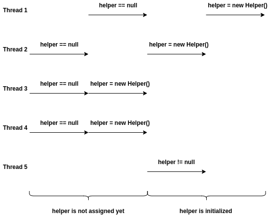
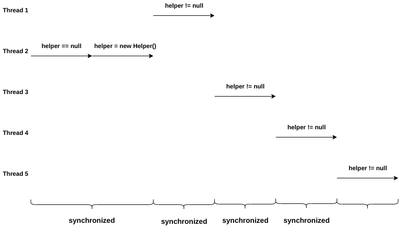
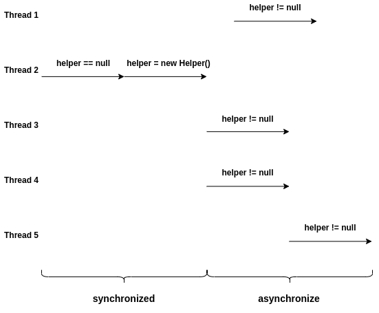
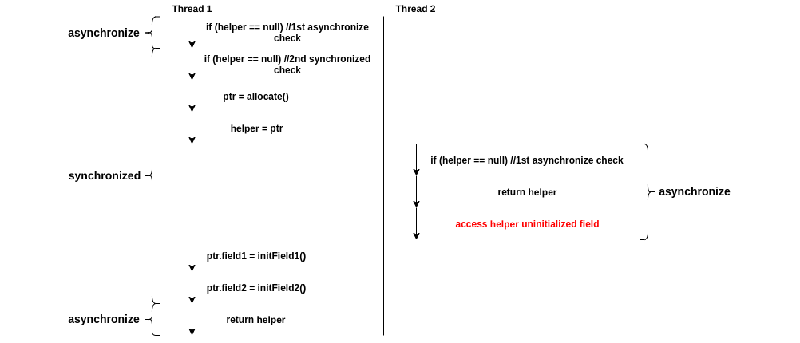

+++
title = "Double-Checked Locking is Broken"
extra.author = "Hongbo Zhang"
extra.author_link = "https://www.cs.cornell.edu/~hongbo/"
extra.bio = """Hongbo Zhang is a first-year PhD student in computer science. He is interested in systems and computer architecture. He is also an okay archer shooting recurve bow."""
+++

Double-checked locking is a software design pattern for 
reducing the overhead of acquiring a lock.
The program checks locking criteria first, 
and acquires the lock only if the check indicates that locking is required.

**Lazy initialization** is a commonly used tactic for delaying the object 
initialization until the first time it is accessed.
In multi-threaded environments, initialization is usually not thread safe,
so locking is required to protect the critical section.
Since only the first access requires locking,
double-checked locking is used to avoid locking overhead of subsequent accesses.
However, on many languages and hardware, design can be unsafe. 

### Single-threading lazy initialization won't work in multi-threading

If we were writing single-threaded code, we could write a lazy initialization 
like this:

```Java
class Foo {
    private Helper helper = null;
    public Helper getHelper() {
        if (helper == null)
            helper = new Helper();
        return helper;
    }
}
```

This code works for a single thread, but if the code is run in 
multi-threaded environments,
    two or more threads could find that `helper` is `null` at the same time, 
    and create multiple copies of `Helper` object.
This can even cause a memory leak in some languages, such as C++.



As shown in the graph above, 
either different threads running concurrently on single processor (e.g. thread 1 and thread 2), 
or running in parallel on different processors simultaneously (e.g. thread 3 and thread 4),
multiple copies of `helper` could be created.

### Always-synchronized solution is slow

To fix this issue, we can simply add a lock to this critical section as follows,
   so that only one thread can enter this critical section at a time.

```Java
class Foo {
    private Helper helper = null;
    public Helper getHelper() {
        synchronized(this) {
            if (helper == null)
                helper = new Helper();
            return helper;
        }
    }
}
```



However, we only need this section of code to be synchronized for the first 
thread access.
After the object is created, acquiring and releasing lock is unnecessary,
and they can have a huge performance impact.

What we want is something like this:



Only the first thread will enter the synchronized section and create the object. 
Once the `helper` is initialized, all subsequent accesses can run in parallel
without synchronization.


Intuitively, we can come up with the following steps to do this job:

1. Check if the object is initialized without locking.
If it is, then return the object immediately.
2. Acquire the lock and check again if the object is initialized.
If another thread has previously grabbed the lock, 
   the current thread can see the object is created, and return the object.
3. Otherwise, the current thread will create the object and return.

With the guidelines above, we will get the following code:

```Java
class Foo {
    private Helper helper = null;
    public Helper getHelper() {
        if (helper == null) {              // first check
            synchronized(this) {
                if (helper == null)         // second check
                    helper = new Helper();
            }
        }
        return helper;
    }
}
```

This tactic is call double-checked locking.

### Double-checked locking is broken 

However, this code is not guaranteed to work.

`helper = new Helper()` is not an atomic operation,
it consists multiple instructions allocating space, initializing fields of the object,
and assigning address to `helper`. 

In order to show what is really happening there,
we expand `helper = new Helper()` with some pseudocode 
and inline the object initialization code.

```Java
class Foo {
    private Helper helper = null;
    public Helper getHelper() {
        if (helper == null) {
            synchronized(this) {
                if (helper == null) {
                    ptr = allocate();
                    ptr.field1 = initField1();
                    ptr.field2 = initField2();
                    helper = ptr;
                }
            }
        }
        return helper;
    }
}
```

In order to improve overall performance,
some compilers, memory systems, or processors may reorder the instructions,
like moving `helper = ptr` before initializing fields of the object.

```Java
class Foo {
    private Helper helper = null;
    public Helper getHelper() {
        if (helper == null) {
            synchronized(this) {
                if (helper == null) {
                    ptr = allocate();
                    helper = ptr;
                    ptr.field1 = initField1();
                    ptr.field2 = initField2();
                }
            }
        }
        return helper;
    }
}
```

This reordering is legal, since there is no data dependency between `helper = ptr`
and the instructions for initializing fields. 
However, this reordering, in some certain execution order, 
    could result in other threads seeing a non-null value of `helper` 
    but accessing uninitialized fields of the object.



### Another fix is also broken

A memory barrier is a type of instruction that can make the compiler and processor
enforce the ordering, so that the instructions on one side of the memory barrier will
not be reordered to the other side of the barrier.

In order to enforce that object initialization `new Helper()` to execute before
assigning to `helper`,
some people came up with another fix with a `synchronized` to enforce ordering,
since `synchronized` is an implicit memory barrier that enforces the instructions
inside the synchronized section to be executed before exiting the section 
(i.e. releasing the lock).

```Java
class Foo { 
    private Helper helper = null; 
    public Helper getHelper() {
        if (helper == null) {
            Helper h;
            synchronized(this) {
                h = helper;
                if (h == null)
                    synchronized(this) {
                        h = new Helper();
                    }                       
                helper = h;
            }
        }
        return helper;
    }
}
```

The purpose of second `synchronized` is only to create memory barrier,
since mutual exclusion is already enforced by the first `synchronized`. 

The intuition is that the lock releasing would act as a memory barrier,
so that `helper=h` will not be executed until the initialization 
in the synchronized section is done.

Unfortunately, the lock releasing is a one-way memory barrier on many processors.
It only enforces the instructions in the synchronized section 
to be executed before lock is released.
The instruction `helper=h` behind the memory barrier could still be moved into 
synchronized section and executed before the object initialization is done.

The expanded and reordered pseudocode should look like the following,
which will result in the same problem as the original version of double-checked locking.

```Java
class Foo { 
    private Helper helper = null; 
    public Helper getHelper() {
        if (helper == null) {
            Helper h;
            synchronized(this) {
                h = helper;
                if (h == null)
                    synchronized(this) {
                        ptr = allocate();
                        h = ptr;
                        helper = h;
                        ptr.field1 = initField1();
                        ptr.field2 = initField2();
                    }                       
            }
        }
        return helper;
    }
}
```

## Working Solutions

### Explicit Memory Barrier

The previous fix with two synchronized sections does not work 
because releasing lock is an implicit "one-way" memory barrier.
It is possible to make the double-checked locking actually work with an
explicit memory barrier.
For example, in C++11 we can safely implement double-checked locking with 
`std::atomic` and `std::atomic_thread_fence`.

```C++
class Foo {
    private:
        std::atomic <Foo*> helper;
    public:
        Foo* get_helper() {
            Foo* h = helper.load(std::memory_order_relaxed);
            std::atomic_thread_fence(std::memory_order_acquire);        //memory barrier
            if (h == nullptr) {
                std::lock_guard<std::mutex> lock(m_init);
                h = helper.load(std::memory_order_relaxed);
                if (h == nullptr) {
                    h = new Helper;
                    std::atomic_thread_fence(std::memory_order_release);//memory barrier
                    helper.store(h, std::memory_order_relaxed);
                }
            }
            return tmp;
        }
};
```

* `std::atomic_thread_fence(std::memory_order_acquire)` guarantees that 
read/write operations after a memory barrier cannot be reordered with 
read operations before the memory barrier.
* `std::atomic_thread_fence(std::memory_order_release)` guarantees that 
read/write operations before a memory barrier cannot be reordered with
write operations after the memory barrier.

The memory barriers guarantee that 
1. `h` loads the value from `helper` before starting object initialization.
2. object initialization finishes before storing the value to `helper`. 

### Atomic Operation

An atomic operation will either happen completely, or it does not happen at all.
This is no intermediate state, so that the side effects op an atomic operations
will not be visible until the operation is complete.

In previous analysis, we have seen that `h = new Helper()` can be interleaved
because it is not an atomic operations.
If this operation is atomic, the double-checked locking will work.

#### 32-bit Primitive Variables

Read and write operations of most primitive variables 
(except `long` and `double since they are 64-bit)are atomic.
If the initialized value is a 32-bit primitive variable,
   assignment to the variable will only happen once the data is available.
Since the write operation is atomic, 
other threads will either see a ready-to-use value or 0,
there is no middle state of "initializing".

```Java
class Foo {
    private int magicNumber = 0;
    public int getMagicNumber() {
        if (magicNumber == 0) {
            synchronized(this) {
                if (magicNumber == 0)
                    magicNumber = GetMagicNumber();
            }
        }
        return helper;
    }
}
```

#### Volatile

Since JDK 5, we can make reads and writes for any variable atomic by declearing
it as a volatile variable.
Every read of a volatile will invalidate cached value and 
load it from main memory.
Every write of a volatile will update value in cache and 
then flush out the cached value to main memory.

The "volatile" in Java also provides ordering guarantees,
which are the same guarantees `atomic_thread_fence` in C++ provides:

* The read/write operations of other variables after a read from a volatile 
variable cannot be reordered before the read from the volatile variable.
* The read/write operations of other variables before a write to a volatile
variable cannot be reordered after the write to the volatile variable.

With this new feature, the double-checked locking issue is resolved by simply 
declaring `helper` as a volatile variable.

```Java
class Foo {
    private volatile Helper helper = null;
    public Helper getHelper() {
        if (helper == null) {
            synchronized(this) {    
                if (helper == null)
                    helper = new Helper();
            }
        }
        return helper;
    }
}
```

However, since all read and write operations of a volatile variable 
triggers cache coherence protocol and accesses main memory,
it can be very slow. 
An improvement can be done with a local variable, to reduce number of times 
accessing volatile variable.

```Java
class Foo {
    private volatile Helper helper = null;
    public Helper getHelper() {
        Helper h = helper;
        if (h == null) {
            synchronized(this) {    
                h = helper;
                if (h == null) {
                    h = new Helper();
                    helper = h;
                }
            }
        }
        return h;
    }
}
```

In cases that the `helper` in already initialized, 
this optimization can reduce one volatile read by returning the local variable.


### Static Singleton

If the `helper` is static, i.e., all the instances of class `Foo` share the 
same instance of `helper`, defining the `helper` in a static field of a separate
class will solve the problem.

```Java
class Foo {
    private static class HelperSingleton {
        public static final Helper helper = new Helper();
    }

    public Helper getHelper() {
        return HelperSingleton.helper;
    }
}
```

This is known as **initialization-on-demand holder idiom**, 
which is a safe and efficient concurrent lazy initialization 
for all Java versions.

* **Lazy Initialization**: as specified by the Java language,
    the static class `HelperSingleton` is not initialized until 
    the first time it is referenced.
* **Safe**: the Java static class initializers is thread safe.
* **Efficient**: all subsequent calls of `getHelper` will return the initialized
    `helper` without any synchronization overhead.


### Thread Local

`ThreadLocal` is a variable that each thread will have its own copy of the
thread local variable.
Each thread can only access and modify its own copy of a thread local variable
independently of other threads.

A thread local can be used to maintain the state of "whether the state has gone
through the synchronized initialization or not". 
If a thread has gone through the synchronized initialization once,
it can be confident that that object is already initialized.

Inside the synchronized initialization section, 
only the first thread will find the object is `null` and initialize the object.
All threads will then change their per-thread state 
at the first synchronized access, 
so that they will not enter the synchronized section again.

```Java
class Foo {
    private static ThreadLocal perThreadState = new ThreadLocal();
    private Helper helper = null;
    public Helper getHelper() {
        if (perThreadState.get() == null) {
            synchronized {
                if (helper == null)
                    helper = new Helper();
                perThreadState.set(perThreadState);
            }
        }
        return helper;
    }
}
```

Admittedly, this solution is slightly more costly 
compared with the "ideal" design:
instead of having only the first thread enter the synchronized section
and initialize the object,
each thread is required to enter the synchronized section exactly once
and change its own per-thread state (i.e. the thread local variable) 
    to prevent future access of the synchronized section.
However, the performance in the long run is still acceptable.

## Conclusion

The article discusses the problem of double-checked locking for lazy 
initialization in multi-threaded environments.
It analyzes why some intuitive solutions do not work,
   and also analyzed some working solutions.

Writing multi-threaded program is hard. 
Writing correct and safe multi-threaded program is even harder.
When analyzing the correctness of multi-threaded programs,
it requires the considerations of multiple components, 
including compilers, systems, and processors.
On the other hand, when designing compilers, systems, or processors,
one also needs to take into consideration commonly used design patterns.

## Acknowledgement

I have referred following documents for code examples and explanations.
Code structures and variable names are modified for consistency in this post.

1. [The "Double-Checked Locking is Broken" Declaration](https://www.cs.umd.edu/~pugh/java/memoryModel/DoubleCheckedLocking.html)
2. [Java Memory Model](http://www.cs.umd.edu/users/pugh/java/memoryModel/jsr-133-faq.html)
3. [Double-Checked Locking](https://en.wikipedia.org/wiki/Double-checked_locking)
4. [Lazy Initialization](https://en.wikipedia.org/wiki/Lazy_initialization)
5. [Initialization-on-demand Holder Idiom](https://en.wikipedia.org/wiki/Initialization-on-demand_holder_idiom)
6. [Double-Checked Locking is Fixed In C++11](https://preshing.com/20130930/double-checked-locking-is-fixed-in-cpp11/)
7. [C++ Reference: Atomic Thread Fence](https://en.cppreference.com/w/cpp/atomic/atomic_thread_fence)
8. [Java Documentation: Atomic Access](https://docs.oracle.com/javase/tutorial/essential/concurrency/atomic.html)

