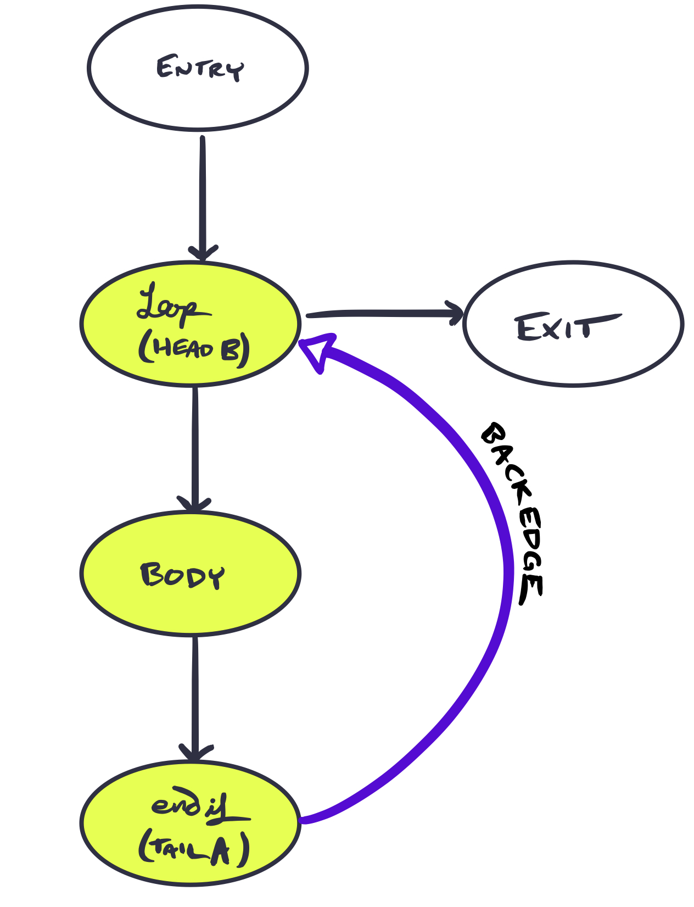

+++
title = "Out of the Loop!"
[extra]
latex = true
bio = """
[Rolph Recto](https://twitter.com/rolphrecto) is a third-year graduate student studying
the intersection of programming languages, security, and distributed systems. Likes climbing, scifi, and halo-halo. 

[G.C.C.](https://twitter.com/elalaCorrea) is a fourth-year graduate fellow taking pictures of atoms. Likes electrons, microscopes, and pandesal.
"""
[[extra.authors]]
name = "Rolph Recto"
link = "https://twitter.com/rolphrecto"
[[extra.authors]]
name = "Gabriela Calinao Correa"
link = "https://twitter.com/elalaCorrea"
+++

Sometimes, loops do more work than they really *have* to. Take for example, the snippet of code below:

```python
for i in range(10):
    x = 3
    y = y + x
print(y)
```
where what we really want is 

```python
x = 3
for i in range(10):
    y = y + x
print(y)
```

The first snippet redundantly sets `x = 3` for *every iteration* when this constant assignment only necessary to do once. This problem scales with larger programs—so how can we remove redundant calculations?

Loop Invariant Code Motion hoists what doesn't need to be in the loop (invariant code) out of the loop. This optimization cuts down the number of instructions executed, by ensuring unnecessary repetition is avoided. Our implementation first identifies movable components, then iteratively moves them. 

Skip to the end to optimize your very own `bril` program!

# Loop

All loops considered here are **natural loops**—that is, a cycle with one entry and a **back-edge**. Back-edges are defined as an edge $A \longrightarrow B$ for tail $A$ and head $B$, such that $B$ dominates $A$.  Natural loops are then defined as the smallest set of vertices $L$ with $A,B \in L$ such that for each vertex $v \in L$ we have $v=B$ or PREDS($v$)$\subseteq L$.

In essence, a back-edge is what brings us from the tail of the loop $A$ to the beginning $B$.
The cycle surrounding this backedge is our loop, where the entrypoint is the start of the cycle.
If the loop has only one entry, it is a natural loop. Below is an illustration of a natural loop and its back-edge. The natural loop is highlighted, with a labeled back-edge.



In the case that an edge connected *entry* and *body*, this would no longer be a natural loop.
 

### Detecting Natural Loops
To find the loop invariant code, first we must detect all natural loops. To accomplish this, we make use of control flow graphs from `cfg.py` and dominator trees from `dom.py` within our three functions. Back-edges are identified with `get_backedges`, and `loopsy` finds the natural loop associated with an input back-edge.


```python
### detect back-edges
def get_backedges(successors,domtree):
    backedges = set()
    for source,sinks in successors.items():
        for sink in sinks:
            if sink in domtree[source]:
                backedges.add((source,sink))

    return backedges


### get natural loops
def loopsy(source,sink,predecessors):
    worklist = [source]
    loop = set()
    while len(worklist)>0:
        current = worklist.pop()
        pr = predecessors[current]
        for p in pr:
            if not(p in loop or p==sink):
                loop.add(p)
                worklist.append(p)
    loop.add(sink)
    loop.add(source)

    return loop
```

### Detecting loop invariants
An instruction within a natural loop is marked loop-invariant if its arguments are defined outside of the natural loop. Alternately, if the instruction’s arguments are defined once—and that definition is loop invariant—then the instruction may be marked as loop-invariant. Our goal is to find these loop invariants so that we may mark them as movable.

To begin with, we find all reaching definitions

```python
### apply reaching definitions analysis
def reachers(blocks):
    rins, routs = df_worklist(blocks, ANALYSIS["rdef"])

    return rins,routs


### get variable information for reaching definitions
def reaching_def_vars(blocks, reaching_defs):
rdef_vars = {}

for blockname, rdefs_block in reaching_defs.items():
    block = blocks[blockname]
    block_rdef_vars = []
    for rdef_blockid, rdef_instr in rdefs_block:
        block_rdef_vars.append( \
            (rdef_blockid, rdef_instr, blocks[rdef_blockid][rdef_instr]["dest"]))

rdef_vars[blockname] = block_rdef_vars

return rdef_vars
```

which then gives us the information to detect loop-invariant instructions using `invloop`.


# Motion


order _basic_ blocks may be moving blocks where they shouldn't be
make the block map also include the block ordering

Now we know how to spot what can move, let's move it!

### Block ordering


### Loop in a Loop in a Loop


### Super nested loops


###

# bugs and bonuses
Dead code elimination, for a very specific subset of things—to avoid edge cases in our own implementation.

# Evaluation

We evaluated our optimization on a suite of benchmarks by instrumenting the
Bril interpreter to count the number of instructions it executes for each
benchmark. We chose to evaluate our optimization this way instead of
comparing the time it takes for the interpreter to obviate measurement biases
that might arise. By abstracting away performance in terms of the number of 
instructions executed, we give a fair comparison between non-optimized and
optimized Bril programs: no matter the environment in which they are executed,
a Bril program that executes fewer instructions performs better than an
equivalent Bril program that executes more instructions.

RETURNS are not counted

# Try it!
Demo for people to see results on their own `bril` code

results are the same between non-optimized and optimized versions for all benchmarks

test
no. of instructions executed for non-optimized version
no. of instructions executed for optimized version

examples/df_test/cond.bril
9
9

examples/df_test/fact.bril
62
55

examples/dom_test/loopcond.bril
117
108

examples/lvn_test/clobber-fold.bril
10
10

examples/lvn_test/clobber.bril
10
10

examples/lvn_test/commute.bril
6
6

examples/lvn_test/idchain.bril
5
5

examples/lvn_test/idchain-prop.bril
5
5

examples/lvn_test/nonlocal.bril
7
7

examples/lvn_test/reassign.bril
3
3

examples/lvn_test/redundant.bril
6
6

examples/lvn_test/redundant-dce.bril
6
6

examples/tdce_test/combo.bril
6
6

examples/tdce_test/diamond.bril
6
6

examples/tdce_test/double-pass.bril
6
6

examples/tdce_test/reassign.bril
6
6

examples/tdce_test/reassign-dkp.bril
6
6

examples/tdce_test/simple.bril
5
5

examples/tdce_test/skipped.bril
4
4

examples/loop_test/depend.bril
158
159

examples/loop_test/fibonacci.bril
78
79

examples/loop_test/nest.bril
147
130


<!---eof--->
