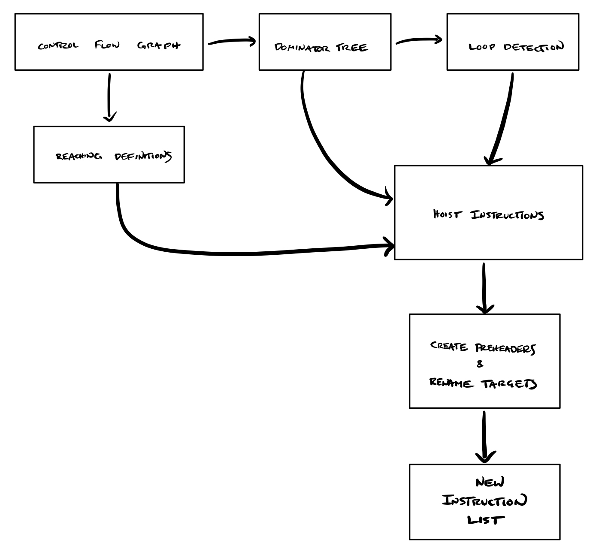

+++
title = "Out of the Loop!"
[extra]
latex = true
bio = """
[Rolph Recto](https://twitter.com/rolphrecto) is a third-year graduate student studying
the intersection of programming languages, security, and distributed systems. Likes climbing, scifi, and halo-halo. 

[G.C.C.](https://twitter.com/elalaCorrea) is a fourth-year graduate fellow taking pictures of atoms. Likes electrons, microscopes, and pandesal.
"""
[[extra.authors]]
name = "Rolph Recto"
link = "https://twitter.com/rolphrecto"
[[extra.authors]]
name = "Gabriela Calinao Correa"
link = "https://twitter.com/elalaCorrea"
+++


Sometimes, loops do more work than they really *have* to. Take for example, the snippet of code below:

```python
for i in range(10):
    x = 3
    y = y + x
print(y)
```
where what we really want is 

```python
x = 3
for i in range(10):
    y = y + x
print(y)
```

The first snippet redundantly sets `x = 3` for *every iteration* when this constant assignment only necessary to do once. This problem scales with larger programs—so how can we remove redundant calculations?

Loop Invariant Code Motion hoists what doesn't need to be in the loop (invariant code) out of the loop. This optimization cuts down the number of instructions executed, by ensuring unnecessary repetition is avoided. Our implementation first identifies movable components, then iteratively moves them. 

The flow of information in our project follows the following visual outline. First we identify natural loops using some existing tools, control flow graphs and dominator trees, which we slightly debugged. These tools were also used to implement reaching definitions. These both then allow us to detect loop invariant instructions to potentially hoist.

Once these instructions are identified, we check if these instructions can be hoisted.
We move hoisted instructions into a preheader basic block and rename jump targets accordingly.
After post-processing, we have our new instruction list!





Skip to the end to optimize your very own `bril` program!

# Loop

All loops considered here are **natural loops**—that is, a cycle with one entry and a **back-edge**. Back-edges are defined as an edge $A \longrightarrow B$ for tail $A$ and head $B$, such that $B$ dominates $A$.  Natural loops are then defined as the smallest set of vertices $L$ with $A,B \in L$ such that for each vertex $v \in L$ we have $v=B$ or PREDS($v$)$\subseteq L$.

In essence, a back-edge is what brings us from the tail of the loop $A$ to the beginning $B$.
The cycle surrounding this backedge is our loop, where the entrypoint is the start of the cycle.
If the loop has only one entry, it is a natural loop. Below is an illustration of a natural loop and its back-edge. The natural loop is highlighted, with a labeled back-edge.


In the case that an edge connected *entry* and *body*, this would no longer be a natural loop.
 

### Detecting Natural Loops


To find the loop invariant code, first we must detect all natural loops. To accomplish this, we make use of control flow graphs from `cfg.py` and dominator trees from `dom.py` within our three functions. Back-edges are identified with `get_backedges`, and `loopsy` finds the natural loop associated with an input back-edge.


```python
### detect back-edges
def get_backedges(successors,domtree):
    backedges = set()
    for source,sinks in successors.items():
        for sink in sinks:
            if sink in domtree[source]:
                backedges.add((source,sink))

    return backedges


### get natural loops
def loopsy(source,sink,predecessors):
    worklist = [source]
    loop = set()
    while len(worklist)>0:
        current = worklist.pop()
        pr = predecessors[current]
        for p in pr:
            if not(p in loop or p==sink):
                loop.add(p)
                worklist.append(p)
    loop.add(sink)
    loop.add(source)

    return loop
```


### Detecting loop invariants
An instruction within a natural loop is marked loop-invariant if its arguments are defined outside of the natural loop. Alternately, if the instruction’s arguments are defined once—and that definition is loop invariant—then the instruction may be marked as loop-invariant. Our goal is to find these loop invariants so that we may mark them as movable. Iteratively checking these two conditions, we converge on a list of invariant instructions.

# Motion

### Hoisting instructions

Once we have determined which instructions are loop invariant, we check if we can actually hoist those instructions out of the loop. The following conditions must be met:

* `condition 1:` instruction dominates all loop exits

* `condition 2:` instruction is the only definition for that variable in the loop

* `condition 3:` definition dominates all of its uses

After identifying all three criteria, an instruction is labeled in a Boolean map, as `true` if hoistable, and `false` if not. 
Instructions are removed from their native basic blocks if marked as `true`. 

### Preheader generation and target renaming

We gather hoisted instructions into a new basic preheader block executed before the loop header.
This means we have to rename jumps that target the loop header to target the preheader instead.
We only rename jumps that target the loop header if they are outside the loop. This ensures that the preheader is only to be executed when we first enter the loop.


### Instruction list generation


Next is to generate a new list of instructions for the function body. To do this, we initially order the basic blocks. The order must follow several constraints: the first and last basic blocks of the original program remain in place. Fall-throughs between basic blocks and the original function are also respected.

Here, we ran into a few bugs. 🐝🐛🦋🐌🐞🐜🦗🕷🦂

The existing code in the repository that computes dominator trees throws an exception when a basic block is unreachable. To solve this, we removed the unreachable block from all data structures. This implements a very limited form of dead code eliminations as a bonus! ☠️

When we have an order for basic blocks we concatenate them to create a new list of instructions. Further post-processing to remove empty preheaders is then executed. Finally we have our new instruction list!

# Evaluation
We evaluated our optimization on a suite of benchmarks by instrumenting the `bril` interpreter to count the number of instructions it executes. Our optimization are evaluated this way, as opposed to comparing execution times. This avoids measurement biases that might arise through timing. 

By abstracting away performance in terms of the number of instructions executed, we give a fair comparison between non-optimized and optimized `bril` programs: no matter the environment in which they are executed, a `bril` program that executes fewer instructions performs better than an equivalent `bril` program that executes more instructions.


|test|original|optimized|
|:---|----:|:---|
|`examples/df_test/cond.bril`           |9|9|
|`examples/df_test/fact.bril`           |62|55|
|`examples/dom_test/loopcond.bril`      |117|108|
|`examples/lvn_test/clobber-fold.bril`  |10|10|
|`examples/lvn_test/clobber.bril`       |10|10|
|`examples/lvn_test/commute.bril`       |6|6|
|`examples/lvn_test/idchain.bril`       |5|5|
|`examples/lvn_test/idchain-prop.bril`  |5|5|
|`examples/lvn_test/nonlocal.bril`      |7|7|
|`examples/lvn_test/reassign.bril`      |3|3|
|`examples/lvn_test/redundant.bril`     |6|6|
|`examples/lvn_test/redundant-dce.bril` |6|6|
|`examples/tdce_test/combo.bril`        |6|6|
|`examples/tdce_test/diamond.bril`      |6|6|
|`examples/tdce_test/double-pass.bril`  |6|6|
|`examples/tdce_test/reassign.bril`     |6|6|
|`examples/tdce_test/reassign-dkp.bril` |6|6|
|`examples/tdce_test/simple.bril`       |5|5|
|`examples/tdce_test/skipped.bril`      |4|4|
|`examples/loop_test/depend.bril`       |158|159|
|`examples/loop_test/fibonacci.bril`    |78|79|
|`examples/loop_test/nest.bril`         |147|130|
|`examples/loop_test/hoist_expr.bril`   |48|32|


The table above shows all executed benchmarks, and the associated number of instructions executed by the interpreter—in both optimized and non-optimized versions. Our benchmarks are drawn from the `examples` directory of the `bril` repository. We also created a new directory called `loop_test` that contain benchmarks we wrote ourselves. 
Among these freshly baked tests, are `nested.bril`,  `fibonacci.bril`, `hoist_expr.bril`, and `depend.bril`. The first, `nested.bril`,  checks if we can navigate redundant expressions in a nested loop.  This saved an execution of 17 instructions once optimized. 


All optimized versions of benchmarks print the same results as their original versions, thus showing our optimization preserves the original semantics of the program. We note that our optimization instructions execute a fewer or equal number of instructions. The only exception to this case is for two of our own built test cases—where fall-throughs existed in the original programs, and optimized versions had explicit jumps.

The results show that if the original program has no loops, our optimization does nothing. We also find that our optimization successfully hoists loop invariant code out of loops. Thus, the interpreter executes fewer instructions in this case. 

# Try it!

Our optimizer is implemented in `examples/loop.py`. This program takes in a `bril` program in JSON format in standard input, and returns an optimized `bril` program in standard output.

```python
bril2txt < test.bril | python loop.py | bril2txt
```

Replace `test.bril` with any program you would like to optimize.


<!---

# RAW DATA
results are the same between non-optimized and optimized versions for all benchmarks
 
test
no. of instructions executed for non-optimized version
no. of instructions executed for optimized version

examples/df_test/cond.bril
9
9

examples/df_test/fact.bril
62
55

examples/dom_test/loopcond.bril
117
108

examples/lvn_test/clobber-fold.bril
10
10

examples/lvn_test/clobber.bril
10
10

examples/lvn_test/commute.bril
6
6

examples/lvn_test/idchain.bril
5
5

examples/lvn_test/idchain-prop.bril
5
5

examples/lvn_test/nonlocal.bril
7
7

examples/lvn_test/reassign.bril
3
3

examples/lvn_test/redundant.bril
6
6

examples/lvn_test/redundant-dce.bril
6
6

examples/tdce_test/combo.bril
6
6

examples/tdce_test/diamond.bril
6
6

examples/tdce_test/double-pass.bril
6
6

examples/tdce_test/reassign.bril
6
6

examples/tdce_test/reassign-dkp.bril
6
6

examples/tdce_test/simple.bril
5
5

examples/tdce_test/skipped.bril
4
4

examples/loop_test/depend.bril
158
159

examples/loop_test/fibonacci.bril
78
79

examples/loop_test/nest.bril
147
130

--->

<!---eof--->
