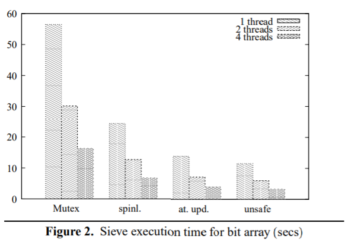
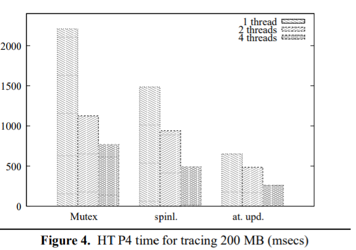

+++
title = "Threads Cannot Be Implemented as Libraries"
extra.author = "Neil Adit and Edwin Peguero"
+++

Attempts have been made to append thread support onto languages that lack thread semantics via a library that is paired with an informal thread semantics. Effectively, this introduces threads into a host language that remains oblivious to their presence.

Due to this obliviousness to threads, compilers may perform optimizations that inadverdently change the behavior of a multi-threaded program with respect to the thread library's specification.
In other words, thread-oblivious compilers may perform optimizations that preserve 'single-threaded' behavior without additionally preserving the thread library's notion of 'multi-threaded' behavior.
It is in this sense that "threads cannot be implemented as libraries"; rather, they must be implemented in the language specification.

This paper examines the case of the widely used C/C++ Pthreads library, demonstrating three kinds of compiler optimizations that can break valid Pthreads programs.

Afterwards, the author argues for a relaxed model for threads that eschews a race-free, critical-section based thread-programming paradigm in favor of one that allows data races and relies on atomic operations.
In particular, they demonstrate performance improvements due to this paradigm shift in an implementation of the Sieve of Eratosthenes and in a garbage collector.

Finally, the author comments on ongoing efforts towards adding a formal thread model to the C++ standard based on the Java Memory Model.

## Semantics of Pthreads: Threads Implemented as a Library

The Pthreads standard informally specifies the semantics for concurrent threads as follows:

> "Applications shall ensure that access to any **memory location** by more than one thread of control (threads or processes) is restricted such that ***no thread of control can read or modify a memory location while another thread of control may be modifying it***.
> Such access is restricted using functions that synchronize thread execution and also synchronize memory with respect to other threads. The following functions synchronize memory with respect to other threads:
>
> ...,
>
> pthread mutex lock(),
>
> ...,
>
> ...,
> pthread mutex unlock(), ...
>
> [Many other synchronization functions listed]"


Thus, a Pthreads program is well-defined if it lacks **data races**.

This specification might seem precise at first glance, but *how can we determine whether a program has a race?*
We require a semantics for threaded programs in order to evaluate whether an execution trace contains a data race, but this semantics is itself given in terms of a data race! Thus, Pthreads provides a *circular definition* for thread semantics.

Conceptually, this circularity is resolved by an implementation-defined thread semantics.
Intuitively, we may expect an implementation akin to the **sequential consistency** (SC) model, which interprets a threaded program as an interleaving of instructions across threads, such that intra-thread instruction order is preserved.

For example, under the SC model, we would observe a data race whereby at least one of `r1 == 1` or `r2 == 1` holds after the execution of the following threaded program:


```c
int r1 = 0;
int r2 = 0;

// Thread 1
x = 1; r1 = y;

// Thread 2
y = 1; r1 = x;
```

SC is an example of a **memory model**, a specification for the behavior of memory operations in a multi-threaded context.
Rather than use SC, however, most compilers implement a *weaker* memory model that allows for behaviors satisfying `r1 == r2 == 0`.

Although this behavior is less intuitive, a weaker model than SC is necessary for two reasons:
- hardware may reorder memory operations in such a way that contradicts the SC model.
- thread-oblivious compiler optimizations don’t need to preserve SC. Thus, it is legal for memory operations reordering to break SC.


## Pthreads’ Partial Memory Model
Pthreads’ memory model is SC in the absence of data races.
In the presence of data races, however, the memory model is **formally undefined**: any behavior is allowed.

In other words, Pthreads allows any behavior for programs with data races. 
The reason behind this design decision is explained as follows:
>Formal definitions of the memory model were *rejected as unreadable by the vast majority of programmers*.
>In addition, most of the formal work in *the literature has concentrated on the memory as provided by the hardware as opposed to the application programmer* through the compiler and runtime system.
>It was believed that a simple statement intuitive to most programmers would be most effective

Thus, since the above example contains data races, any compiler-chosen behavior satisfies the specification, including one for which `r1 == r2 == 0` holds.


## Fighting Compilers for Well-Defined Behavior
To facilitate the writing of race-free, well-defined Pthreads programs, Pthreads offers synchronization primitives such as the **memory barrier** and the **mutex**.
Synchronization enables the containment of shared memory operations in programmer-defined **critical sections**, where memory operations are defined to be *mutually exclusive*.

Since C++ is thread-oblivous, compilers are not guaranteed to respect the semantics of synchronization primitives.
In particular, reads and writes to shared variables may be *moved out of critical sections*, introducing data races and, subsequently, undefined behavior.
Thus, Pthreads relies on special support from compilers. 

Pthreads-compatible compilers generally attempt to preserve synchronization semantics by restricting memory reorderings around synchronization primitives, such as `pthread_mutex_lock()`.
To this end, such compilers model Pthread library calls as **opaque functions**: functions with hidden implementations that are assumed to potentially modify all shared, global variables.
Since the compiler cannot soundly move memory operations across opaque function calls, this strategy precludes unsafe memory-reordering optimizations.

Unfortunately, as we'll see ahead, optimizations may still break thread semantics under this strategy by introducing data races.
This suggests that optimizations cannot be made to preserve thread semantics through heuristics: they must instead be disallowed by formally incorporating thread semantics into the language specification.
It is in this sense that **Threads Cannot Be Implemented as a Library**: if the language doesn't specify the behavior of threads, optimizations cannot be guaranteed to preserve the thread library's specification, even if they sometimes do in practice.


## Three Optimizations that Break Pthreads
The authors identify three compiler optimizations that break otherwise well-defined Pthreads programs. All these examples use the "opaque functions" where the compiler is not allowed to reorder memory operations across locks, but things can go wrong anyway!

### Concurrent modification

Consider the following two statements which are run on 2 separate threads with both the variables initialized to zero:

```c
// Thread 1
if (x==1) ++y;

// Thread 2
if (y==1) ++x;
```

Since there is no way under SC that either `x` or `y` can be read and modified concurrently, this program does not contain data races, and is therefore well-defined. Hence, the result of any SC execution of this program would be `x==0` and `y==0`. 

Since the code does not contain any Pthreads operations around which the compiler is restricted to perform reordering optimizations, it can transform the code in anyway that preserves "single-threaded" correctness. In this process, it may opt to perform a "speculative" optimization as follows:
```c
// Thread 1
++y; if (x != 1) --y;

// Thread 2
++x; if (y != 1) --x;
```

This introduces a data race, since both `x` and `y` are concurrently read and modified. 
Thus, the originally well-defined program is transformed into one that is undefined. This program that looks race-free to the programmer can now segfault or run `rm -rf /` or whatever!

### Rewriting of Adjacent Data

Consider the following struct definition containing bit-fields:

```c
struct {int a:17; int b:15} x;
```
Bit-fields have a fixed number of contiguous bits in memory allocated to them.
In the above case, `a` has been allocated 17 bits followed by `b` which has
been allocated 15 bits. All these bits are adjacent memory locations, which
makes bit-fields great for efficiently packing data.

Consider the following concurrent field assignments:

```c
x.a = 42; //thread1
...
x.b = 37; //thread2
```

At first glance, one might expect the above program to be race free, since both concurrent writes appear to access distinct variables.
However, Pthreads does not define data races in terms of *program variables*, but rather in terms of **memory locations**.
Since this term is not formally defined by Pthreads, compilers may have different program variables unexpectedly *share* a memory location.

In the case above, a compiler targeting a 32-bit machine may choose to have the fields `x.a` and `x.b` share a memory location. This is probable in fact, since such machines are likely to have a 32-bit wide, rather than a 17 or 15-bit wide, store operation, necessitating the following implementation of bit-field assignment for `x.a = 42`:

```c
{
  tmp = x;
  tmp &= ~0x0001ffff;
  tmp |= 42;
  x = tmp;
}
```

Thus, both fields `x.a` and `x.b` share memory location `x`, causing a data race when concurrently modified.

As mentioned, this problematic transformation over adjacent bit-fields is motivated by architectural constraints. 
However, a compiler can also deploy this transformation as a memory-saving optimization over adjacent fields.

For example, given the following structure definition:
```c
struct { char a; char b; char c; char d; char e; char f; char g; char h; } x;
```

And a program that concurrently writes to adjacent fields:
```c
// Thread 1
x.a = 'a' 

 // Thread 2
x.b = 'b'; x.c='c'; x.d='d'; x.e='e'; x.f='f'; x.g='g'; x.h='h';
```

A compiler that targets a 64-bit machine can optimize space usage by transforming Thread 2 as follows (assuming `x` is 64-bit aligned):
```c
x = 'hgfedcb\0' | x.a;
```

This optimization generates a data race, since both `x.a` and `x` share the same memory location and are concurrently modified.


Since the writing of this paper, the C/C++ standard has been expanded to address this problem.
Specifically, the C11 standard defines the memory locations of structure fields as follows:
>A bit-field and an adjacent non-bit-field member are in **separate memory locations**. The same applies to two bit-fields, if one is declared inside a nested structure declaration and the other is not, or if the two are separated by a zero-length bit-field declaration, or if they are separated by a non-bit-field member declaration. It is **not safe** to concurrently update two non-atomic bit-fields in the same structure if all members declared between them are also (non-zero-length) bit-fields, no matter what the sizes of those intervening bit-fields happen to be.


### Register Promotion

Whenever a shared memory location is read and modified, it must first **promote** its value in the memory hierarchy: that is, it must move its value into a local register. 
After operating on this promoted value, it must then **demote** it by moving the computed value back into the shared memory location. 
Such promotion/demotion operations are costly, and especially so in a loop.

Register promotion is an optimization that aims to minimize the cost of promotion/demotion operations in a loop by maximizing data locality at the register level.
Put another way, it aims to "factor out" promotions in a loop.
This optimization transforms a loop by first speculatively promoting the value from a shared variable accessed in the loop into a new, local variable, before the loop. 
Next, all usages of the shared variable are replaced by this new promoted variable within the loop. 
Finally, the promoted variable is demoted after the loop.
If applied to lock-synchronized code, the promotion/demotion operations added by register promotion will lie outside the critical section, therefore creating a data race.

Importantly, register promotion must take care to insert a pair of promotion/demotion operations around opaque function calls within the loop body.
This is because such functions are assumed to refer to all shared variables, so a demotion is required before the call, followed by a promotion.
Register promotion is therefore not beneficial in general, since it may increase the number of promotions and demotions. 
A heuristic must be employed to determine whether its usage improves performance.


To illustrate how register promotion can create a data race, consider the following example, where a shared variable `x` is modified:
```c
for (...) {
  ...
  if (mt) pthread_mutex_lock(...);
  x = ... x...
  if (mt) pthread_mutex_unlock(...);
}
```

Suppose `mt` is only true when multiple threads have been created.
Then this program lacks data races, since reads and writes to `x` are logically synchronized.

Further suppose that register promotion is determined to be a beneficial optimization, perhaps because the conditional is observed to rarely be taken.
Since the Pthreads library calls are simply regarded as opaque function calls, the optimization will produce the following:

```c
r = x; 
for (...) {
  ...
  if (mt) {
    x = r; pthread_mutex_lock(...); r = x;
  }
  r = ... r...
  if (mt) {
    x = r; pthread_mutex_unlock(...); r = x;
  }
}
x = r; 
```

In this case, register promotion introduces unsynchronized reads and writes to `x`, creating a data race.


## Allowing Data Races
In the face of these issues, it’s clear that, indeed, threads cannot be implemented as a library. Instead, the thread specification must be formally incorporated into the language specification, to ensure that compilers do not break the former.

The task of formally specifying Pthreads presents an opportunity for rethinking its synchronization-oriented paradigm.
The author identifies that synchronization is not always desirable, and that it requires a precise interleaving of expensive atomic operations:
>The cost of atomic operations and memory barriers varies widely, but is often comparable to that of a hundred or more register-to-register instructions, even in the absence of a cache miss. For example, on some Pentium 4 processors, hardware instructions to atomically update a memory location require well over 100 processor cycles, and these can also double as one of the cheaper mechanisms for ensuring that a store operation becomes visible to other threads before a subsequent load. 

Instead of synchronization, the author argues in favor of a paradigm that allows data races and relies on atomic operations by showing performance gains from such a paradigm shift. 
>As a result of the high cost of these hardware instructions, and the even higher cost of the pthread primitives built on them, there are a small number of cases in which synchronization performance is critical, and more careful and direct use of the hardware primitives, together with less constrained use of shared variables, is essential. In some cases it may also be necessary to avoid deadlock issues inherent in lock-based programming[7], or desirable because a different parallel programming model is preferable for an application (cf. [32]).

To demonstrate this claim, the author compares the performance of an implementation of the Sieve of Eratosthenes algorithm and a tracing garbage collector implemented under the synchronization and data raceful paradigm.

Four implementations are evaluated when run with 1, 2, and 4 threads.  
Two of these use synchronization: one using mutexes, and another using spinlocks.  
These are compared to two implementations with data races: one that makes use of atomic memory operations, and one that unsafely uses ordinary memory operations.





The results indicate that there are applications for which allowing data races can be improve performance in a multi-processor, motivating the formal specification of programs with data races.

## Formal Model for Data Races
To allow data races, the language standard must provide a memory model for programs with data races.
Java, as a safe language, provides such a model, so the author expressed optimism about the possibility of adapting its model for use in the C++ standard.

Fast-forwarding to the present, however, we see that the problem of defining data races in C++ turned out to be intractable.
Nowadays, the C++ standard incorporates the Pthreads model, stating that data race freedom implies sequential consistency, a model known as **DRF => SC** (“data race freedom implies sequential consistency”).

