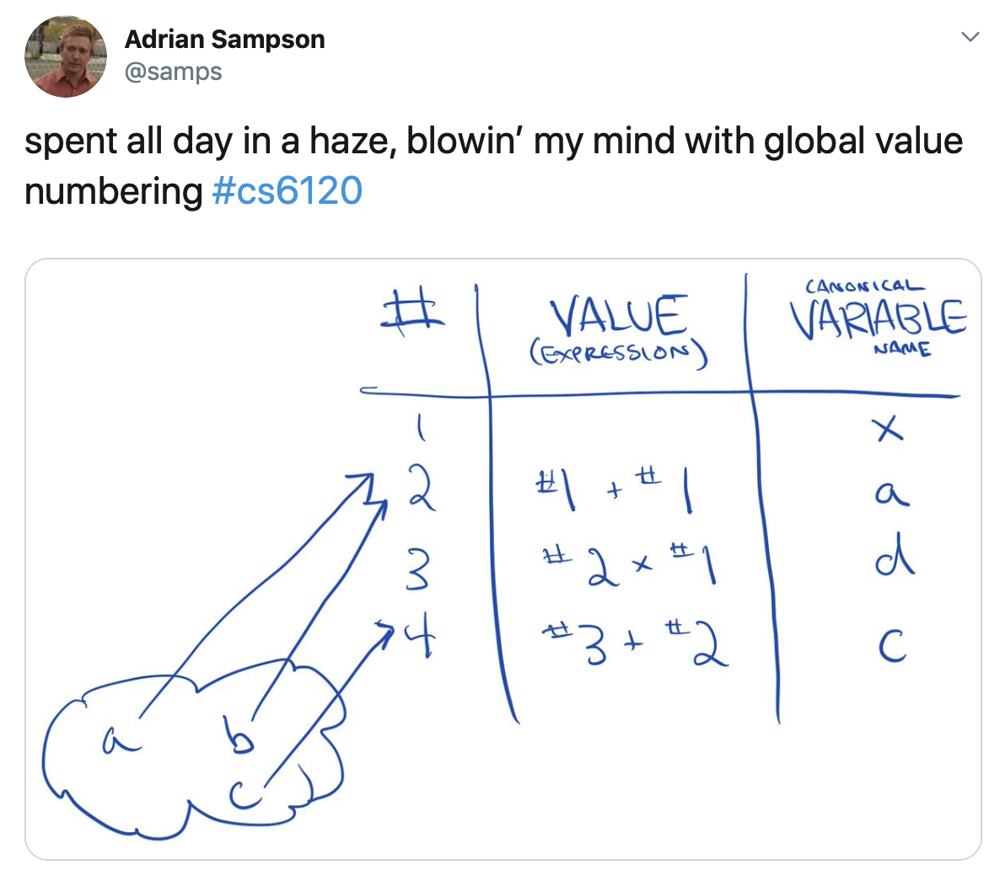
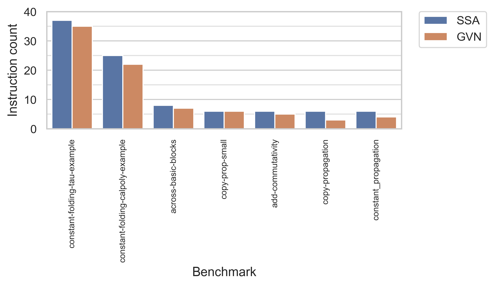
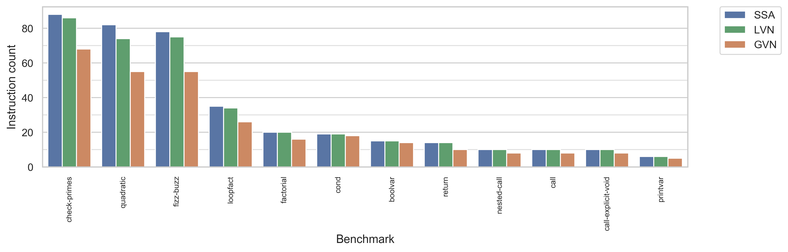

+++
title = "Global Value Numbering"
[extra]
bio = """
  [Alexa VanHattum][] is a second-year student interested in the intersection of compilers and formal methods. She also enjoys feminist book clubs and cooking elaborate [fish truck][] meals.

  [Gregory Yauney][] is a second-year student working on machine learning and digital humanities.
  
[alexa vanhattum]: https://www.cs.cornell.edu/~avh
[gregory yauney]: https://www.cs.cornell.edu/~gyauney
[fish truck]: https://www.triphammermarketplace.com/events/
"""
[[extra.authors]]
name = "Alexa VanHattum"
link = "https://www.cs.cornell.edu/~avh"
[[extra.authors]]
name = "Gregory Yauney"
link = "https://www.cs.cornell.edu/~gyauney"
+++

### Overview

If you follow [PL Twitter™️][pltwitter], you may have seen this tweets go by from our very own [Adrian][]:



What, you may ask, is value numbering, and how is it so mind-blowing? 

The basic premise of [value numbering][vn] is that we can make our code more efficient by removing duplicate computation during compilation.
In particular, if we assign values to every “unique” piece of computation, we can save on work by only actually running that piece once.
At every subsequent use, we can then refer to the already-computed value.

For example, a value numbering pass (followed by dead code elimination) can change the follow:

```
sum1 : int = a + b;
sum2 : int = b + a;
mul : int = sum1 * sum2; 
```

To:
```
sum1 : int = a + b;
mul : int = sum1 * sum1; 
```

A compiler is especially well-poised to do this type of optimization because it can come at the cost of readability.
While a programmer may not want to explicitly memoize every intermediate value across their computations, implementing value numbering allows us to reduce redundancy without much overhead. 

The mind-blowing aspect of value numbering is that while the basic idea seems straightforward, with some simple extensions it can accomplish a wide range of additional optimizations. 
For example, we extend our value numbering to do both [copy propagation][copy] and [constant folding][const].

[vn]: https://en.wikipedia.org/wiki/Value_numbering
[pltwitter]: https://twitter.com/paul_pearce/status/1056684865846861824
[Adrian]: https://www.cs.cornell.edu/~asampson/
[copy]: https://en.wikipedia.org/wiki/Copy_propagation
[const]: https://en.wikipedia.org/wiki/Constant_folding

## Why _global_ value numbering?

The most simple form of value numbering is _local_ value numbering, which works within each basic block.
However, a local approach misses optimizing code like the following, where redundancy is found across basic block boundaries:

```
void main(x : int, y : int) {
entry:
  z1 : int = add x y;
  jmp block;
block:
  z2 : int = add x y;
  ret;
}
```

## Static Single Assignment (SSA) Form

The primary difference between how you go about actually implementing _local_ value numbering vs. _global_ value numbering is the form of the input source code.
For local value numbering, the analysis can take in code in any standard imperative assignment format.
Because local value numbering only considers one basic block at a time, the compiler can easily determine the relationship between assignments to the same variable (that is, if the source writes to a variable `x` twice, we can just process the code in the block in order to know which assignment is relevant). 
This clean assumption breaks when considering multiple basic blocks.
If `x` is assigned to in two different predecessors of the block we are currently processing, looking up the value number for any assignment involving `x` on the right hand side becomes impossible!

Global value numbering sidesteps this difficulty by requiring that the input source code first be transformed to [_static single assignment (SSA)_][ssa] form. 
In SSA, every variable name can only be assigned to once. 
Reassignments to the same variable in the original code are translated to assignments to new variable names. 
Because reassignments often take place in different control flow branches (to actually have the branches be useful!), SSA form needs a way to recombine different names back into a final variable. 
SSA form relies on a special additional instruction, canonically called `phi` nodes (named to be evocative of `if`, backward) to combine variables from diverging control flow back into a single variable. `phi` instructions take as arguments a list of renamed variables, and assign one of the variables into a new assignment based on which control flow block was actually taken.

For example, consider the following Bril code:

```
start:
  br cond left right;
left:
  x : int = const 1;
  jmp exit;
right:
  x : int = const 2;
  jmp exit;
exit:
  print x;
```

To convert these basic blocks to Bril code, we rename variables and insert a `phi` instruction when the control flow merges again in the last block.

```
start:
  br cond1 left right;
left:
  x1 : int = const 1;
  jmp exit;
right:
  x2 : int = const 2;
  jmp exit;
exit:
  x3 : int = phi x1 x2;
  print x3;
```

Having unique variable assignments is enormously helpful in implementing optimization---most industrial-strength compilers, including [LLVM][] and [GCC][], rely on it internally. We followed a standard algorithm to convert Bril programs to SSA form. 

The first pass inserts `phi` nodes wherever control flow merges multiple variable definitions. 
We determine this condition by computing the [_dominance frontier_][domf] (essentially, boundaries in the control flow graph where control flow can recombine) for every basic block. 
For every block in the dominance frontier of every variable, we insert a `phi` node with as many arguments as there are predecessors to the block. 
One bug we hit with this part of the implementation was realizing that we only should insert `phi` nodes at the dominance frontier for variables that we assigned to multiple times. 
For convenience of later analysis, we also augmented the base algorithm to track which basic blocks (or source) each `phi` argument originated from (for the above example, our generated `phi` would be `x3 : int = phi x1 x2 left right;`)  

The second pass is a recursive renaming algorithm that uses a stack to determine the correct version of a variable name for every point in the program.
The trickiest part of implementing this algorithm was traversing the basic blocks in the correct order.
The high level algorithm specifies that you should recursively traverse the children of each block in the dominator tree. 
However, we found that not only did we ned to traverse the children, but we needed to traverse them _in order_ relative to the control flow graph. 
In particular, Bril’s ecosystem already had a utility for getting the dominators of every block. To get the dominance tree, we calculated the transitive reduction of this relation. 
Our implementation additionally extending the dominance tree such that every list of children was ordered relative to a reverse post-order traversal of the control flow graph.

In later testing (using an example, `test/gvn/constant-folding-tau-example.bril`, ported from the [class notes of Prof. Mooly Sagiv of Tel Aviv University)][tau], we found one minor bug with our SSA implementation. 
Bril programs do not have a type checker and are aggressively dynamic: it’s perfectly valid to assign to a variable in one branch of a conditional but not the other. 
The base SSA algorithm does not account for this, so we fail to properly rename in the second step of our algorithm. 
For now, we work around this case by assigning a default value to to the variable before we branch. 

[ssa]: https://en.wikipedia.org/wiki/Static_single_assignment_form
[llvm]: https://llvm.org/docs/tutorial/OCamlLangImpl7.html
[gcc]: https://gcc.gnu.org/onlinedocs/gccint/SSA.html
[domf]: https://en.wikipedia.org/wiki/Dominator_(graph_theory)
[tau]: http://www.cs.tau.ac.il/~msagiv/courses/pa07/lecture2-notes-update.pdf

## Global value numbering

There are two main approaches to global value numbering, as described in [Value Numbering][], Briggs, Cooper, and Simpson, 1997, both of which ultimately require input code in SSA form.
Hash-based techniques, like those used in local value numbering, hash operations and find redundant values by comparing to previously hashed operations.
Partitioning algorithms, on the other hand, divide all operations into equivalence classes.

We chose to implement hash-based value numbering because it allows for copy propagation extensions and operates on the dominator tree computed during conversion to SSA.
While converting to SSA and performing global value numbering can be performed together in one pass over the original code due to their similarity, we chose to implement them separately.
A distinct SSA conversion allows more optimizations to operate on the program's SSA form in addition to allowing testing of both passes independently.

We implemented the following pseudocode, adapted from Figure 4 of the aforementioned paper, so called because it is a 'dominator-based value numbering technique'.
A value's name is the SSA variable name, which is guaranteed to be unique by SSA, for which it was first computed.
The algorithm requires a program's dominator tree and traverses blocks in reverse postorder.

```
DVNT_GVN(block b):
  for each phi node in b:
    remove and continue if meaningless or redundant
    set the value number for the remaining phi node to be the assigned variable name
    add phi node to the hash table

  for each assignment:
    get value numbers for each operand
    simplify the expression if possible
    if the expression has been computed before:
      set the value number for the assigned variable to the expression's value number
    else:
      set the value number for the expression to be the assigned variable name
      add the expression to the hash table

  for each child c of b in the control flow graph:
    replace all phi node operands in c that were computed in this block with their value numbers

  for each child c of b in the dominator tree:
    DVNT_GVN(c)

  remove all values hashed during this function call
```

[value numbering]: http://citeseerx.ist.psu.edu/viewdoc/download?doi=10.1.1.36.8877&rep=rep1&type=pdf

### Copy propagation

[Copy propagation][copy] entails identifying chains of copies (in Bril, `id` instructions) that can be replaced by the original value. For example, the following code:

```
void main(a : int) {
entry:
  b : int = id a;
  c : int = id b;
  d : int = id c;
  print d;
}
```

Can be safely simplified to:
```
void main(a : int) {
entry:
  print a;
}
```

We extend our global value numbering implementation to include copy propagation via special treatment of `id` instructions.
In particular, for `id`'s we look up the value number for the argument value directly. 
Because our programs are in SSA, finding this value number is as simple as grabbing the argument itself.

### Constant folding

[Constant folding][const] entails performing simple arithmetic operations on known constants at compile time rather than runtime.
For example, the following Bril:

```
void main() {
entry:
  a : int = const 1;
  b : int = const 2;
  c : int = add a b;
  print c;
}
```

Can be replaced with:
```
void main() {
entry:
  c : int = const 3;
  print c;
}
```

We extend our global value numbering to perform constant folding by keeping a mapping from variable names defined as constants to their integer or boolean literal values.
When we encounter and arithmetic operation, we check whether all operands are constant, and fold (that is, perform the operation and drop in the result) if so.
The argument constants can then often be removed entirely with a later dead code elimination pass.

When implementing constant folding, we [found a bug][bug] in Bril's existing local value numbering implementation.
When Bril programs have division by zero, the local constant folding failed with an exception.
We made the design judgment that compiler passes should not fail on misbehaving code, but instead generate code with the same behavior (for example, the implementation's dynamic error could exist on a branch that never actually executes).
We modifying this behavior in both the central Bril local value and our new global value numbering to instead bail out on constant folding when encountering a potential exception in the folding step.

[bug]: https://github.com/sampsyo/bril/issues/40

<!-- Difficulties:
- Recursively visiting blocks in the dominator tree in reverse post order is not enough to ensure that a phi node's arguments have been processed in the absence of backedges. 
We also had to sort the immediately dominated blocks by their order in the CFG.
- Can't do constant propagation because Bril operations require registers as operands.
- `examples/gvn/constant-folding-calpoly-example.bril`: There's a division by zero when running constant folding, but the compiler shouldn't crash!
We filed an issue with Bril's local value numbering and fixed our implementation.
 -->

## Evaluation


### Correctness

The following example, from [Value Numbering][], by Briggs, Cooper, and Simpson, illustrates how GVN removes redundant instructions across basic blocks:

```
void main(a0 : int, b0 : int, c0 : int, d0 : int, e0 : int, f0 : int) {
B1:
  u0 : int = add a0 b0;
  v0 : int = add c0 d0;
  w0 : int = add e0 f0;
  cond : bool = const true;
  br cond B2 B3;
B2:
  x0 : int = add c0 d0;
  y0 : int = add c0 d0;
  jmp B4;
B3:
  u1 : int = add a0 b0;
  x1 : int = add e0 f0;
  y1 : int = add e0 f0;
  jmp B4;
B4:
  u2 : int = phi u0 u1 B2 B3;
  x2 : int = phi x0 x1 B2 B3;
  y2 : int = phi y0 y1 B2 B3;
  z0 : int = add u2 y2;
  u3 : int = add a0 b0;
}
```

Our implementation removes the redundant additions in blocks `B2` and `B3`.
It also removes from block `B4`: 1) the meaningless phi node `u2 : int = phi u0 u1 B2 B3;`, which has arguments that are always equal, and 2) the redundant phi node `y2 : int = phi y0 y1 B2 B3;`, which is identical to the phi node that precedes it. 
Here is the full output, which matches the correct output in the paper:

```
void main(a0 : int, b0 : int, c0 : int, d0 : int, e0 : int, f0 : int) {
B1:
  u0: int = add a0 b0;
  v0: int = add c0 d0;
  w0: int = add e0 f0;
  cond: bool = const true;
  br cond B2 B3;
B2:
  jmp B4;
B3:
  jmp B4;
B4:
  x2: int = phi v0 w0 B2 B3;
  z0: int = add u0 x2;
  ret ;
}
```

### Trying to get fewer instructions

We treat the number of instructions as a proxy for code performance, where fewer lines of code is superior.
For each of a number of Bril test programs, we report in the following graph:
1. The number of instructions after converting to SSA, converting out of SSA, and running Bril's existing [trivial dead code elimination][] (TDCE), shown in blue.
2. The number of instructions after converting to SSA, running GVN, converting out of SSA, and running TDCE, shown in red.



### Bigger benchmarks with TypeScript frontend and comparison with LVN

For a slightly more realistic analysis, we ran GVN on the more complex programs afforded by Bril's TypeScript frontend.
In addition to the existing test programs from project 1, we also implemented a quadratic formula calculation (`test/gvn/quadratic.ts.bril`), [fizz buzz][] (`test/gvn/fizz-buzz.ts.bril`), and a naive [Sieve of Eratosthenes][] without arrays (`test/gvn/check-primes.ts.bril`).
All TypeScript programs were first processed by the `ts2bril` frontend.
We encountered an implementation difficulty: the code generated by the TypeScript frontend sometimes inserts `jmp` instructions after returns in the same basic block.
We had to manually remove these in order for SSA conversion and dominator tree creation to work.

In addition to the metrics in the preceding graph, we also report the number of instructions after converting to SSA, running Bril's existing [local value numbering][], converting out of SSA, and running TDCE, shown in green

[trivial dead code elimination]: https://github.com/sampsyo/bril/blob/master/examples/tdce.py
[Sieve of Eratosthenes]: https://en.wikipedia.org/wiki/Sieve_of_Eratosthenes
[fizz buzz]: https://en.wikipedia.org/wiki/Fizz_buzz
[local value numbering]: https://github.com/sampsyo/bril/blob/master/examples/lvn.py



<!--
### LLVM GVN tests that use more features than Bril has.
Our implementation does not produce the same output as LLVM on all tests because 1) Bril operations require that all operands are registers and 2) LLVM GVN has more features.
-->

GVN provides the base for a number of additional optimizations, most of which we have not yet implemented.

[value numbering]: http://citeseerx.ist.psu.edu/viewdoc/download?doi=10.1.1.36.8877&rep=rep1&type=pdf

