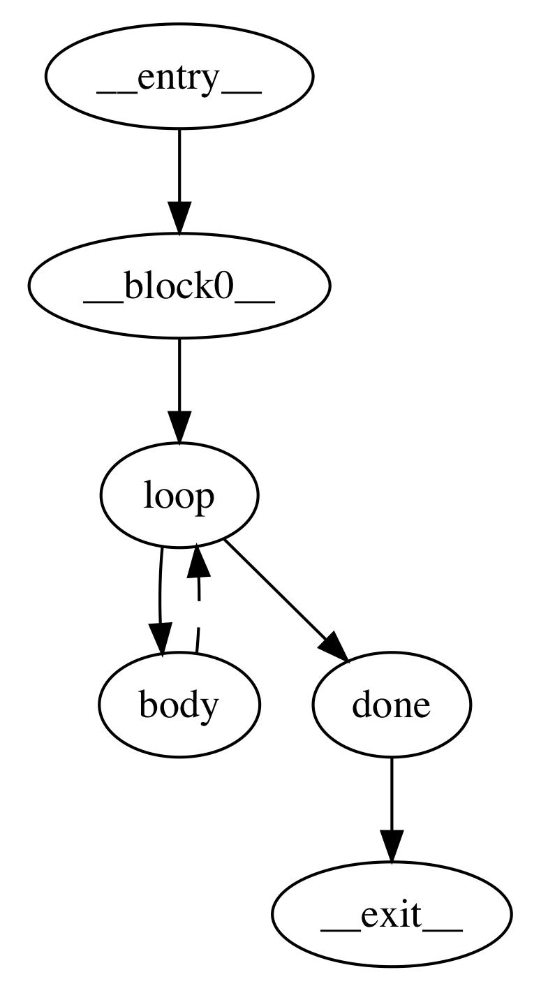
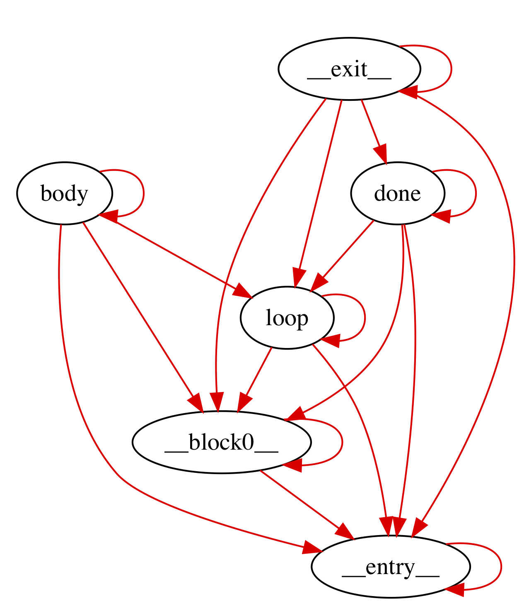

+++
title = "Induction Variable Optimizations"
extra.author = "Daniel Weber & Drew Zagieboylo"
extra.bio = """
  [Daniel Weber](https://github.com/Dan12) is an MEng student interested in programming languages, distributed systems, and the inner workings of computers.

  [Drew Zagieboylo](https://www.cs.cornell.edu/~dzag/) is a 3rd year PhD student researching Security, Hardware Design, and Programming Languages. He enjoys rock climbing and gaming in his free time.
"""
+++

# Induction Variables

Loops are well known targets for optimization since they execute repeatedly
and significant execution time is spent in loop bodies.
The class of loop optimizations which we're considering in this post
are centered on special variables called _induction variables_ (IVs).
An induction variable is any variable whose value can be represented as a function of:
loop invariants; the number of loop iterations that have executed; and other induction variables.

Generally speaking, most induction variable optimizations are limited to
induction variables that are *linear functions* of their inputs.
For Bril, that means induction variables are computed only using
the `mul`, `add` and [`ptradd`](../manually-managed-memory) instructions.

# Optimization Overview

There are a large number of induction variable optimizations
which all have slightly different goals. Here, we're going
to give a brief overview on some of the optimizations we
implemented and what they're meant to achieve.

### Strength Reduction

In reality (despite what many software developers like to think),
not all instructions are really created equal. Some instructions
are more expensive to execute at runtime than others. For instance,
integer addition is usually "cheaper" than integer multiplication.
Induction variable strength reduction lets us "reduce" multiplication
operations on IVs to addition operations.

Take this simple program as an example:
```C
int j = 0;
for (int i = 0; i < 100; i++) {
    j = 2*i;
}
return j;
```

`j` is an induction variable dervied by applying a multiplication
to another IV, `i`. This makes it a perfect candidate for strength
reduction. Each iteration we set `j` to a brand new value
computed with that multiplication. Instead, every iteration we can increment `j`
by two times whatever we increment `i` by.

To simplify this optimization this is usually done by introducing a new variable
to represent the `2*i` value for each iteration.
```C
int j = 0;
int s = 0; //2*i when i == 0
for (int i = 0; i < 100; i++) {
  j = s;
  s = s + 2; //+2 since i gets incremented by 1 each iteration
}
```
After [some other common compiler optimizations](https://en.wikipedia.org/wiki/Copy_propagation),
we can get this simpler version:
```C
int j = 0;
for (int i = 0; i < 100; i++) {
  j = j + 2;
}
return j;
```

It's important to note that `j` no longer has a direct dependence on `i`
since there are no instructions which read from `i` and write to `j`.
Strength reduction often helps remove data dependencies, paving
the way for other IV optimizations.

### Induction Variable Elimination

In many programs, IVs can be redundant.
For instance, a common programming idiom is to introduce
a variable only to use as a loop guard (such as `i` in the following program).
```C
int max = 10;
int result = 0;
for (int i = 0; i < max; i++) {
    result += 2;
}
return result;
```
In this example, we can eliminate the `i` variable
by replacing its uses with another basic induction variable `result` to get:
```C
int max = 10;
int result = 0;
for (; result < max*2; result+=2) {}
return result;
```
This obviously removes extraneous code by combining the "loop counting"
part of the loop with the actual work that it's doing.

# Implementing Induction Variable Optimizations

It turns out that IV analyses require a large number 
of other static analyses before even thinking about optimization.

### Finding Loops

For instance, IV optimizations are all loop optimizations, which
means we need to identify loops. Natural loops are denoted by sets
of basic blocks that all have a common entry point *and* a "backedge"
in the control flow graph. This backedge corresponds to a branch or
jump in the CFG that goes back to the beginning of the loop.
Finding loops requires finding backedges, which it turns out
requires calculating dominators. A backedge is defined as
any edge in the control flow graph where the source vertex
_is dominated by_ the sink. Therefore to even start thinking about
optimizing we need to calculate the dominators and do a brief
reachability analysis. See the pictures below for an example CFG
with backedge annoations.


On the left hand side we have the control flow graph where its only backedge
is represented as a dashed line. The right hand side picture shows all of the
dominators; each red line can be read as "is dominated by". As you can see,
the only edge in the CFG which is the reverse of an edge in the dominator graph
is the backedge from `body` to `loop`.

There are some other subtleties here with nested loops or two loops which happen
to have the same entry block. We elide these into single loops to avoid
incorrectly re-writing induction variables while only looking at one loop at a time.
This approximation of loop structure prevents our analysis from finding some
optimization opportunities but preserves correctness.

### Identifying Induction Variables

Once we find loops, then we need to figure out which variables exactly *are*
induction variables. We divide IVs into two categories: _basic_ induction variables;
and _derived_ induction variables. The most common examples of IVs are the
loop variables that are only used for loop tests (say `i` in the following code):
```C
for (int i = 0; i < 100; i++) {
  A[i] = 0;
}
```
However, basic IVs are more generally defined:
> A basic induction variable, X, is a variable whose only
>  updates within the loop are of the form X = X + _c_, where
>  _c_ is loop-invariant.

In Bril, _c_ is always a variable (as opposed to an inlined constant) so we need to do some sort
of analysis to determine if instruction operands are loop-invariant.
We use a [reaching definition](https://en.wikipedia.org/wiki/Reaching_definition)
analysis to find such variables. We consider any variable to be loop-invariant
if: 1) all of its definitions which reach the loop entrance originate outside
the loop; or 2) it has only one reaching definition which is a `const` expression.

In our implementation we only identify a subset of basic IVs, specifically those
that are updated precisely once inside the loop. We did this for simplicity,
since it greatly reduces the complexity of future IV optimizations.
An elegant way to deal with this complexity would be to run IV optimizations on
[SSA](https://en.wikipedia.org/wiki/Static_single_assignment_form) code,
since all variables have only one definition.

In addition to basic IVs, derived IVs are also eligible for optimization.
A derived IV is:
> A variable with exactly _one_ definition inside the loop whose value is
> a linear function of loop-invariants and a basic IV.

There are several methods for finding _derived_ IVs, the most
general one being a dataflow analysis. We decided to implement a simpler
but probably less efficient and less complete
approach that just involved scanning all of the
definitions in the loop and collecting a set of definitions which satisfy
the above constraints.

In Bril, in particular, our algorithm can be 
_very_ approximate. Since each definition can only implement
one operation, there may be derived IVs which are comprised of multiple
Bril defintions. For example, in Bril, `x = 3*i + 4` looks like:
```C
x:int = mul i three; //three has been defined as const 3
x:int = add x four;  //four has been defined as const 4
```
Our code doesn't consider `x` an induction variable because
of our very approximate heuristic: "`x` is updated twice in the
loop, so it may not be an IV".

### Liveness

Since induction variable elmination is meant to delete unnecessary
variable assigments, we need to be truly sure that those induction variables
are not used outside of the loop's scope. We use a [liveness dataflow analysis](https://en.wikipedia.org/wiki/Live_variable_analysis)
to compute all of the "live-ins" and "live-outs" of every basic block.

Unfortunately, this isn't enough for eliminating "useless" induction variables.
Consider the following Bril-esque C program:
```C
int max = 10;
int result = 0;
int i = 0;
LOOP:
  if (result < max*2) //live-ins = [result, i, max]
    goto BODY;
  else 
    goto END; //live-outs = [result, i]
BODY:
  result = result + 2; //live-ins = [result, i]
  i = i + 1;
  goto LOOP; //live-outs = [result, i]
END: // live-ins = [result]
return result;
```
Even though `i` is used only to update itself,
a standard liveness analysis says that `i` must be both a live-out and a live-in
for all of the loop blocks. This prevents local dead code analyses from removing the useless update: `i = i + 1`.

Instead of local liveness, we need to consider the live-outs _of the entire loop_.
Therefore, when considering the liveness of basic induction variables we don't check
the live-outs of any one basic block. Instead, we union all of the live-ins of the
loop's successors. If `i` is not in that set of variables, we know that no code
which executes after the loop will use `i` and we can safely delete it.

In the example above, the only successor to the loop is the `END` block
and therefore the only live-out of the loop is `result`.

### Strength Reduction Implementation

Strength reduction targets _derived_ IVs
# Evaluating our Optimizations