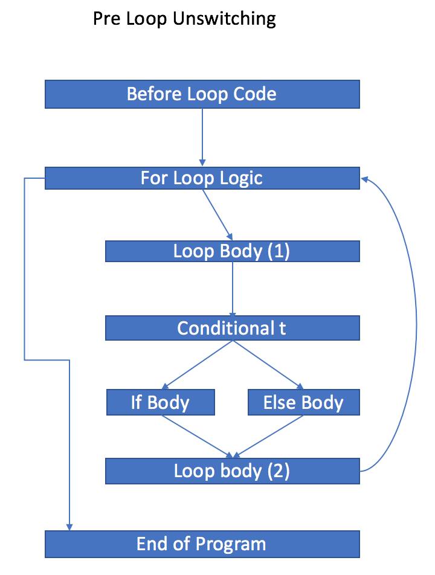
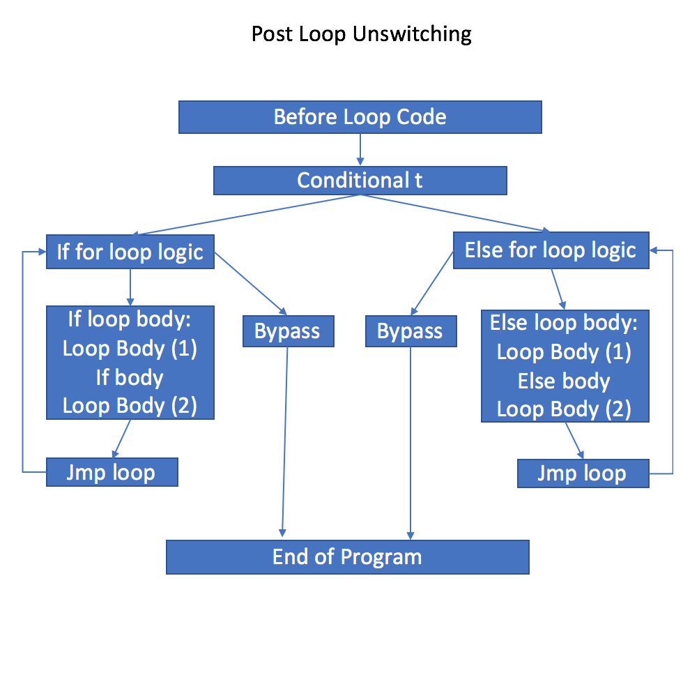

+++
title = "The Loop Unswitching Optimization"
[extra]
latex = true
bio = """
  [Sameer Lal](https://github.com/sameerlal) is a Master of Engineering student. He studied Electrical and Computer Engineering and Mathematics in his undergraduate also at Cornell.  He is interested in probability-related fields."""
[[extra.authors]]
name = "Sameer Lal"
+++


## Goal
For this project, I implemented the loop unswitching optimization for the [Bril][bril] programming language. Loop unswitching involves detecting conditional expressions inside of loops whose condition is independent of the loop's body. This condition is then moved outside of the loop, and the loop's body is replicated inside of each branch.  Consider the following snippet of code:

```
bool b = false
x,y,z = 0
for _ in range(100):
    if b:
        x <= x + 1
    else:
        y <= y + 1
        z <= z + 1
```
Since b is never modified or read inside of the loop's body, we can "unswitch" this code to the following:
```
bool b = false
x,y,z = 0
if b:
    for _ in range(100):
        x <= x + 1
else:
    for _ in range(100):
        y <= y + 1
        z <= z + 1
```
Though code size has effectively doubled, we have now prevented the need to check the conditional statement while inside the loop's body.  This leads to less branching and allows for additional, separate optimizations within each branch.


## Design and Implementation

This optimization primarily involves loops, so the first step is to specify a contract for the representation of loops in Bril.  We use one similar to [LLVM's representation][llvm].  Note that other representations are allowed, though they will need to be preprocessed into the following format before the loop unswitching optimization occurs.  This is a matter of updating the Bril.

The for loop:

```
for( int c = 0; c < max; c += i):
  x = x + x;
z = 11111
print(x)
print(z)
```
is represented in Bril as:
```
main:
  i: int = const 1;
  c: int = const 0
  max: int = const 10;
header:
  b: bool = le c max;
  c: int = add c i;
  br b loopbody exit;
loopbody:
  x: int = add x x;
  jmp header;
exit:
  z: int = const 11111;
  print x;
  print z;
}
```
Most importantly, logic containing whether to enter the loop is encoded in the block "header."  From here, the program either branches into the loop's body which can consist of any number of blocks (here it is "loopbody") or it exits the loop and continues through the rest of the program in the block "exit."

There is also a standing assumption that we are working with Bril programs that have been transformed into SSA form.  Though this implementation does not require SSA form, it may miss unswitches.
### Design

##### Loop Detection
We detect loops by producing the control flow graph (CFG) for the program and then searching for a backedge whose tail is dominated by its head.  
```
back_edges = []
    for e in cfg_edges:
        head, tail = e
        if tail in dom_dic[head]:
            back_edges.append(e)
```
Backedges indicate the presence of cycles.  Next, we find all nodes in between these two nodes by populating a stack with predecessors, until we have reached the beginning of the loop.  We mark these blocks to be part of a loop and pass it to the next part of the algorithm.

##### Deciding unswitchability
Now, we need to decide if this loop is unswitchable.  Recall that in order to unswitch loops, we need to ensure that the condition is independent of the loop's body during execution.  That is, the conditional statement we are unswitching cannot be modified in the loop.  This allows us to write deterministic code.

To implement this,  we adopt the following notation, borrowed from [Matthew John Surawski][mlton] of Rochester Institute of Technology.  Let $v_s$ denote the set of variables defined by statements, and let $v_a$ denote the set of variables defined by arguments.  Now let $V_b = v_a \cup v_s$ be the union of the two for a given block $b$, and let $V_L = \cup_i V_{b_i}$ denote the set of variables entirely in the loop.  Now suppose we have a branching statement on condition $t$:
```
br t if then;
```
Now if $v_t \not \in V_L$, we can unswitch this loop!  In the case of multiple conditional statements that can be unswitched, as we traditionally do in literature, we pick one uniformly at random.

##### Implementing Unswitching
Once we have selected a subset of nodes in the CFG to be unswitched, we need to actually reorder the blocks.  At a high level, we implement the following reordering:




In the above diagram, we have the following:
* Before Loop Code:  This block represents all code before the start of the for loop.
* For Loop Logic:  This consists of logic involving whether or not to enter the for loop's body.  Usually, this encodes code such as: ```for(int i=0; i<n; ++i) ```
* Loop Body (1):  This contains the entire loop body up until conditional t.  In particular, it can consist of many blocks, branches, conditionals, and nonconditional jumps.
* Conditional t:  This block consists of exactly one line of instruction which is in the form ```br b if else``` where ```b``` is the branching boolean that is independent of the loop's body. 
* If Body: This block contains the contents of the ```if``` branch when ```b``` is true.
* Else Body:  This block contains the contents of the ```else``` branch when ```b``` is false.
* Loop body (2):  This contains the entire loop body following the conditional t.
* End of Program: This block contains all code after the loop.  In particular, it may contain additional loops with conditionals, that we are not optimizing.

To implement unswitching, we want to move the ```Conditional t``` block outside the for loop, create branches for each destination (in Bril, we are limited to two branches), and replicate the contents inside of the loop.  We wish to perform surgery in such a way to only to disrupt nodes involving the loop, leaving the rest of the CFG intact.  A high level control flow is as follows for post-unswitching operation:




In particular, we have the following blocks:
* Before loop code: This is the same block as before and contains the contents of the program before we enter the loop.
* Conditional t:  This block contains one instruction, namely the branching instruction that involves the independent boolean.  Based on the value of the boolean, it connects to either the "if" or "else" blocks, each block containing its own for loop.
* If for loop logic:  This block is a replica of the ```for loop logic``` block in the previous CFG, except it branches to two newly created blocks.  If the program decides to enter the loop, we branch to ```If loop body``` and if it decides to exit the loop, it branches to bypass.  
* Else for loop logic:  This block is identical to the previous block, except it branches to either ```Else loop body``` or ```bypass``` depending on the loop invariant. 
* If loop body:  This contains all code in the ``if`` branch of the original CFG.  In particular, this block contains code that is ```Loop body (1)``` $\cup$ ```If body``` $\cup$ ```Loop body (2)```.  This block then automatically branches to a newly created block, ```jmp loop```.
* Else loop body: Similarly, this block contains code in the ```else``` branch of the original CFG:  ```Loop body (1)``` $\cup$ ```Else body``` $\cup$ ```Loop body (2)```.  This block then automatically branches to a newly created block (separate from the previous one), ```jmp loop```.
* Jmp loop:  There are two of these blocks, and each acts as a proxy that feeds back into the loop logic.  Essentially, we delegate logic involving entering the loop through this block.  Further optimizations can make use of this dummy block, though in this implementation, the block only contains a jump instruction.
* Bypass:  Both bypass blocks also delegate the program flow to the end of program block, essentially exiting the loop.
* End of program:  This block is identical to the ```End of Program``` block in the original CFG.

### Implementation

Fine-grain details on the implementation in Python can be found [here.](https://github.com/sameerlal/bril/blob/master/bril-txt/unroll_opt.py)

Implementing unswitching requires favoring generality over specificity.  We begin by loading a Bril file and storing the control flow graph by keeping track of edges.  Next, we run a dominator analysis so we can achieve, in constant time, a dictionary of blocks that dominate a particular block.  We run the loop finding algorithm as mentioned before, and then verify that it is switchable by examining conditional variables and checking to see if that variable has been used before.  We mark these blocks to be reordered and then pass the CFG into the unswitching algorithm.

In my implementation, I stored the program as a dictionary mapping from block name to contents.  The unswitching algorithm takes in this mapping and produces a new mapping that is eventually converted to a Bril program.  It is important to preserve the older block ordering which may have been earlier optimized and only unswitch locally on marked blocks that consist of the loop.  

Since there are multiple duplicated blocks, we first create two hashes, one for each block that act as suffixes for duplicated blocks.  For instance if ```hash(if) = 083``` and ```hash(else) = 061``` then the two bypass blocks are named:  ```bypass083``` and ```bypass061```.  This eliminates the possibility of branching to the incorrect branch, since all block names are guaranteed to be unique.  We choose a hash function a priori according to the number of blocks in the CFG to minimize the probability of hash collisions.  Now we are ready to create the blocks and modify branches for reordering.

We first create the ```conditional t``` block, whose name has already been extracted.  

Next, we create the loop logic blocks.  We copy the contents of the original program's loop logic, duplicate the block, and append the appropriate hashing suffix to its label.  The ```conditional t``` block that we just created will flow to both of these blocks, so we will need to modify the names of the branches there.

```
if_for_loop_logic = loop_logic  + hash(if)
contents[if_for_loop_logic] = contents[loop_logic]

else_for_loop_logic = loop_logic  + hash(else)
contents[else_for_loop_logic] = contents[loop_logic]
```
   
    
Now we are ready to create the loop body blocks.  Here, the contents should include instructions that dominate the ```conditional t``` block and is also dominated by the big loop block.  Here, we use set intersections in the domination dictionary.
    
We reorder these blocks according to the original CFG to ensure that we only locally changing blocks and preserve the original block ordering for all other blocks.  I will delegate the details of this for those interested to the linked code above.
    
In one body block, we include the contents of the ```if``` block, and in the other body block, we include the contents of the ```else``` block.  Finally, we add instructions that are dominated by each of those blocks to be part of the body block.  Combining all of this, as well as performing surgery on the branch instruction names completes the construction of the ```if loop body``` and ```else loop body``` blocks.

Next, we create the additional blocks, namely the ```jmp``` and ```bypass``` blocks that lead to the end of the program.  Creating these blocks requires surgery on the original instructions, as well as rename hashing, since it is not always guaranteed that the last instruction in a block is a ```jump``` instruction.  For instance, both of the following are valid Bril programs:
```
blockone:
    x: int = const 0;
    jmp blocktwo;
blocktwo:
    print x;
```

and
```
blockone:
    x: int = const 0;
blocktwo:
    print x;
```
so we need to guarantee that these two blocks are placed next to each other when we output the new optimized program.  

Finally, we connect the bypass blocks to the end of the program, which we leave intact.   

The last step is to overwrite the original mapping from block name to contents with our new block dictionary and output the resulting Bril program.

## Implementation Difficulties

There were quite a few difficulties that arose during implementation due to the nature of the Bril programming language.

As alluded to before, since Bril does not require jumps at the end of blocks, we need to be careful about reordering blocks in the final Bril program.  Furthermore, this optimization is designed to run after other optimizations, so we would ideally like to keep the majority of the program untouched to prevent overwriting.  This involves a fair amount of bookkeeping especially when these situations occur within the loop body.  

Traditionally, loop unswitching operates on SSA form, and due to time restriction, I was not able to write an SSA translater.  Thus this optimization assumes a prior SSA run.  One example of why we might want SSA form is dead code elimination.  It is possible that after dead code elimination, a branch within a loop becomes independent of the loop body.

Another shortcoming of this optimization is that it currently only operates on natural loops, and in particular, does not operate on nested loops.  That is, programs in the form:
```
b = True
for i in range(10):
    for j in range(10):
        if b then:
            do something()
        else:
            do something else()
```
will not be completely unswitched since the conditional statement lies inside of a nested for loop.  Instead, after one run of the optimization, the conditional will be unswitched outside of the first for loop, which only mildy decreases the number of branches.  Implementing this is not too difficult to do, though it requires  additional abstractions for nested for loops.


## Evaluation and Results

##### Evaluation 

This optimization was tested on many programs of varying length, complexity and number of possible unswitched loops.  The testing suite I generated tests on the following (though not limited to) attributes:
* Should a conditional be unswitched?
* Simple/Complex blocks before/after conditional
* Non-unswitched branches before conditional to be unswitched
* Blocks with no terminating jump instructions
* Nested if/else conditionals should never be unswitched

##### Results
The results of this optimization were quite interesting.  I primarily evaluated the code on percentage difference in the number of branches.  To do this, I modified the Bril Typescript interpreter to keep track of the number of branches for each run.  For a program:
```
for _ in range(maxiter):
    prebody
    if b:
        ifbody
    else:
        elsebody
    postbody
```
and its unswitched version:
```
if b:
    for _ in range(maxiter):
        prebody
        ifbody
        postbody
else:
    for _ in range(maxiter):
        prebody
        ifbody
        postbody
```
the improvement comes from eliminating branches in the "if...else" decision.  Through testing, one loop unswitching produces a decrease in the number of branches of approximately 14% on average for a short Bril program (~20 loc) with one possible unswitched loop.  For medium sized programs (~100 loc), with two unswitched loops, I observed approximately 20% reduction in branches.

This result is highly dependent on the structure of the program.  For instance, after unswitching, ```ifbody``` and ```elsebody``` can separately be optimized which would compound the results even further.  The results from the benchmark tests assume that the loops *cannot* be independently optimized, so our claimed average can be thought to be a lower bound on the decrease in the number of branches.

In literature, benchmarking code unswitching involves measuring the increase in code size.  In my implementation, code size roughly doubled for each unswitching which is consistent with the literature.

Overall, this project was a success, and the natural extension is to extend this optimization to work for nested loops.


I would be very happy with suggestions for additional test cases or pull requests that test this optimization on more test cases.  Furthermore, for questions or comments on design, please reach out by [e-mail](mailto:sjl328@cornell.edu)
.

[llvm]: https://llvm.org/doxygen/classllvm_1_1LoopBase.html
[mlton]: https://www.cs.rit.edu/~mtf/student-resources/20155_surawski_mscourse.pdf
[bril]: https://github.com/sampsyo/bril