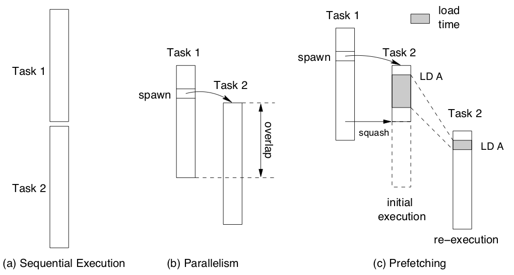
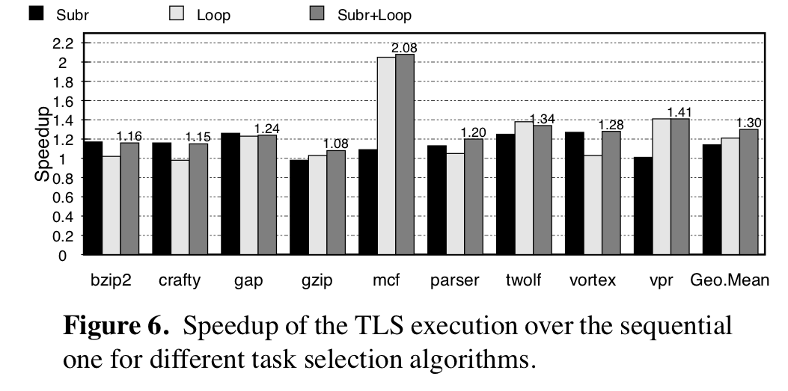
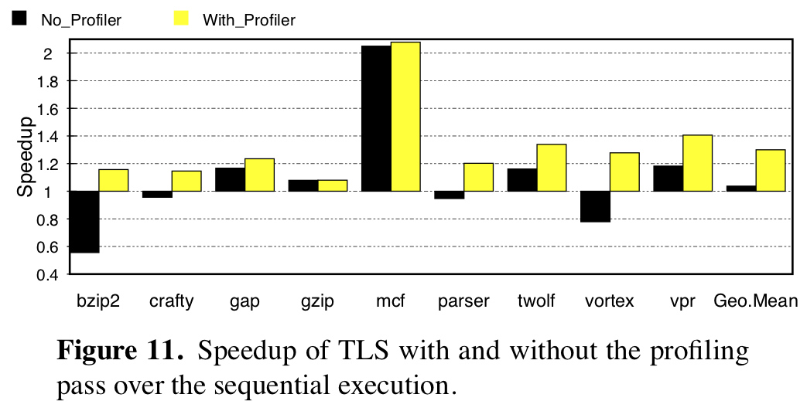
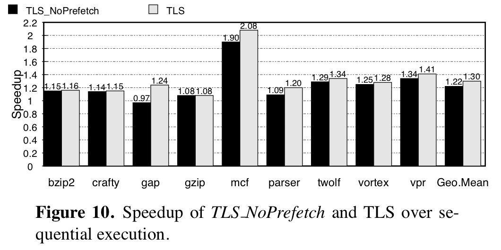

+++
title = "POSH: A TLS Compiler that Exploits Program Structure"
extra.author = "Drew Zagieboylo & Josh Acay"
extra.bio = """
  [Drew Zagieboylo](https://www.cs.cornell.edu/~dzag/) is a 3rd year PhD student researching Security, Hardware Design, and Programming Languages. He enjoys rock climbing and gaming in his free time.

  [Josh Acay](https://www.coskuacay.com/) is a 3rd year PhD student whose research combines information flow control with cryptography to synthesize secure-by-construction distributed protocols.
"""
+++

The development of multicore processor architectures in the 2000s led to
significant advancements in the performance of parallel computing. As a
software developer, if you could split your program or your data into
discrete chunks, you could send different pieces off to different cores
and have all of the processing done in parallel.

Naturally, software developers, compiler writers, and hardware architects
all began to wonder: _"Can we somehow use these extra cores to speed
up sequential, non-parallelizable workloads?"_
One proposed technique to answer this question is _Thread-Level Speculation_ (TLS).
TLS allows software to run portions of a sequential program in parallel while
retaining the original sequential semantics. The key idea is that special hardware
support will detect when any of these parallel tasks misbehave and either rollback
the effects of such "speculative tasks" or hide the "bad" behavior form other tasks
somehow.

In general, choosing where to insert these tasks so that they are likely to
succeed and actually provide speedup over serial execution is a difficult problem.
POSH is a compiler that automatically identifies some of these regions for you,
by using simple heuristics and profiling to eliminate candidate tasks that are
unlikely to be worth the cost of inserting them.


# TLS and Hardware Transactional Memory

Before we dive into POSH itself, we want to give a more detailed
background on both how TLS works and the context in which it was envisioned.
As we mentioned above, TLS relies on special hardware support for detecting
data dependencies between threads running on different processor cores.
Broadly, these kinds of features are known as Hardware Transactional Memory (HTM).
At the [end of this article](#hardware-transactional-memory) we've included a brief aside on HTM and its
presence in modern processors for those who are interested.

POSH assumes that hardware has support
for the following features:
 - Inputs to tasks are passed via memory, not registers.
 - Hardware automatically detects conflicting memory reads/writes
   between the main thread and speculative tasks
   and then automatically kills or restarts tasks.
 - The ISA extension has the `spawn` and `commit` primitives
   for starting and ending task execution.

Most papers exploiting HTM rely on a very similar set of assumptions,
and indeed, real HTM extensions have guarantees not unlike those listed here.
The primary difference between these assumptions and reality are empirical limitations
on code and working set size for speculative tasks.


# Sources of Performance Improvements of TLS

The goal for TLS (remember, HTM is the set of hardware features, while TLS
is a software-level technique that utilizes those features),
is to speculatively parallelize code by predicting which regions do
not have real data dependencies. Existing compiler optimizations already
attempt to identify such dependencies (e.g., [instruction scheduling](../instruction-scheduling))
in order to improve performance. However, those optimizations must be
conservative in order to preserve program semantics.
Since TLS compilers can rely on runtime support from the hardware to preserve
correctness, they can aggressively overestimate data independence to
maximize potential parallelism.

```C
...
x = f(a);
y = g(b);
z = h(x,y);
...
```
For example, in the above code snippet, the calls to functions `f` and `g`
can probably be parallelized so that the operands to `h` are available as
soon as possible. However, `f` and `g` may be side-effectful functions that
modify shared memory; TLS using HTM is free to parallelize those two calls
without fear of race conditions on that memory. A normal compiler would have
to prove disjointness of their memory accesses to parallelize them automatically.


The authors point out another, more subtle, benefit to TLS: data prefetching.
Even speculative tasks which violate data dependencies are likely to
access data that will be useful to re-executions of that task.
The authors assume (fairly) that the hardware primitives for squashing tasks
will not rollback cache state; this implies that squashed tasks can
still prefetch useful data into the cache. Re-executions of the failed
task, or even future tasks may benefit from access to this cached data
and see reduced memory access latency.



This diagram from the POSH paper shows how "load times" in
speculative tasks are not totally wasted during task failure.
Executing a speculative load from memory improves the performance of loads in future tasks.

# POSH Phases

The POSH compiler optimization is broken into three phases;
  1) _Task Selection_: Chose speculative tasks based on program structure.
  2) _Spawn Hoisting_: Place task initiation (spawn instructions) as early as possible.
  3) _Task Refinement_: Use dynamic profiling to remove tasks that are unlikely to be beneficial.

The first step is chopping up the program into tasks that will benefit
from being run concurrently.
As you might expect, doing this optimally is NP-hard, so POSH has to resort
to heuristics.
Its primariy heuristic leverages the existing high level program structure;
each subroutine call and loop iteration is considered a candidate task.
The authors justify this with some intution:
```
All these programmer-generated structures are taken
as hints to delineate code sections with a relatively independent and
sizable amount of work.
```
In reality, not all subroutines or loop iterations are independent
*and* there are other sections of code which may be parallelizable.
The former problem is addressed by _Task Refinement_ but POSH ignores
the latter source of imprecision.

During task selection, POSH inserts the special `spawn` and `commit`
instructions, as well as task begin labels to divy up the program
according to the above heuristic. A subtle optimization included in
this phase is the introduction of [software value prediction](https://people.apache.org/~xli/papers/vpw03-software-value-prediction.pdf).
Although POSH doesn't focus on their implementation of software value
prediction, we include another [aside on how svp works](#software-value-prediction).

In the _Spawn Hoisting_ phase, POSH tries to move spawn instructions as early
as possible without violating dependencies or changing program behavior.
Spawning tasks early increases opportunities for parallel execution and
prefetching, but there are limits to how far we can move them.
For example, it is not sensible to spawn a thread before the assignment
of its input variables. Neither is it clearly beneficial to
move the spawn instruction outside a conditional
statement since that could result in unnecessary code execution.

The final phase uses profiling and simple syntactic criteria, such as task
size and number of inputs, to remove tasks that probably don't improve performance.
Instead, these pieces of the program are executed straight line.
The profiling methodology is to use test inputs and simulate the parallel
execution of the program with a sequential interpreter, while keeping
track of how many dynamic instructions each task executes and how often
it would have to be squashed by the hardware.

# Evaluation

The overall evaluation methodology is to optimize some of the SPECint benchmarks
using some configuration of the compiler, and look at statistics (e.g. execution time or memory behavior).
For the most part, their tests are concerned with the reduction in total execution
time compared to the sequential execution.
All experiments are run on a simulator as hardware with support for TLS
was not comercially available at the time.

While the authors do extensively break down their evaluation,
we'll simply summarize some of the tests they run and our takeaways
from their results.

First the test POSH's various optimizations:
 1) Impact of choosing subroutine vs. loops as tasks
 2) Effect of using [software value prediction](#software-value-prediction)
 3) Importance of using the profiler to eliminate tasks


In the first case, they observe that the best performance comes from parallelizing
both loops and subroutines. Since these measurements involve tests that *do* use the
profiler (which hopefully eliminates tasks that make things worse),
it makes sense that *more candidates* for parallelization means *more performance*.

Value prediction makes a big difference in some cases, but less in others;
but the same theory as before should apply here. Value prediction allows for
more chances to parallelize, so it should improve performance as long as the
profiler identifies when it might be a bad idea.

The following graphs shows the importance of using the profiler:
without it, some programs are _slowed down_ due to the overhead of
managing tasks.
The profiler significantly improves performance, and realizes the
"do no harm" principle of compiler optimization.



As we mentioned earlier, most of the speedup comes from executing code in parallel, but
even when correct parallel execution is not possible and tasks get squashed, memory accesses
they make have the effect of prefetching data that the re-executions are likely to use.
To evaluate the impact of prefetching, they modify the simulator so that data brought
into the processor cache by squashed tasks are marked as invalid.
Comparing the speedup gained with prefetching and without in the graph before,
they claim 26% of the speedup is due to prefetching.




## Evaluation Takeaways

The paper has a solid evaluation which asks (and answers) all the questions we
might want asked. Our primary gripe with their evaluation is that it is based on "eyeball statistics".
No formal null hypothesis testing is done; instead, the authors point at a graph
and say "the bars are usually higher in this case". Additionally, it's unclear if
the SPECint benchmarks are really a representative use case for real code. In theory, these
are meant to test the sequential integer performance of CPUs and may have few opportunities for parallelism.
On the other hand, the opposite may be true *or* they may represent a good spread of optimizability.

Given the breakdowns that the authors provide, it seems likely that the most significant
contribution of POSH is its dynamic profiler, which allows their other optimizations
to be aggresively optimistic. While hardware support does prevent TLS from impacting
correctness, it doesn't prevent TLS from being a bad idea. The POSH profiler fills this
gap instead and allows techniques like software value prediction and the structured
program heuristic to be utilized without hurting performance.

If HTM were actually widely usable by general purpose programs, then POSH would likely
be an effective optimization for automatically speeding up sequential code!

# Appendix

### Hardware Transactional Memory

Before transactional memory, hardware support for parallel computing
was limited to synchronization primitives such as [`atomic compare-and-swap`](https://en.wikipedia.org/wiki/Compare-and-swap)
or [`store-conditional`](https://en.wikipedia.org/wiki/Load-link/store-conditional).
Transactional Memory was meant to accelerate the common use case for such
primitives: atomic software transactions, consisting of a potentially unbounded number of instructions.

In this ideal world, programmers could write systems code like:
```C
withdraw(bank_acct *acct, int amt) {
  atomic {
    if (acct->balance >= amt) {
        acct->balance -= amt; return true;
    } else { return false; }
  }
}
```
where `atomic` was a hardware-supported feature for ensuring the atomicity of the contained code.
If any other thread modified `acct->balance` during the execution of this transaction,
it would *abort* and have to be retried or cancelled.

Usually, HTM is implemented by piggy-backing off of the cache coherence protocol,
which normally ensures that memory writes to the same address are eventually propagated
between cores. Unfortunately, cache coherency can be [notoriously complex](https://doi.org/10.1109/2.55497),
especially in the face of ambiguously defined and/or weak memory models.
One might reasonably expect adding new synchronization features to introduce bugs
and/or interact unexpectedly with existing weak memory guarantees.
Furthermore, relying on cache coherency drastically limits size of datasets read or written by hardware transactions;
in [most systems](https://researcher.watson.ibm.com/researcher/files/us-rodaira/ISCA2015_ComparisonOfHTM.pdf) the write set must fit entirely inside the L1 cache.


### HTM Today

In reality, hardware transactional memory has primarily been a failure
and does not see wide use today.
While Intel theoretically supports these kinds of instructions
with [TSX](https://en.wikipedia.org/wiki/Transactional_Synchronization_Extensions),
numerous bug reports have caused them to [disable it on a number of processors](https://www.anandtech.com/show/8376/intel-disables-tsx-instructions-erratum-found-in-haswell-haswelleep-broadwelly).
Furthermore, the [limitations of TSX](https://blog.ret2.io/2019/06/26/attacking-intel-tsx/)
and other such extensions often make using them impractical, unstable and/or insecure.

However, some low-level code *does* utilize HTM to implement
efficient libraries for high performance computing. In these instances,
developers are targeting very specific architectures with very detailed
models of the processor and memory systems. Since developers in
this domain are already concerned with the finnicky details that often
make HTM transactions impractical, HTM does offer utility as a more flexible
and performant synchronization primitive.

### Software Value Prediction

In TLS, there are some code regions which could be parallelized,
but they involve potentially predictable data dependencies.
For example, in a `while` loop, the iteration condition may not
be known before executing the entire body of the loop and thus parallelism
becomes very limited.

Value prediction transforms this sequential execution into
a potentially parallel one by creating data dependencies between
the original variable and a prediction variable. Value prediction
prodcues code with the following invariant:

*Let x be some variable in the program, pred(x) is its predicted
value and real(x) is its real value. A TLS task that reads pred(x)
will be squashed whenever real(x) != pred(x)*

The following example from [Li et al.](https://people.apache.org/~xli/papers/vpw03-software-value-prediction.pdf)
shows how the newly spawned task will be squashed whenever `pred_x` is not equal to the correct value.
Specifically, this code ensures that the original thread will update `pred_x` to be correct before it commits, forcing
a read-write dependency on that variable.

```C
      pred_x = x; //initialize prediction
Loop: x = pred_x; //use prediction
      pred_x = f(x); //generate prediction
      spawn Loop;
       … = foo(x);
       x = …;
      if (x != pred_x) //verify prediction
        pred_x = x; //recover misprediction
      commit();
 if (cont) goto Loop;
```

The POSH authors don't go into any real detail on their prediction mechanism
beyond what we've described here. While they do evalute its effectiveness,
we have no idea what kind of algorithm they're using to choose prediction values.

Another downside of prediction is that it involves more runtime overhead in
generating predictions. Not only do the instructions used to produce predictions
slow down execution, but the prediction code likely accesses a shared data structure that
could increase the number of failed tasks due to races on that.
It would be a great idea for the POSH profiler to
also take into account this execution information
(_note it does account for the potential task squashing, just not the instruction overhead_).