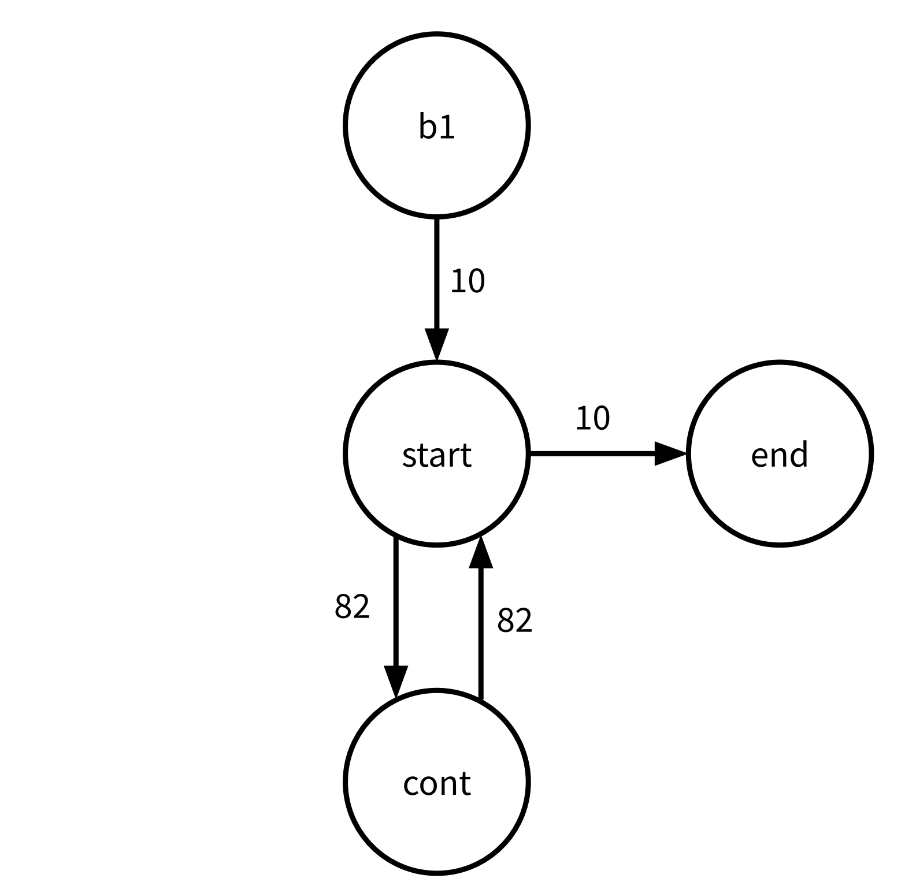
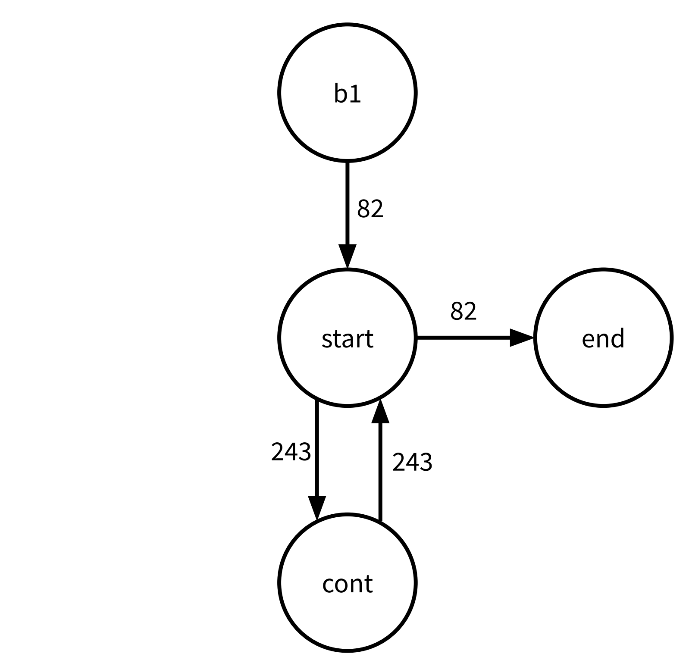
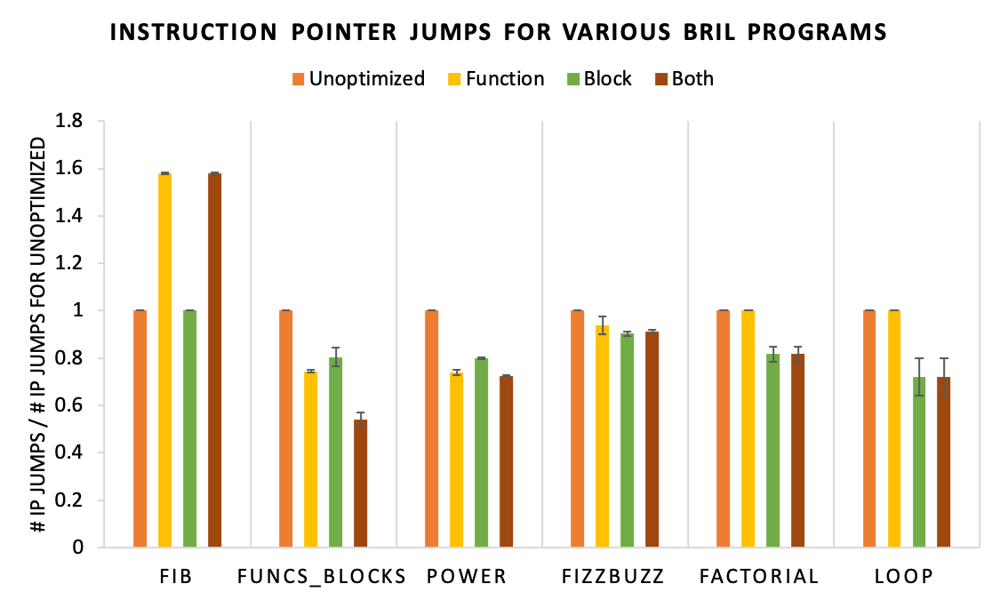

+++
title = "Profile-Guided Code Layout"

extra.author = "Gautam Mekkat"
extra.author_link = "https://github.com/Blue9"

extra.bio = """
Gautam Mekkat is an undergraduate studying Computer Science and Electrical & Computer Engineering.
"""
+++

The goal of this project was to optimize Bril programs with profile-guided function and basic block reordering. I used [Bril()](/blog/making-function-calls-work) to serve as a base for the optimization since it allows for function calls and passing in input via the command line.

## Design

The design of these optimizations is closely related to the optimizations discussed in [Profile guided code positioning](https://doi.org/10.1145/93542.93550) and [Optimizing function placement for large-scale data-center applications](https://research.fb.com/publications/optimizing-function-placement-for-large-scale-data-center-applications-2/). Specifically, the basic block reordering optimization follows the approach laid out the first paper, and the function reordering optimization follows the approach in the second paper. Both optimizations are profile-guided, meaning they use sample inputs to make optimization decisions. Assuming that real-world workloads mirror the sample inputs, we can optimize the code layout for the sample inputs, and this should lead to improved performance on real workloads.

## Defining Code Locality
Before moving further, it is important to clearly define what "code locality" means. Typically, the goal of code layout optimizations is to improve instruction cache and instruction TLB utilization. When an instruction is loaded into an instruction cache, a block of instructions are loaded into the cache. To improve cache utilization, we want to minimize the number of times we load into the instruction cache. In other words, we want sequences of instructions that frequently run together to live close together in the code.

That being said, there are many factors that make measuring this metric difficult for this project. Firstly, since Bril is interpreted, we do not actually load Bril instructions directly into the instruction cache. I considered lower Bril programs to LLVM and evaluating those programs, but that leads into the second problem: I am one person running Bril programs on one machine. The results I find for my machine will not be consistent with other machines, so the results would be misleading. Because of this, I use a different metric to measure code locality: *instruction pointer jumps*. Improving code layout in a typical program will decrease the number of instruction pointer jumps, since frequently executing code lives close together. I introduced an imaginary instruction pointer to the Bril interpreter that is set to the index of the currently executing instruction. Every time an instruction is executed, we can compare the current instruction pointer location to the previous instruction pointer location to determine the number of instruction pointer jumps.

## Profiling

The first step in any profile-guided optimization is—perhaps unsurprisingly—profiling. But first, we need to know what kind of data we want to collect when profiling Bril programs. Function reordering relies on weighted directed call graphs, where nodes denote functions, edges denote calls from one function to another, and weights denote the number of times that call occurred in the sample workload. Similarly, basic block reordering relies on weighted control flow graphs, where edge weights denote the number of time that branch was taken. Therefore, when profiling a Bril program, we would like to keep track of function calls and branches. In addition, to help with evaluation, we will keep track of the total number of instruction pointer jumps.

To build a Bril profiler, I first extended the parser to create an annotated JSON representation of the program. I introduced a new `"block"` key for every instruction, denoting which basic block each instruction belongs to, and a `"line"` key, denoting the line number of the instruction (ignoring whitespace). I then extended the interpreter to accept profiling data in the form of a line-separated list of command-line arguments. It then runs on each input, tracking function calls and basic block changes. The profiler returns a JSON representation of the weighted call and control flow graphs. The format of the profiling output is shown below.

```
{
  "call_graph": [
    {
      "from": caller name,
      "to": callee name,
      "count": total number of times called
    },
    ...
  ],
  "basic_block_flows": [
    {
      "from": block label,
      "to": block label,
      "count": total number of times branched,
      "function": function where "from" and "to" blocks live
    },
    ...
  ],
  "total_ip_jumps": total number of instruction pointer jumps
}
```

To decouple the interpreter from the profiler, I created a new command called `brilprofile`. It reads Bril programs as JSON from `stdin` (like `brili`), but it takes an additional argument, a path to the sample workload. For example, suppose we have a program called `fibonacci.bril` that takes an integer as a command-line argument. If we have a file `fibonacci.in` that contains typical inputs to the program as line-separated integers, we could profile the program by running:

```bril2json < fibonacci.bril | brilprofile fibonacci.in```

Let's first take a look at how basic block reordering and function reordering are done, and then we'll run through an example from start to end.

## Basic Block Reordering
Basic block reordering uses the weighted control flow graph to determine which basic blocks should be close to each other. We want basic blocks that frequently run one after another to live closer together. As a result, it makes sense to co-locate basic blocks that have higher-weighted edges. To do this, I followed a greedy approach presented in the Pettis-Hansen paper. At a high-level, it works by coalescing basic blocks into chains and ordering these chains to form the new block order. Initially, each basic block belongs to its own chain. We define the source node of a chain as the *last* node, and the target node as the *first* node. Note that initially every block is a source and a target. Then, the algorithm works as follows.

1. Iterate over edges in decreasing order of weight.
2. During each iteration, if the tail of the edge is a source *and* the head is a target, then coalesce the two chains into one chain.
3. Continue until no more chains can be coalesced.
4. Order the remaining chains based on frequency of execution. More frequently run chains should be placed higher in the function.

One exception to the above is that the first block in a function must remain the first block in a function since it is the function's entry point. It must always be a target node, and its chain must be explicitly placed at the top of the function.

## Function Reordering
Function reordering uses the weighted call graph to order functions. The approach is similar to that of basic block reordering. I followed the approach laid out by Ottoni and Maher, with some modifications to account for the limitations of the Bril interpreter. Function reordering works as follows:

1. For each node, we assign a "hotness" metric, defined as the sum of their incoming edge weights.
2. Iterate over the nodes in decreasing order of hotness.
3. During each iteration, determine the node's highest-weight incoming edge, and coalesced the node with the source of the edge.
   - Each node has a memory of the order in which nodes are coalesced. For example, if the edge is (`a`, `b`), then after coalescing, the new node will record that `b` is ordered after `a`.
4. Continue until no edges remain.

The final node's order is the function order.

## An example
To get a better idea of how this optimization works, let's run through an example from start to end. The following Bril program takes in two command-line arguments `a` and `b`, and computes `exp(a, b)`.

```
multiply a b : int {
  zero: int = const 0;
  one: int = const 1;
  curr: int = id zero;
start:
  b_zero: bool = eq b zero;
  br b_zero end cont;
end:
  ret curr;
cont:
  curr: int = add curr a;
  b: int = sub b one;
  jmp start;
}

main base exp {
  zero: int = const 0;
  one: int = const 1;
  val: int = const 1;
start:
  exp_zero: bool = eq exp zero;
  br exp_zero end cont;
end:
  print val;
  ret;
cont:
  val: int = call multiply val base;
  exp: int = sub exp one;
  jmp start;
}
```

Below is the workload we will use to profile the program.

```
2 4
4 2
5 5
6 6
2 9
3 9
4 10
2 20
2 10
3 7
```

Now, if we run `brilprofile` on the program with the above workload, we will get the following call graph.

<p align="center">
  
</p>

The function reordering algorithm will place `main` before `multiply`, since `main` calls `multiply` and not the other way around.

Below is the basic block graph for `main`.

<p align="center">
  
</p>

The basic block reordering algorithm will first coalesce `start` and `cont` and then prepend `b1` to that chain. Since `end` cannot be added to this chain, it will remain on its own. Combining the chains will lead to a final block order of `b1`, `start`, `cont`, and `end`.

Below is the basic block graph for `multiply`.

<p align="center">
  
</p>

This is very similar to the weighted CFG for `main`. The output block order is the same: `b1`, `start`, `cont`, and `end`.

Putting all this together, the optimized Bril program is below (after running *both* function reordering and block reordering).

```
main {
  zero: int = const 0;
  one: int = const 1;
  val: int = const 1;
start:
  exp_zero: bool = eq exp zero;
  br exp_zero end cont;
cont:
  val: int = call multiply val base;
  exp: int = sub exp one;
  jmp start;
end:
  print val;
  ret ;
}
multiply {
  zero: int = const 0;
  one: int = const 1;
  curr: int = id zero;
start:
  b_zero: bool = eq b zero;
  br b_zero end cont;
cont:
  curr: int = add curr a;
  b: int = sub b one;
  jmp start;
end:
  ret curr;
}
```

Now we will explore the evaluation of these optimizations.

## Evaluation
I evaluated these optimizations by comparing the total number of instruction pointer jumps for the unoptimized and optimized programs on a given workload. On average, I found that function reordering did *not* decrease the total number of instruction pointer jumps and that basic block reordering decreased the number of instruction pointer jumps by approximately 20% (TODO). Since the two optimizations do not interfere with each other, I also evaluated the combination of function reordering and basic block reordering, and found its performance to comaprable to that of basic block reordering. In most cases, however, basic block reordering outperformed the rest.

To conduct a thorough and rigorous evaluation of these optimizations, I ran them on numerous inputs with various workloads. Initially my evaluation strategy (for a single program) was the following:
1. Profile the original program with a sample workload.
2. Run the function reordering optimization and profile with the same workload.
3. Repeat step 2 but with basic block reordering.
4. Repeat step 2 but run both optimizations one after another. Note that since the optimizations do not interfere, the order in which we apply the optimizations does not matter.

I considered testing the optimized programs with a different "testing" workload but decided that this would not fairly evaluate the optimizations. Since we make the assumption that sample workloads are representative of real-world workloads, we should stick to that assumption.

Below is a graph showing the total number of instruction pointer jumps for 6 representative programs on three different workloads. The last two programs do not contain any functions. Programs and workloads can be found [here](https://github.com/Blue9/bril/tree/project-2/workload).

<p align="center">
  
</p>

Note that the error bars for most programs are very small. The "Loop" test had quite large error bars, and this is because one of the workloads led to the program always exiting and never entering the loop. As a result, its block reordering performance only gave a 0.6% increase in performance. This is important to note because it shows how the performance of the code layout optimizations is sensitive to the workloads.

From the above, we can see that the basic block reordering optimization consistently decreases the number of instruction pointer jumps by 10-20% (with the exception of the first test, which could not benefit from branch reordering), but the function reordering optimization is all over the place. For "Fib", the function reordering optimization increased the number of instruction pointer jumps by approximately 51% on average. Let's investigate this further. Below is the "Fib" benchmark.

```
main (n:int) {
    v1: int = call fib n;
    print v1;
}
le_one (n: int): bool {
    one: int = const 1;
    lto: bool = le n one;
    ret lto;
}
fib n: int {
    base: bool = call le_one n;
    br base return continue;
return:
    ret n;
continue:
    one: int = const 1;
    prev: int = sub n one;
    prev2: int = sub prev one;
    fib1: int = call fib prev;
    fib2: int = call fib prev2;
    ans: int = add fib1 fib2;
    ret ans;
}
```

And below is the `optimized` program returned by the function reordering algorithm.

```
main (n:int) {
    v1: int = call fib n;
    print v1;
}
fib n: int {
    base: bool = call le_one n;
    br base return continue;
return:
    ret n;
continue:
    one: int = const 1;
    prev: int = sub n one;
    prev2: int = sub prev one;
    fib1: int = call fib prev;
    fib2: int = call fib prev2;
    ans: int = add fib1 fib2;
    ret ans;
}
le_one (n: int): bool {
    one: int = const 1;
    lto: bool = le n one;
    ret lto;
}
```

Intuitively, this reordering makes sense. `main` calls `fib`, and `fib` calls `le_one`. However, note the location in `fib` where `le_one` is called. It is at the very top of the function—the first line in fact. As a result, when this call is made, the instruction pointer has to go down the entirety of `fib` to get to `le_one`, and then it has to go all the way back when `le_one` returns. In the original program, the instruction pointer only had to traverse the length of `le_one`, which is considerably shorter than `fib`. This demonstrates one of the core weaknesses of this function reordering algorithm. It assumes that all functions are of the same length and that on average, function calls are made halfway through a function. However, in real programs, this is rarely the case. I think it would be interesting to explore this further and see how we could incorporate the size of functions as well as the location of function calls to improve function ordering.