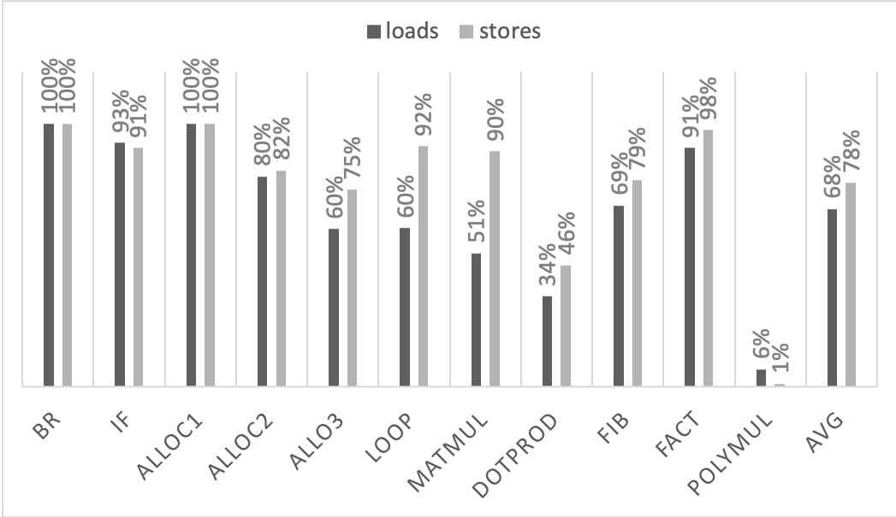

+++
title = "Register Allocation for Bril"
extra.author = "Hongbo Zhang, Sachille Atapattu, Wen-Ding Li"
extra.bio = """
  Hongbo Zhang is a first PhD student in computer science. He is interested in systems and computer architectures. He is also okay archer shooting recurve bow.
  [Wen-Ding Li](https://www.cs.cornell.edu/~wdli/) is a Ph.D. student at Cornell interested in high-performance code generation.
"""
+++
# Register Allocation for Bril

Processors usually have registers which can be used to store variables for faster access. Program will run faster if we can put variables in these registers. Nevertheless, registers are limited, so often times we still need to access memory (or cache) instead of registers and memory access are costly compared with register access. Although modern program often use large number of variables, we can analyze their live range so the same registers may be able to hold different varialbes throughout the program. Then, we can put more varialbes in the registers which may lead to fewer memory access and get a faster program. 

The goal of our project is to perform register allocation on Bril program and anaylze its performance. In this project, we implemented register allocation for Bril via graph coloring. Our project can be found in [this repository](https://github.com/xu3kev/bril) under `regalloc` directory.

## Method
Our approach for the register allocation can be divided in three main parts. First, we perform liveness analysis and then build a graph. Second, we solve approximate k graph coloring problem to obtain a mapping from each varialbe to corresponding register. At last, we generate Bril code based on the mapping.

### Liveness Analysis
We use data flow analysis to get the live varialbes at each instruction of the program. First we transform the input Bril program to control flow graph (cfg) and then perform liveness analysis with a standard backward flow anaylsis. Once we obtain the live varialbes in the end of each code block, we start from that and go backward: when we see a definition of a varialbe, we kill the variable, and when we see the use of the varialbe, we mark it as alive. Then, we can get the live varialbes at every instructions.

### Graph Coloring
With the liveness ranges of all local variables, we can know which variables are "alive" at the same time. If two variables have overlapped liveness ranges, it means that they cannot be allocated to the same register. Otherwise, they may be allocated to the same register. Our goal is to have register assignment so that we can allocate as many variables on registers as possible.
We solve this question by graph coloring. Each node in the graph represents a local variable in the function. There is an edge between two nodes if the two variables have overlapped liveness range. We just needs to compute a color assignment with at most *k* colors, such that every pair of nodes on the two sides of an edge have different colors.
Clearly, it is not always possible to find a coloring scheme. For example, it is not possible to allocate 2 registers to 3 variables with overlapped liveness ranges. Maybe we should find a coloring scheme to cover the subgraph with most number of nodes (variables)?
Unfortunately, it is still impossible. *k*-coloring is a NP-complete problem. Instead of finding the optimal coloring, we use optimistic coloring to find one large subgraph with as many nodes as possible.
On each interation, we find the node with the least number of neighbours that are not assigned a color yet. Then we try to assign a color to the selected node based on the constraints of all neighbour nodes. If it is not possible to assign a color to the selected node, then we remove the node from the graph along with all edges connected to the node.
Only the variables with a assigned color will be allocated to the corresponding registers, all reads or writes to other variables will involve a memory load and store.

### Code Generation
Once we have the graph coloring scheme, we start to generate a new Bril program with register allocation.
We use special variables `r_xx` to represent registers.  For example, 
```
a: int = const 5;
b: int = const 3;
c: int = add a b;
print c;
```
with `r_01` allocated to `a` and `r_02` allocated to `c` will look like the following:
```
r_01: int = const 5;
b: int = const 3;
r_02: int = add r_01 b;
print r_02;
```

If any data transfering between registers and stack is needed, it could be done by `id` operations like `a: int = id r_01`.

## Evaluation Method
We evaluate our implementation by counting load and store counts during program execution.

### Benchmarks
We wrote some common kernels and some hand written programs that can be mapped with a specific number of registers to test our register allocation performance. Following table provides a list of these benchmarks.

| Test   | Description |
|--------|---------------------------------------------------------------------------------------|
| br     | Tests with branching                                                          |
| if     | Tests with a more complex conditional                                        |
| loop   | Tests with a loop                                                          |
| alloc1 | Tests a simple 4 variable program taken from [these](https://web.stanford.edu/class/archive/cs/cs143/cs143.1128/lectures/17/Slides17.pdf) slides.    |
| alloc2 | Test with 14 variables possible to allocate to 4 registers, inspired from the [book](https://www.google.com/books/edition/Modern_Compiler_Implementation_in_Java/N-sgAwAAQBAJ?hl=en&gbpv=0) |
| alloc3 | Test with 14 variables possible to allocate to 6 registers, adopted from the [book](https://www.google.com/books/edition/Modern_Compiler_Implementation_in_Java/N-sgAwAAQBAJ?hl=en&gbpv=0) |
| matmul | An implementation of matrix multiplication in Bril                                |
| dotprod | An implementation of dot product in Bril                                |
| fib | An implementation of fibonnacci in Bril                                |
| fact | An implementation of factorial in Bril                                |
| polymul | An implementation of polynomial multiplication in Bril                    |

The last 5 benchmarks are from this [repository](https://github.com/xu3kev/bril/tree/master/benchmark).

### Baseline
In order to evaluate our register allocation, we assume that there is no register holding data across different instruction as the baseline, so that each instruction loads all operands from the memory and stores the result back to memory after execution. This is a conservative approach and provides an upper bound to the number of loads and stores that can occur.

We also implemented a naïve register allocation technique, which assigns registers in a round-robin manner. This technique doesn't guarantee any efficiencies, but merely provides a mechanism to map to registers. This implementation presently does not support branch operations and therefore is only used for a subset of benchmarks as a sanity check.

To gain more insight, we also manually allocated registers by graph coloring for some tests. This provides a reasonable ceiling to potential performance.

### Counting the Number of Memory Access
We modified the Bril interpreter `brili` to count the number of implicit memory access operations for those data not in registers. As discussed in the code generation section, we introduce a special rule, that is, variable names prefix with `r` are registers. Read and write operation on those registers do not require memory access. However, read and write on other variables all are counted as memory access. With this rule, we can do register allocation and perform evaluation on Bril without language breaking changes. For example:

- `a: int = const 2;` has 1 memory access operations (store a)
- `a: int = id b;` has 2 memory access operations (load b, store a)
- `c:int = add a b;` has 3 memory access operations (load a, load b, store c)
- `br given a b;` has 1 memory access operation (load given)
- `print <N args>;` has N memory access operations, N being the number of arguments (N loads)

As for accessing register values (the case where special variables represented registers will not be counted as a memory access):

- `r1: int = const 2;` has 0 memory access operations
- `a: int = id r2;` has 1 memory access operations (store a)
- `c:int = add a r2;` has 2 memory access operations (load a, store c)

We compare the total number of memory access operations for the same program with and without register allocation. 

It was identified during evaluation that this implementation of counting doesn't support the `ret` instruction. We hope to fix this issue shortly. We have tested this interpreter version with some hand written register allocated code.

### Simulated load and store counts

We simulated the baseline and graph coloring implementation using Brili to test for two things,
1. To make sure that the functionality hasn't been affected by our optimization
2. To measure memory access operations as a proxy for performance

The following tables provides the memory acccess count in the form of `loads/stores`. These tests are run assuming for 4 registers.

Basline and graph coloring tests are an average from multiple simulation runs. This turned out to be useful for the graph coloring technique, as the register assignment can change.

| Test   | baseline | naïve | graph coloring | handtune |
|--------|----------|-------|----------------|----------|
| br     | 3/4      |       | 0/0            | 0/0      |
| if     | 14/11    |       | 1/1            | 1/1      |
| alloc1 | 6/5      | 0/0   | 0/0            | 0/0      |
| alloc2 | 20/17    | 15/26 | 4/3            | 0/0      |
| alloc3 | 20/16    | 17/27 | 8/4            | 2/2      |

This first table evaluates several handcrafted tests to test whether the grach coloring implementation can handle all instructions and where does it lie in terms of performance in a space from inefficient baseline to optimized manual handtuning. As described in the implementation section, the implementation does not achieve optimal coloring, but manages to reduce memory accesses compared to other techniques.

| Benchmark| baseline  | naïve     | graph coloring |
|---------|-----------|-----------|----------------|
| loop    | 53/24     |           | 21/2           |
| matmul  | 2048/1216 | 1280/1980 | 1008/126       |
| dotprod | 257/145   | 128/205   | 169/78         |
| fib     | 103/56    |           | 32/12          |
| fact    | 33/14     |           | 3/0.3           |
| polymul | 929/509   | 711/767   | 869/505        |

These benchmark tests stress test the implementations and provide interesting results. As seen from the tables, graph coloring technique manages to consistently have comparable or less accesses than the other two techniques. It also seem to compromise some load operations to avoid store operations.

Figure illustrates how effective graph coloring is by percentage reduction in memory accesses. Apart from polymul it shows a significant reduction in loads and stores. A possible reason for poor performance in polymul might be it's high register usage. We intend to analyze this further by analyzing how the percentage reduction in accesses increase with more registers.
<br>

<br>

| Test   | baseline | 1 register | 2 registers | 2 registers | 8 registers |
|--------|----------|------------|-------------|-------------|-------------|
| br     | 3/4      | 1/2        | 0/1         | 0/0         | 0/0         |
| if     | 14/11    | 9/6        | 5/3         | 1/1         | 0/0         |
| alloc1 | 6/5      | 3/3        | 0/0         | 0/0         | 0/0         |
| alloc2 | 20/17    | 14/11      | 10/8        | 4/3         | 0/0         |
| alloc3 | 20/16    | 15/11      | 12/8        | 8/4         | 0/0         |

We have also tested the graph coloring implementation by sweeping the number of registers. As expected. memory accesses go down as the number of registers increase. 


