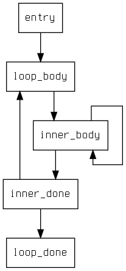
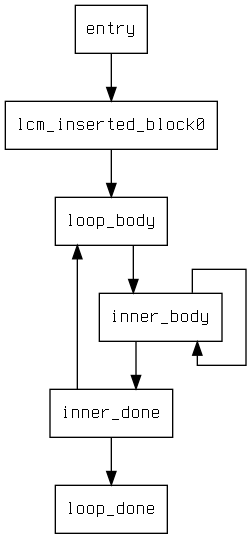

+++
title = "Lazy Code Motion"
[extra]
bio = """
  Ryan is a PhD student at Cornell. He studies programming languages
  and verification.
"""
[[extra.authors]]
name = "Ryan Doenges"
link = "http://ryandoeng.es"
+++

Code motion optimizations shift computations around a control-flow graph
(CFG) in order to avoid redundant computation, reduce code size, or save
resources. Loop invariant code motion, for example, identifies expressions
computed within loops which have the same value from iteration to iteration and
hoists them out of the loop so that they are computed only once. Common
subexpression elimination can also be viewed as a code motion
optimization: rather than computing a subexpression `e` twice in expressions
`f(e)` and `g(e)`, compute it once and store it in a termporary register.

Lazy code motion unifies and improves upon several forms of code motion
including loop invariant code motion and common subexpression elimination. It is
termed lazy to contrast with earlier approaches to unified code motion which
placed compuatations as early as possible. Perhaps this will make more sense if
we take a look at an example. I adapted the following from
[Wikipedia](https://en.wikipedia.org/wiki/Partial_redundancy_elimination).

```
main {
  five: int = const 5;
  br some_condition compute do_nothing;
compute:
  y: int = add x five;
  jmp done;
do_nothing:
  jmp done;
done:
  z: int = add x five;
  ret;
}
```

If `some_condition` holds then `x + 5` whill be computed twice, but if it is
false then the computation only happens once. This is a "partial redundancy,"
and traditional common subexpression elimination will not fix it. A good global
code motion analysis will fix it, emitting code that looks something like this.

```
main {
  five: int = const 5;
  br some_condition compute do_nothing;
compute:
  tmp: int = add x five;
  y: int = id tmp;
  jmp done;
do_nothing:
  tmp: int = add x five;
  jmp done;
done:
  z: int = tmp;
  ret;
}
```

Now all paths through the program include only one computation of `x+5`. This is
optimal code, at least along that dimension, and a realistic result to expect from
partial redundancy elimination or lazy code motion. So what makes lazy code
motion different from eager alternatives?

## Register pressure
When lowering IR code to assembly, compilers have to allocate storage for
a finite but unbounded number of variables in an architecture with a finite and
fixed number of registers. If there are more variables than registers, some of
them are going to end up on the stack. "Spilling" to the stack is costly--memory
is slower than registers.

Earlier passes in the compiler should try to minimize the number of spills
introduced during register allocation. The precise number of spills introduced
into a program depends on the register allocation algorithm in use, which makes
designing optimizations against this metric something of a fool's errand. Lazy
code motion looks to a more understandable proxy metric known as *register
pressure*. Register pressure, for each program point, is the number of live
variables at that point as determined by a standard liveness analysis.

Eager code motion moves variable definitions (computations) further away from
their uses, which lengthens their live ranges. The resulting register pressure
can easily claw back any performance gains due to code motion. Rather than put
computations as early as possible, lazy code motion moves them down to the
a later program point that still avoids redundant computation. In fact lazy code
motion provably places computations as late as possible ([1], Theorem 3). The
wording of this theorem is misleading--the proof grounds out in approximate
static analysis results.

# Implementation
I implemented lazy code motion in Ocaml. Since the existing Bril infrastructure
is written in Python, this meant I had to implement Bril JSON parsing and design
data structures for representing control flow graphs. The open source
[Ocamlgraph](http://ocamlgraph.lri.fr/index.en.html) library helped with
this. It includes excellent generic graph data structures and a framework for
implementing dataflow analyses over graphs.

There were some mismatches between the dataflow analyses presented by Drechsler
et al. [1] and the Ocamlgraph dataflow framework. The biggest issue was that
the Ocamlgraph framework made it hard to refer to results of other dataflow
passes in later ones. I worked around this by tagging every basic block in the
CFG with a map of "attributes" and writing Ocaml functors like `MakeDataflow`
that require their input module to include an `attr_name` field. When you run
a dataflow analysis created with `MakeDataflow`, it saves the results of the
analysis at each basic block into the attributes map under the `attr_name` key.

The analyses were easy to write down once there was structure in place for
defining them. For example, here is the definition of an available expressions
analysis from the paper:

```
let avail_out (_, block_attrs) avail_in =
  Bitv.bw_or
    (Bitv.bw_and
       (Cfg.Attrs.get block_attrs "transparent")
       avail_in)
    (Cfg.Attrs.get block_attrs "computes")

module AvailabilityIn =
  MakeDataflow
    (struct
      let attr_name = "availability_in"
      let direction = Graph.Fixpoint.Forward
      let init _ =
        EXPRS.build ~f:(fun _ -> false)
      let analyze (src, _, _) src_avail_in =
        avail_out src src_avail_in
    end)
```

I implemented a CFG printer using the Ocamlgraph Graphviz backend so that
I could debug the optimization's changes to CFGs directly, rather than staring
at pretty printed output. Here's the result of running the optimization on
`tests/lcm/simple`, a nested loop benchmark. There's a way to include the
instructions from each block inside the nodes, but for this example that makes
it hard to follow. There is a loop invariant computation in `inner_body` that
lazy code motion hoists to `lcm_inserted_block0`.




# Limitations
I implemented the full lazy code motion optimization, but there were some
issues. The optimization expects lexically equal expressions to always be stored
into the same pseudoregister. There may be adaptations of the dataflow analyses
in later work to weaken this assumption, but I introduced a conservative code
rewriting pass that made sure expressions went into a uniquely named temporary.
This increases register pressure and introduces extraneous move instructions to
retrieve computed values from temporaries. A more clever rewriting pass might be
able to ameliorate these costs.

On the other end of the optimization, the computation placement algorithm is
inefficient. Lazy code motion places computations on edges of the CFG, which
means stitching new basic blocks into edges. While they are neccessary in
general, on many edges an inserted basic block could be safely merged with its
predecessor or successor block. This could have performance benefits because it
would reduce the number of jumps. Similarly the pretty-printer for CFGs
does not omit jumps where fall-through would work--this seems like a minor
detail but could have performance or code size implications.

# Evaluation
I instrumented the interpreter to count operations and computations.
A computation is any instruction that computes the value of an expression. An
operation is any instruction at all, including control flow and return
instructions. Many of the programs in the `examples` and `test` directories are
either a single basic block or include no computations, so I excluded them from
this evaluation because the optimization doesn't do anything to them.

```
+-----------------------------------------------------------------------------------------------------------------+
|program                      |ops (before lcm)|computations (before lcm)|ops (after lcm)|computations (after lcm)|
+-----------------------------------------------------------------------------------------------------------------+
|test/lcm/dont-hoist-thru-loop|               8|                        1|             11|                       1|
+-----------------------------------------------------------------------------------------------------------------+
|test/lcm/two-blocks          |               5|                        1|              8|                       1|
+-----------------------------------------------------------------------------------------------------------------+
|test/lcm/hoist-thru-loop     |             412|                      303|            617|                     203|
+-----------------------------------------------------------------------------------------------------------------+
|test/lcm/simple              |            1217|                      906|           1925|                     605|
+-----------------------------------------------------------------------------------------------------------------+
|examples/lvn_test/nonlocal   |               7|                        3|             12|                       3|
+-----------------------------------------------------------------------------------------------------------------+
|examples/dom_test/loopcond   |             117|                       46|            165|                      46|
+-----------------------------------------------------------------------------------------------------------------+
|examples/df_test/cond        |               9|                        1|             12|                       1|
+-----------------------------------------------------------------------------------------------------------------+
|examples/df_test/fact        |              62|                       25|             89|                      25|
+-----------------------------------------------------------------------------------------------------------------+
```

Since lazy code motion is designed to avoid redundant computations of
expressions, the number of computations never increases after optimization. It
looks like the overhead of the conservative temporary allocation strategy and
basic block insertion impacts the total number of computations negatively by
adding moves and jumps respectively. Loopy benchmarks (simple, hoist-thru-loop)
exhibit significant speedups due to computations being hoisted out of their
loops.

# Bibliography
1. Drechsler, K.-H., Stadel, M. P. A variation of Knoop, Rüthing, and Steffen's Lazy Code Motion. SIGPLAN Notices 28, 5, (1993), 29-38.
2. Knoop, J., Rüthing, O., Steffen, B. Lazy code motion. SIGPLAN Notices 27, 7, (1992), 224-234.
