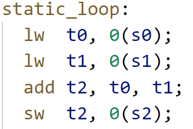
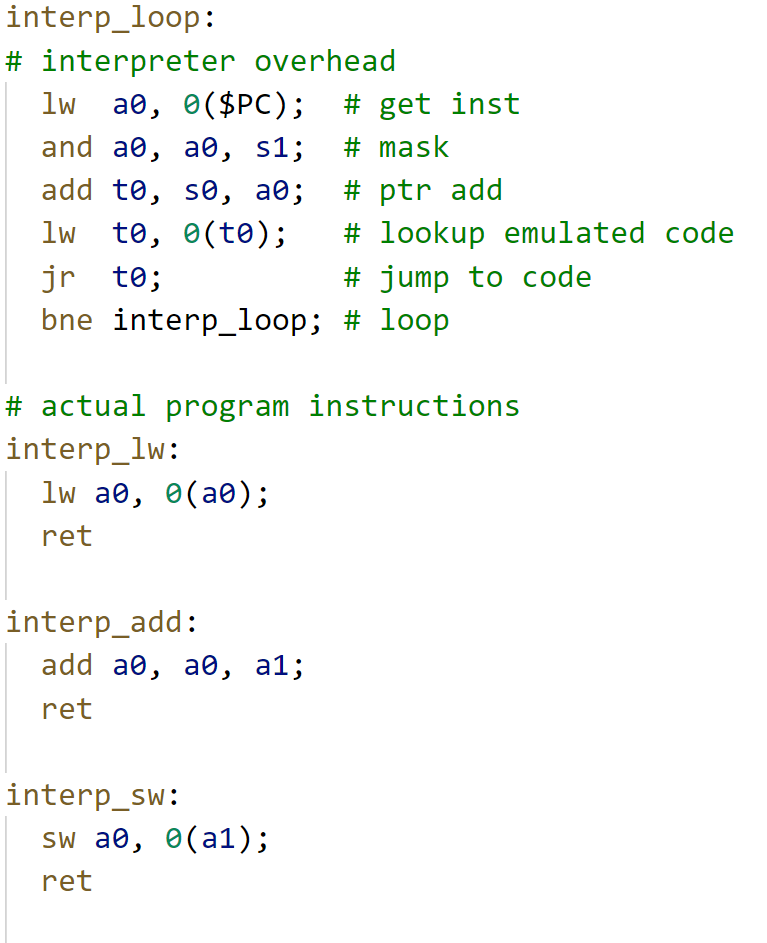
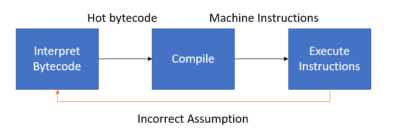
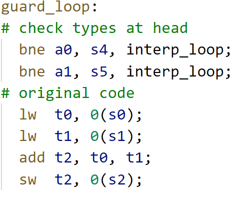
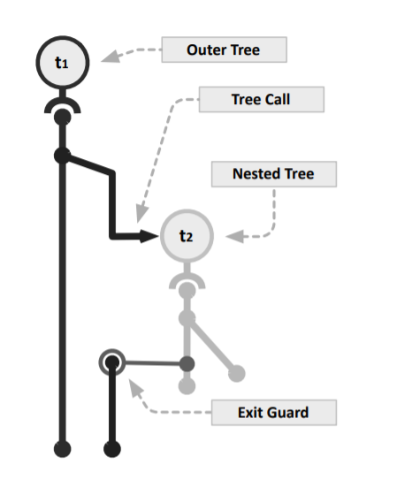

 +++
title = "Trace-based Just-in-Time Type Specialization for Dynamic Languages"
extra.bio = """
  Philip Bedoukian is a 3rd year PhD student in ECE. His research focuses on reconfigurable hardware.
"""
extra.author = "Philip Bedoukian"
+++

## Dynamic Languages

Statically-compiled languages force the programmer to abide by the restrictions of the ISA. For example, languages like C, Java, and Perl require type information to be specified by the programmer. The hardware only knows how to do arithmetic between certain type combinations, so type knowledge is a requirement when compiling for that hardware. In the RISC-V ISA, an integer addition compiles to an `add` instruction while a single-precision floating point addition compiles to a `fadd.s` instruction.

Dynamic languages allow the programmer to free themselves from the strict requirements of the ISA. In languages like JavaScript and Python, a programmer does not need to specify whether a type is an `int`, `float`, or any other primitive type. However, these languages cannot be directly compiled to machine code because there is no instruction for untyped operations in most ISAs. Most high-performance interpreters will compile the source code to *bytecode* instead. A bytecode instruction is neither machine instructions nor lines of source code, but rather something in between. A bytecode instruction consists of behavior much like a machine instruction opcode, but also includes other information from the source language that would not be encoded in a machine instruction. Each bytecode instruction is evaluated by the interpreter, by (1) checking type information and opcode and (2) jumping to a function that evaluates that operation.


## Problem - Dynamic Languages are Slow

Consider a single iteration of vector-vector add (vvadd) as a motivating example. In each iteration, we load two values from memory, add them, and store the result back to memory.

```c
for (i = 0; i < N; i++) {
  c[i] = a[i] + b[i];
}
```

A C compiler would statically compile this iteration to the following RISC-V instructions assuming the types of the arrays were `int`.



If instead we ran the program using an interpreter, we would execute the following machine instructions representing the interpreter rather than the user program.



Notice the same `lw`, `add`, and `sw` are present in the code, but we have to jump to the appropriate function to execute them. The interpreter overhead is, thus, everything that isn't the instructions required by vvadd. For every instruction in vvadd, it requires seven additional interpreter instructions and incurs a penalty of a few cycles due to the additional branches. In total, we can estimate that it takes at least 10 cycles to execute an equivalent machine instruction on the interpreter. Many real-world interpreters perform additional operations that will increase the overhead even more. For these reasons, interpreters are generally an order of magnitude slower than statically compiled code.

## Solution - Just-in-Time Compiler

Just-in-Time Compilers (JITs) provide speedups to dynamic languages. Although previously proposed, this paper optimizes and popularizes tracing JITs for accelerating dynamically typed languages. The authors demonstrate the effectiveness a tracing JIT in a real-world environment, namely the Mozilla Firefox web browser.

The core idea exploited in tracing JITs is the following: 

> A loop tends to have similar type information across multiple iterations.

In the case of vvadd, if on every iteration the types are `int` then we don't actually need the flexibility of the interpreter. Instead, we can compile the bytecode during run-time to machine instructions where the type of each instruction is `int`. The run-time compilation procedure will greatly resemble the ahead-of-time compilation procedure of non-dynamic languages. Generally we only want to spend time compiling code that is run multiple times (i.e., in a loop).

Unlike an ahead-of-time compiler, a JIT makes assumptions about the type information of the bytecode and speculatively emits machine instructions. If our assumptions were wrong, we need to fall back to the interpreter. The JIT compiler then must also insert *guards* that detect when type information is wrong and will jump back to the interpreter. The state machine below describes the high-level process.



Machine code emitted by a JIT might look something like the following. Notice that there are fewer "overhead" instructions than in the interpreter version (just two instead of seven).



## TraceMonkey

The authors propose *TraceMonkey*, a JIT which roughly follows the high-level ideas described above. TraceMonkey is a *tracing* JIT as opposed to a *method* JIT, which were predominant at the the time of this publication. Method JITs compile single functions at a time whereas a tracing JIT compiles single paths through the whole program. 

The machine code generated by each JIT differ significantly. The machine code generated by a method JIT machine code will resemble the original source program. By comparison, the machine code generated by a tracing JIT will have most of its control flow removed (i.e., conditional control flow and function calls). This code will be superior because more basic blocks have been stitched together and can be optimized together.

The overall flow of TraceMonkey is to run the interpreter for a while, observe 'hot' bytecode, compile the bytecode to machine code, run the machine whenever possible instead of the interpreter. Guards are inserted into the machine code to fallback to the interpreter when are assumptions failed. The main steps of TraceMonkey are *interpreting*, *recording*, *compilation*, *native execution*, and *aborting*. These steps are described in some detail in the next section.

To avoid confusion, keep in mind that there are four types of code in TraceMonkey: 1) Source code, 2) Bytecode, 3) Low-level intermediate representation (LIR), and 4) Machine code. Only bytecode and machine code are executed, while source code and LIR are only meant to compiled down to the subsequent code level.

### Interpreting

The default state of TraceMonkey is to execute bytecode via an interpreter. This yields correct but slow execution of a users program.

### Recording

When TraceMonkey detects a loop (simply a back-edge in the control-flow graph), it begins to record a trace. For each bytecode instruction, one or more LIR instructions are generated along with type guards. LIR instructions directly map to machine instructions, but are ISA agnostic.

```c
// Bytecode (not typed)
c = add a b;

// LIR Trace (typed)
guard typeof(a) == int;
guard typeof(b) == int; 
int c = add_int a b;
```

Traces inherently can only follow a single path within a loop iteration. No type information is known about the paths that we not taken, so we can't generate machine code for them. Therefore guards must also check branch conditions. In the following example, two possible traces can be generated from the code.

```c
// Source code
if (a == true) {
  c++;
}
else {
  c--;
}

// LIR Trace 1
guard a == true;
int c = add_int c 1;

// LIR Trace 2
guard a == false;
int c = add_int c -1;
```

Each individual trace can be much shorter than the original program and can forgo any control flow in favor of specialized guards.

### Compilation

The LIR traces must first be compiled to machine code to execute natively on the processor. This compilation needs to be much faster than static compilation because it occurs during runtime. The authors propose limiting the number of code optimizations performed to keep the compilation runtime reasonable. For example, register allocation uses a greedy algorithm. Greedy algorithms generally give non-optimal results, but may be the only type of algorithm appropriate for a small time budget.

The compiled traces are stored in a trace buffer for later use by the interpreter.

```c
// LIR code
guard a == true;
int c = add_int c 1;

// Machine code
addi t0 x0 1; // put 'true' into a register
bne  t1 t0 abort;
addi t2 t2 1;
```

Note that more assumptions allowed in the traces, the more specialized and higher performance the machine code will be. The trade-off is that there are more guards that can fail, and the generated machine code may not be useful for most iterations of a loop.

### Native Execution

The interpreter can execute traces when certain conditions are met. Effectively, the interpreter cedes program control to the generated native machine instructions. The performance of this code should approach that of static code, but is somewhat held back by the low-effort optimizations and additional guard instructions. However, the performance is much better than running in the interpreter.

### Aborting

Whenever a guard fails, we must abort from the current trace because our assumptions were wrong. For example if we thought the type of a value was `int`, but the value turned out to be a `float` future instructions will have incorrect behavior. A simple example is shown below.

```c 
lw  t0 0(s0); // unexpected float!
add t1 t0 t1; // actually need a fadd instruction!
```

The un-optimized version of this mechanism always jumps backs to the interpreter to decide how to proceed. The interpreter can then record a new trace and start executing machine code from that in future iterations. Effectively, the enumerated steps will repeat in the same order. The optimized version of this process is described in the Linked Traces section below.

## Optimizations

The authors lower-level implementation of the ideas described above are the main contributions of this paper. They develop multiple optimizations to make traces less likely to abort. Aborts incur a high performance penalty, so the fewer aborts the faster the user program will run. They also develop techniques to reduce the amount of storage required for the compiled traces. 

#### Typed Traces

Each trace is a basic block that has one entry node and no inner control flow. The interpreter will only enter this basic block if the types of the input variables to the block type check. This is more efficient than entering the trace and immediately aborting because the incoming types were incorrect. In the case of multiple traces, the interpreter has the ability to decide which trace to run based on the input variable types and the trace signature (i.e., the type of each variable as would be given in a C function call).

#### Linked Traces

A trace is a single forward path. A naive approach would jump back to the interpreter at the end of the trace and have the interpreter re-execute the same compiled trace. A trace can be expanded to include its jump back path if the loop is deemed *type-stable*, i.e., the type information does not change over consecutive iterations.

A trace can also jump to another similar trace that has different that uses different input types. This can occur is there is a particular pattern detected between different traces, i.e., if input types go from `int` to `float` to `string` consistently, we would want to link the three traces together.

#### Trace Branches

As previously mentioned a trace can only contain information about a single path through the loop. If machine code encounters a different conditional branch path, it needs to abort. However, it doesn't necessarily need to abort back to the interpreter. If there is another trace that starts from the side path, we could jump directly to this other trace. 

The diagram below presents two traces. The vertical trace (the root trace) is called directly from the interpreter, while the slanted trace is called from the root trace when a certain branch condition is met. These arrangements form tree-like structures called *trace trees*.


Jumping to another trace instead of aborting back to the interpreter is much more efficient.

#### Nested Traces

Traces always consist of a single forward path and end on a backwards path. In the case of a loop nest, instructions will be recorded from a single path through both loops. If there are any conditionals that are post-dominated by the outer loop, then the outer loop instructions can be compiled multiple times (one for each full path). This increases the amount of storage required for reach trace.

The authors propose to effectively perform function outlining on nested loops. One trace can effectively call another trace as the interpreter would.



#### Blacklisting

Specific traces are not worth generating and are prevented from being recorded or run.

## Evaluation

The authors evaluate on a MacBook Pro! JavaScript is somewhat of a consumer language rather than a high-performance language, so a consumer-grade MacBook is somewhat relevant. Keeping in the spirit of consumerism, the authors evaluate on a consumer benchmark suite *SunSpider*. These benchmarks are all extremely small (< 250ms), but webpages generally load within this time.

The authors estimate that a bytecode instruction is 4x faster when compiled to machine code (could be multiple machine instructions, which is why this isn't higher). Most benchmarks spend their time natively executing machine code rather than interpreter bytecode. Thus, every compatible benchmark achieved at least some speedup in TraceMonkey over *SpiderMonkey*, the interpreter-only version of TraceMonkey. TraceMonkey lacks support for certain JavaScript primitives and thus could not gain performance on benchmarks containing those primitives.

I would have liked to have seen the performance impact of the many optimizations they described in their paper, particularly the benefit of creating trace-trees and nested trees.

However, the authors report significant overhead in some benchmarks due to the JIT state machine mainly the recording and compilation procedures. They estimate that a native trace must be executed 270 times to justify the overhead. This may seem small, but generally the total run-time of a JavaScript program is also quite small.

## Discussion Questions

Is the short compilation time potentially limiting the performance that could be achieved by traces? Bytecode only 4x when executed natively? What could be done?

Could an ISA be designed that does not require machine instructions to include type information?

This paper was written at the beginning of the multi-core processor era. Could multiprocessing improve the JIT performance?

Is it wasteful for billions of computers to "learn" the same traces when they load a webpage? Could anything be done to remedy this?


