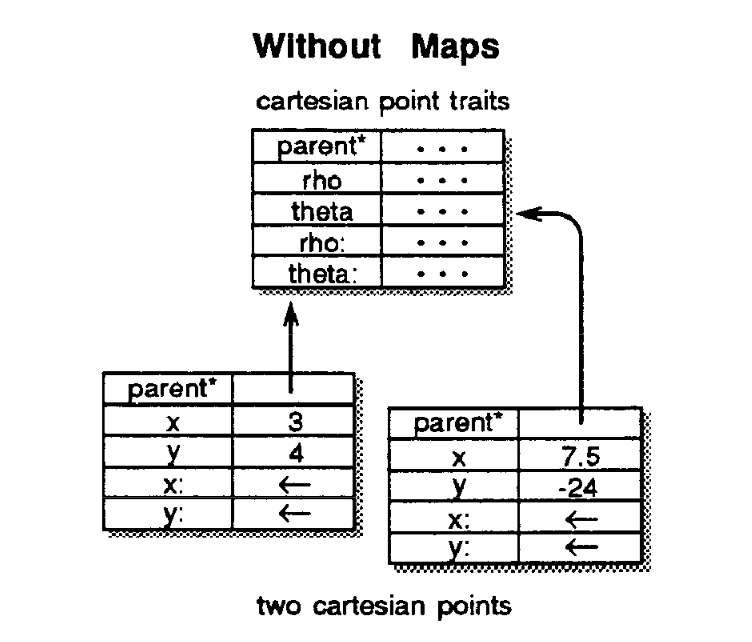
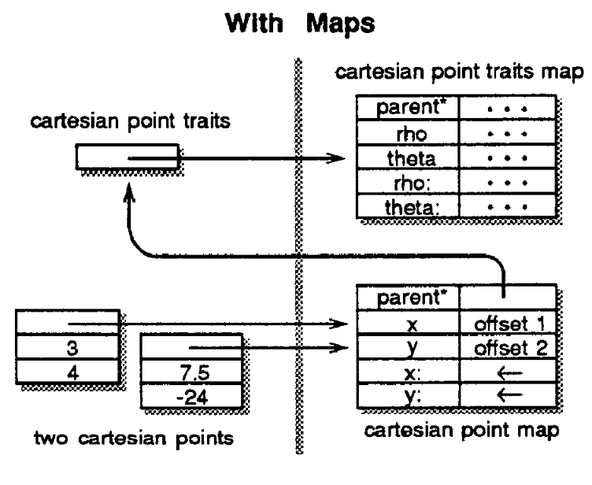
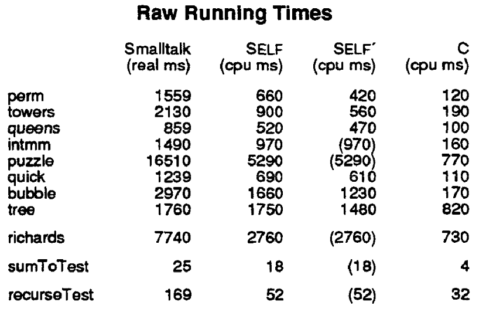

+++
title = "An Efficient Implementation of Self"

[extra]
bio = """
  [Rachit Nigam](https://rachitnigam.com) is a second year PhD student interested in
  programming languages & computer architecture. In his free time, he
  [subtweets](https://twitter.com/notypes/status/1170037148290080771) his advisor and [annoys tenured professors](https://twitter.com/natefoster/status/1074401015565291520).
"""
[[extra.authors]]
name = "Rachit Nigam"
link = "https://rachitnigam.com"
+++

[An Efficient Implementation of Self, a Dynamically-Typed Object-Oriented
Language Based on Prototypes][paper] presents techniques for runtime
compilation, now more commonly referred to as just-in-time (JIT) compilation,
for the [Self][] programming language.

> We have developed and implemented techniques that double the performance of
> the dynamically-typed object oriented languages.


## The Challenge

The term "dynamic language" is mostly commonly associated with modern scripting
languages like Python and JavaScript. Self, a much older language developed
at the famed Xerox PARC labs, takes the philosophy of dynamism to a logical
extreme -- *everything* in self is a message to an object. This includes
Java-like method calls on object *as well as* control structures like loops
and conditionals.

For example, the Self condition `IfTrue:IfFalse:` is a method invocation on
the boolean object `true` and `false`. This means that a simple conditional:

```
if (x) 1 else 2
```

in Self parlance (written with JavaScript-esque syntax) looks like this:


```
x.If({ true: () => 1, false: () => 2 })
```

The run-time behavior of this program is invoking the method `IfTrue` on the
object `x`, which can be a `true` or `false` but is not required to be those,
and execute the "thunk" (a function with no argument) corresponding to the true
or the false branch.  Note that `x` is not required to be `true` or `false`.
Any Self object can define the `If` method and specify its conditional
behavior.

Considering this dynamism, a Self compiler must:

1. **Respect the semantics of method calls**. Restricting or specializing conditionals and primitives don't follow the spirit of the language.
2. **Provide interactive speed**. Recompiling after a small change is not an option because Self is meant for rapid exploration in a programming environment.
3. **Preserve stack traces**. Self supports extreme reflection and introspection. A programming environment must be debuggable.
4. **Generate fast code**. Interpreting the whole language is probably too slow.

## The Solution

While the paper goes into the nitty-gritty of object layouts and method
invocations, the essence of the paper can be summarized as:

>  When type information for an object is available, generate specialized code
>  and let inlining and compiler optimizations work their magic.

The ideas described in the paper have influenced the design of modern JITs for
JavaScript which use a lot of [similar features][jit] to improve JavaScript execution
times.

### Object Layout

Self programs use object prototypes to describe inheritance relationships.
Unlike classes, which have _constructors_ used to build _instances_, Self uses
prototypes, which act as _exemplars_ for other objects. Creating a new object
from a prototype is as simple as _cloning_ it and setting its parent pointer to
the prototype. Changing the common behavior of all clones is as simple as
changing the behavior of a prototype. Since method and field lookups traverse
the parent hierarchy, clones can also override methods and fields of their
prototypes.

A naive layout scheme for objects would copy all fields from a prototype and
end up wasting a lot of space describing potentially shared behaviors. The Self
compiler minimizes space usage of _clones_ derived from the same prototype by
using _clone families_. A cloned object only stores its modifiable in its
object and points to the clone family for its prototype. If the instance ever
overrides one of its methods, the creates a new clone family to preserve
semantics and propagate behavior changes to all clones of a prototype.




### Customized Compilation

The rampant dynamism in Self programs forces compilers to conservatively
generate slow code. For example `x < y` is a method call on the object `x` and
requires knowing the precise type of `x` to generate optimized code for `<`.
The paper mentions that contemporary Smalltalk-80 compilers restricted the
customization of primitive methods and control structures to allow for
specialized code generation. Instead of imposing these restrictions, the Self
compiler will generate specialized code for every _receiver_ object at runtime.
This means that at the first invocation of `<` on an integer, the compiler will
specialize `<` with check to see if the type matches to an `integer` and
generate a single compare instruction when this is case. When the type of
receiver has not been encountered before, Self will default to a method send
to the object.

### Message Inlining and Splitting

Inlining remains one of the most crucial optimization in modern compilers,
enabling other optimizations to become more effective. However, inlining
becomes impossible in presence of dynamic method calls if the type of the
receiver object is unknown. This is an even bigger problem for Self since
most of program is a sequence of dynamic calls.

The Self compiler performs two optimizations, message _inlining_ and
_splitting_ to enable efficient execution. Message _inlining_ works in a similar
fashion to customized compilation -- If the type of a receiver is know, either
at initial compilation through a dataflow analysis or at runtime, inline the
method body at the call location. When type information for an object is lost
due to control flow splits, _message splitting_ generates specialized code for
possible receiver types and guards them using type tests. If the type of
receiver matches, fast code can be executed.

### Programming Environment Support

The Self compiler supports _incremental recompilation_ and _source-level
debugging_ by keeping track of the provenances of various method
specializations in a map.

Incremental Recompilation occurs when the compiler observes a change in the
programming environment and invalidates compiled methods associated with the
affected data. At compile time, the compiler creates a dependency list encoding
the information required for specialization. For example, if a method was
inlined from a clone's parent, updating the parent pointer or the method body
in the parent should invalidate the specialized code. Since the compiler
selectively invalidates code, methods that weren't modified can still execute
with specialized code.

Source-level Debugging requires language support and can often cause compiler
writers to forgo obvious optimizations. For example, the Chrome V8 team decided
to [forgo][v8-no-tail] tail call optimization due to due concerns about being
unable to reconstruct stack frames. The programming environment needs to be
able to step through specialized code as if it was going through the normal
method call chain. Self appends debugging information to each compiled method,
allowing the environment to reconstruct the state of the stack.

## A SELFish Evaluation

The Self compiler was written in 33,000 lines of C++ code and ran on the Sun-3.
The authors wrote 9,000 lines of Self code to implement the object hierarchy
and prototype graphical user interface.

The quantitative evaluation compares Self running times to that of the fastest
Smalltalk-80 compiler at the time by translating the Stanford Integer
Benchmarks. The authors both did a straightforward transliteration of Self programs
(marked `Self`) and also rewrote the benchmarks in idiomatic Self (marked `Self'`).



On average, Self was 2-3x faster than the Smalltalk implementation and 4x slower
than the original C programs.

The authors also describes a new metric to measure the performance of an object
oriented programming language - _Millions of Messages per Second (MiMS)_ which
corresponds to MIPS. To compute the MiMS of a specific virtual machine, divide
the number of messages the benchmark sends by its total running time. The
first generation Self compiler ran at 3.3 MiMS or a message executing every 300ns.


[paper]: https://dl-acm-org.proxy.library.cornell.edu/citation.cfm?id=74884
[self]: http://www.selflanguage.org/
[jit]: https://hacks.mozilla.org/2017/02/a-crash-course-in-just-in-time-jit-compilers/
[v8-no-tail]: https://bugs.chromium.org/p/v8/issues/detail?id=4698
