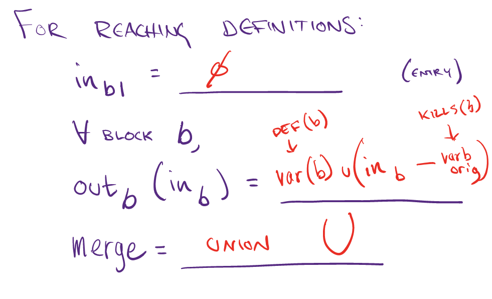
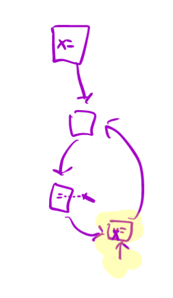

+++
title = "Static Type Checking for Bril"
extra.author = "Yi Jing, Zhijing Li, Neil Adit"
extra.bio = """
[Zhijing Li](https://tissue3.github.io/) is a 2nd year Phd student at ECE department, Cornell. She is interested in compiler optimization and domain-specific languages. \n
[Yi Jiang](http://www.cs.cornell.edu/~yijiang/) is a 2nd year Phd student in CS dept, Cornell. She is interested in designing compilers for Processing-In-Memory related architectures and also general compiler optimization. \n
[Neil Adit](http://www.neiladit.com) is (guess what!) also a 2nd year PhD student at CSL, Cornell. He is interested in fun things in compiler research.

"""
extra.latex = true

+++

## Goal

The goal of the project is to replace expensive operations like multiplications with equivalent cheaper operations like additions. This is done with the help of loop invariant code motion and induction variable analysis. 

## Design Overview

We divided the project into 3 parts:

1. Preprocessing to LICM: Finding back edges and associated loops along with reaching definitions of variables.
2. LICM algorithm: Finding loop invariant code and moving it into a pre-header outside the loop.
3. Strength reduction: Using the tools like LICM to simply constant expressions and analyzing induction variables that can be computed using cheaper operations.

## Implementation


### Finding loops

All loops are built around back edges. We started by finding all pairs of `[tail, head]` such that there exists an  edge `tail->head` where `head` dominates `tail`. This is demonstrated by the pseudo code below:

```python
for node in cfg:
  for dominator in dom[node]: # dom[node] is an array of dominators of the node
    if dominator in successor[node]: # successor[node] is an array of successors of the node
      list.append([node,dominator]) #storing the backedge pair of [tail,head] into the list
```


Assuming this is a reversible CFG, all back edges would be associated with a natural loop. This assumption makes it easier to find loops associated with each back edge. Hence, we'd like to associate a list of nodes (basic blocks) which form a loop corresponding to a back edge pair from the previous step.

For a back edge `A->B` we know that `B` dominates `A`, hence all paths to `A` are through `B`. So we can find predecessors of `A` recursively until we hit `B` and include them in the loop. This is the smallest set of points which include `A` and `B` such that for all nodes, `n` in the list `L`:  `preds(n)` $\in$ `L` or `n = B` . 

```python
all_loops = []
for A,B in back_edges:
  natural_loop=[B]
  explored=[B] # won't find predecessors of explored nodes
  find_pred(A,natural_loop,explored) # add predecessors and current node to natural_lop list
  all_loops.append(natural_loop)
return all_loops
```


### Reaching Definition

For finding loop invariant code, we look into reaching definitions of the argument and check wether they are outside the loop. The reaching definition problem was discussed in the lecture of CS 6120. For each block we can generate a list of reaching inputs and outputs. The data structure that we chose to represent this is a dictionary of dictionaries. We decided to store the block number associated with the variable in each block. Hence reaching definitions of each block has a dictionary of variables (as keys) and block number they were defined in (as values). This helps in keeping track of reaching definitions outside the loop to identify loop invariant code.  The reaching definitions look something like this:

```
reaching_defs = {blocks:{variable:[list of block numbers]}}
```

Instead of the usual:

```
reaching_defs = {blocks:[list of variables]}
```

The reaching definition problem can be solved using the worklist algorithm after defining merge and the transfer function:



The union function for our data structure is more nuanced than a simple union of sets of variables. In case of multiple definitions of a variable from predecessor blocks we union the list of block numbers associated with the variable. So if block 1 and block 2 are the inputs for the current block we merge (take union) the lists corresponding to each variable in these blocks. This way we keep track of the block numbers of definitions of each variable.

```python
out = {}
    for s in dicts:
        for k,v in s.items():
            if k not in out:
                out.update({k:v}) # add a reaching definition of a variable 'k' if not already present
            else:
                out[k] = list(set(out[k])|set(v)) # take union of lists of block numbers for a  variable 'k'
    return out
```

### Finding Loop Invariants Code

The loop invariant instruction is the one that does not change execution result during the loop execution. We need to go to individual loops, individual blocks in the loop and finally individual instructions inside the loop to check if the instruction is loop invariant. A instruction is loop invariant when any of its argument is either constant or variable `var` satisfying:

1. All reaching definitions of `var` are outside the loop.
2. There is exactly one reaching definition of `var` and the definition is loop-invariant.

These two conditions are realized by the following code.

```python
rd = reach_def[block][var] #var is defined at rd block
c1 = all([x not in loops[loop] for x in rd ]) #all rd blocks outside the loop
li = loop_invariants[loop].get(rd[0]) #None or LIs in rd block
li = [] if li is None else li
c2 = len(rd)==1 and any([var == i['dest'] for i in li]) #one reaching definition and var is defined as LI (matches one of dest in LIs in rd block).
```

### Create Pre-Headers of Loop Headers

Before we actually move code, we need to create pre-headers for loop headers. These pre-headers are empty blocks that should be placed before loop header blocks. Notice this assumes Bril code loops have only one entry. Using these empty blocks, we can easily move loop invariants out of the loop when the requirements are satisfied. 

Also notice that usually pre-headers are created so that even in loop with multiple entries, loop header can have only a single predecessor, so compiler can put pre-loop code. In our implementation, pre-header is not necessary rather than a design choice.

For each block, we first copy old block content and then check if the next block is a loop header. If so, we create an empty block. 

```python
for edge in loops:#we use back edge as key to denote loop
    if b_names[i+1] in edge[1]: #edge[1] is the pre-header block name
        name = fresh('b', new_blocks) # generate block name that is never used before
        new_blocks[name] = []
        pre_header = {x:name for x in loops[edge]}
        break
```



### Move Loop Invariant Code to Pre-Headers

Not all pre-headers are allowed to be moved to the pre-headers. If the destination of an LI is `d`, it needs to satisfy the following condition:

1. There is only one definition of  `d` in the loop.
2. `d` dominates all its uses, or equivalently, `d` is not live-out of its pre-header.
3. `d`'s block dominates all loop exits where $d$ is live-out.

To learn the first condition, we need to know all definitions inside the loop and check if  `d` is unique in the list `defs`.

```python
defs = [ins.get('dest') for b in loops[back_edge] for ins in blocks[b] if ins.get('dest')]
defs.count(instr['dest']) ==  # if true, first check passed
```

For the second condition, we can check the predecessor block of the pre-header we just added, by simply reading the index of pre-header and subtracting 1. Then check if `d` is live-out of block.

```python
ind = b_names.index(pre_header[b_name]) - 1 #b_name is the name of block where d is LI.
instr['dest'] not in live_var[1][b_names[ind]] #if true, second check passed
```

For the third condition, we need to know which blocks are exit blocks. The exits are blocks that have successors not in the loop. 

```python
exits = {}
for k in loops:
    exits[k] = []
    for l in loops[k]: 
        if any( s not in loops[k] for s in succ[l]):
            exits[k].append(l)
```

After that, we just need to find all exit blocks where `d` is live-out and check if `d`'s block dominates all loop exits.

```python
edest = [e for e in exits[back_edge] if instr['dest'] in live_var[1][e]]
all([b_name in dom[e] for e in edest]) # if true, third check passed.
```

### Block to Dictionaries

` json.load(sys.stdin)['functions']` gives us dictionaries and for each dictionary we obtain list of instructions when the key is `instrs`. Then we change this list of instructions into a dictionary of blocks. We would like to reverse this process to regenerate list of instructions with modified blocks. However, the original list of instructions does not have so many labels introduced when generating block names and creating pre-headers. For example, main function does not have a label, but to form a block, we generate a `b0` for its label. Similarly, when generating a pre-header, we might have inserted blocked labeled with `b1` .  Luckily, the modified blocks are still in an ordered dictionary. Blocks with no label at first is safe to be unlabled and for `pre-header` blocks, we assume they have only one in-edge and one out-edge.

Therefore in this step, we only create a `label` instruction when the original label is in `blocks`. The rest is just copy every instruction other than labels to the new list of instructions.

```python
for block in blocks:
    if block in label_name:
        new_instrs.append({'label':block})
    new_instrs = new_instrs+blocks[block]
```


### Strength Reduction

Strength reduction is a compiler optimization where expensive operations are replaced with equivalent but less expensive operations. A typical example of it is to convert relatively more complex multiplications inside a loop `L` to easier additions. Here we are mostly interested in 

1. loop invariant code: values that do not change within the body of a loop (as we have already discussed previously)
2. induction variables: values that are being iterated each time through the loop

Here is the definition of induction variable:
it is either 

- a basic induction variable `B`: a variable `B` whose only definitions within the loop are assignments of the form: `B = B + c` or `B = B - c`, where c is either a constant or a loop-invariant variable, or
- a variable defined once within the loop, whose value is a linear function of some basic induction variable at the time of the definition `A = c1 * B + c2`

The procedure of performing strength reduction is as follows:

1. Create new variable: `A'`
2. Initialize in preheader: `A’ = c1 * B + c2`
3. Track value of B: add after `B=B+x`: `A’=A’+x*c1`
4. Replace assignment to A: replace lone `A=...` with `A=A’`

Thus, the key idea here is to first find out each induction variable `A` and then replace definitions of A when executed.

To find out each induction variable, we scan through the code to

1. find out all the basic induction variables `B`
2. find out all induction variables `A` in family of `B`, where `A` refers to the `B` at the time of definition

The `A` here should be in one of the following conditions:
i. `A` has a single assignment in the loop `L` in the form of:
​    `A = B * c` | `A = c * B` | `A = B / c` | `A = B + c` | `A = c + B` | `A = B - c` | `A = c - B`
ii. `A` has a single assignment in the loop `L` in the form of (`D` is an induction variable in the family of `B`) 
​    `A = D * c` | `A = c * D` | `A = D / c` | `A = D + c` | `A = c + D` | `A = D - c` | `A = c - D`
Also, no definitions of `D` outside `L` reaches the assignment of `A`, and every path between the point of assignment to `D` in `L` and the assignment to `A` has the same sequence (possibly empty) of definitions of `B`.

After all induction variables are found, strength reduction is performed to add new initialization to the variable and reduce multiplications to additions following the procedure we have described above.


# Challenges

1. There are more properties we need than we originally expected. At first, we only generated loops and reaching variables. Then we for loop invariant code motion, we needed exits to the loop, dominance relations, and live variables. 
2. The representation of different variables are randomly decided at first and need implementation after we finalized the representation. For example, the loop invariant code at first was stored as a list of instructions. Later, we found it necessary to change the storage form to a dictionary whose key is the block name. Otherwise, we would need to search and match the instruction to block, e.g, in the `move_LI` function.
3. There is more similarity between basic induction variables and their families. It is sometimes tricky to differentiate them. Thus, the definition flow of each induction variable is maintained to tell them apart.


## Evaluation

We would like to evaluate our optimizer in two aspects: theoretical improvement and actual wall-clock speedup.

### Benchmarks

Because loop invariant code motion and strength reduction are specific optimization for loops, and studies are based on case by case, we can hardly generate automatic testing scripts while writing Bril codes to generate `for` loop are actually painful. Instead we reply on Typescript for help. 

However, default Bril scripts generated by Typescript always introduces redundancy during translation, and code motion optimization by default will be performed. For example, `int v10 = const 5; int v11 = v11 + v10;` can be found in the body of a loop if there is a line `x = x + 5` in Typescript. Because we don't perform other optimizations, we wonder how much speedup is contributed by the redundancy. We therefore write test cases with no expected optimizations (but will have some when translated to Bril) as baseline to compare actual wall-clock speedup.

| Filename                                | Description                                 |
| --------------------------------------- | ------------------------------------------- |
| `normal.ts`, `nested.ts`, `nestedif.ts` | No optimization expected.                   |
| `codemotion*.ts`                        | Expecting code motion.                      |
| `strengthreduction*.ts`                 | Expecting strength reduction optimizations. |
| `both*.ts`                              | Expecting both kinds of optimizations.      |


   ### Implicit Redundancy

   Bril scripts generated by Typescript introduce some redundant operations usually an `id` or a `const`. Inside a loop, these would usually be loop invariant code which gets removed by our optimizer. However, we were not sure if this would contribute towards outr speedup. To make sure that these are actually negligible we benchmarked similar codes without explicit loop invariant codes in the loop to see speedups (if any).

   We ran `normal.ts` , `nested.ts` and `nestedif.ts` to this end and got the following results:

| Filename      | Unoptimized runtime | Optimized runtime |
| ------------- | ------------------- | ----------------- |
| `normal.ts`   | 193.4 ms            | 193.3 ms          |
| `nested.ts`   | 327.7 ms            | 330 ms            |
| `nestedif.ts` | 280.4 ms            | 276.8 ms          |

   We observe that these do not change by a large margins and can be ignored.

   ### Loop Invariant Code Motion Examples 

   The program `codemotion1.ts` has the following loop code:

   ```
   let a = 8;
   let x = 0;
   let y = 8;
   let z = 1;
   let n = 100000;
   for (let i = n; i > 0; i = i - 1) {
       x = y + z;
       a = a + x * x;
   }
   ```

   Since both `y` and `z` are constants in the loop, computation of `x` in each iteration is redundant and this operation can be moved outside the loop. The optimized Bril code does perform this function outside the loop as:

   ```
   v10: int = id y;
   v11: int = id z;
   v12: int = add v10 v11;
   x: int = id v12; x= y+z
   ```

   and the loop body is reduced to:

   ```
   for.body.5:
   v13: int = id a;
   v14: int = id x;
   v15: int = id x;
   v16: int = mul v14 v15; #using the updated x for x*x
   v17: int = add v13 v16; #a=a+x*x
   a: int = id v17;
   ```

   Assuming the cost of `x=y+z` was `c` we reduced the computation in the program by `(n-1)*c`. To benchmark this, we timed our optimized version using [hyperfine](https://github.com/sharkdp/hyperfine) which helps set warmup times (for warming up the cache) and number of execution runs to perform (10 in our case):

   ```
   hyperfine --warmup 1 'brili < opt_codemotion'
   
   Time (mean ± σ):     163.8 ms ±   3.2 ms
   ```

   The unoptimized version of the code yields:

   ```
   hyperfine --warmup 1 'brili < orig_codemotion'
   
   Time (mean ± σ):     216.8 ms ±   4.5 ms
   ```

   Similarly `codemotion2.ts` has nested loops where invariant code can be moved from inner loops to outer ones. 

   ```
   hyperfine --warmup 1 'brili < orig_codemotion2'
   Time (mean ± σ):     908.6 ms ±  14.8 ms
   
   hyperfine --warmup 1 'brili < opt_codemotion2'
   Time (mean ± σ):     665.4 ms ±  11.9 ms
   ```

   ### Strength Reduction Examples

   The program `strengthreduction1.ts` has the following loop code:

   ```
   let a = 8;
   let n = 10;
   for (let i = n; i > 0; i = i - 1) {
       a = a*i;
   }
   ```

   Since both `a` and `i` are induction variables and `i` is the basic induction variable, the multiplication of `a` can be reduced to addition by defining a `a'` variable outside the loop. The result code will act like `a = a + a - 8`.

   Assume the cost of `x = y*z` is `c1` and that of `x = y+z` is `c2`. We reduce the computation in the program by `n*(c1-c2) - c1`. To benchmark this, we timed our optimized version as in Loop Invariant Code Motion. The results are

   ```
   hyperfine --warmup 1 'brili < orig_strengthreduction1'
   Time (mean ± σ):     192.1 ms ±   7.2 ms
   
   hyperfine --warmup 1 'brili < opt_strengthreduction1'
   Time (mean ± σ):     173.2 ms ±   10.3 ms
   ```

   Similarly, `strengthreduction3.ts` has division to be reduced.

   ```
   hyperfine --warmup 1 'brili < orig_strengthreduction2'
   Time (mean ± σ):     61.1 ms ±   2.4 ms
   
   hyperfine --warmup 1 'brili < opt_strengthreduction2'
   Time (mean ± σ):     56.3 ms ±   5.9 ms
   ```

   ### Both Optimizations Examples

   To combine both loop optimizations, namely loop invariant code motion and strength reduction, we run tests `both1` and `both2` following the same evaluation method. The results are as follows.

   ```
   hyperfine --warmup 1 'brili < orig_both1'
   Time (mean ± σ):     655.0 ms ±   8.6 ms
   
   hyperfine --warmup 1 'brili < opt_both1'
   Time (mean ± σ):     484.1 ms ±   13.7 ms
   ```

   ```
   hyperfine --warmup 1 'brili < orig_both2'
   Time (mean ± σ):     66.2 ms ±   3.3 ms
   
   hyperfine --warmup 1 'brili < opt_both2'
   Time (mean ± σ):     49.8 ms ±   5.9 ms
   ```

   ### Final Results

| Filename                | Unoptimized runtime | Optimized runtime | Speedup |
| ----------------------- | ------------------- | ----------------- | ------- |
| `codemotion1.ts`        | 216.8 ms            | 163.8 ms          | 1.32x   |
| `codemotion2.ts`        | 908.6 ms            | 665.4 ms          | 1.36x   |
| `strengthreduction1.ts` | 192.1 ms            | 173.2 ms          | 1.11x   |
| `strengthreduction2.ts` | 61.1 ms             | 56.3 ms           | 1.09x   |
| `both1.ts`              | 655.0 ms            | 484.1 ms          | 1.35x   |
| `both2.ts`              | 66.2 ms             | 49.8 ms           | 1.33x   |

   Based on the evaluation results, we find out that both loop optimization techniques can provide some speedup. Loop invariant code motion can provide up to 1.36x speedup, while strength reduction can only have about 10% performance improvement. That is due to the fact that multiplication/division does not take significantly more cycles than addition/substraction on modern machines and there are many redundant `id` operations when generating `bril` programs from `ts`. Thus, only limited performance improvement can be obtained We expect that more speedup can be obtained if exponential operation is optimized. Also, note that there are nested loops in `codemotion2.ts` and `both1.ts`, thus their runtime are much longer than the rest.
