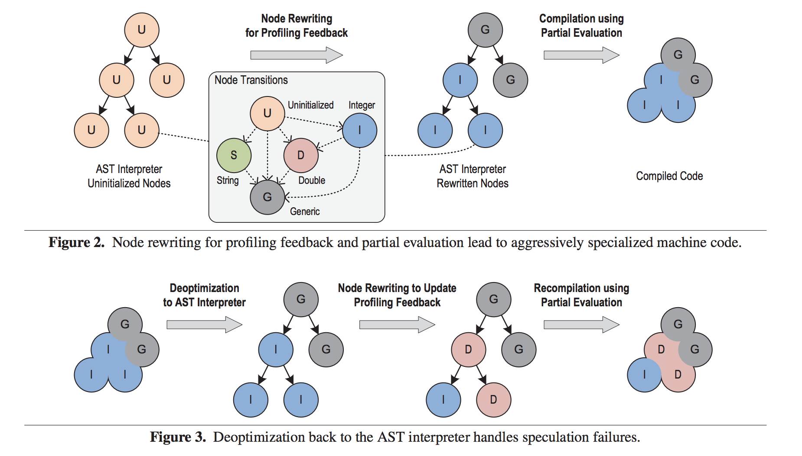
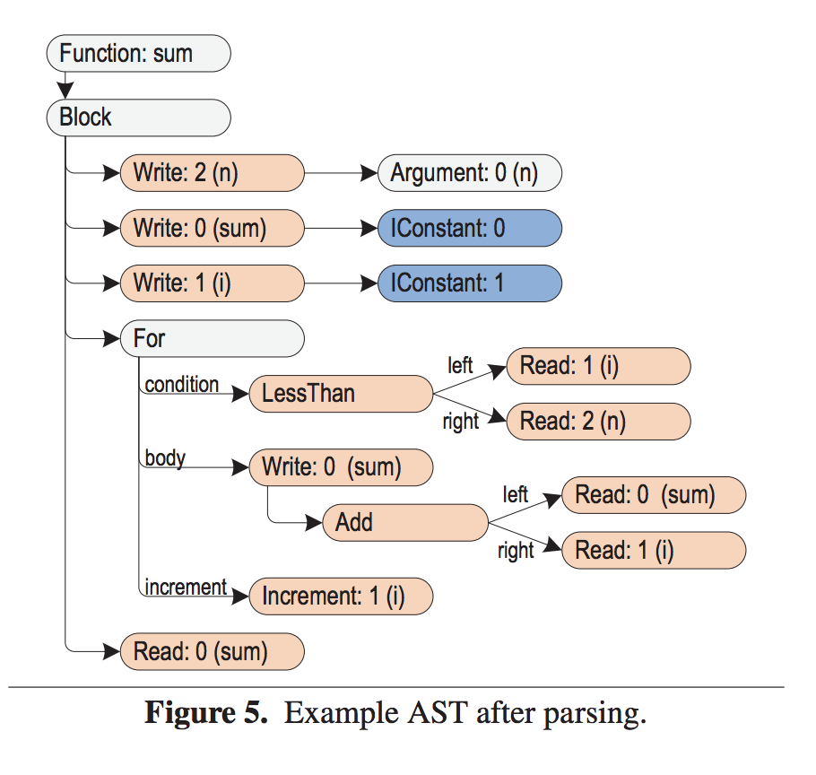
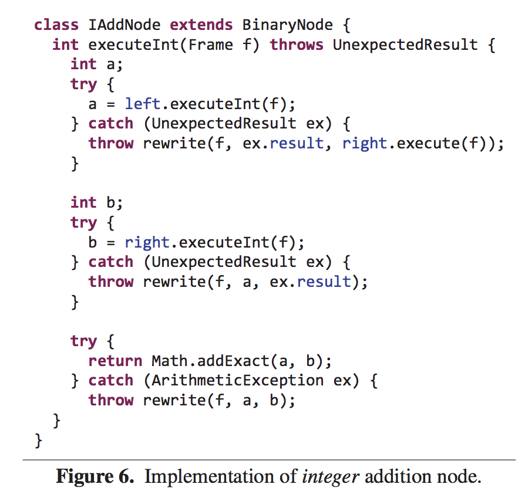
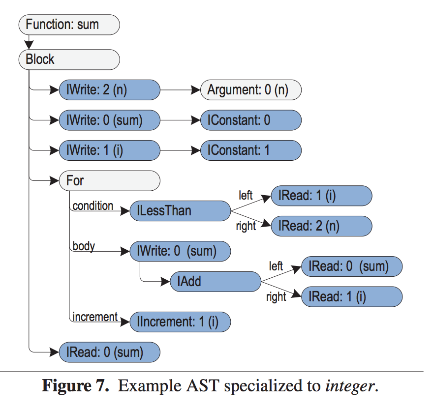
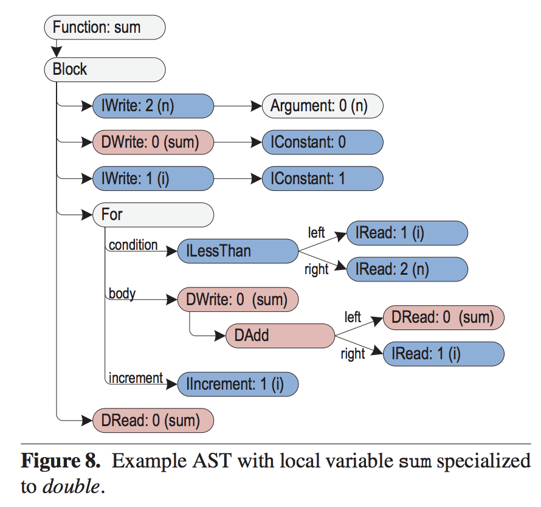
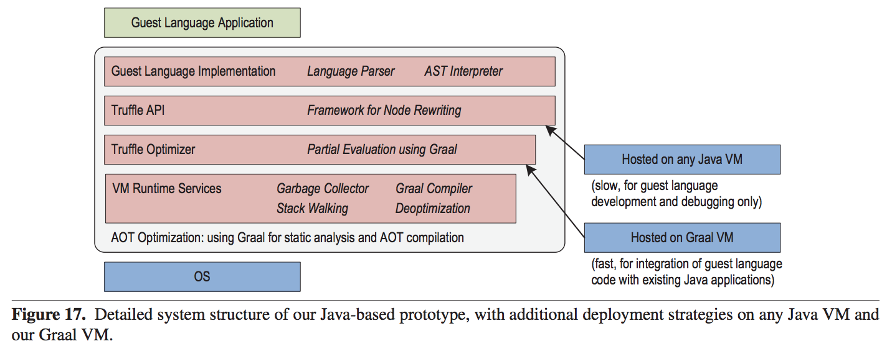
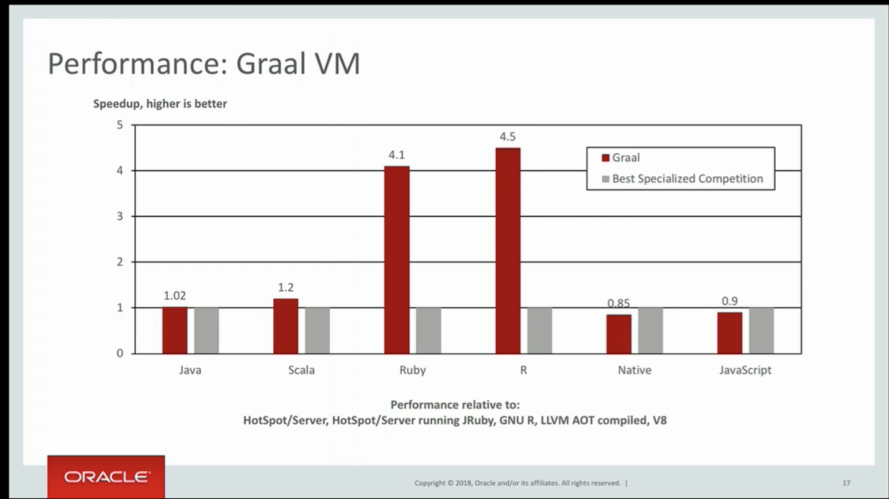

+++
title = "One VM to Rule Them All"

[extra]
bio = """
  [Sameer Lal](https://github.com/sameerlal) is a Master of Engineering student.  He studied Electrical & Computer Engineering and Math in his undergrad.  He is interested in probability-related fields.
"""
[[extra.authors]]
name = "Sameer Lal"
link = "https://linkedin.com/sameer-lal"
+++


# A Short Story
You are the latest hire for the startup company _QuantBet_ which specializes in developing computational models that are used for proprietary sports betting.  _QuantBet_ is fairly new, and as a gifted PL researcher, you are tasked with creating a new programming language _QuantPL_ to assist gamblers in their analysis.

Sports betting is a fast business, and you want your code to run quickly.  You begin your project by developing a parser for _QuantPL_ and an Abstract Syntax Tree (AST) interpreter.  

Your colleagues are impressed by your work with _QuantPL_ which they claim is more intuitive when scripting models.  But soon, they start to notice that it's a lot slower than what they're use to.

You think about developing a real VM.  This would require spending a lot of time designing a run-time system in C without causing memory leaks.  You think about using Java instead as your backend.  You may have to even design a bytecode format and interpreter.  If they complain more, you'll have to hire others to help you write a JIT compiler.  This is a slow, costly and painful process.

You hear that rival company _Quant2Bet_ has developed a language _Quant2PL_  that is almost as fast as Java code without much effort.  They're using something called Truffle and Graal, so now you're stuck modifying your programming language from the very beginning.  You decide this isn't worth your time, quit your job, and join _Quant2Bet_ instead.

# A Solution
[One VM to Rule Them All][paper] (2013) presents an architecture which allows implementing new programming languages within a common framework, allowing for language-agnostic optimizations.  Instead of designing the entire stack for a new programming language, you can just focus on creating a parser and AST interpreter.  Now, you can reuse functionality from existing Virtual Machines and your language is already fast and optimized.  In the following sections, we call the new language that we are trying to build the _guest language_ and the backend for this infrastructure that acts as an interpreter the _host language_.

## Background
* __Java Virtual Machine (JVM)__ is a virtual machine that allows computers to run programming languages that compile to Java bytecode.
* An __Abstract Syntax Tree (AST)__ is a tree representation of source code.  Each node is a specialized construct of the programming language, with branches as inputs to the construct.
* A __Just-In-Time (JIT) compiler__ compiles a program at run-time instead of before execution. JIT compilers rely on Ahead-Of-Time (AOT) compilation and interpretation.
* __Dynamic Dispatch__ is the process of iterating through implementations of a polymorphic operation and selecting which one to call at run time.


## One VM to Rule Them All 
This paper claims the following:
* A method of rewriting nodes in which a node can rewrite itself into a more specialized or general node.  Nodes capture particular semantics of the guest language, such as addition or division.  
* An optimizing compiler that takes in the structure of an interpreter and compiles it to bytecode.  In Graal, the compiler is written in a subset of Java.
* A method called _speculative assumption_ in which heuristics determine the probability of executing certain sections of code.  For less frequent sections, deoptimization disregards compiled codde and switches to execution using interpretation.


The combination of these claims result in high-performance from an interpreter without the need of implementing a language-specific compiler.

### Truffle and Graal 

The prototype of the language implementation framework is called _Truffle_ and the compilation infrastructure is called _Graal_, both of which are [open source][graal] by Oracle.  At a high level, a user of this ecosystem implements an AST interpreter for the guest language.  In the interpreter, each node encapsulates information regarding a particular semantic of the guest language.  An addition node may be specialized for integer, double and string inputs. 

Node rewriting occurs during interpretation, using profiling feedback.  When a subtree of the AST is deemed to be stable (meaning unlikely to be rewritten), the AST is partially evaluated at that subtree and the Graal compiler produces optimized machine code to run on the VM.  

If during execution a node is not the correct specialized type, we _deoptimize_.  The optimized machine code is discarded and we switch to AST interpretation.  The node rewrites itself and the subtree is then recompiled.  

Here, dynamic compilation is agnostic to the semantics of the guest language.  

#### Example

The below diagram describes an instance of an AST interpreter during execution.  In Figure 1, nodes are first uninitialized.  After profiling feedback, nodes are rewritten to become specialized and are then compiled.

Now suppose in Figure 3, there is integer overflow.  Our speculation that all nodes in that subtree are of type integer is incorrect, so we have to deoptimize, rewrite a second time, and then recompiled.  Note that node rewriting is not just for type transitions, but for any time of profiling feedback.



## Node Rewriting

It is the duty of the developer of the guest language to implement node rewriting.  As a guideline, the authors of the paper suggest that developers fulfill the following:

> __Completeness__ - Each node must provide rewrites for _all_ cases that it does not handle itself.

> __Finiteness__ - The sequence of node replacements must eventually terminate to either a specialized node or a generic implementation that encompasses all possible cases.

> __Locality__ - Rewrites occur locally and only modify the subtree of the AST.

Examples of profiling feedback are type specializations, polymorphic inline caches and resolving operations.  As program is successively executed, the profiler yields more optimized compiled code.  The authors then claim that because of this, their interpreter is better than other interpreter implementations.  They note that the main overhead is dynamic dispatch.

Consider the following example, where the guest language is JavaScript:

```
function sum(n) {
   var sum = 0;
   for (var i = 1; i < n; i++) {
   sum += i;
   }
   return sum;
}
```
The following is an example of an AST after immediate parsing.  Note that only constants are typed.




In code, we can write the integer addition node as follows.  Here, Java is the host language for the JavaScript interpreter.



After execution, nodes replace themselves as specialized nodes for type _integer_ called IAdd to be used for subsequent executions.  Note that IAdd nodes only operate on integer values.  If it does not receive an integer value, it will throw an exception, and the node will be rewritten.  

The below picture shows an instance where nodes are specialized for the integer type (depicted by prefix "I").



If `sum` overflows, we need to rewrite certain nodes to specialize for the double data type (prefix "D").  The following image shows this case:



We can actually do a bit better in code if the host language is Java.  For a given node, in this case `add`, we can use the annotation `@Specialization` to denote a specialized implementation and use `@Generic` to denote the default, unspecialized implementation.  Now the Java compiler will call the Java Annotation Processor which iterates over all Node Specifications, marked by the annotations.  It is essentially the same as before though now we can use developer tools and IDEs more seamlessly.  

## Performance
The main overhead is dynamic dispatch between nodes when rewriting occurs.  To do this, we count the number of times a tree is called, and when it exceeds a certain threshold, the tree is assumed to be stable and is then compiled.  Deoptimization points invalidate the compiled code, allowing for the node to be rewritten.  The counter is reset, and after the threshold number of executions it will be deemed stable and compiled again. 

This architecture allows for additional optimizations, such as:
> __Injecting Static Information__ : where a node adds a guard that leads to a compiled code block or a deoptimizing point.

> __Local Variables__ : where read and write operations on local variables are delegated to a Frame object that holds values.  [Escape Analysis][36] is enforced allowing static single assignment (SSA) form.

> __Branch Probabilities__: where probabilities of branch targets are incorporated to optimize code layout which decrease branch and instruction cache misses.  


# Current Implementation and Deployment
Currently, this infrastructure is prototyped using a subset of Java.  



The __Truffle API__ is the main interface to implement the AST.  The __Truffle Optimizer__ involves partial evaluation.  The __VM Runtime Services__ provides basic VM services which includes Graal.  

The authors suggest two main deployment scenarios:

> __Java VM__:  The current implementation is in Java so it can technically run on any Java VM.  This is especially useful for debugging and low cost.

> __Graal VM__:  This provides API access to the compiler, so the guest language runs with partial evaluation.  This uses Graal as its dynamic compiler and is extremely fast.  It is useful for integrating the guest language in a current Java environment.


# A Survey on Languages
The following languages have been tested by the authors: JavaScript, Ruby, Python, J, R and Functional programming languages.  We will expand upon the first two as they pose interesting points.

__JavaScript__ has many implementations, several which are of high performance.  Noderewritting is used for type specialization and inline caching.  Type specialization has been described before in the int/double example for addition.  Inline caching seeks to optimize operations that are performed on specific-type objects.  The implementation of this is similar to pattern matching in functional languages such as `Haskell` or `OCaml`.

__Ruby__ is even more interesting.  Ruby allows to redefine any method, so naturally, deoptimization can be applied to invalidate compiled nodes.  Most notably, [later papers][oracle] indicate that Ruby implemented with Truffle is 45x faster than MRI (C backend).  Truffle JVM is also approximately 2x faster than Topaz which shows merit.  

One question I'd like to pose is do these results change if the backend compiler were written in C instead of Java?


# Merits and Shortcomings:

### Merits
This is an interesting idea that definitely is worth exploring when implementing the backend for a new programming language.  The main merit of Truffle is the ease of implementing a new programming langauge.  The developer only has to implement an AST interpreter, and Truffle handles the rest of the heavy lifting.  The main merit of Graal is its ease of pairing with Truffle.  Graal itself is an impressive compiler which can run both JIT or AOT, has many optimizations as previously discussed and can convert Truffle ASTs into native code.  Graal is also easily extendable for new optimizations.

Most of Truffle/Graal is available open-source!  This is a huge merit for the [Open Source Initiative][osi]!

### Shortcomings

One shortcoming I noticed was the amount of memory needed for this ecosystem during runtime.  At deoptimization points, metadata is stored, the partially evaluated AST is reloaded and the original AST is also kept in memory.  This is a lot of information, and the different speculative optimization add even more memory usage.  Running this compiler will consume a lot of RAM which can be costly and may even outweigh performance.  This is not to mention the memory cost of Truffle and Graal themselves at runtime.  Currently, [SubstrateVM][substrate] is a suggested solution to this shortcoming.  But SubstrateVM itself has many shortcomings, including dynamic class loading/unloading, finalizers, [etc][short].


One shortcoming involves the author's solution to the dynamic dispatching problem.  The authors describe keeping a counter, and only after the counter reaches a threshold, the AST is compiled.  This means that peak performance only occurs after many iterations of the program, when node rewriting is unlikely.  For programs are not run as frequently, this is a major shortcoming because the execution count for each branch may never even reach the said threshold.  With the example of _QuantBet_, you only run a model a few times before tweaking it.  Thus, it is probably not useful for those scenarios.

# In Industry
Both [Twitter][twitter] and [Goldman Sachs][gs] have prototyped integrating Truffle/Graal into their stack.  


# Related Work Today

__PyPy__ is runs much quicker than Python.  Python is normally interpreted in CPython.  Pypy runs faster than CPython since it is a JIT compiler.  PyPy implements a Python VM written in RPython.

__Metacircular VMs__ are written in the guest language instead of the host language.  This allows sharing between the host and guest systems.  

__Self Optimizing Interpreters__ rely on improving interpretation performance during execution.  This paper claims that since compilers analyze larger portions of the code, it can perform global optimizatoins that an intepreter is not able to do.

It would be interesting to quantify this statement and develop interpreter optimizations to combine with Graal.  I curious to see if interpreter optimizations in general make a significant difference. 

# Final Thoughts


The paper is interesting in its claims, though it fails to provide benchmark tests.  The main benchmark I was surprised that the paper did not include is how guest language performance using the Truffle/Graal ecosystem compares with the LLVM compiler.  In particular, I would have liked to see a runtime comparison between the two, and a qualitative description of the overhead in producing LLVM IR from the guest language as compared to creating the AST interpreter.  This, I believe, is a natural benchmark which the paper does not include.  


It actually took a lot of searching, and eventually I found a [talk by Thomas Wuerthinger][talk] at Devoxx which shows the following performance measures.  Maybe these weren't measured at the time of publishing this paper, or the authors were wary of displaying results that are marginally the same as their counterparts.




This paper also markets Truffle/Graal as the first of its kind, but in its references, it acknowledgs that it is actually not.  I mainly attribute this to the fact that the paper was published out of Oracle Labs and there may have been conflicts of interest between academics and industry-minded folks.  In fact, on a [YCombinator][ycomb] message board thread, developers openly refuse to even consider using a product by Oracle.


# Related Reading
[Metropolis][metropolis] which tries to implement Java using Java.

[Top 10][ten] things to do with GraalVM.

[Getting Started][startgraal] with GraalVM.


[paper]: https://dl.acm.org/citation.cfm?id=2509581
[graal]: https://github.com/oracle/graal
[36]: https://dl.acm.org/citation.cfm?id=1064996
[substrate]: https://github.com/oracle/graal/tree/master/substratevm
[short]: https://githubcom/oracle/graal/blob/master/substratevm/LIMITATIONS.md
[twitter]: https://www.youtube.com/watch?v=ZbccuoaLChk
[gs]: https://www.ivonet.nl/2018/10/23/codeone/Tuesday/DEV6082__one-vm-to-rule-them-all-lessons-learned-with-truffle-and-graal/
[ycomb]: [https://news.ycombinator.com/item?id=6232240]
[metropolis]:http://openjdk.java.net/projects/metropolis/
[ten]:https://chrisseaton.com/truffleruby/tenthings/
[metropolis]:http://openjdk.java.net/projects/metropolis/
[talk]: https://www.youtube.com/watch?v=8AYESZIaacg
[oracle]: https://chrisseaton.com/truffleruby/ecoop14/ecoop14-ruby-truffle.pdf
[startgraal]: https://www.graalvm.org/docs/getting-started/
[osi]: https://opensource.org/node/905