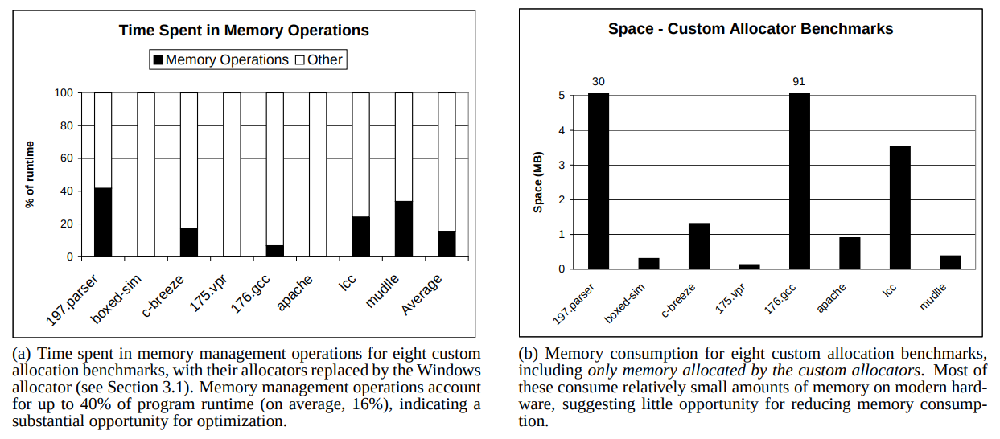
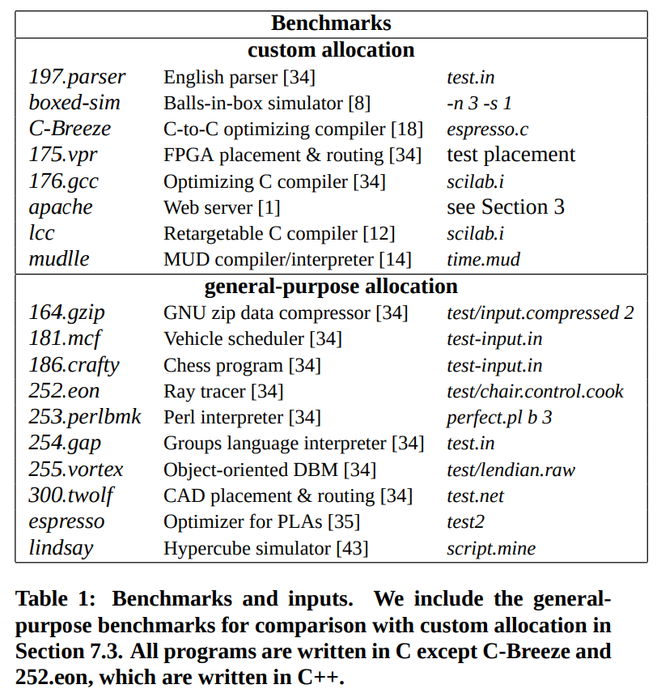
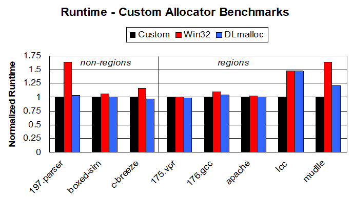
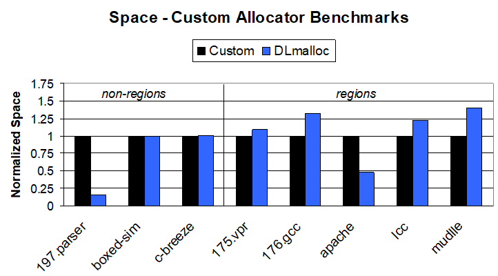
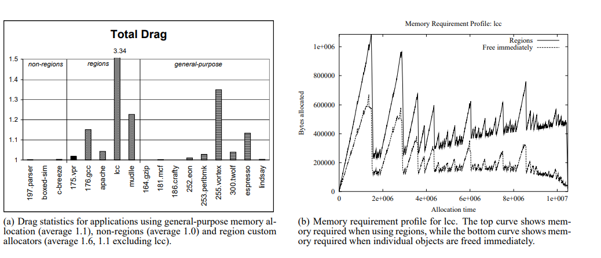
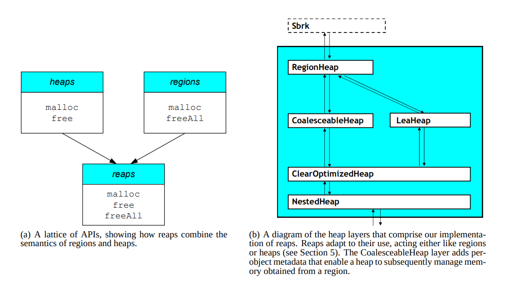
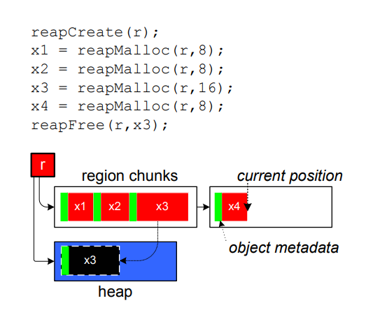
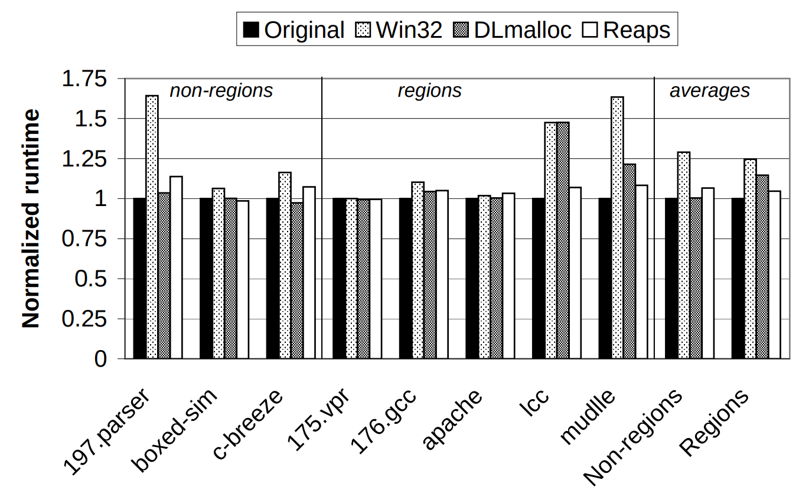

+++
title = "Reconsidering Custom Memory Allocation"

[extra]
bio = """
  [Oliver Richardson](https://cs.cornell.edu/~oli) is a theory student"""
[[extra.authors]]
name = "Oliver Richardson"
link = "https://cs.cornell.edu/~oli"
+++

In this post, I review [Reconsidering Custom Memory Allocation][paper], a 2002 paper which (1) argues against the then-pervasive wisdom that writing custom memory allocators gives you performance boosts, and (2) introduces a datastructure called a "reap" to do hybrid region / heap memory management. All images in this post are taken directly from the paper, or [Emery's slides](https://people.cs.umass.edu/~emery/talks/OOPSLA-2002.ppt).


# Background on Custom Allocation

Memory is necessary, but creating and freeing it takes time, and the general purpose memory management offered by C may not be optimal for your purposes. You probably know much more about the memory patterns of your application than the designers of the default memory allocator, and might be able to exploit this to save resources. Moreover, there is an opportunity to save a lot of time, as up to 40% (and 17% on average) of the program time can be spent allocating and de-allocating memory[^1]:


<!--img src="potential.png" alt="drawing" width="400" style="margin-left:100px;"/-->

All of this makes writing custom memory allocators very appealing.  
<!--In C, this amounts to overloading the `new` and `delete` operators. -->


#### Saving Time with Custom Allocation

For instance, suppose you have a large number of objects which you know you will eventually create, and have some upper bound on how many you'll eventually get. Suppose further that you know there are relatively few objects that are freed during the first phase phase of the program, which takes the most time. By the second phase, which you know executes quickly, you don't need any of the objects anymore. Now, a custom memory allocator can:

 * Reduce the allocation time, by using only a single call to malloc, and getting enough space for them all at once (even though you might not know the exact number, or use them all at the same time, and you can't create them all yet).
 * Save time with free calls: you can free them all at once at a the end, rather than freeing each object individually (which could still happen regularly) during phase one of the program when all of its references go away.
[Reconsidering Custom Memory Allocation][paper]
Allocating memory in this way would in fact be creating a _region_ allocator: you allocate one large chunk of memory at first, and then increment a pointer into it; the entire region must then be freed all at one time.


#### Saving Space with Custom Allocation

The example above actually uses more memory than a heap. That is more common, but they can also be used to reduce the memory footprint, primarily by preventing fragmentation. For instance, if memory fragmentation is a huge issue, but you know rougly what fraction of your memory is used by objects of different sizes, you can partition it into pieces, and deal with each size class separately, which offers much better guarantees about the worst and average case fragemtation. This is commonly done in practice; [Mesh][], for instance, requires that all pages in question are of the same size class. [The paper we analyze][paper] refers to allocators liek these as "per-class custom allocators".

For all of these reasons, in 2002, it was common practice and widely condisered a good idea to write a custom memory allocation for your program to improve performance.


## The Drawbacks to Custom Allocation

Of course, even without any experiments, it is easy to see how doing this could be a mistake: the effectiveness of any of these relies on certain assumptions about the programs, and so any modifications need to be done while keeping the custom allocator in mind. Moreover, non-standard allocation schemes make it much more difficult to use existing tools to analyze your code. In more detail:

* Accidentally calling the standard `free` on a custom-allocated object could corrupt the heap and lead to errors
* Custom memory allocation makes it impossible to use leak detection tools
* It also prevents you from using a different custom allocator to do something else that's more valuable in the future
* It keeps you from using garbage collection


# The Paper: Reconsidering Custom Memory Management

The paper at hand, [Reconsidering Custom Memory Allocation][paper], is packaged and sold as the thesis that custom memory allocators in practice do not out perform general ones.

One of the key arguments of this paper is that standard baselines are not fair. Evidently the usual argument _in favor of_ cusom allocation in 2002 was a comparison against the win32 memory allocator, which was much slower than custom allocators. The first part of this paper is an evaluation against the Lea allocator (Doug Lea's `dlmalloc`, now often the default allocator), which greatly reduces and in some cases eliminates the margin of victory for custom allocators not exploting regions.


### The Taxonomy of Memory Allocators.
This paper uses the following three bins to classify allocators:

**[1] Per-class allocators**. You build a separate heap for every object size class, and optimize each one separately for objects of this size. This is fast, simple, and interacts with C well --- but could be space inefficient if you don't know how much memory of each class size you will use.


**[2] Regions**.  An allocator that allocates large chunks of memory, puts smaller pieces within it, and then must free them all at once. They are fast and convenent, but use a lot of space and are arguably dangrous because dangling references keep things from being freed. This (nominally) requires programmers to re-structure code to keep references to the region, and free the entire region at once, resulting in a usage pattern that looks somewhat like this:

	```
	createRegion(r);
	x1 = regionMalloc(r,8);
	x2 = regionMalloc(r,8);
	x3 = regionMalloc(r,16);
	x4 = regionMalloc(r,8);
	```

**[3] Custom patterns**. Anything else --- for example, those that exploit stack-like patterns in memory allocation (the relevant benchmark is `197.parser`). The authors describe these as fast, but brittle.

## Experimental Setup

Although this paper is well-regarded and remembered primarily for its evaluation, the actual experimental data involves only 8 programs, each run with a single input. The table containing the programs and their inputs can be seen in the figure below:

<!--  -->


All of the other graphs in this blog post will reference the 8 benchmarks on the left, and run their experiments for a single input, a single time, not reporting variance, the impact of parameters, machine loads, or any other confounders. For a paper that is purported to be an exemplar takedown of a common design practice, and appears to have had a large impact on the state of memory allocation, its actual empirical backing is quite flimsy.

Given that there are only 8 data points, with no reported statistics, and more than 8 graphs presented in the paper alone (we must imagine the authors conducted far more that they did not report), that dozens of features were exposed, and that the authors were willing to consider non-linear decision boundaries (the _is it a region_ decision stump), makes things even more worrying. The authors also give very little attention to allocators that are not regions. As we will see, the hypothesis that the primary reason for the difference in performance is the existence of regions also does not even fit the data particularly well: many of the region allocators, too, fail to outperform `dlmalloc` by wide margins.

### Emulation

In order to compare allocators which have different semantics and expose different interfaces to the programmers, Emery et. al. write an emulator so that these programs can be run using malloc and free. This allows them to be linked to the analysis tools, and for various properties of the programs to be computed, such as the drag. This hampers the custom allocators and could also be a source of preformance disparity.

## Results Part I: Custom vs General-Purpose Allocators

The primary finding of this paper is that that, while programs outperform the win32 memory allocator, they often roughly break even with the Lea allocator. The only custom allocators that seem to be able to get a reliable edge on `dlmalloc` are  region allocators, as seen below:



At a glance, we can see that dlmalloc roughly matches the performance of the custom allocators for all except for `lcc` and `muddle`, both region allocators. Given that the Lea allocator was already over a decade old when this paper was being written, it is suprising that people had not recognized this. Perhaps an alternate, less grand but equally appropriate framing of the discovery would be "the win32 memory allocator is not very good, and you have other options". The failure of regions to help in the first three applications  remains an unexplored question. One also wonders about the possibility of a ninth data point in which a non-region allocator vastly out-performs dlmalloc.

Here are the results in terms of memory usage, for comparison:

The observation the authors make is that regions can provide performance benefits in both realms[^3], though regions' beneifts are misleading, because their peak memory consumption is higher, and they often leave a lot of memory lying around, as seen in the drag graphs below:




# Regions and Reaps
In order to provide the performance benefits of regions to general purpose allocators, Emery et. al. introduce "reaps", a merging of regions and heaps, sold as a generalization of both.
Recall that a heap exposes `malloc` and `free`; a region gives you a `malloc` and `freeAll`. The example in the paper is the following:
<!--  -->



Unfortunately, this ends here, leaving readers to wonder why we allocated new memory and copied meta-data when really when we intended to free memory by deleting things. This is the entirety of the relevant description from the paper:

> "Reaps adapt to their use, behaving either like regions or like heaps. Initially, reaps behave
> like regions. They allocate memory by bumping a pointer through
> geometrically-increasing large chunks of memory... Reaps act in this region mode
> until a call to `reapFree` deletes an individual object. Reaps place
> freed objects onto an associated heap. Subsequent allocations from
> that reap use memory from the heap until it is exhausted, at which
> point it reverts to region mode."


Owing in part to their ellusivness, I have not been able to deterine with certainty how edge cases work, but I will give an expanded intuition for what reaps seem to be doing and why one might expect this to give some performance benefits:

### A Pair of Heuristics

We start a new heap because the assumption is that after freeing some memory, we will probaly be both freeing and allocating memory frequently in the future. Thus, the very end of our memory acts like a heap for a little while, so a bout of object creation and deletion has only the impact of a single loop iteration on the consumed memory. Effectively, we are using the heuristic that freeing an individual object means we don't want to be using regions "right now", and in particular, for the upcoming allocations.

On the other hand, how do we know we should go back to allocating things in region mode? This should happen when we've allocated a lot of memory without freeing any. Thus, we go back to region mode when the heap is full. This is our second heuristic. In some ways, tying these two together to the size of an artificial heap seems like a very neat trick.


### Impact on Programmers

The authors argue that this is purely positive, as it gives programmers the option of programming in a style that is region-like, and thereby gaining all of its benefits, but also leaving them the freedom to do other things. This seems compelling, but one might also worry that by not forcing programmers to interact with the region semantics, one will lose their attention and mistakes will not be caught. For instance, mostly using region mode, while freeing an occasional object would result in a modest overhead and in reality frees exactly zero memory; such a mistke might not be easy to see.

## Results Part II:

Reaps do indeed reap the performance benefits that were expected on them (at least as far as these 8 program traces are concerned). Below, we can see the same graph, with the addition of reaps



The most important feature of this graph, of course, is the fact that reaps perform reasonably well compared to dlmalloc and the custom allocators for programs that don't use regions, and don't pay as much as dlmalloc on `lcc` and `muddle`, where regions have given a large performance bump beyond the other general-purpose allocators.

The authors draw this conclusion unreservedly, but there are some very worrying things about this graph.
 - Almost all of the performance benefit comes from a single data point, `lcc`, which dlmalloc handles no better than win32. Even for `muddle`, dlmalloc does not perform terribly.
 - In addition, reaps have a small overahed on nearly everything; it is particularly pronounced for the parser and c-breeze.
 - Combining the first two points, it seems as though dlmalloc would out-perform reap on average if we take out `lcc`.
 - Almost none of the trends that one can read off of this graph are supported uniformly by all of the points. And Once agin there are only 8 of them.

# From 2002 to 2019

The Lea allocator (Doug Lea's malloc, now referred to as `dlmalloc`) is now the default implementation of linux. The standard general purpose allocator to beat in evaluations is now [jemalloc](http://jemalloc.net/), which seems to be considerably more efficient [^2]. The existence of even better general purpose allocators in some ways strengthens the point made by the paper: there's even less to be gained by writing your own allocator.

On the other hand, custom memory allocation is not quite dead. [Here](https://github.com/mtrebi/memory-allocators)'s a tutorial on how and why custom allocators are helpful, custom allocation still is seen as a potential reason to disregard projects such as [Mesh][], and Emry Berger's [Heap Layers][heapl] project (used to construct reaps in the present paper), which has been much more widely employed, ironically is a framework for building custom allocators, by its own admission:

> "Heap Layers makes it easy to write high-quality custom and general-purpose memory allocators."


**What happened to reaps?**
Though modern memory allocators more effectively put off frees to make them more region-like, "reap" is not a common term for memory allocators --- in fact, only a small handful of the papers that cite this one mention reaps (and all share authors).

It is interesting that the reap, which one might consider the more substantive, creative contribution to this paper, does not seem to have caught on. In his [2012 blog post](https://emeryblogger.com/2012/10/28/most-influential-oopsla2012/) in which he acknowledges a most influential paper award for this paper, Emery tells people (with extreme brevity and no explanation) to use [his more modern allocator, Hoard](hoard.org), instead of reaps. Even more strangely [the technical paper] that hoard is based on does not include the word "reap", leaving us wondering what happened to them. Still, an implementation lives on in [the legacy portion](https://github.com/emeryberger/Heap-Layers/blob/master/legacy/reap/regionheap.cpp) of the Heap Layers project.

# Conclusions

While this paper seems to have been largely correct in several important ways, many of its elements leave something to be desired, as discussed in the [Empirical Setup section](#experimental-setup). The evaulation seems thorough but unprinicpled and worrylingly oversteps the boundaries of good empiricism with its conclusions; the new algorithm and data structure (reaps) seem very useful and are sold well, but explained phenominally poorly, with only a partial example which doesn't illustrate interesting cases, no theoretical backing, and no explanation of the heuristics that enable its performance.

These reaps do not seem to have been used more than once or twice since 2002, and not for lack of publicity (several claim, nebulously, to use "ideas from reaps"). It is unclear whether the reason they were not adopted was because of the poor explantion, to some fundamental flaw which was later discovered, or because they never were quite as good as they look (after all, there are only 8 data points, and it might be easy to overfit to them with parameter or design tuning). With no follow-up studies or testing on benchmarks for which they were not designed, it's hard to know.

Even so, the general message is well-articulated, appears to have rung true in retrospect, and perhaps necessarily so. As general-purpose allocators get even better, and perhaps even begin to be tunable to custom programs, out-performing them becomes increasingly difficult. This is a general trend: while knowing something about the matrices you want to multiply may have been an invaluble place to mine in order to edge out general purpose matrix multiplication algorithms, today it is almost impossible to out-perform standard libraries for doing them---so much so, that it is often beneficial to rewrite other computations in terms of matrix multiplications to accelerate them; moreover, representing computations in this generic way often provides some more standard insights into the structure of your problem and allows you to immediately make use of relevant algorithms. For similar reasons, it is hard to imagine that custom memory allocators will do any more than dwindle.

<!--- THOUGHTS.


* This is really an empirical claim: that people do not write or maintain their custom memory allocators properly. Obviously, antything customized for your domain can outperform what you want


Results & Evaluation:
* Benchmarks: only 8 programs. Each was run on only 1 input! Strong incentive to chose benchmarks where the result is stronger. Worse still: there is a meta selection bias: a person who mostly interacts with benchmarks where this is a problem is more likely to come up with a paper like this.
	- To solve this, you really have to do a more convincing, reresentative sample of programs, provide reasons. This is, of course, very difficult.
* These experiments don't translate to the modern world, but jemalloc and other

General Thoughts
* This is part of a trend of that takes power away from programmers and puts it in the hands of those writing dev tools. This is often a good thing (e.g., writing higher level languages, libraries, etc.,) but also is a bit patronizing.
* Taxonomy is not at all crisp. Most things seem like they can be emulated with other things. Worry that there are false dichotomies being presented as storeies.
* Per-class allocators are easy to implement.

One key thing to keep in mind is that this custom memory allocation is just another abstraction _that can be built with the default allocator_. It's built on top of the system `malloc`, and so anything you can


--->
[^1]: of course, there are only 8 programs, and so it is hard to really trust this analysis.
[^2]: https://suniphrase.wordpress.com/2015/10/27/jemalloc-vs-tcmalloc-vs-dlmalloc/

[paper]: https://dl.acm.org/citation.cfm?id=582421
[hoard]: https://dl.acm.org/citation.cfm?id=379232
[supermalloc]: http://supertech.csail.mit.edu/papers/Kuszmaul15.pdf
[Mesh]: https://arxiv.org/pdf/1902.04738.pdf
[heapl]: https://plasma.cs.umass.edu/emery/heap-layers.html
[jemalloc]: https://people.freebsd.org/~jasone/jemalloc/bsdcan2006/jemalloc.pdf
