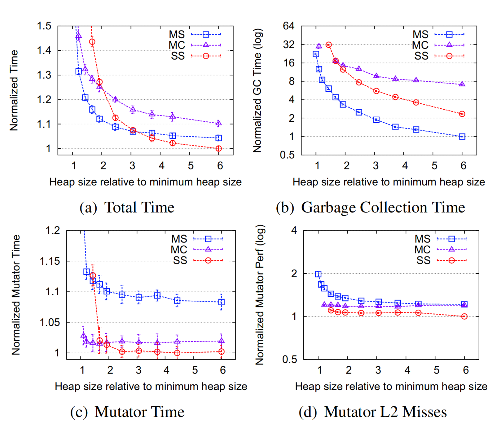

+++
title = "Immix: a Mark-Region Garbage Collector with Space Efficiency, Fast Collection, and Mutator Performance"
extra.author = "Siqiu Yao"
extra.bio = """
  [Siqiu Yao](http://www.cs.cornell.edu/~yaosiqiu/) is a 3rd year Ph.D. student interested in security about systems and programming languages.
"""
latex = true

+++

[Immix: a mark-region garbage collector with space efficiency, fast collection, and mutator performance](https://dl.acm.org/citation.cfm?id=1375586) describes a new garbage collector *immix*, 
which combines two techniques: 
*mark-region* and *opportunistic* defragmentation. 
And by full-scale evaluations, 
this paper shows that immix can match the state of the art on three critical aspects: 
*space efficiency*, *fast collection*, and *mutator performance*.

# The Imperfection of Existing Tracing Collectors

This paper focus on three important demands on garbage collectors:

- *Space efficiency*: the less space overhead, the better.
- *Fast collection*: the faster the collector runs, the better.
- *Mutator performance*: the faster the mutator runs, the better.

This paper first investigates three existing canonical tracing collectors: 
*semi-space* (SS), *mark-sweep* (MS), and *mark-compact* (MC). 

The above figure shows the performance tradeoffs for canonical collectors. 
It plots the geometric mean of total time, collection time, mutator time, 
and mutator cache misses as a function of the heap size, 
normalized to the best, for 20 DaCapo, SPECjvm98 and SPECjbb2000 benchmarks, 
and shows 99% confidence intervals. 
Figure (a) demonstrates that semi-space performs best when the heap size is large enough, 
but sacrifices space efficiency due to the 2x space overhead; 
Figure (b) shows that mark-compact does a bad job on achieving fast collection; 
Figure (c) and (d) indicate that mark-sweep cannot compete with the other two in terms of mutator performance.

Therefore, the primary goal of the new collector proposed by this paper is to guarantee all three demands.

# Immix

Immix contains two components: 
a *mark-region* collector and an *opportunistic* defragmentation mechanism.

### Mark-region

A mark-region collector is similar to a mark-sweep collector, 
with 2 differences: 
(1) In mark-region, memory is divided into fixed-sized regions, 
and objects may not span regions;
(2) Instead of maintaining a free list, 
which a mark-sweep collector allocates from and sweeps to, 
a mark-region collector bumps allocates into free regions, 
which are regions with no living objects, 
and reclaims free regions during collection.

A mark-region collector performs better on mutator performance than a mark-sweep collector because of its contiguous allocation nature. 
However, it suffers from space-inefficiency as one single living object can hold a region unavailable. 
Immix addresses this problem by 
(1) refining this introduced mark-region collector to improve utilization of a region;
(2) introducing a defragmentation mechanism, 
which is presented in the next section.

Immix refines mark-region by operating at two levels, 
coarse-grained *blocks*, and fine-grained *lines*. 
Comparing to the original mark-region collector, 
the differences are: 
(1) Objects may span lines; 
(2) during reclamation,
immix also identifies free lines in partially free blocks (formerly unavailable blocks); 
(3) during allocation, 
immix first tries to find contiguous free lines that are large enough for the allocations. 
If it cannot find suitable lines, 
then it allocates into free blocks.

This paper elaborates more on the allocation process of immix, 
which is called *steady state allocation*. 
The allocator is divided into two parts: 
a global allocator that maintains a pool of free blocks,
and a thread-local allocator that maintains free lines. 

The figure above illustrates the basic immix heap organization during steady state allocation. 
The allocator maintains two pointers (Bump Pointer Cursor and Bump Pointer Limit) that indicate the left and right bound of the current hole (contiguous free lines);
the right bound is either right before the next living line or the end of this block, since an object cannot span blocks. 

#### Implementation Details

This paper discusses many details of its implementation; 
here are some remarkable ones about mark-region.

1. **Parallelism**. Immix implementations are parallel. The thread-local allocators are mostly unsynchronized while the global allocator is synchronized. Therefore, they follow a design pattern to maximize fast, unsynchronized thread-local activities and minimizes synchronized global activities. As a result, immix's mark-region collector requires hardly any synchronization.
2. **Demand Driven Overflow Allocation**. Each immix allocator is paired with an *overflow allocator* that is also a contiguous allocator, however, it always uses empty blocks. If immix cannot allocate a *medium* object (an object with size greater than a line) into a block that contains free lines, immix allocates it with the overflow allocator.

### Opportunistic Evacuation

The mark-region collector, 
like a mark-sweep one, 
is non-moving and thus subject to fragmentation. 
Immix uses a defragmentation mechanism called *opportunistic evacuation*.

Actually, before the evacuation process, 
methods are needed to determine when to trigger defragmentation and how to select candidate blocks. 
This part is left to be discussed in implementation details, 
let's suppose we know the set of candidate blocks for now. 

This evacuation process is: 
when the collector encounters a live object in a candidate block, 
it *opportunistically* evacuates the object. 
That is, it only evacuates an object if prior evacuation has not exhausted all target space. 
And the process to allocate this object is the same as to allocate an object created by the mutator,
except all defragmentation candidate blocks are not considered free nor partially free. 
Besides, the collector leaves a forwarding pointer which records the address of the new location.
And if the collector encounters references to a forwarded object, 
it replaces them with the new location.

#### Implementation Details

1. **Defragmentation Trigger.** If there are one or more recyclable (free or partially free) that the allocator "did not use" or the previous collection didn't free enough space, immix triggers defragmentation at the beginning of the current collection.
2. **Candidate Selection**. Immix selects candidate blocks with more holes, as many as possible. It maintains an array called *available histogram* AH, where AH[i] reflects space occupied in all blocks with i holes. During selection, immix starts from biggest i, selects all blocks with i holes as candidates if available space is not exhausted, and decrease i, repeating this process until available space is exhausted or i becomes 0.
3. **Headroom**. Headroom is a small number of free blocks that immix never returns to the global allocator and *only* uses for evacuating.
4. **Pinning.** In some situations, an application may request that an object not be moved. Immix supports this pinning feature. If the application pins an object, defragmentation never moves this object.
5. <!--**Mixing Marking and Evacuation.** ??? I don't understand this part in the paper-->

# Evaluation

This paper has put a lot of effort into evaluations.

The benchmarks contain SPECjvm98, DaCapo suites, and pseudojbb2000. 
They use three different hardware platforms, 
including one machine with a dual-core CPU:
Intel Core 2 Duo.
Most analyses focus on results from the Core 2 Duo using two processors.

Immix is implemented in the memory management toolkit (MMTk) in Jikes RVM, 
other algorithms evaluated in this paper are also implemented in MMTk

The first set of evaluations compare immix to mark-sweep, semi-space, and mark-compact.

The figure above shows performance as the geometric mean for all benchmarks. 
(a) - (c) show that immix outperforms the others consistently on all three architectures. 
(d) and (e) demonstrate mutator time and L2 cache misses, 
where immix matches the performance of semi-space and mark-compact. 
Finally, (f) shows that immix performs as good as mark-sweep in terms of collection time. 
In addition, the below chart illustrates the minimum heap sizes needed to run each algorithm. 
Immix is 14% more space-efficient than mark-sweep on average and is close to mark-compact.

The second set of evaluations examine the performance of immix in a composite generational collector. 
(G|A-B) represents a generational collector who performs A in nursery space and B in mature space.

The figure above shows the total performance of mark-sweep and the three generational semi-space composites. 
Immix's performance is consistently among the best. 
And you can also see there is a fairly large gap between traditional tracing algorithm and generational composite.

The authors also evaluated the performance sensitivity of immix. 

The table above shows the performance of immix when certain features are disabled, 
or parameters are changed. 
Here I want to focus on the algorithm features.
The four columns under algorithm features represent performance for mark-region collectors that provide only block marking (Block);
block and line marking with overflow allocation, 
but without defragmentation (Line); 
everything but headroom (No HR); 
everything but overflow allocation. 
It is interesting to me that disabling headroom affects the performance a lot while disabling overflow allocation doesn't matter too much.

# Conclusion and Thoughts

This paper introduces mark-region, a new family of garbage collectors, 
and opportunistic evacuation, 
a lightweight defragmentation mechanism. 
It combines them in immix and shows that it matches or beats existing canonical garbage collectors by presenting a full-scale evaluation and detailed analysis.

- I think this paper puts a lot of effort into details of immix's implementation, which is good. However, I see a lot of optimization applied to the original design, for example, adding overflow allocator that always uses free blocks, adding headroom that is reversed for evacuation only. And it seems some of them matter a lot to the performance (by looking at the last table I show), it seems questionable to me that this algorithm would still perform better if we strip these optimizations off. Or maybe all production collectors tweak a lot?
- This paper doesn't talk about pause times. Maybe the reason is that all the algorithms here stop-the-world, and the techniques for improving pause times such as incremental collection or concurrent collection are orthogonal to the topic.

# Influence

I wanted to find out any existing industrial instance of this algorithm, 
so I did a little survey on several popular languages' compilers to get a sense of the state of modern garbage collection.

- *Python* (CPython) and [*PHP*](https://www.php.net/manual/en/features.gc.php). They are using reference counting plus some cycle detection mechanism
- [*Swift*](https://docs.swift.org/swift-book/LanguageGuide/AutomaticReferenceCounting.html). It also uses reference counting, but no cycle detection. Programmers are supposed to leverage weak references correctly to get rid of cycles by themselves. Wow.
- [*C#*](https://docs.microsoft.com/en-us/dotnet/standard/garbage-collection/fundamentals?redirectedfrom=MSDN). Concurrent generational mark-compact.
- *Javascript* ([V8](https://v8.dev/blog/trash-talk)). Parallel concurrent incremental generational semi-space+mark-compact, with idle time GC.
- *Haskell* ([GHC](https://wiki.haskell.org/GHC/Memory_Management)). Parallel generational GC, from a paper published by MSR in 2008.
- Java. OpenJDK has four GC options, the newest one ([G1](https://www.oracle.com/technetwork/tutorials/tutorials-1876574.html))is a concurrent parallel mark-region(!) collector with evacuate defragmentation(!). However, it doesn't maintain finer-grained regions.

In conclusion, 
there is a state-of-the-art compiler which is applying a similar idea,
if it is inspired by this paper, then that's a great impact!

# Questions

- The final table shows a case performance with only blocks (column "Block"), what if we remove lines but still combine defragmentation?
- How do you like the organization/design of the evaluation? (I actually found it quite overwhelming.)
- This paper leaves concurrency to future work, do you think it is easy to turn immix concurrent?

