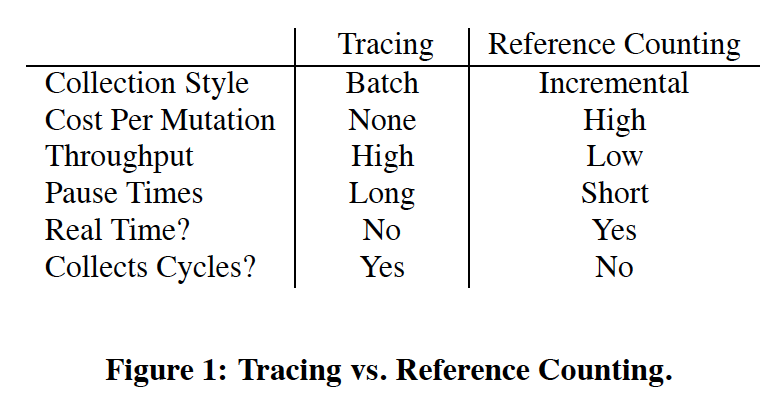
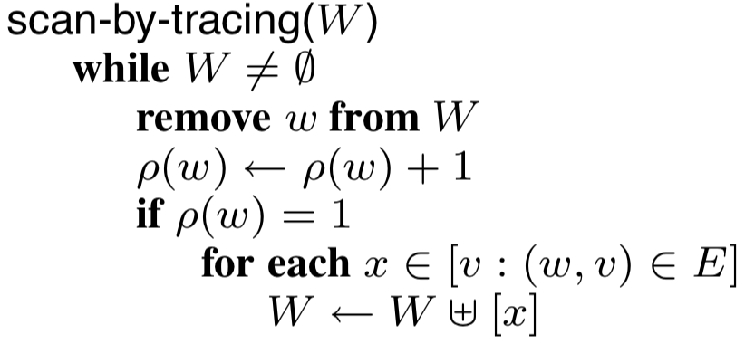
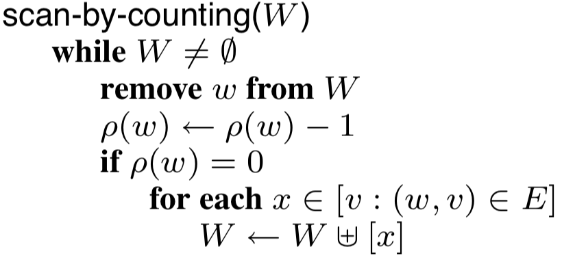
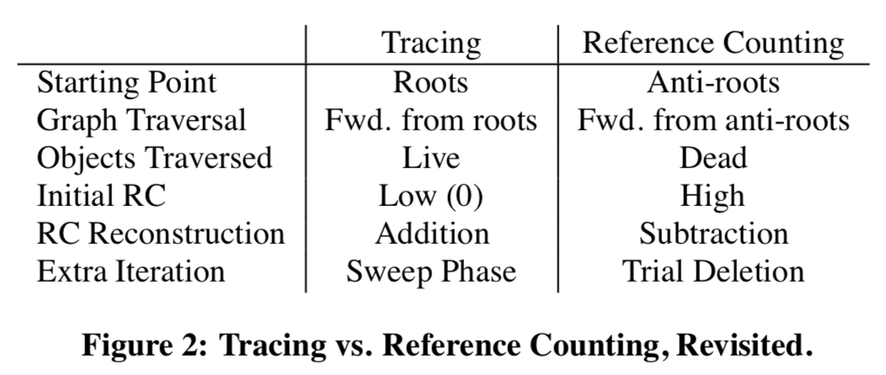
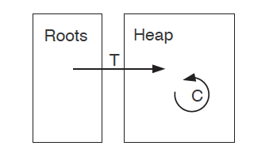
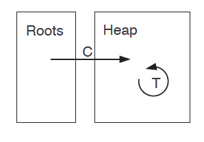
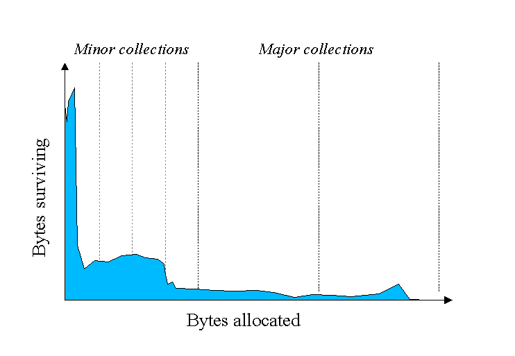
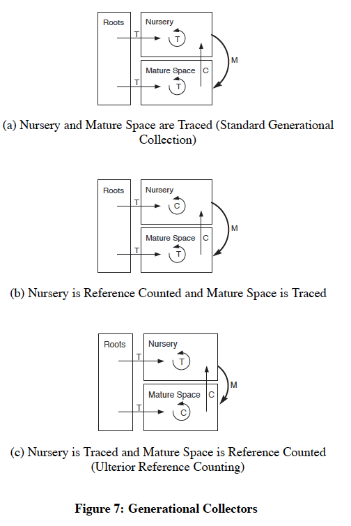

+++
title = "A Unified Theory of Garbage Collection"
[extra]
bio = """
  Mark Anastos is an undergraduate senior studying Computer Science and
  Electrical & Computer Engineering. Qian Huang is an undergraduate junior
  studying Computer Science and Mathematics.
"""
latex = true
[[extra.authors]]
name = "Mark Anastos"
link = "https://github.com/anastos"
[[extra.authors]]
name = "Qian Huang"
+++

## Summary

Tracing and reference counting are normally viewed as two main different approaches to garbage collection. However, in A Unified Theory of Garbage Collection,  Bacon et al. showed tracing and reference counting to be duals of one another, and
that all garbage collectors are various types of hybrids of tracing and reference counting. Intuitively, tracing is tracking the live objects while reference counting is tracking dead objects. 

## Background

Broadly speaking, garbage collection (GC) is a form of automatic memory management. The garbage collector attempts to free the memory blocks occupied by objects that are no longer in use by the program. It relieves programmers from the burden of explicitly freeing allocated memory. Moreover, it also serves as part of the security strategy of languages like Java: in Java virtual machine programmers are unable to accidentally (or purposely) crash the machine by incorrectly freeing memory. The opposite is manual memory management, which is available in C/C++. This gives the maximum freedom for programmers and avoids the potential overhead that affects program performance.

The task garbage collection needs to solve is identifying the objects not accessible by the program in the reference graph. It then frees the unreachable objects and rearranges the memory sometimes to reduce heap fragmentation. 

The most traditional approaches are tracing and reference counting:

- Tracing: Recursively mark reachability by starting from a set of roots memory
  blocks that are in use (e.g. pointed by global variable or local variable
  currently in stack frames).
- Reference Counting: Count the number of pointers pointed to one particular
  object by bookkeeping it every time a pointer is created or modified. It frees
  the object when the counter decreases to zero.

These two approaches have a lot differences:

Although tracing naturally solves the reachability problem accurately, it requires to traverse over a static graph and therefore suspend the whole program. On the other hand, reference counting is done incrementally along with each pointer assignment and collect. However, it brings unnecessary overhead when the pointers are changed often and it does not collect cycles of garbages. Thus people proposed more complicated algorithms based on different hypotheses, such as deferred reference counting, generational garbage collection, etc. 

## Tracing & Reference Counting are Duals

On the high level, tracing is tracking "matter" -- all reachable objects, while reference counting is tracking "anti-matter" -- all unreachable objects. Their connection is further revealed when we align them by removing certain "optimizations". We can consider a version of tracing that computes the number of incoming edges from roots or live objects instead of a single bit; and a version of reference counting that postpones the decrements to be processed on batches. If the graph contains no cycle, both methods would converge to tagging the same value for each object. Tracing achieves this by setting this value to zero and increases it recursively, while reference counting starts from an upper bound and decrements it recursively. 

To formalize this connection, we define the value they converge to mathematically then align their algorithmic structures.

### Mathematical Model

In order to analyze and compare different garbage collection strategies, the
paper presents a mathematical model of the memory management problem that
garbage collection is trying to solve. Objects in memory and the pointers that
they contain are modeled as the nodes and edges of a graph. The set of objects
is denoted as $V$, and the multiset of pointers between objects is $E$. An
object should not be freed if it could be used in the future. A conservative
approximation of this, without any program analysis, is that an object could be
used in the future if there exists a path of pointers to the object which
originates from the stack or from a register. We call the starting points of
such paths (i.e., all objects to which there is a direct pointer on the stack or
in a register) the roots of the graph, which make up the multiset $R$.

Using these definitions, we can formulate the reference counts of objects
(denoted $\rho(v)$ for $v \in V$) as a fixed point of the following equation:

$$ \rho(v) = \big|[v : v \in R]\big| +
             \big|[(w, v) : (w, v) \in E \land \rho(w) > 0]\big| $$

Here we recursively define the reference count of an object $v$ to be the number
of root pointers to $v$ plus the number of pointers to $v$ from objects which
themselves have non-zero reference counts. Any object whose reference count is
zero according a fixed point of $\rho$ can be freed, as there is no way for the
program to reference it in the future.

However, it is important to note that there could be multiple fixed points to
this equation, namely in the presence of cyclic garbage. If object $a$ points to
object $b$, and vice versa, but neither is a root and neither is pointed to from
elsewhere, then, by this formulation, both $\rho(a) = \rho(b) = 1$ and $\rho(a)
= \rho(b) = 0$ are valid solutions. Ideally, a garbage collection algorithm will
find the least fixed point of $\rho$, meaning that it will consider all cyclic
garbage as able to be freed. A tracing collector does this, whereas a reference
counting collector does not detect any cyclic garbage, and thus finds the
greatest fixed point.

### Alignments of Algorithmic Structures

As modeled in the paper, a tracing garbage collector fundamentally works by
performing a traversal on the memory graph, starting from the root objects in
$R$. Every time it reaches an object, it increments its reference count. And,
when it reaches an object for the first time, it traverses the pointers from
that object. In order to complete the traversal, the algorithm maintains a work
list, $W$, of objects that it needs to visit. This traversal recomputes all
reference counts completely each time it runs. When it terminates, every live
object will have a positive reference count, and every dead object will have a
reference count of zero.

This formulation of the algorithm differs in a few ways from a standard tracing
collector. For example, there is no need in a real tracing collector to keep
track of the full reference count of each object; it is sufficient to keep just
a single mark bit which determines whether the reference count is non-zero. A
tracing collector might also employ other optimizations, such as pointer
reversal, to improve its run time or memory usage. However, these optimizations
do not significantly change the core ideas of the algorithm.

Reference counting collection differs from tracing collection in that the
reference counts persist over time and are computed iteratively. The paper
models reference counting collectors to keep a work list as tracing collectors
do. Every time a pointer stored somewhere, its reference count is immediately
incremented. Every time a pointer is overwritten or erased, it is added to the
work list. Then, when the collection algorithm runs, the work list is iterated
through, decrementing the reference count of each object in the list, and, if
this causes the reference count to become zero, adding any objects that are
pointed to by that object to the work list. When this algorithm terminates,
every live object will still have a positive reference count, and the reference
counts of dead objects could be zero (depending on if they are part of a garbage
cycle).

Real implementations of reference counting collection will typically not have a
work list. Instead, they will immediately decrement the reference count whenever
a pointer is overwritten, and, if the reference count becomes zero, recursively
decrement the reference count of anything that is pointed to by that object. The
algorithm is presented in this work-list format in order to more clearly
represent its relationship to tracing garbage collection. Formulated in this
way, if we look at the code for the central work-list algorithms for each type
of garbage collector, we can see striking similarities between them:

 |  
:-------------------------------------:|:--------------------------:
 Graph traversal algorithm for tracing | Work-list algorithm for RC

The only differences between the two are that tracing increments the reference
counts of objects on the worklist whereas RC decrements them, and that tracing
checks if $\rho(w) = 1$ for when to add the objects that $w$ points to whereas
RC checks if $\rho(w) = 0$. The two garbage collection strategies also differ in
how $W$ is initialized. For tracing, $W$ initially contains all of the roots of
the graph, $R$. For reference counting, $W$ starts with all of the objects that
have had a pointer to them erased since the last time the algorithm ran. By
viewing the two strategies through this formulation, we can see that they are
opposites of each other in many ways:

As discussed in the mathematical model part, reference counting requires an extra pass to collect cycles. This is generally be done by two strategies: backup tracing, which traces (part of) the heap occasionally, and trial deletion, which attempts to decrease  $\rho(w)$ by trial-and-error guided by heuristics. However, notice that there is also counterpart for that in tracing: sweeping phase. In addition, while tracing converges to the fixed point value stating from the lower bound 0, reference counting starts from the upper bound, which is all incoming pointers that existed historically. 

## Hybrids

The authors further show that all realistic garbage collectors are in fact hybrids of tracing and reference counting. In general, we can categorize collectors to unified heap collectors, split heap collectors, and multi-heap collectors. Then different garbage collectors can be seen as performing tracing or reference counting when tracking references within each region and across regions.

### Unified Heap collectors: Deferred Reference Counting & Partial Tracing

 |  
:-------------------------:|:-------------------------:
Deferred Reference Counting |  Partial Tracing

Rather than doing reference counting completely, Deferred Reference Counting defers updating the reference count of objects pointed directly by roots until batch processing. This is based on the observation that pointers from roots are likely to change very often as they are directly used in the program. Notice that we can view this as tracing from roots to their targets and reference counting for the intra-heap pointers: All the assignments that lead to intra-heap pointers change would be tracked by reference counting as normal. When we suspend the program, we trace the roots for one level, which compensates for the delay.

Reversely, we could design Partial Tracing, which uses reference counting for edges from roots to heaps while tracing the intr-heap pointers. However, this combines the worse properties of both tracing and reference counting: it suffers from the high mutation cost from the fast-changing of root pointers while still need to spend a long time to trace the heap. This design failure demonstrates that although tracing and reference counting are duals, they are not equally easy to solve under different cases. 

### Split Heap and multi-Heap Collectors

The most common Split-heap collector architecture is Generational collectors. Generational collectors are based on the following empirical observation that most objects are short lived, as shown in the left figure bellow. Here Y axis shows the number of bytes allocated and the X access shows the number of bytes allocated over time. (https://www.oracle.com/webfolder/technetwork/tutorials/obe/java/gc01/index.html)

 |  
:-------------------------:|:-------------------------:
Most objects are short lived  |  Generational collectors

So Generational collectors isolated out a nursery space from the remaining mature space. Most of the time it only collects garbage from this nursery space and moves the remaining alive objects to mature space (minor collections). Once in a while it performs a garbage collection cross the whole heap to clean the mature space (major collections). An example of Generational Collectors is available in https://blogs.msdn.microsoft.com/abhinaba/2009/03/02/back-to-basics-generational-garbage-collection/

This process can also be seen as a combination of tracing and reference counting as shown by (a) in the right figure: Reference counting is performed to track edges from mature space to nursery space. Tracing is performed within nursery space during minor collections. And finally a full tracing is performed during major collections.

We can then explore different combinations of tracing and reference counting within each space. However, notice that reference counting is always used for the edges from mature to nursery space in order to avoid visiting all objects in the mature space. In fact, the authors claim that any algorithm
that collects some subset of objects independently is fundamentally making use of reference counting. 

This conclusion is further used for Multi-heap collectors, which split heaps into multiple regions and collect each region individually. They can be treated asymmetrically (as in Generational collector) or symmetrically. One of the basic extension from Generational collector is the Train algorithm. The train algorithm extended the mature space to multiple regions of different "generations", where only one region is collected at a time. This is mainly for reducing the pause time for collecting the mature space. Specifically, it divides the Mature Object Space(MOS) to cars of fixed size, which are chained to form trains. Each time, the current youngest car will be collected, until the whole first train is collected. We assume that then this process moves on to the next train, but then it is unclear to us why we need several trains instead of one train with all cars?

## Cost Analysis

The paper also presents an abstract mathematical representation for analyzing
and comparing the space and time costs of different garbage collectors. In order
to represent the memory that a garbage collector requires, they define
$\sigma(X)$, for any garbage collector $X$, to be the space overhead of $X$ in
units of the size of a single object. For several of the garbage collectors
discussed in the paper, they give equations or approximations of $\sigma$. As an
example, for a tracing collector, $\sigma(T) \simeq \frac{\mathcal{M}}{\omega} +
\mathcal{D}$, where $\mathcal{M}$ is the capacity of memory in units of the
object size, $\omega$ is the size of an object in bits, and $\mathcal{D}$ is the
space cost of the traversal stack, proportional to the traversal depth. This
model represents a version of tracing collection without pointer reversal, and
hence includes the traversal stack. If pointer reversal were considered,
$\mathcal{D}$ could be removed from the space equation, but this would also
increase the time cost of the collector due to the additional graph traversal
required.

They define $\tau(X)$ to be the time overhead of a garbage collector. For each
collector, they define $\tau$ in terms of a linear function of various
properties of the program, omitting the constant factors that could vary between
implementations. These equatioons for the time and space costs of various
collectors in terms of parameters of the workload enable the comparison of
different collectors to determine how well-suited they are for certain programs
and constraints. While not giving the exact formulations for these properties,
which would be difficult to do in general, the abstracted equations give an idea
of how the space and time of a collector vary with their parameters, and thus
what the important constraints of each are.

## Conclusion

By better understanding the shared structure and duality of tracing and
reference counting collectors, we can consider the design of a high-performance
garbage collector as a balance between the two base strategies. The paper
suggests that the design of a garbage collector involves three major decisions:
how to partition memory, how to traverse memory, and what space-time trade-offs
should be used. The heap can be divided into multiple segments, as with
generational and multi-heap collectors, or can be collected uniformly. Each
component of the heap, as well as the roots of the graph, can then be traversed
and collected through either tracing or reference counting. And within the
implementation of the two strategies there are other space-time trade-offs to
consider as well, such as whether to employ pointer reversal.

Note that in this paper, the authors are mainly concerned with identifying unreachable objects correctly with high performance in terms of speed and space usage, probably because rearranging heap can also be done with memory allocation.

Note that reachable memory leaks are still possible. Although the memory manager can recover unreachable memory, it cannot free memory that is still reachable and therefore potentially still useful. Modern memory managers therefore provide techniques for programmers to semantically mark memory with varying levels of usefulness, which correspond to varying levels of reachability.

There are also other garbage collection e.g. escape analysis, abstract garbage collection (soundly over-approximates the behaviour of a concrete
interpreter.http://drops.dagstuhl.de/opus/volltexte/2019/10802/pdf/LIPIcs-ECOOP-2019-10.pdf 2019) Short-term memory for self-collecting mutators https://dl.acm.org/citation.cfm?id=1993493

