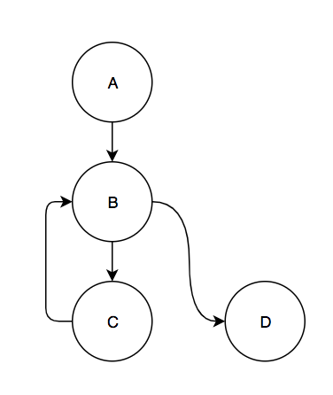
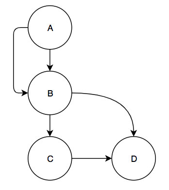
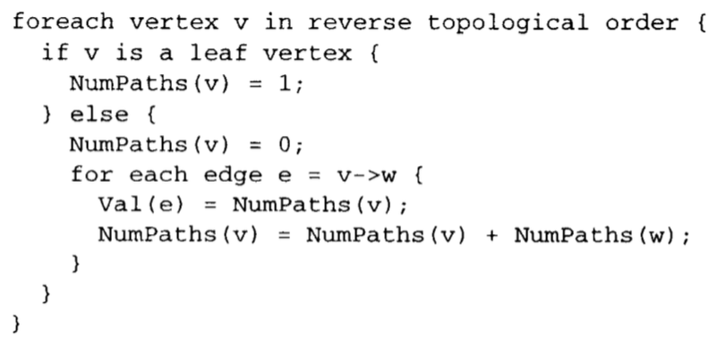
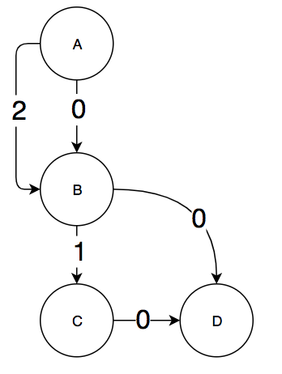
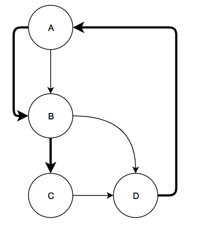
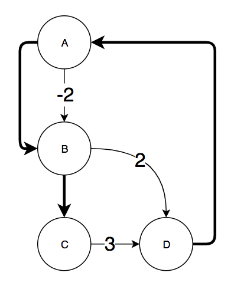
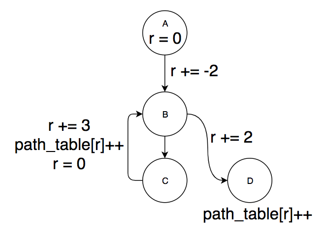
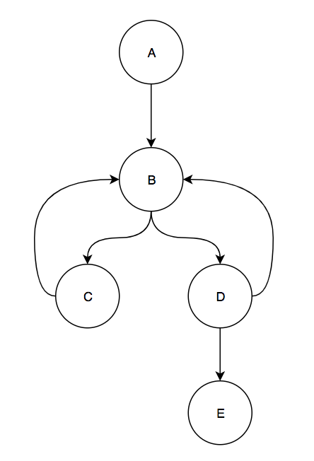
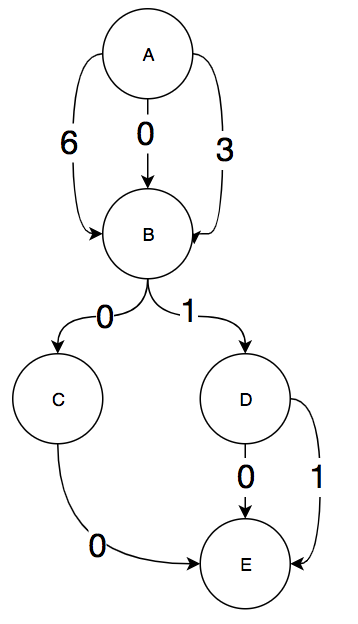

+++
title = "Implementing Efficient Path Profiling"
extra.author = "Daniel Weber"
extra.bio = """
  [Daniel Weber](https://github.com/Dan12) is an MEng student interested in programming languages and distributed systems.
"""
+++

## The Goal

The goal of this project was to implement the path profiling algorithm from the [Efficient Path Profiling](https://dl.acm.org/citation.cfm?id=243857) paper by Thomas Ball and James R. Larus as an LLVM pass. The LLVM pass should generate profiling instrumentation for each function in the source code and then generate a profiling report after the code is finished running.

## Implementation

The paper already gave good explanations and some pseudocode for how to implement the path profiling algorithm. I will now briefly describe what this algorithm is doing. The algorithm presented in the paper assigns a number to each path through a CFG from a designated entry node to a designated exit node. When executing the entry block of the CFG, some instrumentation is inserted to set a path register `r = 0`. Then, the algorithm figures out which edges to add instrumentation to in order to have `r` equal the path number that was taken once execution reaches the exit block of the CFG. Then, some code is added to the exit block of the CFG to increment a value in a path table like so: `path_table[r]++`. While the program is running the instrumentation will accumulate a path profile of the execution of the program through the CFG. Then, when the program exits this information can be saved somewhere and analyzed.

There are a few more details when the algorithm deals with loops. Whenever a back edge is taken the algorithm considers it a termination of the current execution through the CFG and then begins profiling a new execution of the CFG starting from the loop header. For example, consider the following CFG:



There are 4 paths in this graph. There are two that start at block A: A,B,C and A,B,D. The other 2 start at the loop header, block B: B,C and B,D. The source of a back edge is similar to an exit node in that it can terminate a path. Then, the back edge also starts a new path.

### Algorithm steps

The version of the paper's algorithm that I implemented has 6 steps in order to accomplish the above goal on any CFG with back edges. I will also briefly discuss the ways in which this differs from the algorithm in the paper.

First, the algorithm verifies that the CFG has exactly one block with no parents, which it denotes as the entry block, and one node with no children, which it denotes as the exit block.

Second, the algorithm removes all back edges from the CFG and for each back edge it adds two edges: one edge going from the entry block to the destination of the back edge (the loop header) and one edge going from the source of the back edge (the bottom of the loop) to the exit block. This creates a DAG out of the CFG. Adding these two edges allows the algorithm to simply count the number of paths in the graph by counting the number of paths from the entry to exit node in the DAG. This count will include the loop paths from the entry block to the bottom of a loop and the paths that start from loop headers. Sticking with our small graph example from above, this is the DAG that would be created by the algorithm:



Third, the algorithm performs a topological sort of this DAG and then uses the topological sort to compute a mapping `Val` from edges to integers. The `Val` mappings are computed such that each path from the entry block to the exit block has a unique `Val` sum. This is the algorithm for computing `Val` given in the paper:



Informally, for each block `v` in reverse topological order, it is iteratively computing the number of paths from `v` to the exit block by summing the number of paths on blocks `v` is a parent of. For each edge `e` from `v` to a child of `v`, `Val(e)` gets set to the current path count of `v`. There is a proof in the paper of why this algorithm generates a unique `Val` sum for every path through the CFG. An example `Val(e)` mapping is shown for the small sample graph we have been working with:



If we consider one of the edges from A to B to represent the loop back edge, then we get that the val sum of the paths are:

| Path | Val  |
|:-:|:-:|
| A,B,D  | 0 |
| A,B,C  | 1 |
| B,C  | 3 |
| B,D  | 2 |

The edge with `Val = 2` from A to B represents reinitializing the path number register `r` to 2 when we take the back edge in the loop.

Fourth, the algorithm generates a maximum spanning tree of the graph gotten by taking the DAG and adding an edge from the exit to entry node (and also removing the directionality of the edges). This does create a cycle in the graph so it is no longer a DAG but the next step requires the graph to have this edge to work correctly. The maximum spanning tree of the graph is calculated by starting with an empty set of edges and iteratively adding edges as long as no cycle is created. For the small sample graph we have been using, this would be an example of a maximum spanning tree (the bolded edges are the edges in the tree):



Fifth, for every chord of the spanning tree (edge not in the maximum spanning tree) the algorithm computes a mapping `Inc` from edges to instrumentation increment values. The algorithm to do this was specified in another paper referenced by the Efficient Path Profiling paper but is actually quite simple. For every edge `e` not in the maximum spanning tree, there must exist a path through the spanning tree between the two endpoints. We reinterpret edge `e` as a directed edge from some block `u` to some block `v` in the CFG and find the path through the spanning tree from `u` to `v`. We then take the directed sum of all `Val(e')` where `e'` is an edge on the path through the spanning tree. By directed sum, I mean that if in the path we go along edge `e'` in the same direction that `e'` is in in the CFG then we all `Val(e')` to `Inc(e)`. If we go across the edge backwards, we subtract `Val(e')` from `Inc(e)`. Finally, we add `Val((u,v))` to `Inc(e)` to finish the computation of `Inc(e)`. For the sample graph and the maximum spanning tree computed above, this is the `Inc` mapping:



All `Inc` mappings are required to have the same sum on a path `P` through the CFG as the sum of the `Val` mappings for path `P`. The edge with `Inc(e) = -2)` for the edge from A to B was computed by taking the path from B to A in the spanning tree. `Val((A,B))` was 2 but because we traversed the edge backwards, we subtracted 2 from `Inc` of the other edge.

Finally, the algorithm inserts instrumentation according to the `Inc` mapping. For every edge in the original CFG with a non-zero `Inc` value, the instruction `r += Inc(e)` is inserted by creating a new basic block between the source and destination of the edge with that instruction. The block is then inserted into the CFG by rerouting the source's successor to the new block and adding a jump at the end of the new block to the destination block. The entry node adds an instruction to initialize `r=0` and the exit node adds an instruction `path_table[r++]`. Back edges are bit more interesting. For back edges we insert the instruction sequence:

```
r += backedge_inc
path_table[r++]
r = backedge_reset
```

`backedge_inc` is set to `Inc((entry,backedge.dest))`, which is the `Inc` value of the edge from the entry node to the head of the loop containing the back edge. `backedge_reset` is set to `Inc((backedge.source, exit))`, which is the `Inc` value of the edge from the bottom of the loop to the exit block. This was somewhat underspecified in the paper but I believe it makes sense based on their descriptions of what the two inserted edges for each back edge represent. This is the instrumented CFG of the example we have been looking at:



We can verify that our path mappings are preserved by figuring out the value of `r` at the end of every path before we do `path_table[r]++`:

| Path | r  |
|:-:|:-:|
| A,B,D  | 0 |
| A,B,C  | 1 |
| B,C  | 3 |
| B,D  | 2 |

Also, note that this matches the `Val` sum for each path computed above.

### Differences between the paper

First, the paper seems to be a bit misleading when it comes to instrumenting back edges. It seems to imply that whenever you have a back edge that you should always insert the instructions `path_table[r]++; r = 0`. However, as the above simple example showed and the edge cases below will show, it actually needs to be a bit more complex than just increment and reset `r` to 0. The edge cases analyzed below will hopefully show that the following code snippet is actually what back edges should be instrumented with:

```
r += backedge_inc
path_table[r++]
r = backedge_reset
```

I also diverged from the paper when constructing the maximum spanning tree. The authors used existing edge profiling information to estimate the cost of instrumenting an edge. Because instrumentation is only placed on the chords of the maximum spanning tree, those will be the edges least likely to be taken. When I construct the maximum spanning tree, I don't assume any prior profiling information and assume that each edge is equally likely to be taken. This produces an instrumentation with minimal edges but not necessarily the edges that are taken the least. I felt like this was an acceptable compromise in order to keep this project fairly self contained and not rely on importing information from an edge profiler.

The paper also introduces a few optimizations for instrumentation placement that I felt were not necessary to implement for this project. Specifically, it discusses moving the initialization of the path number register `r` from the entry block to the edges that are uniquely reached from the entry node. Additionally, they move the path table count increment up to the edge which uniquely reaches the exit node on every path.

### Difficulties and edge cases in the implementation

There were a few parts of the algorithm that were underspecified in the paper that caused some edge cases and lead to some interesting implementation details. The main thing was that the DAG that was created after removing the back edges and inserting the 2 new edges was a multigraph, which means that there could be multiple edges with the same source and destination block. This meant that edges could not be uniquely identified with their source and destination blocks. Furthermore, because edges in the DAG corresponded directly to edges in the CFG, I needed a way to link edges in different graphs together. This lead to a representation of a graph as a list of edge structs, where each edge struct contained a source and destination pointer as well as some additional data if the edge represented a back edge. This representation sacrifices efficiency since child and parent lookups are now O(m) (where m is the number of edges) but I believe it makes up for that by being easy to use for the implementation of the path profiling instrumentation algorithm. Specifically, different graphs (like the CFG and the DAG) could have different lists but the elements in those lists were the same, which made it easy to match the edges in the `Inc` mapping to edges in the CFG (since they were the same edge structs). If, for example, I had chosen to represent the multigraph with a map from basic blocks to a list of the children of that basic block, then it would be difficult to match edges between two modified version of the same graph. In the end, this representation made the implementation quite clean so I was happy with the representation.

One other edge case that I uncovered was how to correctly deal with chords of the maximum spanning tree that had the same source and destination blocks. Consider the following CFG:



When we remove the 2 back edges from C to B and D to B, insert the necessary edges for the back edges, and compute the `Val` mapping for the resulting graph we get:



If we use this `Val` mapping as the `Inc` mapping then we encounter 2 cases not covered in the paper. The first is that we have a loop header (block B) with 2 back edges pointing to it. If we follow the algorithm that I implemented, then we get that we need to reset `r` to 6 if we go along the back edge from C to B and we reset `r` to 3 if we take the back edge from D to B. This means that the path from B to C can have 2 possible mappings, 3 or 6, depending on which back edge you took to get to the top of the loop. Initially, I thought that this might be some kind of bug in the algorithm and that the algorithm should only insert the entry to loop header edge if it didn't already exist. Then you would only get a single reset value when taking any back edge to the loop header and then the path from B to C would have a single value. However, I realized that these 2 mappings for the same path actually do capture important path information: they describe how you entered a path. In the above example, if path 3 gets incremented then I know I took the path from block B to C and I entered this path by taking the back edge from block D to B. If path 6 gets incremented, then I know that I took the path from B to C but that I entered that path by taking a back edge from C to B. This path entry information might be useful for some kind of profile driven optimization or if you are worried about path coverage. This also shows why non-zero resets are necessary. If the back edge from C to B reset `r` to zero, then path B,C would have the same value in `r` as path A,B,C.

The second case is when there are 2 edges from a block to the exit block. This happens with block D. There are two edges, one of them a back edge from D to the exit block in the DAG. In the paper it was not specified what to do if a back edge had an `Inc` value. It seems to imply that you just ignore the value. But if we do this and instrument the back edge from D to B with just `path_table[r]++; r = 3` then path B,D and path B,D,E have the same `r` value: 4. This is clearly incorrect, since they are 2 different paths. This means that we need to add `r+=1` on the back edge from D to B before incrementing the count in `path_table`. These two observations are what lead me to my modified version of the back edge instrumentation that I presented above:

```
r += backedge_inc
path_table[r++]
r = backedge_reset
```

I believe this is the correct instrumentation based on the examples and reasons given above.

## Evaluation

My evaluation consisted of 2 parts. In the first part I developed some programs that were edge cases for the algorithm and verified that the algorithm behaved as expected. The second part was TODO

### Correctness Tests


### Performance Tests