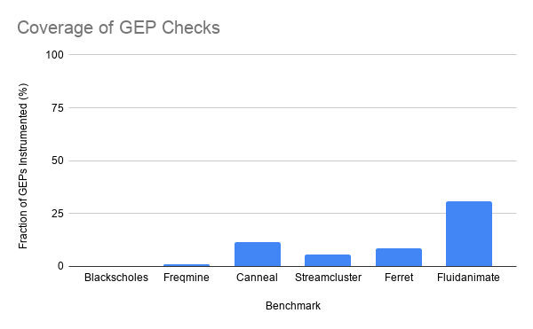

+++
title = "Making LLVM Address Calculation Safe(r)"
extra.author = "Drew Zagieboylo"
extra.bio = """
  [Drew Zagieboylo](https://www.cs.cornell.edu/~dzag/) is a 3rd year PhD student researching Security, Hardware Design, and Programming Languages. He enjoys rock climbing and gaming in his free time.
"""
+++

# Memory Safety in LLVM

LLVM IR code is not generally memory safe.
While certain *obviously bad* behaviors are
disallowed, it is not hard to write code that
may execute out-of-bounds memory accesses at runtime.

For instance, the size of an
array may be statically known,
but the access index may be unknown at compile time:

```C
int foo(int x) {
    int tmp[10];
    ...//some code to set values in tmp
    return tmp[x];
}
```
In this project we seek to improve the memory
safety of LLVM programs by inserting dynamic bounds
checks at runtime that cause the program to stop
executing rather than violate memory safety.
After running our compilation pass the aforementioned
code would have the following runtime behavior:

```C
int foo(int x) {
    int tmp[10];
    ...//some code to set values in tmp
    if (x >= 0 && x < 10) {
       return tmp[x];
    } else {
       exit(1);
    }
}
```
### LLVM Address Calculation

When compiling high level array and struct access to LLVM code, compilers
generally use the [getelementptr](https://llvm.org/docs/GetElementPtr.html)
(or GEP) instruction to calculate offsets into these memory allocations.
GEP instructions have the nice property that they are type aware; offsets are phrased
in terms of "number of elements" rather than "number of bytes."
For example, the code in this stub dereferences some memory in
the middle of a struct (specifically the last element of the `b` field).

```C
struct EX {
  int a;
  char b[3];
  int *c;
}

struct X;
...
return X->b[2];
```

In LLVM, we could write a single GEP instruction to calculate
the correct offset into the struct and then execute a `load` instruction
to actually dereference the pointer.

```C
%1 = getelementptr %struct.EX,  %struct.EX* %X, i64 0, i32 1, i64 2
%2 = load i8, i8* %1
ret %2
```

This functionality makes GEP an ideal point for analyzing out-of-bounds accesses.
Before a program might make an out-of-bounds access it has to
acquire an out-of-bounds pointer. Usually, this means it
executes a GEP whose result will then later be the argument of a
load or store operation.

Our approach in this implementation is to prevent the execution of
any runtime GEP instructions that might lead to
illegal memory accesses.
*If a program can never acquire an out-of-bounds pointer,
it can't violate memory safety.*

### Making GEP Safe(r)

Let's go back to our first example of an out of bounds array access:

```C
int tmp[10];
...
return tmp[x];
```

The return statement roughly translates to:

```C
%addr = getelementptr [10 x i32], [10 x i32]* %tmp, i64 0, i64 %x;
%val = load i32, i32* %addr;
ret %addr;
```

In order to insert a dynamic check for memory safety, there
are two things we need to know:

 - What is the *actual* access index value?
 - What are **legal** access index values?

Happily, when considering GEP instructions, the first question is easy
to answer; each operand represents an access index
value. We can dynamically insert instructions into the program that compare
those operands to other values.

The second question is a much more difficult problem,
whose subtleties we'll address in the next section.
For the most part though, we leverage LLVM's type
information. Based on its type annotation, we know
 that `%tmp` points to an array with 10 32-bit integers (notated as `[10 x i32]`).
Therefore, we can conclude that the only valid values for `%x` are
between 0 (inclusive) and 10 (exclusive).

To execute this check completely, we need to check that *all* index operands
are legal. You may have noticed that our prior example actually has **two**
index operands; we have to check both that `tmp` points to at least one
integer array of size 10, *and* that `x` is a valid index for such an array.

In general our algorithm for modifying LLVM code is this:

```
1) Initialize the current type to be the type of the first operand.
2) Initialize current operand to the first index operand.
3) If possible, insert instructions to check if current operand is in bounds based on current type.
4) Set current type to the next element type (e.g. if current type is *int[] the next type is int[]).
5) If there are no more index operands, exit.
   Else, set the current operand to the next in the operand list and goto (3).
```

### GEP Checking: A Walkthrough

In this section we'll walkthrough the above example in excruciating detail.
Feel free to skip ahead to [the next section](#pointer-sizes-and-tracking-allocations)
if you're an expert in how `getelementptr` works and/or the above algorithm makes intuitive sense.

The main complicating part of the above algorithm is how to compute the next element type.
Based on the possible types that GEP expects there are only a few cases to handle.
Intuitively, each type represents a container in some way and "indexing" into it
should get us the type contained by the outer one.

| Type | Next Element Type | Notes |
|------|-------------------|----------|
| t*   | t                 | For pointers, the next type is the type being pointed to |
| [ size x t ] | t          | For arrays, the next type is the array element type |
| < size x t > | t | Vectors, like arrays, have an element type |
| struct { f1, f2,...,fn } | fi | i is the index value, LLVM requires this is a compile time constant |


Checking the instruction: 
`%addr = getelementptr [10 x i32], [10 x i32]* %tmp, i64 0, i64 %x;`

```C
PointerSource = %tmp;
CurrentType = [10 x i32]*;
CurrentOp = i64 0;

//Get the max offset for accessing %tmp. Since %tmp was generated with
// %tmp = alloca [10 x i32]
//We know that %tmp points to only 1 integer array
NumElements = 1;
InsertCheck(CurrentOp >= 0 && CurrentOp < NumElements); // (0 >= 0 && 0 < 1)
//Our implementation will actually automatically omit this
//check since it can be easily statically determined to be `true`

CurrentType = NextElementType(CurrentType); //[10 x i32]
CurrentOp = i32 %x;

NumElements = 10 // retrieved from the type [10 x i32]
InsertCheck(CurrentOp >= 0 && CurrentOp < NumElements); // (x >= 0 && x < 10)

CurrentOp = <none>;
//Done!
```

## Pointer Sizes and Tracking Allocations

In the above examples, we could always tell how big our memory allocations
were since they were allocated with static sizes. `int tmp[10]` comprises of
two static allocations: 1) a single pointer-sized memory cell (to contain the local variable `tmp`); 2) a memory cell
containing 10 integers (the memory pointed to by `tmp`).

In many cases, the sizes of arrays may be difficult or impossible to determine at compile
time. Consider the following snippet:

```C
int foo(int x, y) {
    int tmp[x];
    ... //init values in tmp
    return tmp[y];
}
```
In the corresponding LLVM code, the type of `tmp` is no longer a sized type;
it is just `i32*`. We can no longer use types to help us determine what
are and are not legal offsets. In this case, however, there is something
that we can do. LLVM uses [`alloca`](https://llvm.org/docs/LangRef.html#alloca-instruction)
instructions to allocate local variables. `alloca` takes an argument to
determine how many elements must be allocated. If we keep track of the
sizes of local allocations we can infer that the above code is safe if and only if:

```C
0 <= y < x //we'll assume x > 0 here
```

In our implementation, we simply keep around a map from allocaitons to their sizes.
Additionally, we track heap allocations by scanning for function calls to `malloc`.
This allows us to calculate maximum pointer index values for GEP instructions
where the types are unsized. Unfortunately, this is rather imprecise since
it tracks *exact* value dependencies and doesn't keep track of other ways
a pointer may be passed to a GEP. For instance, spilling a value to memory
and then re-loading it will cause our analysis to lose track of the original
allocation. 

Additionally, we run our transformation as a function pass so
it doesn't track interprocedural allocations. The main
reason for this limitation is that, even if we knew
the original allocation size for all callers, we would
have to modify the function signature to communicate
legal index values from the caller.
This seemed both out of scope for our current project
and a potentially questionable design decision. Should
a compiler pass be modifying the signatures of
potentially every function?

Consequently, our pass is unable to improve the
memory safety of this function:
```C
int foo(int* x, int y) {
    return x[y];
}
```

We had hoped to use LLVM's alias analysis or copy propagation tools
to increase the precision of allocation tracking. However, we couldn't get
these to work; they were difficult to integrate and didn't seem to track
pointer value propagation as we expected them to. LLVM's relatively new
[MemorySSA](https://llvm.org/docs/MemorySSA.html) analysis seemed very
promising, since their example code finds domination relationships between
memory uses and definitions. This would allow us to, at least for some cases,
track allocation size information transitively through pointer reads and writes.
However, the implementation is less precise than the documentation lets on
and does not find accurate enough relationships to identify the root allocation
for any pointers in practice.

### Bitcasting
Additionally, `bitcast` instructions complicate this process
even more, since they cause the "sizes" of memory allocations to
be interpreted differently.

```C
%1 = alloca i32, i64 10
%2 = bitcast i32* %1 to i8*
```

Since 4 `i8` values fit into one `i32`, the allocation of `%2` represents a totally
different number of elements than `%1` even though they represent the result of the
same allocation operation.
In the above code, a GEP that uses `%1` can safely index into elements 0 to 9.
However, a GEP that uses `%2` as the base can safely index into elements 0 to 31.
For any bitcast instruction that casts an allocation of known size, we convert
and track the size of the new value, using integer multiplication and division
to soundly approximate the maximum safe index. For typical bitcasts (e.g. `char` to `int`)
this will not lose precision; however LLVM does have arbitrary precision integers,
which could cause this estimate of allocation size to be an underestimate.


## Soundness and Completeness

Often, when trying to ensure a safety
property you'd like to show that your results are either *sound* or *complete*.
In our case, soundness would imply that any LLVM program which uses no
"type unsafe" features and is compiled with our pass 
executes *no GEP instructions which would generate out-of-bounds pointers*.
Completeness, on the other hand, would imply that we can compile
all programs and allow them to execute.

Typically, you cannot achieve both soundness and completeness simultaneously;
although, the use of code transformation to insert runtime checks does make
this tractable for some problems. Our solution achieves only completeness and
not soundness; we allow all programs to execute by skipping checks where we
cannot determine the legal index bounds. A simple *sound alternative* would be to
simply reject any programs that fit the above criteria; by placing an unconditional
exit in front of any such GEP instruction we could ensure safety but would prevent
some safe programs from executing.

### A Note on Soundness

Soundness for our problem isn't really achievable without some
assumptions about the behavior of LLVM programs oustide of the GEP instructions
(*or without a much more complex interprocedural analysis*).

To highlight one of the reasons for this, consider the following LLVM program:

```C
%1 = alloca [10 x i32]
%2 = bitcast [10 x i32]* %1 to [11 x i32]*
%3 = getelementptr [11 x i32], [11 x i32]* %2, i64 0, i64 %x
```

The above LLVM code is totally legal and will compile using standard
LLVM tools. However, this example invalidates the assumption that our
pass uses to ensure GEP safety.

To be clear, `%1` is a pointer to an array of 10 32-bit integers, 
but the next instruction copies that same pointer value into `%2`
while treating it as a pointer to *11* 32-bit integers.

When our pass analyses `%3` it will insert the following bounds
check for `%x`:

```C
0 <= %x < 11
```
Executions where `%x == 10` will cause memory safety violations.
We consider such behaviors outside the scope of this project
and assume that the LLVM types for the arguments to the GEP
instruction reflect accurate allocations of memory. This assumption
is what we mean by not using "type unsafe" features.

## Evaluation

To evaluate the utility of our pass,
we took a selection of [PARSEC](https://parsec.cs.princeton.edu/)
benchmarks and considered both: 1) How often we failed to determine the
legal bounds for a pointer; and 2) How much runtime overhead we inccured
with our dynamic checks. Furthermore, we ran a number of microbenchmarks
to ensure that our pass was properly instrumenting code in the absence
of the soundness problems that we mentioned above.

We chose benchmarks primarily by the ones that we could get
to compile most easily, so they may not be reflective of as
wide a range of behaviors as possible. We maintained the
same compiler flags used in the original suite, specifically
using the `-O3` optimization flag. For an apples to apples comparison
the "Baseline" uses Clang to compile but does not run our transformation
pass. The "Instrumented" code is generated by running our pass after `-O3` optimization but
does not run any further optimizations. Therefore, any overheads we find
should be considered upper bounds as optimization may remove some of
them or improve how they are calculated.

We ran the benchmarks a total of 10 times each and
calculate both the average and standard deviation of execution time.
These were executed on a Intel(R) Core(TM) i7-7700 CPU @ 3.60GHz,
with 32GB of RAM and only one thread allocated per execution.
The reported execution times are based off of the built-in PARSEC
*region of interest* measures which only report execution of the
hot loop and omit initialization and clean up times.

### Evaluation: Precision

In all of the PARSEC programs we benchmarked, we failed to
instrument *most* of the unsafe memory acceses. As you can see by
the graph below, in the best case (Fluidanimate) we managed to instrument 30%
of GEP instructions, while in the worst we added *no runtime checks* (Blackscholes).



Based on our manual observation of the compiled code and testing
our instrumentation with microbenchmarks, we believe this lack of
precision stems from two main sources:
 - Pointers allocated outside function scope (arguments and global variables)
 - Allocation information loss due to operations on pointer variables

As mentioned previously, the former is difficult to deal with
as an IR compiler pass since a general solution would require
modifying function signatures to pass allocation size information.

The latter problem stems primarily from three operations: `load`, `store` and `getelementptr`.
While complications arising from GEPs are straightforward to solve (since that's already an instruction
we're instrumenting already), without precise memory dependency and alias analyses,
we cannot track allocation sizes of pointers derived from other pointers.
The most common case we noticed, anecdotally,
were global pointers to data that were "malloced" at the beginning of the `main` function,
but accessed throughout the program.

For instance, take the **Blackscholes** benchmark, for which we instrumented *no* GEP instructions.
It has a global pointer to an array of `floats` called `prices`, whose size is determined during
the beginning of execution:

```C
fptype *prices;
...
main() {
   ...
   prices = (fptype*)malloc(numOptions*sizeof(fptype));
   ...
}
```

The above allocation translates to the following LLVM IR:
```C
%46 = tail call noalias i8* @malloc(i64 %45) #9
store i8* %46, i8** bitcast (float** @prices to i8**), align 8
```

Our analysis determined that the runtime size of the memory pointed to
by `%46` was given by the value `%45`.
However, `%46` is not used as the argument to any GEP instruction, instead
later operations use a `load` to retrieve the array pointer from `prices`.

```C
%179 = load float*, float** @prices, align 8
%180 = getelementptr inbounds float, float* %179, i64 %159
```

Since we are not running a memory dependency analysis we could
not determine that the size of the allocation pointed to by `%179` was `%45`.

Often, these two problems combined, since `prices` may be accessed
outside the scope at which `%45` is available and we therefore would need
to modify the program to communicate this allocation information (potentially
via an extra global variable).


### Evaluation: Overhead

We measured runtime overhead in terms of wall clock time purely because it
was the simplest thing to instrument. In the following graph we report the
average slowdown caused by our instrumentation (lower is better). At the end
of this section is a graph reporting our base results (rather than the ratio)
which reports the mean runtime for both configurations. Error bars on that
graph represent one standard deviation.


In the case of the Ferret benchmark, our instrumentation caused the implementation
to exit prematurely. Since the benchmark is quite large we did not have time to investigate
why this was; it is possible that Ferret intentionally executes "unsafe" GEP instructions.
Since our instrumentation did not cause bugs in any of the other implementations we find
this to be a likely cause, but it does warrant further examination.


Interestingly, the instrumented Canneal and Streamcluster benchmarks run ever so slightly
faster, however this result is within the standard deviation and could
also be influenced by effects covered in the [first blog for this course](../measurement).
Without running any real statistics, it seems like the instrumentation only had a meaningful
impact on the Fluidanimate benchmark. Somewhat unsurprisingly, this is also the benchmark
for which we managed to instrument the most GEP instructions.

Intuitively, our instrumentation *should* add runtime overhead which scales with
the number of GEPs and the number of times each of those GEPs are executed. It would
have been interesting to determine how "hot" each GEP instruction was and drill
down into where the overhead was coming from. That would have involved much
more invasive profiling which we did not implement.


