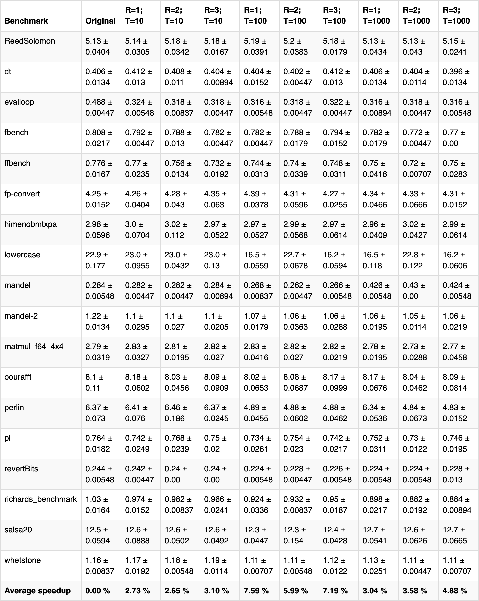

+++
title = "LLVM Function Inlining Pass"
[extra]
bio = """
  Gautam Mekkat and Mark Anastos are undergraduate seniors studying Computer
  Science and Electrical & Computer Engineering.
"""
[[extra.authors]]
name = "Gautam Mekkat"
link = "https://github.com/Blue9"
[[extra.authors]]
name = "Mark Anastos"
link = "https://github.com/anastos"
+++

It is a common convention in computer programming to abstract out repeated
functionality in a program into procedures, so that it can be referenced
multiple times without having to repeat the code. Separating out code in this
way can increase the legibility and modularity of the program, but comes at a
cost. Namely, function calls in programs can introduce a major runtime
performance overhead due to the costs of entering and exiting functions.
Typically, when a function is called, a new stack frame will need to be created
and the instruction pointer will need to be moved to the beginning of that
function—which may or may not be in the instruction cache—among other
function-initialization tasks. Also, some of the state of the calling function
(e.g., caller-saved registers) will need to be stored in preparation for the
call, such that it will not be overwritten by the called function. Separating
out functions also gives the compiler less information for optimizing the
program, because when looking at a function, the compiler cannot be sure of the
context that it will be running in. As such, it is often beneficial for
compilers to be able to get rid of function calls.

Function inlining is a classic compiler optimization that does exactly this; it
replaces calls in code with the body of the called function in order to remove
the overhead of making the call at runtime. In this project we implemented and
evaluated the effects of a function inlining pass which runs on programs in the
LLVM intermediate representation (IR).

## Design

To properly inline a function call without breaking the program, there are
several considerations that must be made. As a first approximation, the call
instruction is erased, and all of the instructions in the function that was
called are put in its place. Any arguments or return values in the call must
then be handled. Uses of the arguments in the inlined function now need to refer
to the actual values that were provided in the call instruction. Due to the
possibility of multiple return instructions in the function, handling the data
flow and control flow for exiting the inlined function is a bit more
complicated. All return instructions are replaced with unconditional branches to
the block which immediately followed the call in the parent function. A phi node
is inserted into that block to coalesce the values from all of the return
instructions into a single place, which then can be used whereever the returned
value was used in the parent function. The LLVM API provides the function
`llvm::InlineFunction` which handles completing these operations. In general,
you would also need to handle naming collisions between variables in the caller
and callee functions. However, because the LLVM IR is in static single
assignment (SSA) form, and data dependencies are represented explicitly through
pointers, this is not a concern.

With a method for inlining in place, the next step is to determine when we want
to inline calls. Some function calls can be immediately eliminated from
consideration because they would be impossible to inline correctly. For example,
functions not defined locally cannot be inlined, as their implementations are
unknown. Also, functions that include indirect branch instructions may directly
address locations, and if they do, they cannot be inlined, as doing so could
cause the indirect branches to go to unexpected positions in the program.

Even if a function is able to be inlined without breaking the semantics of the
program, it still may not be beneficial to do so. For one, inlining functions
with large numbers of instructions can have a significant impact on the code
size of the program. As such, the space-time tradeoff must be considered before
inlining every function call. Also, duplicating code in this way can reduce the
temporal locality and thus the performance of the instruction cache.
Consequently, it is typically most beneficial for overall performance to inline
smaller functions and leave the larger ones as calls. In our implementation, we
decided to only inline functions whose instruction counts are below a constant
threshold. In the evaluation we discuss how the exact value of this threshold
affects the program performance. In general, more sophisticated heuristics could
be used to determine when to inline a function call in order to better optimize
the space-time tradeoff, such as considering the hotness of the call instruction
from profiling data. A call to a large function which is executed frequently
could be more beneficial to inline than a call to a small function that is
rarely reached.

Our function inlining pass runs through each of the function calls in the
original program and decides whether or not to inline them. As such, it never
gets caught in a loop trying to inline a recursive function. However, there are
cases when it is beneficial to inline deeply (i.e., inline calls that were
created from the inlining of another call). As such, our implementation provides
the capability to iterate through the program multiple times. In the evaluation,
we consider the effect that multiple iterations have on program performance.

## Evaluation

We ran our optimization on a subset of programs from the [LLVM test suite][].
Specifically, we focused on single-source programs in the [Misc folder][].

[LLVM test suite]: https://github.com/llvm/llvm-test-suite
[Misc folder]: https://github.com/llvm/llvm-test-suite/tree/master/SingleSource/Benchmarks/Misc

We benchmarked programs by measuring the total running time of each program. We
ran each benchmark test with varying function size thresholds and recursive
inlining levels to determine their effects on program performance. All benchmark
programs were run on a 2.90GHz Intel(R) Core(TM) i9-8950HK CPU with 32 GB 2400
MHz DDR4 RAM, and they were run five times. Average running times along with
standard deviations are shown below. "R" refers to the recursive inlining level
(e.g., "R=2" means that the inlining pass was run twice), and "T" refers to the
function size threshold in terms of LLVM instructions (e.g., "T=100" means that
all functions that translate to at most 100 LLVM instructions are inlined).

As seen above, function inlining usually improves the performance of the
benchmark programs, but there is no clear overall trend. For some benchmarks,
increasing the function size threshold (for a constant recursive inlining level)
improves performance. This is seen in "evalloop," "fbench," "mandel-2," and a
few other benchmarks. However, in other cases, increasing the function size
threshold decreased performance. This is seen in "ReedSolomon," "fp-convert,"
and several others. This variability in performance is likely due to the
unpredictable effects of function inlining. In some cases, function inlining may
improve performance due to the reduced number of stack allocations for function
calls. However, function inlining might cause page thrashing, in which chunks of
code are constantly swapped in and out of virtual memory. From our benchmarks,
it seems that the average speedup is optimal at R = 1 and T = 100, with a 7.59%
performance improvement. That being said, each individual benchmark's
performance distribution varies quite a bit, and it would be naive to draw
conclusions from the average metrics.

Another important factor to consider with this optimization is code size. On
average, function inlining increased code size by about 20% (in terms of LLVM
instructions), and in some cases, bloated program size by almost 150%. There is
not a clear correlation between the inlining parameters and program size, since
the changes in code size are highly dependent on the programs themselves.
Overall, the space-time tradeoff seems reasonable, and if program performance is
crucial, the ~5-10% speedup may be worth a 100% increase in code size.

Ultimately, from the benchmarks, it seems that there are no universal optimal
function inlining parameters, and that each program requires manual
experimentation to determine optimal function inlining parameters. For future
work, it would be interesting to investigate a more complex cost model than
function size. For example, taking into account the number of function
parameters and whether the function is recursive or not could be interesting. It
would also be interesting to take a profile-guided approach to this optimization
by inlining "hot" functions and seeing the effect on program performance.
