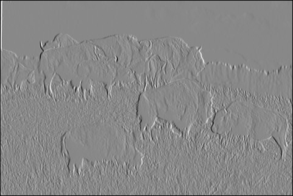
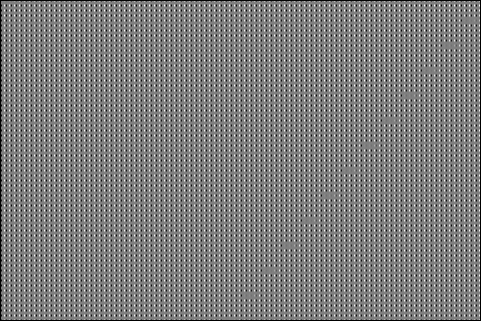
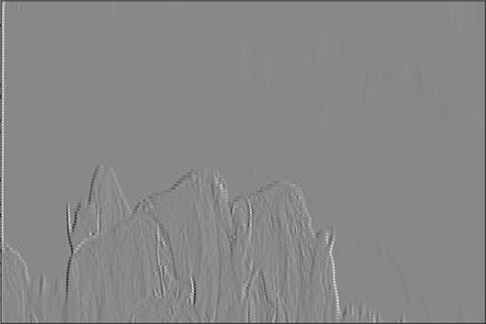
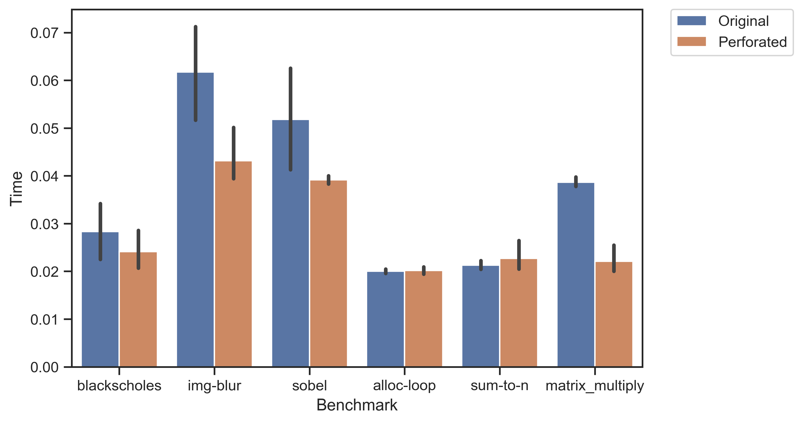
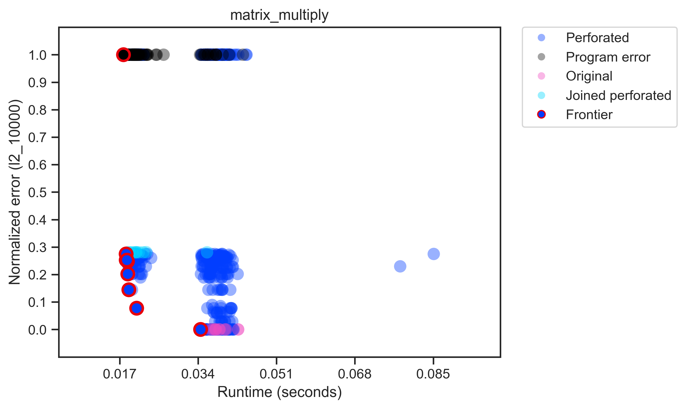

+++
title = "Loop Perforation"
[extra]
bio = """
  [Oliver][] is a CS PhD student in theory at Cornell, who does decision theory and category theory.

  [Alexa][] is a second-year student interested in the intersection of compilers and formal methods. She also enjoys feminist book clubs and cooking elaborate [fish truck][] meals.

  [Greg][] is a second-year student working on machine learning and digital humanities.

[alexa]: https://www.cs.cornell.edu/~avh
[greg]: https://www.cs.cornell.edu/~gyauney
[oliver]: https://www.cs.cornell.edu/~oli
[fish truck]: https://www.triphammermarketplace.com/events/
"""
latex = true

[[extra.authors]]
name = "Oliver Richardson"
link = "https://www.cs.cornell.edu/~oli"
[[extra.authors]]
name = "Alexa VanHattum"
link = "https://www.cs.cornell.edu/~avh"
[[extra.authors]]
name = "Gregory Yauney"
link = "https://www.cs.cornell.edu/~gyauney"
+++

Have you ever been frustrated that your code takes too long to run?
Do you have a sneaking suspicion that most of the time is spent in loops?
Have you ever considered just _running fewer loops_ by having your compiler mangle your code to skip arbitrary loop iterations?

Welcome to [loop perforation][loopperf], an idea that sounds so ludicrous that we can barely believe it actually works at all!

The basic premise is common across the field of [approximate computing][approx]: many applications spend a lot of time and energy getting results that are _exactly_ right, when they could happily get away with results that are _mostly_ right.
If a programmer is able to define what exactly "mostly right" means for their particular application, then approximate computing techniques allow them to explore trading off cost and correctness.
The original [loop perforation paper][paper], "Managing Performance vs. Accuracy Trade-offs with Loop Perforation", from ESEC/FSE’11, takes this idea to a beautifully flippant extreme: look at some loops, and replace something like `i++` with `i += 2` or even `i += 21`.
Skipping loops like this almost definitely makes your code both faster and more energy efficient (assuming it still runs!).

For this project, we set out to implement simple loop perforation as a [LLVM][] pass, with the goal of a richer exploration into what it means to actually accept worse accuracy from our programs in this domain.


[loopperf]: https://en.wikipedia.org/wiki/Loop_perforation
[approx]:https://en.wikipedia.org/wiki/Approximate_computing
[llvm]: https://llvm.org

## What We Did

LLVM is an industrial-strength compiler that structures optimizations as a series of passes that both act on and produce a human-readable intermediate representation.

We implemented two new LLVM passes:

1. `LoopCountPass`, a function pass that identifies and saves which program loops are candidates for perforation.
2. `LoopPerforationPass`, a loop pass that perforates loops at a specified rate.

Both passes work in conjunction with additional infrastructure:

1. An external driver program, written in Python.
2. User-provided representative inputs.
3. User-defined accuracy/error metrics.

You can find our implementation [here][repo].

[repo]: https://github.com/avanhatt/llvm-loop-perforation

## A Meandering Tour of Loop Perforation

To understand the interplay between our LLVM pass, the user-defined error metrics, and the python driver, let's consider a toy example.

Say we want to write a silly function that sums the integers from 0 to some number `n`:

```
int sum_to_n(int n) {
    int sum = 0;
    for (int i = 0; i < n; i++) {
       sum += i;
    }
    return sum;
}

int main(int argc, char const *argv[]) {
    printf("%d\n", sum_to_n(5));
}
```

You can imagine that perforating the loop here is a _pretty_ bad idea: this implementation doesn't have a ton of wiggle room in getting a totally correct result.
However, if we suspend disbelief for a moment and imagine that some poor soul only cares about the _order of magnitude_ of the resulting sum, then perforating this loop becomes an interesting task.

Conceptually, the driver just needs to take in the `sum_to_n` implementation and some oracle that can answer the question: "is this perforated implementation _good enough_?"
(For more complicated applications, the driver also needs a representative input, but for this example the executable takes no arguments.)
So, let's also tell the driver how wrong the ultimate answer can be.

To do this, we require a python implementation of an `errors` module.
At a high level, `errors` should tell the driver 1) what error metrics we care about for this application, and 2) a float value between 0 and 1 for each metric (0 is perfect, 1 is unacceptable).
For `sum_to_n`, let's define a single error metric that's the ratio between our new sum answer and the correct answer:

```
# Provide the name of each metric we care about
error_names = ["error_ratio"]

# The arguments `standard_fn` and `perforated_fn` are filenames of output files
def error(standard_fn, perforated_fn):
    standard = int(get_contents(standard_fn))
    perforated = int(get_contents(perforated_fn))

    delta = abs(standard - perforated)
    ratio = delta / standard

    return {"error_ratio" : ratio}
```

Now, we can hand off this little application to the driver, to determine which loops it can successfully perforate. The driver takes an argument for what level of error is acceptable; we said we cared about the order of magnitude, so let's say the error can be 50% and we'd still be happy:

```
$ python3 driver.py tests/sum_to_n -e 0.5
```

Let's walk through what happens now. First, the driver needs a basic sense of what the correct behavior for this application should be, so it builds and executes the application (on the representative input, if provided).
For `sum_to_n`, our basic understanding of arithmetic holds up, and we get that the sum of the numbers from 0 to 4 is indeed:

```
10
```

This output is saved to disk for later comparisons.

Executing the application a single time assumes that the application's output is deterministic, which is potentially a huge blindspot in loop perforation.
In particular, our implementation does nothing to detect non-determinism in the intact program, which seems consistent with much published work on this topic (though some do address this by collecting multiple runs e.g., [ACCEPT](https://dada.cs.washington.edu/research/tr/2015/01/UW-CSE-15-01-01.pdf)). 
However, we do run the perforated variants multiple times, as we will see below.


After the driver executes the standard variant of the application, it needs to determine what loop structures the program has to exploit.
To accomplish this, the driver runs our first pass, `LoopCountPass`.
Because we are in LLVM-land, this pass gets to rely on existing LLVM infrastructure for most of the heavy lifting.
The pass invokes two dependent passes, `llvm::LoopInfo` and `llvm::LoopSimplify`, which return statistics and simplify loops to a canonical form where possible, respectively.
Our pass then examines which of these loops have both been successfully been converted to a simple form and have a canonical induction variable.
We write these loops, which we consider to be perforation candidates, out to disk as a JSON file.
For `sum_to_n`, the implementation has example one loop in a simple form, so the resulting JSON looks something like this:

```
{
    "sum_to_n-phis.ll": {
        "sum_to_n": [
            "%2<header><exiting>,%4,%6<latch>"
        ]
    }
}
```

We use functionality from `llvm::Loop::Print()` to get the name of each loop, which includes which basic blocks are included in the loop (here, `%2`, `%4`, and `%6`) as well as their role within the loop.
Here, we enter the loop at block `%2`, then either exit the block or branch to blocks `%4`, `%6`, and back to `%2`.

Next, the driver needs to explore how far it can mangle each loop before the results become unacceptable (remember, here that means with error under 50%).
The driver iteratively perforates each candidate loop with a set of possible perforation rates—for this example, 2, 3, 5.
More concretely, the driver invokes the second LLVM pass, `LoopPerforationPass`, that finds canonical induction variables and replaces them with constants multiplied by the desired rate.
For our toy example, conceptually this means changing the loop increment expression from:

```
for (int i = 0; i < n; i++) {
    ...
}
```

To:
```
for (int i = 0; i < n; /* Perforated rate here -> */ i += 2 ) {
    ...
}
```

At the LLVM intermediate representation level, this changes this blocks' implementation from:

```
; <label>:2:
  %.01 = phi i32 [ 0, %1 ], [ %5, %6 ]
  %.0 = phi i32 [ 0, %1 ], [ %7, %6 ]
  %3 = icmp slt i32 %.0, %0            ;; Check if i < n
  br i1 %3, label %4, label %8         ;; Exit or loop again

; <label>:4:
  %5 = add nsw i32 %.01, %.0           ;; sum += i
  br label %6

; <label>:6:
  %7 = add nsw i32 %.0, 1              ;; i += 1
  br label %2
```

To:

```
; <label>:2:
  %.01 = phi i32 [ 0, %1 ], [ %5, %6 ]
  %.0 = phi i32 [ 0, %1 ], [ %7, %6 ]
  %3 = icmp slt i32 %.0, %0.
  br i1 %3, label %4, label %8         ;; <- Branching condition doesn't change

; <label>:4:
  %5 = add nsw i32 %.01, %.0
  br label %6

; <label>:6:
  %7 = add nsw i32 %.0, 2              ;; <- Perforated rate here
  br label %2
```

After the driver perforates the desired loop, it executes that modified executable on the representative input, this time multiple times, as these could be non-deterministic even if the original program was not.[^1]


The driver checks the return code of the execution and treats crashing programs as unacceptable.
It also measures the execution of each program in wall-clock time.
The output is saved to disk then compared with the standard, non-perforated output.
The comparison uses the application-specific `errors` module, calculating the error between the perforated and expected result for a number of user-defined metrics.
This driver repeats this for every potential perforation rate, and then write the results out as another JSON file.

For `sum_to_n`, this looks like the following (with some light post-processing for brevity):

```
{
    "{\{\"sum_to_n\": {\"%2,%4,%6\": 1}}}": {
        "return_code": 0,
        "time": 0.0195,
        "errors": {
            "error_ratio": 0.0
        }
    },
    "{\{\"sum_to_n\": {\"%2,%4,%6\": 2}}}": {
        "return_code": 0,
        "time": 0.0194,
        "errors": {
            "error_ratio": 0.4
        }
    },
    "{\{\"sum_to_n\": {\"%2,%4,%6\": 3}}}": {
        "return_code": 0,
        "time": 0.0197,
        "errors": {
            "error_ratio": 0.7
        }
    },
    "{\{\"sum_to_n\": {\"%2,%4,%6\": 5}}}": {
        "return_code": 0,
        "time": 0.0196,
        "errors": {
            "error_ratio": 1.0
        }
    }
    // ...
}
```

Here, our wall-clock execution time is essentially a wash, because the loop is so small that the difference is negligible relative to noise.
However, we can see that the error ratio does drastically change as we increase the perforation rate, from perfect for the standard run to completely unacceptable at a perforation rate of 5, as we might expect (skipping 4 in every 5 iterations is skipping every integer except 0!). Note that if our application had multiple loops, we would see a results equal to the number of loops times the number of perforation rates (one run for each).

The final task of the driver is to combine what it learned about how much it can mangle each loop into one final answer.
That is, where we were previously perforating each loop in turn, we now want to perforate some subset of the loops that we determined don't hurt the accuracy too much.
Here, we follow the lead of the original loop perforation paper in making a greedy assumption—that we can choose an final loop perforation strategy based on joining the maximum perforation rate for each loop that that was below the error tolerance.
This strategy makes the very optimistic assumption that errors do not interfere in destructive ways to cause crashes; in the published paper their system backtracks in the case that the combined executable is unacceptable.
For the purpose of this project, we simply ungracefully fail in that case.

In our `sum_to_n` toy example, this joined result sees that only a loop perforation rate of 2 produces an executable that is below our error threshold of 50%. We thus see the following final joined summary in the results:

```
    "joined_{\{\"sum_to_n\": {\"%2,%4,%6\": 2}}}": {
        "return_code": 0,
        "time": 0.020437002182006836,
        "errors": {
            "error_ratio": 0.4
        }
    }
```

To summarize, our pass took our little toy example of summing the integers up to `n` and made it much, much stupider.
We defined a simple error metric that the resulting sum must be within 50% of the real sum, which led the driver to choose a loop perforation rate of two.
The ultimate joined perforation pass thus changed the loop increment from `+= 1` to `+= 2`.
This means the sum skips the loop iterations for `i = 1` and `i = 3`, resulting in a total sum `0 + 2 + 4 = 6`, which is 40% off from the correct answer of 10.
Close enough!!!!!!1! ¯\\_(ツ)_/¯

Now, an enterprising reader might have picked up on the fact that while we claim that loop perforation will make your code run _faster_, we actually executed your entire executable _way more times_ in order to find perforation rates that won't crash or completely destroy your output accuracy.
That reader would be right!
However, the promise of loop perforation (along with many other optimizations that rely on dynamic analysis) is that we can run the expensive analysis on a small, representative input, and have the performance improvements scale to much larger examples.
For this silly toy, imagine we wanted to sum a list of millions of numbers—we would not need to rerun analysis, but could simply use the same executable.

[^1]: Perforated programs could be non-deterministic even if the original program was not. For instance, the perforated `alloc-loop` reads allocated but uninitialized values, which are vestigal, meaningless bytes from a bygone age.


### Design Decisions

We made the following design decisions in our implementation:

- Our driver is less clever about "criticality testing" (that is, determining which loops are safe to perforate) than the original paper.
In particular, in addition to not implementing backtracking when combining loop perforation rates, we do not use Valgrind or anything similar to detect memory errors in perforated runs, and instead rely only on process return code and the user-defined accuracy metrics.
- In some implementations of loop perforation, rather than modifying the induction variable directly the pass instruments an additional counter to each loop.
For example, this is the approach taken in [ACCEPT's loop perforation pass][].
This allows the compiler to do more clever variants of loop perforation, such as copying the value from a previous iteration instead of skipping an iteration altogether.
We decided to modify the induction variable directly to be able to spend more effort on the driver and evaluation.
- Unlike the original paper, we allow users to define any number of error metrics instead of just one.
This allows users to conduct a richer exploration of the [Pareto frontier][frontier] for their given application.
We discuss this further in the Error Metrics section.
- Our passes write and read JSON files rather than keeping all data in memory.
We made this decision to make it easier to assess progress and debug as we used the driver and passes.

[accept]: https://github.com/uwsampa/accept/blob/master/pass/loopperf.cpp
[frontier]: https://en.wikipedia.org/wiki/Pareto_efficiency#Pareto_frontier

## Evaluation

### Error Metrics

The [original loop perforation paper][paper] uses the following accuracy metric:

$$ \text{acc} = \frac{1}{m} \sum_{i=1}^m w_i \left|\frac{o_i - \hat o_i}{o_i}\right| $$

That is to say, it comes with a pre-selected division of the accuracy into pre-selected "components" $o_i$.
Though these components are sold as a modular feature of the approach, this exact equation is extremely restrictive.
For instance, this means that matrix and vector accuracy calculations _must be_ weighted sums of their dimensions.
Moreover, overwhelmingly there is no good choice for one component to be weighted over another: the representation is forced by the restriction to real valued outputs of programs, and so anything encoded across multiple components cannot be re-weighted.
More generally, if a programmer has an error metric in mind that require a set of components to all be operating well (arguably very important for measuring functionality), they cannot easily encode this in this methodology.

One consequence of this restriction is that for the common distance metrics used for matrices, images, etc., only a "normalized" $\ell_1$ distance can be encoded.
It also assumes that zero is a privileged value for all computation metrics: relative error is given as distance away from zero.
Relative error approaches infinity, independent of the tolerance of the system to errors, as the standard error $o$ goes to zero.
For many applications, this might be far off from what an actual end-programmer would specify as their intended acceptable error.

In an attempt to mitigate these problems, and investigate the dependence on the particular choice of error metric, we take a very different approach: we collect statistics, and compute _many_ different error metrics.
For instance, we implement other common metrics for matrix errors that include: distance based on $\ell_2$, $\ell_1$, or Frobenius operator norms.

Each of these conceptually give us distances between matrices, but what distances are good?
The answer depends largely on the variance of the data.

We still want a "normalized error" in order to run the loop-perforation algorithm, as we need to set some threshold for what it means to be "good enough" to survive the culling pass.
Rather than using the absolute scale of the correct answer as our measuring stick, we effectively provide the variance as an input.
Assuming that the final distance measure is normally distributed (which is more and more appropriate the more sums and multiplications of random variables are involved) with variance $\sigma^2/2$, then the probability that the observed variable lies within a distance $d$ of the correct one is exactly the [_error function_](https://en.wikipedia.org/wiki/Error_function):

$$ \text{erf}(x) := \frac{1}{\sqrt{\pi}} \int_{-x}^x e^{-t^2} \mathrm{d}t $$


This can be scaled to a specific variance $\sigma^2/2$ by dividing $t$ by $\sigma^2$.
Effectively, this gives us a way of turning scalar distances into variance-parameterized error metrics.
For these reasons, we enter a total accuracy score for each error metric that we collect, as well as for each of many variances.
We then use all of these metrics to compute the Pareto frontier.

These error metrics are more finicky than they might appear for real programs.
Consider a Sobel image filter for edge detection.
We use an implementation of this filter from the [ACCEPT benchmarks][] for approximate computing.

Running the standard implementation on this image of cute buffalo:


Gives the following correct output:



Running our driver with a default configuration perforates the loops in this application at the following rates:

```
{
    \"load_image_data\": {\"%81,%84,%85,%97,%98,%88,%95\": 5, \"%85,%88,%95\": 5},
    \"save_image_data\": {\"%11,%14,%15,%28,%29,%18,%26\": 1, \"%15,%18,%26\": 1},
    \"sobel_filtering\": {\"%74,%77,%78,%88,%89,%81,%86\": 5, \"%78,%81,%86\": 5}
}
```

The driver chooses this configuration because one of the error metrics, `"l2_100000"`, only has an error of 0.185.
However the resulting image looks... very bad.




With a little design space exploration, we can try and find other metrics that produce less psychedelic results.
The following result only considers the `l1_10000` metric and allows an error of 0.6.



This image is _kind of_ on the right track, in that we can clearly see some of the edges in the original image (just shifted and stretched to be almost useless).
Remarkably, the above image was the closest to correct we could find with any loop perforation at all via a casual design space exploration.
However, this is clearly **not** an acceptable result for edge detection!

Ultimately, this example illustrates that finding the right error metric might be both difficult and counterintuitive—to get a better image that gained any speedup, we had to select a higher error rate, just for a different metric.


[paper]: https://dl.acm.org/citation.cfm?id=2025133

### Tests and Benchmarks

We implemented three small test programs:
1. `sum-to-n`: Sums all numbers between 1 and n.
2. `alloc-loop`: A program that performs arithmetic on an array of integer pointers.
3. `matrix_multiplication`: Matrix multiplication of two random 100-by-100 matrices.

We additionally ran loop perforation on three larger benchmark programs:
1. `sobel`: A Sobel filter from the [ACCEPT benchmarks][] for approximate computing.
2. `img-blur`: A Gaussian blur that operates on the same inputs as `sobel`; we implemented this ourselves using Sobel as a model. They share PGM processing code.
3. `blackscholes`: From the [PARSEC][] benchmark suite. We chose this benchmark for ease and simplicity of compilation, as well as having a straightforward potential for error metrics for the output data.

It is worth noting that the `blackscholes` benchmark is meant to be a stress test and hence wrapped in one outer loop which duplicates the computation in order to get more robust estimates. Skipping iterations of the outer loop, which does not degrade performance, clearly undermines the intent of the benchmark, once again suggesting that loop perforation gains may be overfitted to the evaluation metrics they're trained on.

We had hoped to run our pass on additional PARSEC benchmarks, but had trouble either 1) compiling them with LLVM on our machines, or 2) determining reasonable error metrics.

[ACCEPT benchmarks]: https://github.com/uwsampa/accept-apps/blob/master/sobel/sobel.c
[Parsec]: https://parsec.cs.princeton.edu

The following plot shows run times for original programs and the final joined perforated programs.
Perforation rates were allowed to be 2, 3, 5, 8, 13, and 21.
Each program was run ten times on a 2017 MacBook Pro (2.3 GHz Intel Core i5, 8 GB RAM), and error bars represent 95% confidence intervals.
The perforated versions of `img-blur`, `sobel`, and `matrix_multiply` are faster than their corresponding originals because they have so many fewer instructions.
The other three programs are so small their runtimes are likely dominated by overhead.



For every test and benchmark, we plotted the error and runtime of every perforated and non- version.
Each resulting graph shows a [Pareto-optimal] frontier trading off error and runtime, as in the [original paper][paper].
A point is not on the frontier if it is eclipsed by another point that has both lower error by every metric and lower runtime.
The frontier can be thought of as the projection of the convex hull of all runs with all error metrics onto the particular space chosen for visualization.
Each program was run ten times, and all runs are included in the graphs. Runtimes were calculated as above.
The following graph is for `matrix_multiply` with an $\ell_2$-error and an error function variance of 10,000:

[Pareto-optimal]: https://en.wikipedia.org/wiki/Pareto_efficiency#Pareto_frontier



The ten runs of the original program (in magenta) are on the bottom with zero error.
The black points at the top are from runs that did not complete successfully and were assigned the maximum possible error.
In this case, perforating some loops reduced the size of matrices, making them incomparable to the correct program output.
The frontier shows that perforated programs gain some speed by rapidly incurring error.
The joined perforations aren't always on the frontier—even for a simple program like this, multiple perforated loops can perform worse than their individually perforated components.
