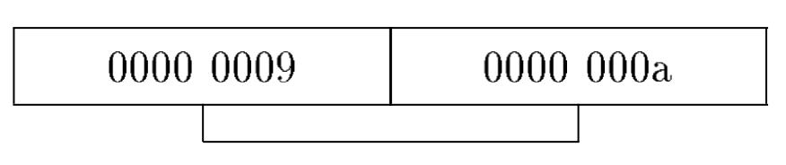
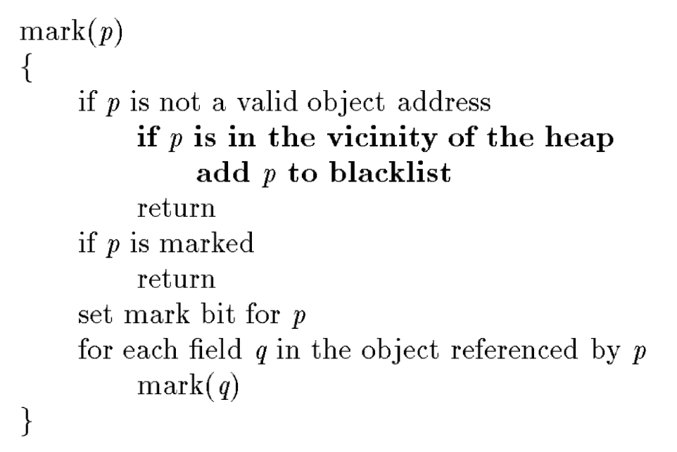
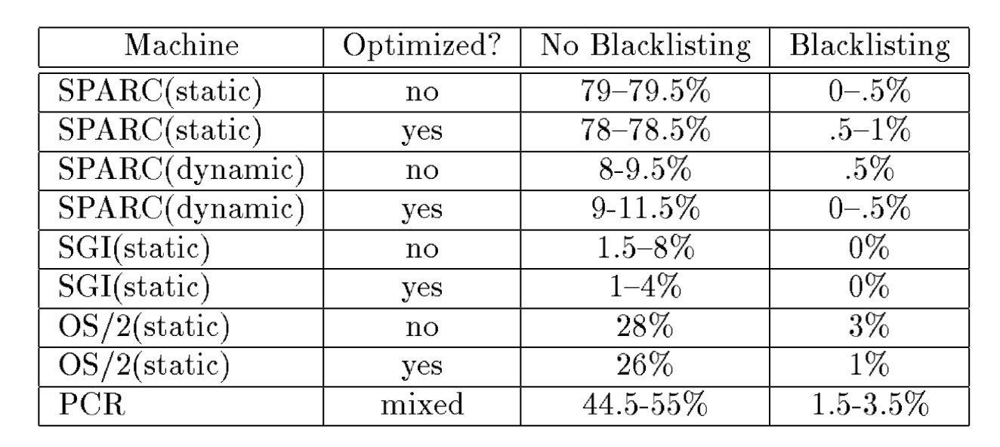
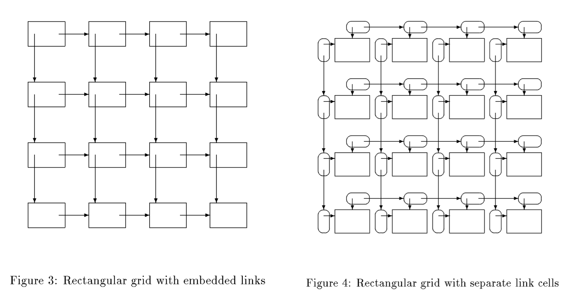

+++
title = "Space Efficient Conservative Garbage Collection"
extra.author = "Yi Jiang"
extra.bio = """
  [Yi Jiang](http://www.cs.cornell.edu/~yijiang/) is a 2nd year Ph.D. student interested in computer architecture and systems.
"""
latex = true

+++

["Space efficient conservative garbage collection"](https://dl.acm.org/citation.cfm?id=155109) describes some inexpensive but useful techniques that can make *conservative garbage collectors* more space efficient.
Their techniques can reduce pointer misidentification to retain less memory during runtime, and also excess retention due to less information about variable liveness. Their methods can be easily incorporated into any garbage collecting allocator transparently to client programs.

# Pointer Misidentification and Solutions od Existing Conservative Garbage Collectors

The goal of a garbage collector is to retain as little memory as it can, subject to the constraint that all memory that will be accessed in the future must be retained. A garbage collector is called **conservative** if it can operate with minimal information about the layout of the client program's data. 

For conservative collectors, the most apparent potential source of excess memory retention is **pointer misidentification** (e.g., misidentify integers as pointers). Here are some examples:

- An integer variable contains the address of a valid but inaccessible object
- An object that has a pointer pointing to the interior

The probability of such misidentification even get increased if more of the address space is occupied by the heap.

Some *current ad hoc techniques* can help decrease pointer misidentification probablity. One method is to design an allocator to avoid allocating objects at address that are likely to collide with other data (properly position the heap in the address space) and align pointers properly. Otherwise, all possible alignments must be considered by the collector and could result in more false pointers. For example, in the figure shown below, these two small integers (*0000 0009* and *0000 000a*) can also be viewed as a valid heap address (*0009 0000*) with the concatenation of the low order half word of the first integer and the high order half of the next.

Currently, most compilers always guarantee adequate alignment. However, it is hard to determine the proper position of the heap. Thus, this paper introduces a much less ad hoc and more flexible technique to avoid pointer misidentification.

# Their Techniques

This paper's techniques has two steps: 

### Regular Garbage Collection

They ensure regular garbage collections, with at least a fast and initial one happening just after system startup before any allocation begins.

### Invalid Pointer Record

A record of invalid pointers found during a garbage collection that could be valid object addresses afterwards is kept as a **blacklist**. The figure below shows the modified marking algorithm with blacklisting. The only modification is in bold, which adds adjacent addresses to the blacklist.

The garbage collector does not allocate objects at blacklisted address. This scheme would mostly blacklist addresses that correspond to long-lived data values before these values become false references as they are the data that could possibly cause garbage to be retained indefinitely. 

### Implementation

They implemented variants of this approach in some versions of [PCR](https://dl.acm.org/citation.cfm?id=74862) and other [garbage collectors](https://dl.acm.org/citation.cfm?id=52202). They both conservatively scan the stacks, registers, static data and the heap.

Entire pages rather than individual addresses are blacklisted. In that way, the blacklist can be implemented as a bit array, indexed by page numbers. Hask table can be utilized for discontiguous heaps.

### Evaluation

They evaluate their techniques by runing **a** program on different machines using both statically and dynamically linked versions of C library. The program allocates 200 circular linked lists containing 100 Kbytes each. And the collector would retain the entire list if any data points to any of the 100,000 addresses corresponding to objects in the list. The results of **storage retention** with and without blacklisting are shown in the following table.

Several observations can be made based on the table:

1. Blacklisting is effective in nearly eliminating all accidental retention caused by garbage collector conservativism.
2. The numbers in the table are approximate as the results are not completely reproducible. This is due to the fact that the scanned part of the address space is polluted with UNIX environment variables. So they are specified as ranges.
3. If all interior pointers are considered valid, it would be difficult to allocate individual objects larger than about 100 Kbytes without violating the blacklist constraint, or requesting memory from the OS at a garbage collector specified location.
4. According to the paper, blacklist can be easily incorpoated into a garbage collecting allocator at *almost no performance cost*.

### Other Sources of Excess Retention

Another source of excess memory retention is due to the fact that conservative collectors usually have less information about variable liveness than conventional collectors. As it lacks these information, the allocator could come for help.

Here are some useful techniques:
- Have the allocator and collector carefully clean up after themselves, clearing local variables before function exit.
- The allocator try to clear areas sometimes in the stack beyond the most recently activated frame.

### Minor: Consequences of Misidentification

Actually, the involved data structure can greatly influence the individual false reference. 

For example, given a balanced binary tree, the expected number of vertices retained in a false reference is about the height of the tree, which is usually tolerable. Queses and lazy lists could exhisit much worse behavior as they grow without bound.

A more common problem is the construction of largely stronly connected data structures, which could result in an unvounded memory leak if the structures are large enough. Take the data structures shown in the below graph as an example.

They are a rectangular array of vertices, which are linked both horizontally and vertically. The structure can be accessed by traversing a row/column. The left shows an embedded link representation. A false reference in this structure would result in the retention of a large fraction of the whold structure. The right shows an embedded link representation of the same structure, with a separate link representation (represented by ovals in the fig). Thus, at most a single row/column is affected.

Therefore, the embedded link version of some data structures would greatly help reduce storage retention and should be encouraged.

# Conclusion and Thoughts

This paper introduces some simple but effective techniques for reducing storage retention in conservative garbage collectors. 

- I think this paper gives a thorough explanation in the pointer misidentification problem in conservative garbage collectors, as well as the current and their proposed solutions. The blacklisting solution is simple and effective, and can be easily incorporated into current collectors. 
- However, it doesn't give a thorough evaluation of their techniques. Only a handwritten program is tested for the effectiveness and no experiment is conducted on the performance cost when incorporating it into current garbage collectors. Also, they don't consider the possible memory fragmentation problem in evaluation.

# Questions
- How much could fragmentation due to blacklisting influence the performance?
- How do you like the organization/design of the evaluation? (I thought it quite inadequate.)
- Still ad hoc? Any more insightful ideas recently?
