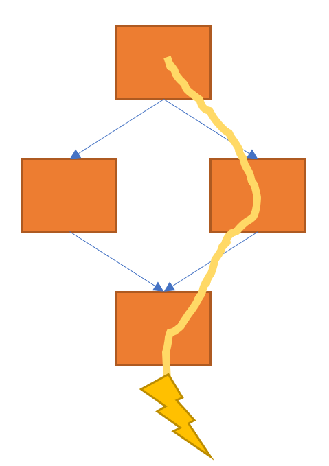

+++
title = "Generating traces from LLVM"
extra.author = "Philip Bedoukian and Sachille Atapattu"
+++

Let's generate traces from LLVM!
---------------------------

The code described in this blog post is [here](https://github.com/pbb59/ir-trace).

## Overview

In this project we use LLVM to generate traces and execute them. We use LLVM passes to log all the traces in a program and use another pass to create an executable that only executes a selected trace. This could be useful to implement efficient trace selection, or to implement trace-based LLVM passes in general.

In a real system, an interpreter would internally implement both of these passes (profiling and trace generation) internally. However, we did not use an interpreter due to technological limitations in LLVM.

## Background

Trace-based compilers have found many use cases in computer systems. A piece of a program (generally a loop body) is compiled to only execute a single path through that piece. 

Guards must be inserted to check whether this assumption of path taken by the program is correct. If it's not correct, then another path must be executed at high performance overhead. These systems speculate on a certain control flow of the program in a somewhat high-risk high-reward environment: the benefits of repeating the same trace is large (fewer instructions and more optimizations between basic blocks), but failing to run the trace results in worse than not running the trace at all.

Tracings system found early success in VLIW architectures. These architectures try to schedule many instructions at once, but run into trouble scheduling across basic blocks, which may or may not be run. A single basic block can remedy this by only considering instructions along a single path through the program.

More recently, tracing has found success in Just-in-Time compilers (JITs) for dynamic languages. The most popular Python JIT is a tracing JIT that speculates both on types and control flow.

## Trace Detection

To determine all the traces in a given program, we first use LLVM functions to detect branch instructions. We isolate branch instructions that diverge control flow and then insert a function call to a runtime library to log the condition upon divergence. At runtime, when the conditions to the diverging branch instructions are resolved, the sequence of branch selection at execution is generated as a csv file of boolean values. This sequence of branch selection forms a trace through the entire program taken at the execution of trace detection runtime.

This LLVM pass was created broadly following the "Linking With a Runtime Library" section from [LLVM for Grad Students](https://www.cs.cornell.edu/~asampson/blog/llvm.html) blog post. However, a `Value` was created from `FunctionCallee` object before passing into `CreateCall` function from [`IRBuilder`](https://llvm.org/doxygen/classllvm_1_1IRBuilder.html) to avoid a casting error. This pass is registered as `-skull` in `Skull.cpp`.

The next step in trace detection was detecting back-edges and clipping off isolated traces from the full execution trace. LLVM provides great tools to achieve this through "interactions between passes" detailed in [Writing an LLVM Pass](http://llvm.org/docs/WritingAnLLVMPass.html#specifying-interactions-between-passes). Using [LoopPass](https://llvm.org/doxygen/classllvm_1_1Loop.html) analysis to gather loop information, LLVM provides a nice way to detect loops and whether each basic block is within a loop or not. However, accessing entry point to the loop and exit point turned out to be hard. The pass is expected to mark the start and end points of each loop in the trace log, thereby enabling trace selection and optimizing. Work in progress on this pass can be found using `-pelvis` in `Pelvis.cpp`.

## Trace Generation

Traces through the program are generated using a function pass in LLVM. The pass takes as input the profiling data generated in the trace detection pass. The pass modifies a function by merging the entry block with other basic blocks along the function path. At the end of the pass, the entry block will be the only block in the entire function. We trace the program at the level of the function because it was simplest method. The applicability to real benchmarks will be discussed in the Evaluation section.

Starting from the top of the entry block, we traverse the instructions in program order. We modify the entry basic block when we encounter one of four instructions enumerated below. Once this modification occurs we restart the traversal from the beginning of the modified entry block.

|     Case    | Action with Entry Block | Instruction Action |
| ------------- | ------------------- | ---------------- |
| Conditional Branch | Merge appropriate block (1 of 2) based on profile | Remove Branch
| Unconditional Branch  | Merge block jumped to. | Remove Branch
| Function Call  | Inline Function | Remove Call
| Phi Node (only in -O1+)  | Update program dependencies to last defined variable | Remove Phi Node

Block merging transfer the instructions from a block into the entry block and removes the branch linking the blocks. Function inlining uses the built-in LLVM inline tool. This algorithm is effectively recursive so control can be traced through branches nested in branches, functions in functions, branches in functions, etc..

TODO some simple examples

Phi Nodes should also be removed because there is not control flow to merge in the trace after block merging has occurred. When a Phi Node, the single operand that exists should be forwarded to the uses of that Phi Node.

We do not remove the basic blocks during the previously described traversal. It's possible a block that was not taken by a conditional branch may be jumped to later, so we can't delete it. Once block merging and inlining is complete, we delete all dead basic blocks by checking if any predecessors exist.

The traces generated take the place of the given function. They do not contain guards that check if the path speculation was correct. Thus they must be run in isolation as a single loop iteration.

## Evaluation

We evaluate on a subset of benchmarks from [Embench](https://github.com/embench/embench-iot). These are single-threaded benchmarks targeted at embedded systems.

We do not have an interpreter or language runtime so we could not inject trace code into the program, and importantly handle failed traces. Additionally, there are no guards to hook into this language runtime even if it did exist. For these reason, we do not evaluate on entire programs, but rather small sections of the programs. Our methodology is a shown below.

|         | Step | 
| ------------- | ------------------- | 
| 1 | Extract the body of a 'hot' loop into a function
| 2 | Compile and run with the profiling pass
| 3 | Compile with the trace generation pass
| 4 | Run the generated trace

In certain scenarios, we removed some loops (set iterator to the initial value) and unrolled fixed size loops where possible.

We evaluate on sections from four Embench benchmarks and one synthetic benchmark. The features of each code section are described below.

| Benchmark | Conditional Branches | Function Calls 
| ------------- |  ------------------- | ------------ |
| minver | 2 | 1
| aha-mont64 |  1 | 0
| nbody | 0 | 1 (built-in, don't inline)
| ud | 1 | 0
| synthetic |2 (nested) | 0

Our performance metric is the number of machine instructions generated by the optimized program vs. the un-optimized program in the observed function. We use `objdump -dC <binary>` and look at the instructions in the function. We compiled both at `-O0`, but included a dead code elimination (`--dce`) pass after both to eliminate no longer useful instructions from the trace (condition check and initializing un-used variables).

| Benchmark | Un-opt Machine Inst. | Opt Machine Inst. | Inst. Reduction (%)
| ------------- |  ------------------- | ------------ | ------- |
| minver | 64 | 33 | 48
| aha-mont64 |  45 | 34 | 24 
| nbody | 130 | 130 | 0
| ud | 56 | 50 | 11
| synthetic | 39 | 12 | 69
