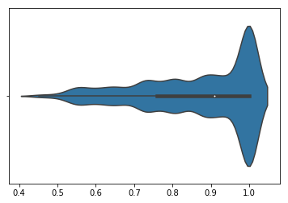
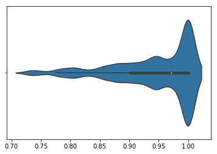
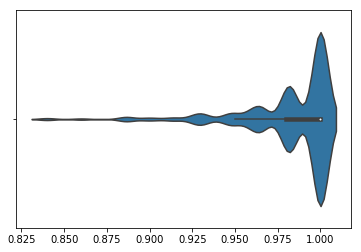

+++
title = "Bril Phase Selection and Ordering"
extra.author = "Horace He & Qian Huang"
extra.latex = true
extra.bio = """
    Horace He is a senior undergraduate studying CS & Math. He's interested
    in the intersection of machine learning and compilers. This past summer,
    he worked on PyTorch at Facebook, as well as automatically scheduling
    Halide programs.

    Qian Huang is a junior undergraduate studying CS & Math. She's mostly
    interested in machine learning and algorithms. She's curious about the
    compiler optimizations people perform in practice.
"""
+++

# Background

Modern compilers are often organized in terms of independent "passes". That
is, a compiler will consist of tens or even hundreds of optimization passes
that each do a clearly defined task. Along with these many passes, however,
comes the problem of ordering them. For example, it isn't obvious whether one
should run constant folding or copy propagation first. Although some of these
may have well defined answers, it's likely that one can find an example in
which the ordering performs poorly.

We set out to try and build a ML-based phase selection/ordering system. Due
to some amount of problems/discoveries, we ended up only analyzing the
effects of different orders and generating an optimal sequence of
optimizations.

# Design Overview

## Optimizations

To set up the phase ordering task, we selected and implemented several optimization passes:

- For Dead Code Elimination (DCE), we used the given implementation directly.

- For data flow analysis based optimization passes, we implemented Copy Propagation and Constant Folding, as defined in the lecture. Each pass will gather data flow analysis information first then modify the instructions in place.

- For control flow graph optimizations, we implemented Branch Removal, Unreachable Code Elimination, CFG cleaning and  Tail Merging. We refer to this [slide](http://user.it.uu.se/~kostis/Teaching/KT2-10/Slides/ControlFlowOpts.pdf) for more details.

    + Branch Removal

        If we can decide the guard value to be true or false, then we can eliminate one of the two branches accordingly.

    + Unreachable Code Elimination(UCE)

        The basic blocks unreachable from the entry block will be removed.

    + CFG cleaning

        We can simplify CFG by several transformations that eliminate useless edges and combine some basic blocks. Specifically, we can 1) replace a br instruciton with two identical destination to a jmp instruciton; 2) merging empty blocks; 3) merging two blocks with only one edge in between under some cases.

    +   Tail Merging

        If the predecesssor or successors share a same section of code in the end or begining correspondingly, we can change the jump to reuse the same segment of code.

In general, the optimization we selected are tailored for the simple
structure of Bril, which has a lot of contant calculation and branches that
do not allow falling through. Passes like DCE and UCE will likely to remove
more codes, but other passes might or might not generate new opportunities
for DCE and UCE. Thus we need to order passes properly to obtain best
performance, especially under the case where we can only apply limited number
of passes.

## Random Program Generator
In order to analyze programs in Bril, one obstacle was that we didn't have a
large enough corpus of code to analyze. To do statistical analysis or any
kind of optimization techniques, we need a substantial training set to
evaluate our ordering methods.

To create this training set, we created a random Bril program generator. Our
program generator evaluates each decision independently, and doesn't take any
care to preserve program wide structure. We follow this flow chart at each
step.

1. First, we randomly chose whether we want to insert a binary operation, a constant, or an id.
2. Next, given the instruction type, we decide whether it should be a boolean or an integer.
3. Finally, we choose whether this instruction should write to a new identifier or an already existing identifier. If it's an already existing identifier we uniformly choose one from all the identifiers of the correct type.

One thing that we've ignored so far is control flow. Considering that several
of our optimizations are control flow optimizations, we clearly need to
handle them somehow. However, introducing arbitrary control flow is fairly
tricky. For example, we may construct non-terminating programs, which make
evaluating them/checking our optimizations for bugs tricky.

Thus, we settled on constructing a Directed Acyclic Graph. Every fixed
interval, we insert a label. In addition to that label, we have a chance of
adding a jump/branch to a succeeding label.

We note that there are a lot of hand set probabilities in this generation
process that have the ability to heavily affect the types of programs
generated. For example, introducing a lot of control flow makes it more
difficult for other optimizations to be applied. Thus, we select a mix of
random constants.

## Phase Ordering Analysis
So, first of all, how much does the phase ordering even matter? To evaluate
the effectiveness of our optimizations, we will use # of instructions as a
proxy.

We will use three different test sets for this. One where we have a lot of
control flow, one with no control flow, and one with intermediate control
flow. These will be called CFLow, CFMid, and CFHigh.

Then, we apply 200 random permutations of the 7 optimizations mentioned
above. We record the worst and the best performing permutation, and report
that here.

| Dataset   |      Avg Low      |  Avg High | Avg Ratio |
|----------|-------------|------|----|
| CFLow | 18.7 | 26.3 | .72 |
| CFMid | 34.0   | 39.0| .87|
| CFHigh | 52.7 | 54.7| .96 |

As we can see, especially on the programs with low amounts of control flow,
there can be a huge difference between the best and worst permutation.

However, merely the min and max does not provide much information about how
the distribution of possible permutations performs. To show that, we will
normalize all permutation performances by the worst performing permutations
and plot the distribution as a violin plot. We see that there is a tail of
permutations that performs substantially better than the majority of
permutations, many of which perform as bad as the worst permutation.

CFLow:

CFMid:

CFHigh:

## Phase Ordering Heuristics
However, questions remain about the nature of the good performing
permutations. Is there a single true permutation? Or does the ideal
permutation vary among programs? To answer that, we generated random
permutations and evaluated them across all 3 datasets. We report the
percentage (# instrs of optimized program/# instrs of unoptimized program) of
the best single permutation across a given dataset, the average percentage
for optimizing the permutation per program, and the percentage for the best
overall permutation across all three datasets.

| Dataset   | Best Permutatation | Best Individual Permutation | Overall Permutation |
|----------|-------------|------|----|
| CFLow | 35.81 | 35.32 | 36.15 |
| CFMid | 59.28 | 59.24 | 59.28 |
| CFHigh | 77.60 | 77.54 | 77.61 |

Somewhat disappointingly, we find that there are permutations that always
perform very close to the optimal permutation for any program. On average,
the optimal permutations reduced the code length to 57.68% of the original
code length.

Doing so, we also find that there are many permutations with the best
performance as the best permutation (selected by best average performance
across all 3 datasets). We were curious if there was essentially some subset
of the optimizations that mattered. We analyze all of the "optimal"
permutations for common subsequences, and find that all of the optimal
permutations had the following order of permutations:

1. Copy Propagation
2. Constant Folding
3. Branch Removal
4. Dead Code Elimination

We find that for our datasets, these are the only optimizations that matter.
Removing the other 3 optimizations still provides the same performance across
our dataset.

However, note that per program, there is still occasionally performance
improvements to be found. Of our 150 random programs, there are 10 programs
in which we can find a better order than the fixed dataset wide one. We're
unable to isolate any particular pattern these programs/permutations have.

# Future Work
Originally we were interested in using ML to choose optimization orders.
However, because of how effective a fixed optimization order is, we decided
that we were unlikely to get substantive improvements from a ML based
ordering system. We suspect that this is due to the low amount of
optimizations we have, as well as the lack of more "ambiguous" optimizations.
Optimizations like constant folding or dead code elimination always improves
performance of code (we think...). Thus, it's possible that there is a fixed
optimization order that achieves almost optimal performance. However, the
implementation cost of adding more optimization passes (including verifying
their correctness) limited us to only 7 optimizations.

Future work would include more optimization passes. If adding more
optimization passes gave more ambiguity in the optimization ordering, we
could then explore program specific orderings.

Another aspect of optimization passes that we completely ignored is the fact
that we can run each optimization pass more than once. For example, dead code
elimination is often run many times due to its computational cheapness and
the fact that dead code is often generated by other optimization passes. It
could be worth exploring that as well.

