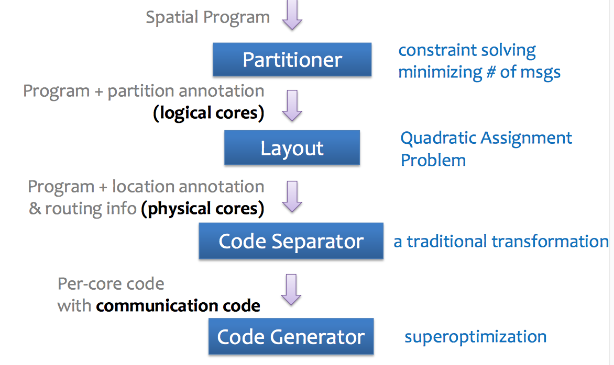
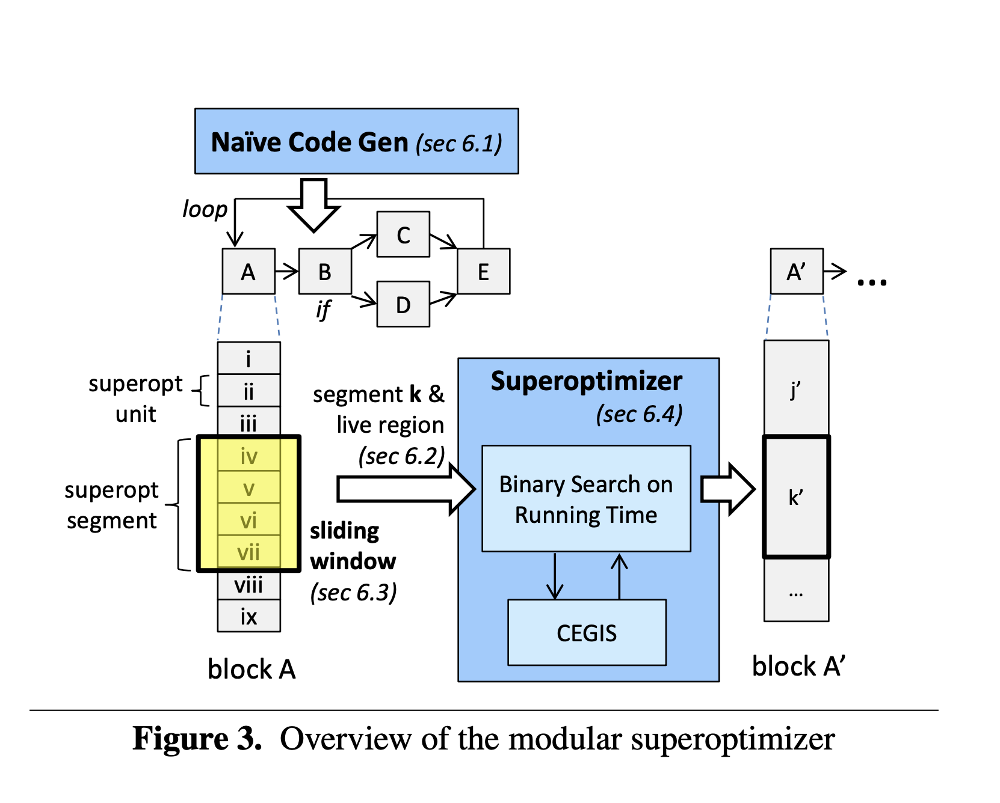
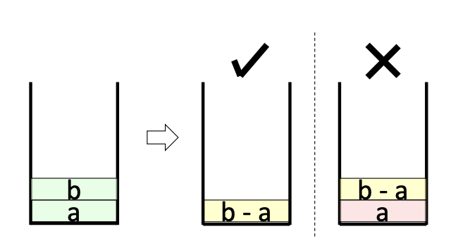
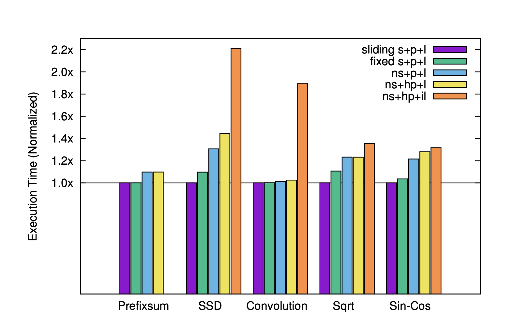
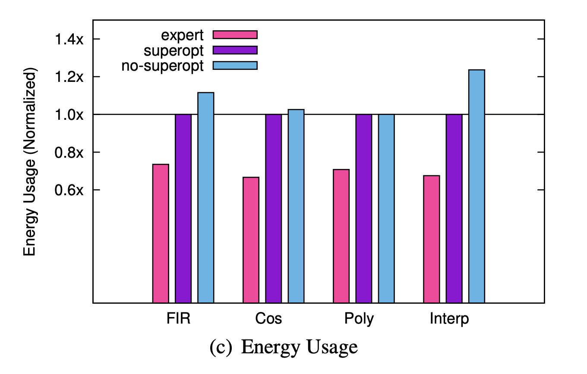
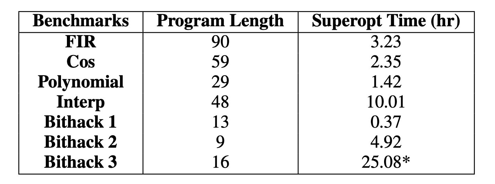
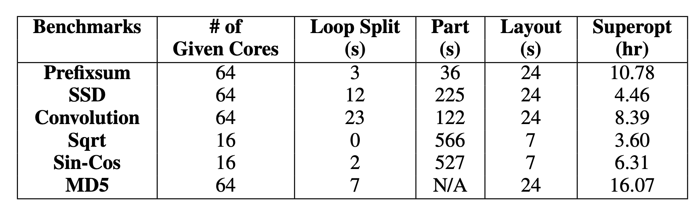

+++
title = "Chlorophyll: Synthesis-Aided Compiler for Low-Power Spatial Architectures"
extra.author = "Shaojie Xiang and Katy Voor"
extra.bio = """
  [Shaojie Xiang](https://github.com/Hecmay) is a 2nd year ECE PhD student researching on programming languages and distributed systems. 
  [Katy Voor](https://github.com/kavoor) is a senior interested in compilers and computer architecture.
"""
+++

## Introduction 

Energy efficiency has been increasingly important for embedded processors and internet of things (IoT) systems. Many spatial hardware architectures have been proposed to address the power consumption problem without compromising the performance. GreenArrays 144 (GA144) is one example of the low power spatial processor. GA144 is a stack-based 18-bit processor without shared memory and fixed clock. To program GA144, users have to write an assembly-like low level programming language [[1]](#1) to define the data storage, data movement and communication logic to make use of the spatial architecture. This paper proposes a programming model and synthesis-aided compiler to compile high level C-like programs into binary executables on GA144. The compiler-optimized program can achieve comparable results with an expert written low level program.

An additional motivation for investigating Chlorophyll is the need for a higher-level abstraction over arrayForth, the language used on GreenArray chips. ArrayForth requires the programmer to partition data structures and code as well as to insert the requisite communication code. Chlorophyll aims to abstract away communication code as well as some partitioning logic that can be inferred by the synthesizer and separator. 

### Background 

Spatial hardware is an architecture where the users are required to assign data, computations, and communications explicitly to use its computing resources, storage, and interconnect network. Compared with general purpose processors, spatial architectures can achieve comparatively good, or even better performance and energy efficiency for some specific applications. However, spatial hardware is especially hard to program and debug as users have to manually manage the low level hardware resources and efficiently transform their programs in order to take advantage of the hardware features. 

To mitigate programmability concerns, one possible solution is to use certain domain specific language (DSL) like Spatial [[2]](#2) or T2S [[3]](#3). DSLs provide specialized APIs to help users realize different optimization on target hardware with much less effort. People can also use hardware templates to solve the problem. DNN/FPGA Co-Design [[4]](#4) developed a complication flow from an ML workload to certain spatial accelerator like FPGA or CGRA by searching through template IP pools with certain constraints. Such approaches improve the programmability without sacrificing much performance, but still require users to have expertise for the target hardware.


### Chlorophyll Overview

Chlorophyll decomposes the problem of compiling high level programs into spatial machine code into four sub-problems:




* **Partitioning**: Search the partitioning scheme that minimizes the communication between different logical cores
* **Layout**: Assign the partitioned program segments to physical cores such that the actual communication cost is minimized 
* **Code Separation**: Generate communication code for data movements between physical cores
* **Code Generation**: Search and generate high performance binary code taking advantage of hardware features of the target machine
 
The users can develop their programs in C and compile to GA144 without worrying about the communication and data movement. The compiler partitions the code, explores the design space, and automatically optimizes the program to improve the performance.


### Partitioning Synthesizer

#### Type System

Chlorophyll provides an annotation based syntax for users to indicate partition types for variables, arrays and operators. Partition types can be declared using annotation or inferred by the synthesizer. Here follows an example of annotating arrays into different partitions.

```cpp
int@{[0:32]=0,[32:64]=1} x[64]; 
int@{[0:32]=2,[32:64]=3} y[64]; 
int@{[0:32]=4,[32:64]=5} z[64]; 
int@6 r = 0;
for (i from 0 to 64) {
  z[i] = leftrotate(x[i],y[i],r)!4 -@place(z[i]) 1; 
  if (r >@6 32) r = 0;
}
```

`@` in the program is an indicator of the partition index, and `@place` will return the partition type the argument. `!` is an operation of sending data from one partition to another. In the example above, array x, y and z are partitioned into two logical cores (first half and second half stored in separate cores). The computation of `leftrotate` function may happen in the same or a different logical core depending on the result of type inference. 

For loops in Chlorophyll programs, the synthesizer conducts loop splitting to make variables in each split loop have the same partition ID. The loop in the example above will be decomposed into multiple non-overlapping sub-loops.
```cpp
for (i from 0 to 32) {
  z[i] = leftrotate(x[i]!8,y[i]!8,r!9)!4 -@4 1;
  r = r +@6 1;
  if (r >@6 32) r = 0;
}
for (i from 32 to 64) {
  z[i] = leftrotate(x[i]!8,y[i]!8,r!9)!5 -@5 1;
  r = r +@6 1;
  if (r >@6 32) r = 0;
}
```

In the partitioning stage, Chlorophyll compiler performs type checking and type inference to generate the completely partitioned code, where each operand will have an explicit partition type as well as the destination partition ID (if it will be used by operations on other logical cores). The partitioning is conducted with the following two key functions:

* **Communication Interpreter**: The interpreter calculates the communication count of given program `P` with every valid input `x` under a complete partition type annotation $\sigma$. The maximum communication count is defined as
$$
MaxComm(P, \sigma) = max_{x}Comm(P, \sigma, x)
$$ If the input program is partially annotated, the interpreter returns a formula in terms of symbolic variables for partition types. The returned value is used as an input to a constraint-based solver to search for an optimal partitioning scheme for the given program (i.e., better type inference on the un-annotated variables). 

* **Partition Space Checker**: Given a complete partition scheme for each variable, array and other constructs in the program, the space checker checks the space usage of in each partition, to make sure that the memory usage is no larger than the storage capacity on the core.

The partitioning synthesizer utilizes these two functions as constraints to a backend solver to infer the prtitioning scheme minimizing the communication while not violating the memory constraint. Every time the solver finds a feasible solution, the synthesizer will lower the upper bound constraint of communication count to push for a better solution in next runs.

### Layout 

The layout problem is formalized as a quadratic assignment problem (QAP), where we search for the assignment function to minimize the total communication cost:
* facilities set $P$ (a set of partition types we derived from partitioning synthesizer)
* the weight distance $W(a,b)$ returning the weight factor between two facilities $a$ and $b$
* function $D(a, b)$ returning the distance between two given locations
* Assignment function mapping different facility (in our case function) into a specific location (i.e., logical core on GA144)
$$
f = argmin_{f}\sum_{a, b\in P}W(a, b)D(f(a), f(b))
$$

The QAP problem is a classic combinatorial problem and can be efficiently solved with Simulated Anealing (SA). And we use the layout result to generate communication code in the code separation phase.


### Code Separation
The program is now separated into per-core program fragments. These program fragments communicate with read and write operations, that the separater subsequently inserts. This design is advantageous as the GA144 architecture does not support shared memory, and cores communicate via synchronous channels.

<!-- < TODO INSERT why preserving the order of operations within each program fragment prevents deadlock> -->

Consider this example with only basic statements.
```
int@3 x = (1 +@2 2)!3 *@3 (3 +@1 4)!3;
```
The separator traverses the AST in postorder to place sub-expressions according to their partitions, and then add the requisite communication code.
This program is separated into these program fragments:
``` 
partition 1: write(E, 3 + 4);
partition 2: write(E, 1 + 2); write(E, read(W));
partition 3: int x = read(W) * read(W);
```
These partitions are mapped to cores (0,1), (0,2), and (0,3), arranged west to east.


In the program the operation `(3+4)` occurs at partition 1 and is written to partition 3. However, since these partitions are not on adjacent cores, the separator inserts a `write EAST` of this result at partition 1 to partition 2.
Next, at partition 2, the operation `(1+2)` occurs, and is written to partition 3. The separater inserts a `write EAST` of this result. In addition, the separater inserts a `write EAST` for the result of partition 1 on partition 2, that was written to its data stack previously. Note that the arithmetic operations on partition 1 and partition 2 happen in parallel.
Finally, with both results written to the data stack of the core mapped by partition 3, the operation `(3+7)` occurs by reading its data stack to source operands.

This process is much more challenging with control flow and functions. When considering functions, a function call in the original program translates to a function call at each of the cores on which the function resides.

<!-- TODO maybe talk about arrays -->

### Code Generation

Typically, code generation is performed using a dynamic programming algorithm that utilizes local optimization to optimize larger and larger code fragments. Think of tiling an abstract assembly tree and building up larger and larger optimized tiles from smaller ones. This approach is not as effective for code generation for nontraditional architectures with nonlocal optimizations, such as optimizations for circular stacks. 

Instead of writing new transformation rules, the authors search for an optimized program in the space of candidate programs. One way to do this is through superoptimization.

*Superoptimization* is the process of searching the space of all instruction sequences and verifying the candidate programs against a reference implementation with naively-generated code. Unfortunately, according to this paper, superoptimization only scales to roughly 25 instructions. However, there has been more recent work to mitigate this with increased contextual information and early pruning of invalid candidate programs [[4]](#4).

#### Naive Code Generation
In order to create this reference implementation, each per-core program is translated to machine code. Each operation in the high-level program is stored in a *superoptimizable unit*.

A *state* of the machine is a collection of the data stack, return address stack, memory, and special registers. 

Each superoptimizable unit contains a *live region*. A *live region* indicates the parts of a machine's state that store live variables at the end of execution of the unit.

These units can then be merged into a longer sequence as a *superoptimizable segment*. 

Since we do not support recursion, it is possible to statically determine the depth of the stack at any point in the program, and thus reject all programs that overflow the stack.

#### Modular Superoptimization
A behavior of a program is specified by its sequence of instructions *P*, and its live region *L*. 
Consider the resulting data stacks from executing *P*.


*P* changes the data stack from $\alpha$|$\beta$ to $\alpha$|$\gamma$. Assume $\alpha$|$\gamma$ is in the live region. We say *P'* is equivalent to *P* if *P'* produces $\alpha$|$\gamma$, and the stack pointers after executing *P* and *P'* point to the same location.

Consider figure (b) above. Let *P'* be the sequence of instructions resulting in (b). Note that under this definition of equivalence, the resulting stacks in (a) and (b) are different. This is because the stack pointer is pointing to different places on each stack.

In order to decrease the number of false negatives, the authors loosen the specification. Assume *P* results in a data stack of $\alpha$|$\gamma$. *P'* is equivalent to *P* if *P'* results in a data stack of $\delta$|$\alpha$|$\gamma$, where $\delta$ may be empty. Additionally, they place no restrictions on the stack pointer.

This is valid because the stacks are circular, and therefore leaving garbage at the bottom of the stack will simply be overwritten as the stack pointer is incremented accordingly.

This engenders additional optimization as well. Consider the corresponding stacks for a subtract operation.



Here, b and a are popped from the stack, subtracted, and the result is pushed back onto the stack. The *P* that results in only `b-a` left on the stack is 8 instructions long, with 3 instructions to remove the remaining garbage value `a` from the stack. However, as noted before, it is in fact legal to leave `a` at the bottom of the stack, thus saving 3 instructions. 

#### Sliding Windows
To scale superoptimization to real world programs, the authors employ the *sliding windows technique*.
This algorithm merges superoptimizable units into a superoptimizable segment. It starts with an empty segment, superoptimizes the largest sequence possible from the input instruction sequence, and appends the result to the output, if valid.
In the case where no valid segment is found from the superoptimizer, it appends the the first unit from the segment to the output, and attempts to build another sequence to superoptimize. 
Then, it iterates until the instruction sequence is empty.

The superoptimizer executes a binary search over programs given a cost model. It uses counterexample-guided inductive synthesis (CEGIS) to synthesize a program of cost $k$, and if one exists, to synthesize a program of cost $k/2$, and so on.

When perusing papers that cite this one, we found the primary critique of the *sliding windows technique* to be the focus on local optimization and inability to make whole-program optimality guarantees. Other synthesis approaches such as metasketches, claim to provide these guarantees [[6]](#6).


<!-- #### SMT Formulas
Once we have our superoptimizable segment, we optimize the segment using SMT solvers, specifically Z3. We use the GreenArrays cost model to approximate execution time for a given program. Then, we perform binary search over a candidate program space to find one of optimal execution time. -->

<!-- #### Address Space Compression
When it comes to supertoptimization, the smaller the memory required, the smaller the search space. In order to allow superoptimization to scale, the authors compress our address space during superoptimization. One primary example of compression focuses on memory assigned to arrays.  -->
<!-- INSERT: It is unclear how they change arrays to be of length two and modify the rest of the addresses accordingly? -->
<!-- 
After a valid output program is found, the address space is then decompressed and verified to be the same as the original input program. This is advantageous as verification is much faster than synthesis. -->


## Evaluation
### Performance
To assess the performance of the partitioning synthesizer, the authors implement a heuristic partitioner that greedily merges small unknown partitions when there is communication between the two.
To assess performance of the layout synthesizer, the authors compare the default layout synthesizer that considers approximate communication costs with a modified version  that assumes communication costs between every pair is 1. To assess performance, the authors compare generated programs with and without superoptimization. Finally, the authors compare sliding windows against fixed windows. 



For each benchmark, 5 different versions of the program are generated. We include a key here to interpret the figure above:
 - **(sliding | fixed | ns)** = (sliding-window | fixed-window | no) superoptimization
 - **(p | hp)** = partitioning synthesizer | heuristic partitioner
 - **(l | il)** = layout synthesizer | imprecise layout synthesizer
 
On average, when comparing (ns+p+l) with (ns+hp+l), the authors find a 5% speedup when using partitioning synthesizer over the heuristic partitioner. They confirm the precise layout is crucial and note the 1.8x speedup when using the precise layout for the Convolution benchmark. This is due to the significant parallel patterns in the Convolution benchmark where placing parallel groups closeby can have a large impact.
When looking at superoptimization, the authors find an average 30% speedup on programs that use superoptimization. Furthermore, the programs that use sliding-window superoptimization are on average 4% faster than programs that use fixed-window superoptimization.

The authors further claim that programs generated with synthesis are comparable to *highly-optimized* *expert-written* programs. 




On these single-core programs, the authors found the generated programs to be on average 46% slower, 44% less energy efficient, and 47% longer than the expert written programs.
It is important to note that the programs that were tested are single-core. When running the single multicore program the authors have access to through the partitioning synthesizer, the synthesizer times out and the heuristic partitioner fails to produce a program that fits in memory. The authors partition this program by manually finding partition annotations, examining the machine code, and iterating. They compare two programs partitioned this way such that one is initially bigger than memory before it is superoptimized, and one that fits on the cores without superoptimization.

While the authors find the multicore program with superoptimization is 65% slower than the experts' implementation and 7% faster than non-superoptimized program, it is unclear whether we can confirm "these generated programs are comparable with experts' not only on small programs but on a real application." It is challenging to compare the results from the multicore test with the performance of the experts' implementation as the authors manually partitioned these _generated programs_ themselves. Even so, they found them to be 65% slower and 70% less energy efficient than the experts' implementations.

While the threshold for stating these generated programs are _comparable_ to expert implementations is subjective, the data from the multicore test appears moderately contrived. We would like to see more naturally generated partitions for more multicore examples before leaping to the claim that these generated programs are comparable to real applications.

### Discovering Optimizations for Unusual Hardware
The authors go on to claim their supertoptimizer can discover optimizations that traditional compilers may not. They hand select a couple of programs with potential bit-manipulation optimizations and find the superoptimizer discovers the expected strength reduction optimizations as well as CSE. We found the primary takeaway from this claim to be the superoptimizer's ability to find optimizations specific to the unusual hardware, exploiting special instructions not found in common ISAs. This addresses one of the motivating challenges of this paper: Building a mature compiler with heuristic-guided tree rewrites takes quite a bit of time, and low-power architectures are a moving target as they are under very active investigation. This challenge demands a way to discover optimizations for changing architectures, and these initial abilities of the superoptimizer are promising.

### Opportunity for Improvement with Human Insight
One last item to note is the time it takes for the superoptimizer to converge on a valid optimized program is significant. Below we see the results for single-core and multicore benchmarks with their corresponding convergence times.




The authors' claim that injecting human insight into the superoptimizer in the form of templates or pinning code to cores can help mitigate these times. They provide minimal examples and evidence of the potential impact of this human insight. We note the tradeoff between convergence times and programmability, one of their primary motivations for Chlorophyll as a higher-level abstraction over arrayForth.


### Optimization Opportunity Loss
The separation of partitioning and superoptimization engenders a few places for improvement. Chlorophyll uses a schedule-oblivious routing strategy. Therefore, if core A can communicate with core B via core X or core Y, it will choose the route arbitrarily. If core X is busy during this time, the optimal route would be through core B, instead of waiting on X to finish its work. When determining the importance of this scheduling issue, we wanted to know what proportion of execution time is dedicated to communication cost, including time spent waiting. Given the strict space constraints, it is unclear whether inserting instructions to conditionally use different communication instructions saves enough execution time to be worth the space. Further benchmarks would be required to determine if it is worth it, and if so, in which cases. 
<!-- If this time spent is significant, it may be worth it to perform a static analysis before code separation in order to better predict which cores will be busy to more optimally route data. -->

## GA144 Powered Lemonade-Bleach Battery Demo
Check out a [demo](https://youtu.be/zMfdef-nYGY) in which the GA144 chip runs an integer division program entirely powered by a lemonade-bleach battery. The battery provides 1.6V and the application draws 2-3 mA.

## References
<a id="1">[1]</a> [Getting Started With The GA144 And ArrayForth](https://bitlog.it/20141224_getting_started_with_the_ga144_and_arrayforth.html)
<a id="2">[2]</a> [David Keoplinger et al. Spatial: A Language and Compiler for Application Accelerators](https://web.stanford.edu/~kozyraki/publications/2018.spatial.pldi.pdf)
<a id="3">[3]</a> [Nitish Srivastava et al. T2S-Tensor : Productively Generating High-Performance Spatial Hardware for Dense Tensor Computations](https://nitish2112.github.io/publication/t2s-tensor-fccm2019.pdf)
<a id="4">[4]</a> [Cong Hao et al. FPGA/DNN Co-Design: An Efficient Design Methodology for IoT Intelligence on the Edge](https://arxiv.org/abs/1904.04421)
<a id="5">[5]</a> [Phitchaya Mangpo Phothilimthana et al. Scaling up Superoptimization](https://dl.acm.org/citation.cfm?id=2872387)
<a id="6">[6]</a> [James Bornholt et al. Optimizing Synthesis with Metasketches](https://homes.cs.washington.edu/~luisceze/publications/synapse-popl16.pdf)
