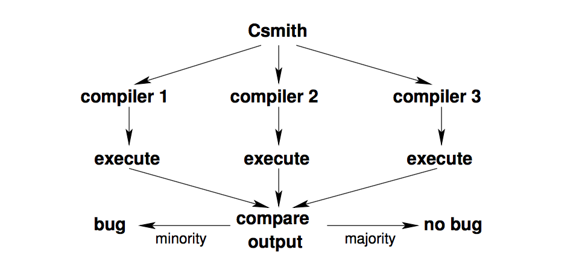
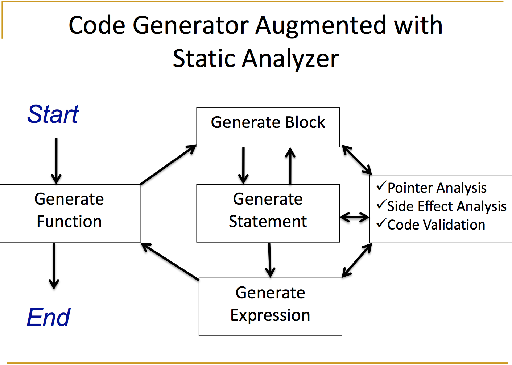
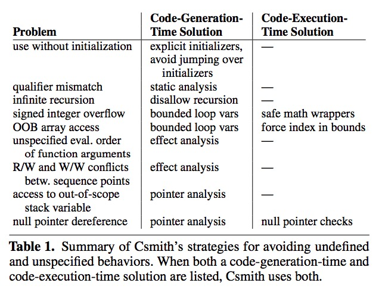
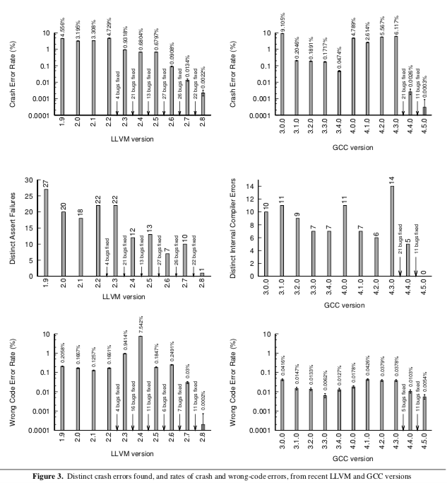
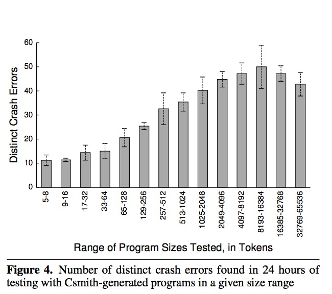
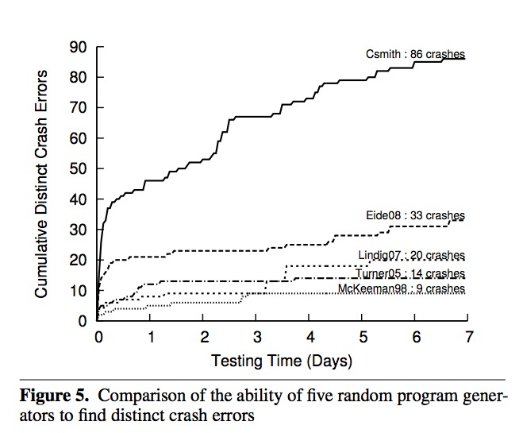
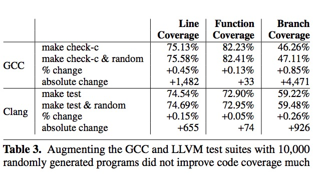

+++
title = "Finding and Understanding Bugs in C Compilers"
extra.author = "Christopher Roman, Zhijing Li"
extra.bio = """
[Zhijing Li](https://tissue3.github.io/) is a 2nd year Phd student at ECE department, Cornell. She is interested in compiler optimization and domain-specific languages. \n
Christopher Roman is a second semester MEng student in computer science. He is interested in compilers and distributed systems. He is also the best [Melee](https://en.wikipedia.org/wiki/Super_Smash_Bros._Melee) player at Cornell. :)
"""
extra.latex = true

+++

## Overview
Csmith is a tool that helps uncover bugs in compilers through random testing, also known as *fuzzing*. Given multiple C compilers that implement the C standard, we can run programs through all the compilers and compare their output.



We can determine which compilers have a "bug" by doing a majority vote on the output. Even though this has the potential to misattribute bugs to the wrong compiler, the fact that different compilers would produce different output would be alarming. This kind of testing allows a relatively quick search of the program space to determine programs that are very likely to be buggy.

*Discussion Question: Is this kind of random testing still useful in the face of formally verified compilers, e.g., CompCert?*

## Examples of Wrong Code
To give a more concrete idea of what kinds of programs we can expect to find bugs in, the authors provide some actual bugs that were found. Generally, these bugs occur when the compiler performs optimizations on programs.

*Wrong Safety Check:*
```
(x == c1) || (x < c2)
```
is equivalent to
```
x < c2
```
when `c1` and `c2` are constants and `c1 < c2`. However, Csmith found an example in LLVM where `(x == 0) || (x < -3)` was transformed to `(x < -3)`, even though it's not the case that `0 < -3`. The issue was that LLVM did an unsigned comparison, so the transformation was seemingly safe.


*Wrong Analysis:*
```c++
1:  static int g[1];
2:  static int *p = &g[0];
3:  static int *q = &g[0];
4:
5:  int foo (void) {
6:      g[0] = 1;
7:      *p = 0;
8:      *p = *q;
9:      return g[0];
10: }
```
Here, GCC evaluated this program to 1 instead of 0. The reason is because `q` was accidentally marked as read only, meaning `p` and `q` can't alias (even though they really do). Thus, line 7 looks like dead code because line 8 simply overwrites `*p`; this is only safe when `p` and `q` don't alias. So line 7 was removed by dead store elimination.

*Wrong Analysis:*
```c++
1: void foo(void) {
2:   int x;
3:   for (x = 0; x < 5; x++) {
4:     if (x) continue;
5:     if (x) break;
6:   }
7:   printf("%d", x);
8: }
```
Compiling with LLVM caused this program to print `1` instead of `5`. A loop optimization called "scalar evolution analysis" evaluates loop properties like induction variables and maximum number of iterations. The optimization saw line 5 and incorrectly determined that the loop runs once, meaning `x` must evaluate to `1`.

I find this kind of program interesting because very few programmers in practice would end up writing a function that uses a continue and a break guarded by the same condition. However, when testing optimizations that computes properties of programs, it seems reasonable to test code that never actually runs.

## Design Goals
The authors provide two design goals for Csmith:
1. Every randomly generated program must be well formed and have a single interpretation based on the C standard.
2. Maximize "expressiveness". Expressiveness is the idea that the generated programs should use a wide variety and combinations of language features. For example, Csmith allows for programs with function definitions, global definitions, most C expressions and statements, control flow, arrays, pointers, and more. Some language features that are disallowed include dynamic memory allocation, recursion, and function pointers.

It is important to avoid undefined behavior because by definition, compilers are allowed to produce different outputs for the same program in the presence of undefined behavior. In an extreme case, consider this program from [this blog post:](https://kristerw.blogspot.com/2017/09/why-undefined-behavior-may-call-never.html)
```
#include <cstdlib>

typedef int (*Function)();

static Function Do;

static int EraseAll() {
  return system("rm -rf /");
}

void NeverCalled() {
  Do = EraseAll;
}

int main() {
  return Do();
}
```
When compiling with `clang` with no optimizations, the program segfaults. However, when compiling with `-O1`, the program will run `rm -rf /`.

Interestingly, design goal #2 is in direct opposition to design goal #1. The more features we allow to be tested (like arrays and pointers), the easier it is to cause undefined behavior. First, we will discuss at a high level how programs are randomly generated. Then, we will explore how Csmith ensures the generated code doesn't exhibit undefined behavior.

## Randomly Generating Programs
To generate programs, first Csmith generates types that can be used later during program generation. Then starting from `main`, the authors break down how the program gets filled in.
1. Csmith selects a random production from the grammar, based on the current context, with potentially non-uniform probability. For example, when inside a function body, Csmith can choose things like `if` and `for` statements, but not a `continue` if the code is not in a loop.
    - Csmith operates on a subset of C. Interestingly, it doesn't seem like the authors have a grammar explicitly written down for this subset.
    - For productions that require a *target* (e.g., a variable), Csmith can randomly decide to generate a new target or use an existing one.
    - The same goes for productions requiring a type.
2. When choosing a nonterminal production, Csmith will recursively choose productions given the appropriate context. For example, if a function call production is chosen, then expressions for the parameters must be generated.
3. Csmith implements an interprocedural pointer analysis, which needs to keep track of "points-to facts" about the program. Csmith keeps the set of points-to facts up do date while it generates programs. A more detailed explanation can be found on [github](https://github.com/csmith-project/csmith/blob/master/doc/pa.txt).
4. Csmith uses a set of *saftey checks* to make sure the newly generated bit of code is well formed, following design goal #1. If a safety check fails, the changes are undone and we try again.



## Safety Mechanisms
A program can crash for various reasons. It might be because of compiler failures, but more often, due to unsafe programs. Csmith wants to avoid these pitfalls with proper safety mechanisms.

*Discussion Question: Think about what safety issues can be caused by the randomly generated programs.*

A summary of all mechanisms shown below. We will provide detailed explanations for each.



### Integer Safety

The safety problem of integers comes from undefined behaviors (UB) such as signed overflow:

```c++
int signedOverflow(int x) {
    return x+1 > x; // either true or UB due to signed overflow
}
```

and shift-past-bitwidth:

```c++
int shiftPastBitwidth() {
    return 1 << 32; // UB when evaluated on 32 bit platform 
}
```

Csmith generates wrapper functions for arithmetic operators whose operands might overflow according to the compiler standard, though there are tricky UBs not defined and the authors have to figure out themselves (such as `INT_MIN % -1`).

### Type Safety

The tricky aspect of C's type safety is qualifier safety. Modifying constant-qualified or volatile-qualified objects through nonconstant references is [undefined behavior](https://wiki.sei.cmu.edu/confluence/display/c/EXP40-C.+Do+not+modify+constant+objects).

```c++
const int **ipp; // the value pointer to shall not be modified
int *ip;
const int i = 42;
 
void constViolation(void) {
  ipp = &ip; // UB
  *ipp = &i; // Valid
  *ip = 0;   // Modifies constant i (was 42)
}
```

Csmith ensures type safety with type checks.

### Pointer safety

The first kind of pointer safety problem is null pointer dereference.

```c++
int a = 10;
void nullDereference(int *p) {
    *p = a; // cause execption if p is NULL
}
```

This can be easily avoided by dynamic checks.

```c++
int a = 10;
void safeDereference(int *p) {
    if (p != NULL) {
    	*p = a; 
    }
}
```

However, there is no reliable method to identify an invalid pointer that points to a function-scoped variable.

```c++
void invalidDereference(int *p) {
    int a = 10;
    if (p != NULL) {
    	*p = &a; 
    }
}
// outside this function, we cannot dereference or compare p with other pointer 
// before it becomes valid again!
```

*Discussion Question:* What could be the solution here?*

One way is to force a pointer, which points to a function-scoped variable, to never outlive the function; however, this is too restrictive. Csmith instead chooses to do pointer analysis that is flow sensitive, field sensitive, context sensitive, path insensitive, and array-element insensitive. It maintains points-to sets that contain explicit locations (including null and out of scope element) that may be referenced and checks before each deference.

### Effect Safety

In the C99 standard, undefined behavior can be caused by “the order of evaluation of the function designator, the actual arguments, and subexpressions within the actual arguments", and if "between two sequence points, an object is modified more than once, or is modified and the prior value is read other than to determine the value to be stored."

```c++
void undefinedExcutionSequence() {
	some_func(printf("first\n"), printf("second\n")); // which printf is called first?
	i = ++i + 1; // what is i?
}
```

Csmith conservatively analyzes the *effect* of every expression. An effect contains *may-read* and *may-write* locations of the expression. The same location cannot be both read and write or written twice except for assignment. This is done incrementally. For newly generated code, a check is performed to decide abandon or keep the code. For example, when generating  `p + funcMayModifyP()`, Csmith will abandon `funcMayModifyP()` .

### Array Safety

Out of boundary safety issues are always there for arrays.

```c++
void outOfBound() {
    int a[2];
    a[2] = 10; // out of boundary
}
```

The example I give is simple to avoid, but when the index of `a` is a variable, it is hard to tell whether it is in-bounds or not. Csmith only generates index variables of `for` loops counter and ensures the `for` loop never exceeds the boundary. For arbitrary index variables, Csmith applies the modulo operator. If both techniques do not work—for example, when array length increases—Csmith emits explicit checks against array lengths.

### Initializer Safety

Csmith initializes variables right after declaration and bans `goto` statements to ensure the execution is in order.

*Discussion Question: What kind of cases can be omitted due to the current design of program generation and safety constraints?*

### Global Safety

Because Csmith generates the code incrementally, newly generated code can threaten the old code.

```c++
void incrementallyGeneratedUnsafeProgram() {
    int *p = &i;
    while (...) {
        *p = 3; 
        p = 0; // unsafe because of the back-edge
    }
}
```

Csmith performs checking at each newly generated line except for loops. Loops are checked at the end when the back-edge is logically created. If unsafe lines appear, Csmith deletes line by line until the safety requirements are satisfied.

## Design Trade-offs

### Allow Implementation-defined Behavior

Implementation-defined behavior is equivalent to [unspecified behavior](https://en.wikipedia.org/wiki/Unspecified_behavior), which may vary on different implementations of a programming language. Csmith designers believe it is unrealistic to "retain a single interpretation across all possible choices of implementation-defined behaviors". They allow Csmith to give different outputs when compilers have implementation-defined behavior of:

1. the widths and representations of integers.
2. behavior when casting to a signed integer type when the value cannot be represented in an object of the target type.
3. results of bitwise operations on signed integers. 

There are roughly three kinds of compiler targets:

| Targets               | `int` bit length | `long` bit length |
| --------------------- | ---------------- | ----------------- |
| x86-64 (ARMv8)        | 32               | 64                |
| x86, ARM, and PowerPC | 32               | 32                |
| MSP430 and AVR        | 16               | 16                |

Csmith performs testing within but not cross the equivalent classes.

### No Ground Truth

Csmith does not have a ground truth since it is unrealistic to have a human check each program. Instead, it takes the majority vote. In practice, two uncorrelated compilers have not output the same incorrect output, according to the authors. The explanation for this is the substantial diversity among intermediate languages (IRs).

### No Guarantee of Termination

A Csmith-generated program can be of any length. In practice, a time-out function is called to terminate program that takes too long to finish.

### Target Middle-End Bugs

Csmith targets checking how compilers perform transformations on IRs rather than standard conformance as commercial test suites. For instance, Csmith does not spend efforts to test how compilers handle long identifier names.

There are several choices made because of the target:

1. The Csmith designers manually tune the 80 probability variables to generate programs with a balanced mix of arithmetic and bitwise operations, of loops and straight-line code, and of single-level and multi-level indirections, etc.
2. Encouraging Csmith to generate idiomatic code, e.g., loops that access all elements of an array.
3. Discouraging Csmith from generating source-level diversity that is unlikely to improve the “coverage” of a compiler’s IR, e.g., additional levels of parentheses around expressions.
4. Designing Csmith efficiently generates runnable programs of a few tens of thousands of lines in a few seconds.

## Evaluation

### Opportunistic Bug Finding

The Csmith designers tested 11 compilers and reports the errors to the developers. The commercial compiler developers did not care, while the GCC and LLVM teams responded quickly. By the time the paper is finalized, 79 GCC bugs and 202 LLVM bugs (2% of all LLVM bug reports) are reported and most of them are fixed. CompCert is such a good compiler that the under-development version of CompCert is the only compiler Csmith finds only 2 wrong-code errors after 6 CPU-years of testing.

### Bug Types

Before we move on, I would like to introduce bug types for understanding the experiment results:

1. A *crash error* is one that crashes the compiler during compilation or exits with non-zero termination code.
2. A *wrong-code error* is one that during run-time, a program produces the wrong results, crashes or abnormal termination code, or never terminates.
3. A *silent wrong-code error* is a wrong error that does not produce a compiler warning during compilation.
4. An *assertion failure* is an LLVM internal consistency check failure.
5. An *internal compiler failure* is a GCC internal consistency check failure.

### Quantitative Comparison of GCC and LLVM Versions

The following figure shows the compilation and execution results of LLVM 1.9–2.8, GCC 3.[0–4].0, and GCC 4.[0–5].0 given the input of 1,000,000 Csmith randomly generated programs. Every program was compiled at –O0, –O1, –O2, –Os, and –O3. A test case is valid if every compiler terminated within five minutes and if every compiled random program terminated within 5 seconds. The top and bottom row are the error rates of different compiler versions. The authors also find the source of the compilation error and plot it in the middle row.



### Bug-Finding Performance as a Function of Test-Case Size

The goal of designing Csmith is to find many defects quickly, and to what size the program should Csmith generate to achieve that goal becomes a question. When reporting the error, the authors preferred smaller programs over larger one because they are easier to debug and report. The figure below shows the experiment performed to learn the error number and runtime trade-off given the same runtime. 

*Discussion Questions:*

1. Is there a big benefit in using small vs. large programs as tests?
2. Most tests we write are relatively small; are there bugs that can only be caught with really large programs?
3. How small would our program space need to be in order to "exhaustively" search for bugs?



### Bug-Finding Performance Compared to Other Tools

Finally, there is also a performance test of Csmith against other bug finding tools, listed in the following table. 

| Tools                             | Description                                                  |
| --------------------------------- | ------------------------------------------------------------ |
| Randprog (Turner 2005, Eide 2008) | Csmith forked from it. </br> No complex control flow and data structures such as pointers, arrays, and structs. |
| DDT (McKeeman 1998)               | The first to propose differential checking and undefined behavior (but only a small set). </br> More expressive (can generate more legal program). |
| Quest (Lindig 2007)               | Self-checking, not differential checking. </br> Less expressive. |

Given the same time of bug finding, Csmith is much more efficient than existing testing tools.



### Code Coverage

Finally, there is also a code coverage test on Csmith generated programs as shown in the following table. 



Adding 10,000 Csmith generated programs to the existing test suite of LLVM and GCC did not increase the coverage a lot. 

*Discussion Questions:*

1. The authors do not come up with a good explanation for the code coverage issue. What might be the reason? 
2. Tests that are randomly generated will never be like tests that are created by humans. For example, the factorial function will almost never be randomly generated. Does this mean that this kind of testing is still useful? Why and how?
