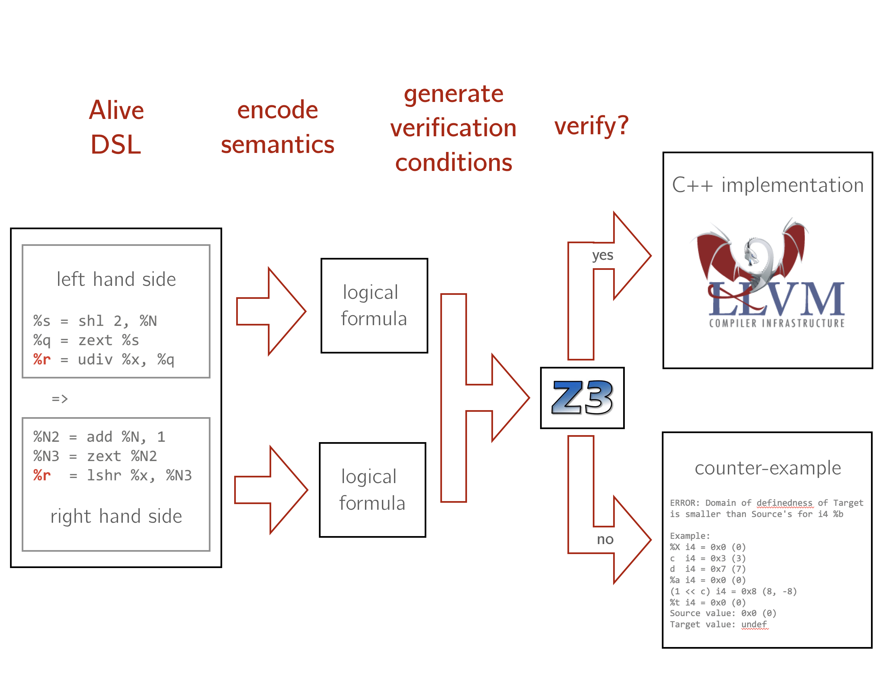
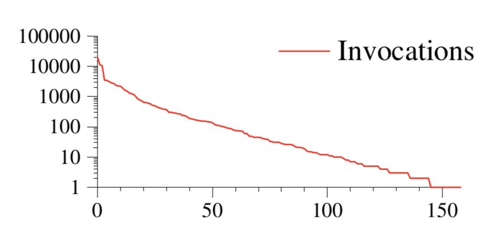

+++
title = "Provably Correct Peephole Optimizations with Alive"
extra.author = "Alexa VanHattum"
extra.author_link = "https://www.cs.cornell.edu/~avh/"
extra.bio = """
  [Alexa VanHattum](https://www.cs.cornell.edu/~avh/) is a second-year student interested in the intersection of compilers and formal methods.
  She also enjoys feminist book clubs and cooking elaborate [fish truck][] meals.
"""
+++
In previous discussions, we've considered research systems that find bugs in compiler implementations via _differential testing_.
To page you back in, [CSmith][] and [Equivalence Modulo Inputs (Orion)][emi] both used clever tactics to generate randomized test programs and inputs, with the goal of finding instances where compilers produce different output than expected.
These systems exploit a key assumption: while we don't have an oracle that determines the ground truth correct behavior for any program (without a precise semantics), we can expect compilers to produce the "same" behavior across different implementations.

On the other hand, there are fully verified compilers such as [CompCert][] that guarantee against mis-compilations, but do so at the cost of supporting entire language surfaces and getting fast, optimized code.

What about middle ground, where we leverage a correctness oracle for some particularly tricky portions of a commonly-used optimizing compiler?

Lopes et al.’s [“Provably Correct Peephole Optimizations with Alive”][paper], from PLDI 2015, takes one flavor of this approach.
Instead of treating the compiler itself as a black-box system that we try to break from the outside, Alive _proves_ that the high-level insights behind certain optimizations are correct.
Alive is built for [LLVM][], our friendly massively-optimizing, ahead-of-time, heavily-used beast of a compiler.
Alive aims to hit a design point that is _both_ practical and formal&mdash;the provable guarantees of verified compilation, for one component of a very pragmatic compiler.

[csmith]: https://www.cs.cornell.edu/courses/cs6120/2019fa/blog/bug-finding/
[emi]: https://www.cs.cornell.edu/courses/cs6120/2019fa/blog/equivalence-modulo-inputs/
[compcert]: http://compcert.inria.fr
[paper]: https://dl.acm.org/citation.cfm?id=2737965
[LLVM]: https://llvm.org

### Peephole optimizations

In particular, Alive focuses on LLVM's peephole optimizations&mdash;those that involve replacing a small set of (typically adjacent) instructions with an equivalent, faster set.
For example, a clever compiler might replace `%x = mul i8 %y, 2` (`x = y * 2`) with `%x = shl i8 %y, 1` (`x` = `y` [shift left][shl] `1`).
While these optimizations may ["delight hackers"][delight], they are also extremely tricky to get right for edge cases and boundary conditions.

Alive's specific focus was inspired by the author's previous work on [CSmith][], which found that the single buggiest file in LLVM was in the instruction combiner, home of over 20,000-C++-lines (!) of peephole optimizations.
Since its publication in 2015, Alive has been used to fix and prevent dozens of bugs and improve code concision in production LLVM.

[shl]: https://en.wikipedia.org/wiki/Arithmetic_shift
[delight]: https://dl.acm.org/citation.cfm?id=2462741

## System overview

Below is a high-level overview of Alive's approach.

First, Alive comes with its own domain-specific language (DSL) that was designed to resemble LLVM's intermediate representation.
Optimizations are written in this DSL with a source (left hand side) and and target (right hand side) template, which abstract over constant values and exact data types.
The semantics of each side are encoded into logical formulas.
Then, Alive generates verification conditions that cover the full range of potential cases, including special treatment of undefined behavior.
The verification conditions are handed to an off-the-shelf SMT (Satisfiability Modulo Theory) solver, [Z3][], which proves their validity of provides a counterexample.
If the verification conditions are provably correct, Alive is able to generate C++ code that implements the optimization (which the developer can then link into LLVM).
If the verification conditions fail, Alive provides the developer with a counter-example (in terms of the original source and target template).

[z3]: https://github.com/Z3Prover/z3



## Grokking undefined behavior
The greatest technical challenge for a compiler or verification engineer in this space is wrangling with undefined behavior.
One of the authors of Alive, John Regehr, has [several][jr1] [excellent][jr2] [blog][jr2] posts on the topic.

### Refinement
By definition, compilers are allowed to produce different results for the same source program in the presence of undefined behavior.
However, compilers are _not_ allowed to introduce undefined behavior for a program and input that was well-defined in the unoptimized source code.
That is, the burden on a verifier like Alive is to show that optimization targets are _refinements_ of the source: the optimized target can include a more, but not less, specific subset of behaviors of the source.

To illustrate this, let's look at a [real bug][PR20186] in an optimization that Alive discovered in production LLVM (also described [here][jr1]).
The optimization aims to simplify an expression that negates the division of a variable `x` with a constant `C`, from the explicit `0 - (x/C)`, to the simpler `x / -C`.

In the Alive DSL, we specify this with:

```
%div = sdiv %x, C
%r = sub 0, %div
  =>
%r = sdiv %x, -C
```

When we hand this optimization off to Alive, we get:

```
Precondition: true
%div = sdiv %x, C
%r = sub 0, %div
  =>
%r = sdiv %x, -C

Done: 1
ERROR: Domain of definedness of Target is smaller than Source's for i2 %r

Example:
%x i2 = 2 (0x2)
C i2 = 1 (0x1)
%div i2 = 2 (0x2)
Source value: 2 (0x2)
Target value: undef
```

The problem here is the interplay between an edge case (signed integer overflow) and undefined behavior.
When the concrete type is `i2` and the values are `x = -2` and `C = 1`, `x/-C = -2/-1 = 2`, but `2` overflows a 2-bit signed integer! While mathematically this is also true in the source template, LLVM's language reference states that overflow in `sdiv` is undefined behavior, the same of which is not true for `sub`.
Thus, the target template introduced undefined behavior in a case where there previously was none, so it is _not_ a refinement.

In order to fix this bug, the LLVM developers added a precondition that `C != 1` and `C` is not a sign bit.
In Alive, we can represent this precondition as ` ((C != 1) && !isSignBit(C))`, and the optimization verifies.

### Poison
An additional complication in handling undefined behavior is that LLVM actually has two flavors of _deferred_ (non-crashing) undefined behavior: the `undef` value, and implicit _poisoned_ values.

Poison values are a stronger form of undefined behavior: they happen when a side-effect-free instruction produces a result that might later trigger undefined behavior.
The true undefined behavior only occurs if/when a poisoned value is later used by an instruction that _does_ have side effects (for example, a division by zero).
Poison values are not represented explicitly in LLVM IR, and can only be identified via careful analysis.
Alive models poison in a similar way to `undef` values: target templates can only yield poison values if the source did as well.

[jr1]: https://blog.regehr.org/archives/1170
[jr2]: https://blog.regehr.org/archives/1467
[jr3]: https://blog.regehr.org/archives/1496
[PR20186]: https://bugs.llvm.org/show_bug.cgi?id=20186

## Evaluating Alive's impact
At the time of publication in 2015, Alive's authors (manually) ported 334 peephole optimizations.
Optimizations varied in verification time from a few seconds to several hours.
From these 334 optimizations, Alive found 8 bugs.

In addition, the authors build a version of LLVM with the default instruction combiner replaced by Alive-generated C++ for their 334 optimizations.
They found that despite not covering all of the previous optimizations, LLVM+Alive maintained within 10% of the performance of LLVM on SPEC 2000 and 2006 benchmarks.
Much more interestingly, however, the authors show how little coverage these optimizations received in the existing tests and benchmarks.
An instrumented LLVM-Alive run on LLVM's nightly test suite and both SPEC benchmarks found that only 159 of the 334 optimizations were triggered:



That is, nearly half of the peephole optimizations ported to Alive were untested via the existing manual test and benchmark flow!

In addition to their hard performance numbers, Alive's authors reached out to LLVM developers to incorporate Alive into work-in-progress patches.
The authors report they found "dozens" of proposed incorrect optimization implementations, which they were able to provide counter-examples to prevent with the help of Alive.

## Key take-aways
Alive leaves us with several key nuggets of wisdom:

#### *DSL + SMT = profit*
Alive demonstrates that finding a domain-specific language for your goals, in this case concise peephole optimizations, can be especially fruitful for verification.
The authors argue that DSLs help compiler engineers reason about code.
Beyond that, Alive shows that a DSL makes translation of semantics to a formal logic like SMT more tractable than trying to wrangle with the full semantics of languages like C or LLVM IR directly.
Later work on Alive (["Alive2"][a2]) has also introduced tools to help translate LLVM IR to Alive's DSL in an automated fashion.

[a2]: https://github.com/AliveToolkit/alive2

#### *Usability matters in formal methods*

Alive is a formal system, but it is also a deeply practical one.
It recognized that there is impact to be had from building verification systems closer to where working programmers spend their day-to-day-hacking, in part by targeting a massive existing code base in a piecewise, workable way.
In addition, Alive's DSL and counter-examples were designed with an interface meant to be familiar to LLVM engineers, which undoubtedly paid off in the adoption of this work.
Finally, the authors of Alive engaged closely with the LLVM community, from frequenting the RFC discussion channels to publishing high-level blog posts on their contributions.
A less optimistic lesson, however, is that technology transfer is _still_ **really** hard.
Despite the project's deep engagement with the community, LLVM has still not wholesale replaced most of its instruction combinations with Alive-generated code.
There is always more work to be done reconciling ideals from research prototypes with the difficult constraints of industry-scale software engineering!

#### *Undefined behavior is pernicious*
One of the trickiest part of the job for both industry compiler engineers and research verification hackers is dealing with undefined behavior.
Eliminating undefined behavior entirely isn't feasible in an aggressive optimizing compiler that wants to exploit speculation, so researchers need to continue to push for better methodology to keep it contained, understandable, and verifiable.
In particular, the authors of Alive have been among several researchers who have pushed for LLVM to change its treatment of deferred undefined behavior.
In 2016, they shared a proposal titled ["Killing undef and spreading poison"][prop] that advocated for removing the `undef` value, adding an IR-level `poison` value, and introducing a `freeze` instruction that would stop the prorogation of poison by resolving to an arbitrary value.
Alive includes a [branch][] modeling these new semantics.
Just last month, LLVM took another step toward realizing this vision by adding the `freeze` instruction.

<div class="center">
<blockquote class="twitter-tweet"><p lang="en" dir="ltr">the freeze instruction finally landed in LLVM!<a href="https://t.co/W6odosWUe0">https://t.co/W6odosWUe0</a><br>docs:<a href="https://t.co/kKcCpJUH1L">https://t.co/kKcCpJUH1L</a><br>lots of work left to do but this is a big step towards making LLVM have a clear and consistent undefined behavior model</p>&mdash; John Regehr (@johnregehr) <a href="https://twitter.com/johnregehr/status/1191765816422760448?ref_src=twsrc%5Etfw">November 5, 2019</a></blockquote> <script async src="https://platform.twitter.com/widgets.js" charset="utf-8"></script>
</div>

[prop]: https://lists.llvm.org/pipermail/llvm-dev/2016-October/106182.html
[branch]: https://github.com/nunoplopes/alive/tree/newsema

## What's left on the table

Alive has several threats to validity called out in the paper: Alive's implementation itself is not verified (though a later [AliveInLean][lean] verifies components), the correctness relies on the authors faithfully manually translating tricky LLVM semantics, and the bounded-verification with SMT solving is often either incomplete or slow.
In addition, later work tackles extending Alive to some [floating point optimizations][fp].

In addition, Alive opens the question of whether SMT solving can be used to _synthesize_ optimizations, instead of just verifying them once they are already written.
This type of work is often in the category of super-optimization, and is undertaken by both the previously-discussed [Chlorophyll][] project and [other][souper] [related][optgen] [projects][sands].

[lean]: https://sf.snu.ac.kr/aliveinlean/
[fp]: https://www.cs.rutgers.edu/~santosh.nagarakatte/papers/alive-fp-sas16.pdf
[chlorophyll]: https://www.cs.cornell.edu/courses/cs6120/2019fa/blog/chlorophyll/
[souper]: https://arxiv.org/pdf/1711.04422.pdf
[optgen]: https://link.springer.com/chapter/10.1007/978-3-662-46663-6_9
[sands]: https://llvm.org/devmtg/2011-11/Sands_Super-optimizingLLVMIR.pdf