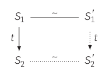
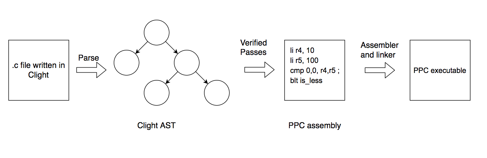
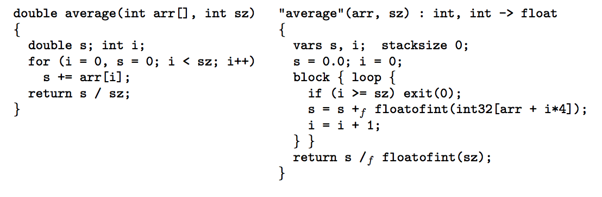
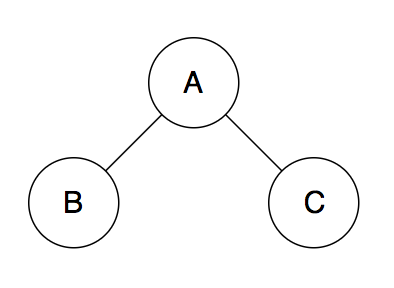
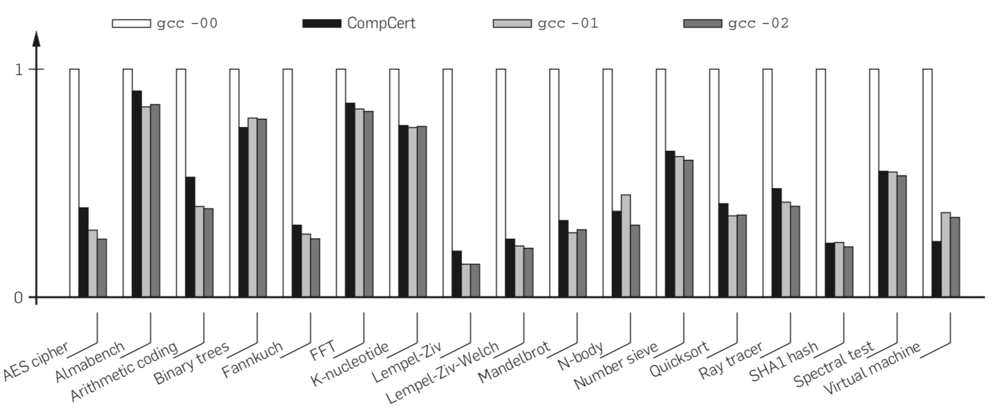

+++
title = "CompCert: Formally Verified C Compiler"
extra.author = "Samuel Thomas & Daniel Weber"
extra.latex = true
extra.bio = """
  [Samuel Thomas](https://sgtpeacock.com) is a senior undergraduate applying to Graduate Schools for programming languages.
  [Daniel Weber](https://github.com/Dan12) is an MEng student interested in programming languages and distributed systems.
"""
+++

## Motivation

The primary motivation of this paper is that compilers these days form a base of trust for most modern applications. If the application's code is correct, then compiled executable of that application will also be correct. However, most modern compilers like GCC and LLVM do have bugs, some of which silently miscompile code without emitting any error messages. Most of these bugs occur when the compiler performs transformations and optimization passes over the source program. The goal of CompCert is to create a compiler that will never silently miscompile code. The way CompCert accomplishes this is by formally verifying (i.e., proving) that each compiler pass does not change the original meaning of the program. The formally verified parts of CompCert are written in [Coq](https://coq.inria.fr/), which is a proof assistant based on the calculus of inductive constructions.

## Semantic Preservation

In order for a compiler to be correct it needs to preserve the semantics of our source program. In this section, we discuss how the paper formalizes the notion of semantic correctness.

The paper assumes that the source and target languages have formal languages that assign *observable behaviors* to each program. The notation $S \Downarrow B$ means that the program $S$ executes with observable behavior $B$. An observable behavior includes things like whether the program terminates or not, and various *going wrong* behaviors such as accessing an array out of bounds or invoking an undefined operation like dividing by zero. It also includes a trace of all external calls (system calls) that record the input and output of the external functions. However, it doesn't include the state of memory.

The strongest definition of semantic preservation is that a source program $S$ has exactly the same set of possible behaviors as a compiled program $C$:

$\forall B, S \Downarrow B \Leftrightarrow C \Downarrow B$

However, this definition is too strict because it doesn't give the compiler room to perform certain desirable optimizations, such as dead code elimination, because doing so may optimize away certain *going wrong* behaviors. For example, if the result of an operation that divides a number by zero is never used, we want the compiler to be able to get rid of it. But doing so means that the compiled program has one fewer going wrong behavior than the source program. For this reason, the paper only requires that all of the safe behaviors of the source program are preserved in the compiled program:

$S \texttt{safe} \Rightarrow (\forall B, C \Downarrow B \Rightarrow S \Downarrow B)$

$S \texttt{safe}$ is a predicate that means $S$ doesn't have any going wrong behaviors. This definition enforces that all observable behaviors of $C$ are a subset of the possible behaviors of $S$ and that if $S$ does not go wrong, then $C$ doesn't go wrong either.

The paper actually uses the contrapositive of this statement because it is practically easier to prove since you can induct on the execution of $S$:

$\forall B \notin \texttt{Wrong}, S \Downarrow B \Rightarrow C \Downarrow B$

### Verification vs. Validation
The paper models a compiler as a total function, `Comp(S)`, from source programs to either `OK(C)`, a compiled program, or `Error`, the output that represents a compile-time error, signifying that the compiler was unable to produce code. There are two approaches for establishing that a compiler has the semantic preservation property discussed above: verifying the compiler directly using formal methods or verifying a *validator*, a boolean function accompanying the compiler that verifies the output of the compiler separately. An unverified compiler along with a verified validator provides the same guarantees as a verified compiler because you can guard the result of the unverified compiler with the validator:

    Comp'(S) =
      match Comp(S) with
      | Error -> Error
      | OK(C) -> if Validate(S, C) then OK(C) else Error

The validation approach is convenient because sometimes the validator is significantly simpler than the compiler. We'll see this approach used later for verifying part of the register pass.

Verifying the compiler directly using formal methods amounts to proving that each step in the semantics of the source program corresponds to a sequence of steps in the semantics of the target program with the same observable effects. If you can also show that the initial states and final states of the source and target programs are equivalent then this proves semantic equivalence. This is represented in the following simulation diagram:



$S_1$ represents a state in the execution of a program from the source language and $S_1'$ represents the equivalent state in the execution of the target program. The `~` line is an equivalence relation between states from the source semantics to states in the target semantics. The `~` line in the diagram is showing that $S_1$ and $S_1'$ are equivalent states. The down arrows represent a single step in the execution of the program and the $t$ label represents the observable effects that took place in this step.

## Structure of the Compiler

The source language of the CompCert compiler is Clight, which is a subset of C that includes most familiar C programming constructs like pointers, arrays, structs, if/then statements and loops. The compiler front end consists of an unverified parser that parses a source file to a Clight AST. From there, the formally verified section of the compiler performs several passes that repeatedly simplify and transform the representation of the source code all the way to PowerPC assembly code. Then, an unverified assembler and linker take the assembly code and generate an executable that can be run.



In total, CompCert formally defines 8 intermediate languages and 14 passes over them. The 14 passes must be proven to preserve the semantics of the original program. The first few passes simplify the C code by converting all types to either ints or floats (pointers get converted to ints) and explicitly describing memory accesses. The result of these passes is an intermediate representation called Cminor, and below is an example of a translation from Clight to Cminor.



As you can see, function signatures have been made explicit, implicit casts have been made explicit (like the cast from float to int), array accesses have been transformed into exact byte offsets from pointers, and the size of the function's activation record has been made explicit. The explicit function activation record is used fo dealing with the address-of (&) operator, which requires function local variables to be mapped to a location on the stack frame of the function.

Next, CompCert performs instruction selection for the specific architecture that it is targeting. This is done via instruction tiling which can recognize basic algebraic identities. For example, the instruction selection pass will transform `8 + (x + 1) × 4` into `x × 4 + 12`. These algebraic identities are proven in CompCert in order to assist in the semantic preservation proof. The selected instructions are very similar to available PowerPC instructions. Next, CompCert makes the control flow of the program more explicit via a transformation to the RTL IR, which represents control flow using a CFG. In addition to generating a CFG, the RTL representation transforms variables into pseudo-registers, of which there are an unlimited supply of. The RTL representation is a convenient representation to perform optimizations on, so CompCert runs several dataflow analyses on the program in order to perform optimizations such as constant propagation, common subexpression elimination, and lazy code motion.

The next transformation pass performed by CompCert maps the pseudo registers to hardware registers or abstract stack locations using a register allocation algorithm. The algorithm implements an approximation of the graph coloring algorithm in OCaml which is used in CompCert using the validator method discussed above. Further passes linearize the CFG, spill registers on the stack and insert the necessary loads for temporaries. Some simple optimizations like branch tunneling (removing branches to branches) are also performed as part of these passes. Finally, CompCert performs instruction scheduling to increase instruction level parallelism on super scaler processors, such as PowerPC processors, and generates PowerPC assembly code.

## Verification of the Register Allocation Pass

In order to explain the verification process in more depth, the paper describes some of the more technical details of the register allocation pass. The register allocation pass operates on the RTL IR. In this representation functions are represented as CFGs with instructions that roughly map to assembly instructions supported by the PowerPC architecture. However, the instructions use an infinite supply of pseudo-registers, also known as temporaries. The execution semantics of the RTL IR are given by a set of small step semantics. The small step semantics operate over a global environment, which includes a list of all of the temporaries and their values as well as the state of memory. CompCert represents memory as a collection of blocks with a bounded size. Pointers are described as pointing to some offset from the base of a memory block.

In order to produce performant code, as many of the temporaries as possible should be mapped to hardware registers instead of being stored on the stack. The register allocation algorithm starts with a liveness analysis of each program point. For every program point $l$ the liveness analysis computes the set of variables that are live coming into program point $l$. This is typically expressed by solving the reverse dataflow equations with a transfer function that removes all defined temporaries at program point $l$ and adds all temporaries that were used at program point $l$. Consider the following code snippet:

```
1  b = a + 2;
2  c = b*b;
3  b = c + 1;
4  return b*a;
```

On line 4, the variables $a$ and $b$ are live. Program point 3 defines $b$ and uses $c$. Therefore, variable $c$ must be live at line 3. However, $b$ must no longer be live before line 3 because it was just redefined. On line 2, $c$ is defined and $b$ is used, so $c$ is no longer live but $b$ is. Finally, on line 1 $b$ is defined so it is not live before line 1. This gives the following live variable sets coming into each program point:

```
1  b = a + 2;     LV = {a}
2  c = b*b;       LV = {a,b}
3  b = c + 1;     LV = {a,c}
4  return b*a;    LV = {a,b}
```

The reason live variable analysis is important for register allocation is that it helps build an interference graph. The interference graph represents temporaries as nodes. Edges between two nodes A and B mean that temporaries A and B cannot be assigned the same hardware register. If two temporaries are live at the same time, then they cannot be assigned to the same hardware register. When building the interference graph you simply inspect the live variable sets at each program point and add edges between all temporaries in the live variable set. Then, you need to color the graph to assign temporaries to hardware registers. For the above code snippet the interference graph would be:



The live variable analysis is implemented in Coq. Furthermore, the analysis is proven to generate live variable sets that are supersets of the actual live variable sets at a program point. The paper claims this is easier to prove and does not violate the correctness of the register allocation step. This is because supersets of the actual live variable sets only add more edges to the interference graph, which still maintains the correctness of the register allocation pass.

The actual coloring of the interference graph is implemented in unverified OCaml code due to its complexity. The function is then used in the proof of semantic preservation using the validator approach. As a reminder, the validator approach allows CompCert to use the OCaml code only if the output is valid. Otherwise, compilation fails and no code is emitted. The correctness conditions for the coloring $\phi$ of the temporaries is:

1. $\phi(r) \neq \phi(r')$ if $r$ and $r'$ interfere
2. $\phi(r) \neq l$ if $r$ and $l$ interfere ($l$ is a machine register or stack location. The interference graph can be pre-colored and some pseudo registers can interfere with hardware registers or stack locations)
3. $\phi(r)$ and $r$ have the same register class (either int or float)

After coloring the graph, the RTL IR is transformed to LTL IR by replacing temporaries according to the mapping $\phi$. For each temporary $r$, $\phi(r)$ either a hardware register or a stack location. In order to prove that the transformation preserves the semantics of the original program, the lock-step simulation approach discussed above is used. The equivalence relation on states requires that control flow is preserved, memory contents are the same, and that the registers are somehow preserved. The first two properties are intuitively correct because register allocation doesn't really affect control flow or memory state at a program point. However, the equivalence between temporaries and hardware registers is a bit more subtle. This is because the value in a hardware register might not be the same as the value in a temporary mapped to it. For example, if two temporaries that do not interfere are mapped to the same hardware register, the value in the hardware register will not be the same as one of the two temporary values at some point in time. Therefore, the paper states that a relaxation was proven where at every program point $l$, $R(r) = R'(\phi(r))$ for all $r$ live at point $l$ ($R$ is the state of the register mapping).

## Evaluation

In general CompCert is able to output code with similar performance characteristics to gcc at -O1 and -O2.



However, we think a more important metric is the correctness of CompCert, since this was the primary purpose of creating it. This is something the paper was not able to do because nobody had seriously tested CompCert at the time of the paper's release. However, several automated compiler testing tools such as [Csmith](https://www.cs.utah.edu/~regehr/papers/pldi11-preprint.pdf) and Orion (from the [Equivalence Module Inputs](http://vuminhle.com/pdf/pldi14-emi.pdf) paper) have reported a handful of bugs in CompCert over the years. We looked into issues on the official CompCert GitHub page and bug reports generated by Orion to try and figure out what some of the bugs were and where the manifested themselves.

The GitHub repository for [CompCert](https://github.com/AbsInt/CompCert) seems to have been created in 2015, while the paper is dated 2009. So there may be several bugs found in the original version of CompCert that were patched when the GitHub repository was started. The Orion project includes a [page](https://web.cs.ucdavis.edu/~su/emi-project/compcert.html) with all of the bugs it found that led to open issues on the CompCert GitHub repository. There are 31 total issues on this list, with 27 of them being marked as fixed and the remaining 4 marked as won't fix. This list of issues was reported between August 2016 and May 2017. Most of the issues reported seem to be issues in the front end OCaml code and are mostly crash failures. There are a few crash failures associated with the unverified register allocation code that seem to have required some updates to the Coq proofs such as [issue 183](https://github.com/AbsInt/CompCert/issues/183). However, it does not appear as if there was a case where CompCert silently generated a miscompilation due to an error in the formally verified parts of CompCert. This suggests that CompCert does indeed succeed at its goal of creating a C compiler with no miscompilation bugs.
