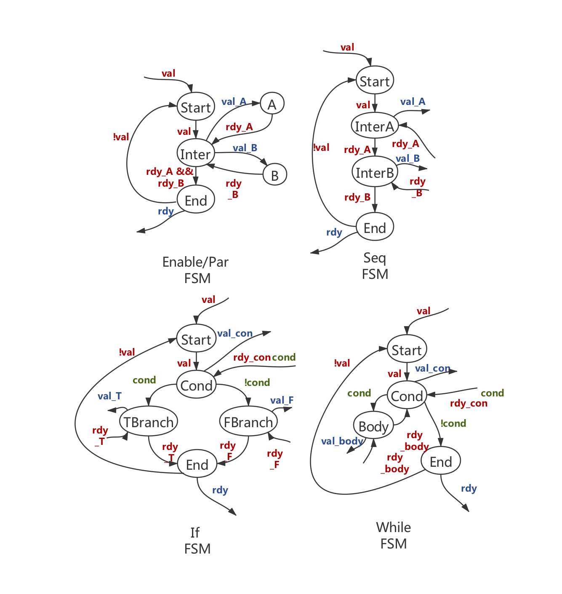
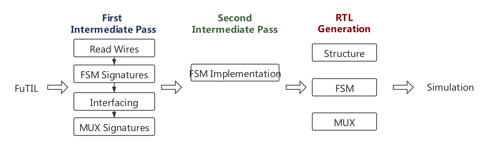

+++
title = "Runtime Execution Profiling using LLVM"
extra.author = "Yi Jing, Zhijing Li, Neil Adit, Kenneth Fang, Sam Thomas"
extra.bio = """
[Zhijing Li](https://tissue3.github.io/) is a 2nd year Phd student at ECE department, Cornell. She is interested in compiler optimization and domain-specific languages. 
[Yi Jiang](http://www.cs.cornell.edu/~yijiang/) is a 2nd year Phd student in CS dept, Cornell. She is interested in designing compilers for Processing-In-Memory related architectures and also general compiler optimization. \n
[Neil Adit](http://www.neiladit.com) is (guess what!) also a 2nd year PhD student at CSL, Cornell. He is interested in fun things in compiler research.

"""
extra.latex = true

+++


## Goal


The goal of this project to generate Control FSM for FuTIL, which can be divided into the following two parts:

- Convert a Control AST in FuTIL to an intermediate FSM structure
- Generate RTL from the intermediate FSM structure

## Background

FuTIL is an intermediate language that represents hardware as a combination of *structure* and *control*. The *structure* represents how subcomponents are instanced and wired together, while the *control* determines how these subcomponents are activated at different times. The ultimate goal of FuTIL is to provide an RTL backend for the Dahlia language. The structure is fairly straightforward to convert to RTL, which easily represents components and wires, but the control flow statements have no straightforward representation in RTL. We will convert the control statements in FuTIL into an RTL FSM to facilitate RTL generation from FuTIL.

A typical FuTIL program is shown below:

```fut
(define/namespace prog
  (define/component main () ()
    ((new-std a0 (std_reg 32 0))
     (-> (@ const0 out) (@ a0 in))
     (new-std const0 (std_const 32 2))
     (new-std b0 (std_reg 32 0))
     (-> (@ const1 out) (@ b0 in))
     (new-std const1 (std_const 32 1))
     (new-std gt0 (std_gt 32))
     (-> (@ a0 out) (@ gt0 left))
     (-> (@ const2 out) (@ gt0 right))
     (new-std const2 (std_const 32 1))
     (new-std y0 (std_reg 32 0))
     (-> (@ const3 out) (@ y0 in))
     (new-std const3 (std_const 32 2))
     (new-std z0 (std_reg 32 0))
     (-> (@ const4 out) (@ z0 in))
     (new-std const4 (std_const 32 4)))
    (seq
     (par
      (enable a0 const0)
      (enable b0 const1))
     (if (@ gt0 out) (enable gt0 a0 const2)
         (enable y0 const3)
         (enable z0 const4)))))
```

It is composed of structure and control parts. The structure part is straight forward: ` (new-std b0 (std_reg 32 0))` stands for instantiation of the library component `b0` with parameter `32` and `0`, and `(-> (@ a0 out) (@ gt0 left))` stands for wiring the `out` port of component `a0` with `left` port of component `gt0`. The control part specifies which components are active with `enable` keyword, and the execution logic with `par`, `seq`,`if` and`while` keywords.

In this project, we are interested in changing all the control logic to finite state machines (FSMs) and then generate simulatable Verilog program based on both FSMs and the structures.


## Design Overview

FuTIL is the backend for Dahlia. The FuTIL semantics is designed in favor of smallest effort from high level language Dahlia to FuTIL language, but this opens a gap between FuTIL semantics and RTL implementations. The table below shows the efforts required to translate the FuTIL semantics to synthesizable Verilog implementations.

| FuTIL Semantics   | Verilog         |
| ----------------- | --------------- |
| Invalid wire      | Read wires      |
| Component Reusing | MUX, Read wires |
| Control           | FSM             |

### *Read* Signals

In FuTIL semantics, `enable` keyword is used to determine whether a component is active. It is the easiest way of translating a program into hardware. However, this implicitly assumes that the signal on a wire is not valid or readable until we `enable` a component. We therefore require any *data* wire to have one extra bit to specify whether the signal is readable.

### *MUX*

A component can be used more than once in FuTIL. For instance, if we reuse variable `a0`, then the register need to choose the input from const0 and const2. This introduces a multiplexer (MUX).  

```futil
(enable a0 const0)
(enable a0 const2)
```

At different time step, read signals tells which wire to the MUX is readable. Therefore, read wires serve as **sel** signals for MUX.

### *FSM*

In FuTIL, there are control logics like `if`, `while` and etc. This can be translated into FSM in Verilog implementation, which is the main goal of this project. However, before getting to that, we created intermediate FSM expressions in FuTIL. An FSM component has:

- input and output ports,
- connection of wires between its own ports and other components's port,
- internal control logic that determine the output signals.

The internal control logic of a FSM component can be divided into several states that determines the output signals. A state transfers to another according to some input signals. In general, all FSM components are composed of one **Start** state, some **Intermediate** states and **End** state. 

Consider the syntax `(enable A B)` . The **Start** state transfers to the **Intermediate** when the *valid* signal is high. At the **Intermediate** state, the FSM sends out valid signals to subcomponents `A` and `B`, and waits for *ready* signals from them to be high. Once both of the *ready* signals are high, the FSM transfers to **End** state and outputs *ready* signals to notify upper components. It transfers back to **Start** state when *valid* signal is low, indicating the upper components have received the *ready* signal and finished execution so it is safe for the FSM to go back to the **Start** state. The same design logic applies to all FSMs. The only difference happens in intermediate state(s): `seq` FSM has one or more intermediate states and one intermediate only transfers to next state when receiving high *ready* signal from the previous state; `if` FSM send *valid* to the module that execute the comparison and receive both *ready* and *condition* signals and determine which state it should transfer to with the *condition* signal; `while` FSM transfers to loop **Body** state when *condition* signal is high and goes to **End** State when condition is low.




## Implementation



At implementation, to realize what we describe in design overview, we gradually added intermediate passes.  

### First Intermediate Pass

There is a *Visitor* trait in this pass, which performs a recursive walk of abstract syntax tree (AST), so each individual pass can perform modification to the AST with function calls including `add_structure`, `add_input_port`, `remove_structure`, and etc provided in struct `Changes`.

#### Read Wires

The first pass is adding read wires. We go though all input and output ports of each component, adding corresponding *read* ports, and then each wire of the components and adding *read* wires to the ports. We do this pass ahead of creating FSM signatures because we don't want to create *read* wires for control signals like *valid* and *ready*.

#### FSM Signatures

This pass translates control syntax to FSM components.

Based on the design logic of FSMs, we can specify the inputs and outputs of each FSM component and the wires connecting each ports to its subcomponents. Notice we also need to add *cond_read* signals to specify whether the *condition* signal from the comparison component is readable.

| FSM                  | Input Ports                                   | Output Ports                 |
| -------------------- | --------------------------------------------- | ---------------------------- |
| `enable`/`par`/`seq` | *val, rdy_A, rdy_B, ...*                      | *rdy, val_A, val_B, ...*     |
| `if`                 | *val, rdy_con, cond, cond_read, rdy_T, rdy_F* | *rdy, val_con, val_T, val_F* |
| `while`              | *val, rdy_con, cond, cond_read, rdy_body*     | *rdy, val_con, val_body*     |


### Interfacing

This pass creates input port *clock* for all components and *valid* for the top level component. Notice in FuTIL we actually does not have the notion of logical time step. However, to make things easier for RTL translation, we created these ports.

#### MUX Signatures

Similar to creating FSM signatures, we need to specify the inputs and outputs of each MUX component and the wires connecting each ports to its subcomponents. To do this, we create a Hashmap indexing with destination ports and store a vector of source ports according to the wiring of the component. For each destination port, if there are more than one source port connecting to it, we create an MUX. 

Notice there is a difference between control signal and data signals though. Control signals do not have corresponding *read* wires and no matter which control signal is high, the output is high. On the other hand, data signals always have corresponding *read* wires to explicitly specify if the data on the *data* wire is readable. The data signal should be chosen according to its *read* wires. Therefore at implementation, we go through wires twice. The first time we go through it we record *read* wires going to the same destination components. The second time we go through it we actually create the large MUX with both *data* and corresponding *read* wires.

The last step is removing old wires connecting the same destination port with more than one source port.

### Second Intermediate Pass

#### FSM Implementation

This pass creates true FSM representation in FuTIL AST.  Each `FSM` has a *name* field, a *states* Hashmap storing states and indexing of the state, a *start index* corresponding to the first state being created and a *last index* pointing to the last state being created. Each `State` is composed of a vector of *outputs*, where each *output* is specified with output *value* and *port name* and a vector for *transitions*, where each transition is a tuple of *next state index* and *inputs* of *value* and *port name*, so that the transition happens when the input has certain *value*. Finally, there is a default state for each state that is an optional field, telling which state it should transit to when no *transition* condition is met.

We provide abstract methods `new(name: &str) -> StateIndex`, `new_state() -> StateIndex`, `get_state(idx: StateIndex) -> &mut State` for `FSM` and `push_output(output: ValuedPort)`and `add_transition(transition: Edge) ` for `State` to generate actual FSM inner logic according to the graph we made in design review.


###  FSM to RTL generation

After generating an FSM, we need to translate the entire structure of inputs, outputs and states to synthesizable hardware using Verilog. This is done by breaking down a verilog file into distinct components.

1. Module Declaration- Here we define the name of the module alongwith the inputs and outputs for it.
2. Wire/reg definitions- These are internal signals that are used within the module.
3. FSM- FSMs can be represented in Verilog using 3 `always` blocks - State transition, Next state logic, State outputs. 

To expand on how all the 3 `always` blocks are generated we discuss them below:

1. State transition- This is pretty standard. It actually changes the state at a clock edge. Since this is a generic block it can be create without any inputs.
2. Next state logic- This block has a bunch of cases for all the states. For each state in the FSM struct, based on the input transitions to it, we have `if else`  statements for next state logic. 
3. Output logic- This block contains output signals for each state represented by cases, similar to the previous block. In addition to having verilog statements for all the relevant outputs in the state, we also assign the rest of the outputs of the FSM to be zero for now. This is done to avoid inferred latches, which can occur if all outputs are not assigned in each state even though they don't change.

We used `RcDoc` for formatting the Verilog files.


## Hardest Parts

1. FuTIL is implemented with [Rust](<https://www.rust-lang.org/>), so we spent some time to get familiar with the language. 
2. The design of FSM representation changes multiple times. Because the state should be store as pointer and then modified when we add transition and outputs to it. Rust will force the user use reference counter, which we did not realize at first. Also, even with reference counting, our implementation will result in endless loop when printed out. We therefore rely on Hashmap in the end.
3. FuTIL *read* signals are not common in Verilog coding convention. We had two models in our minds, the Verilog valid/response model and our FuTIL valid/read model. We messed things up because of the existing of the two models and spent huge amount of time discussing which one should be the most ideal design.

## Evaluation 


