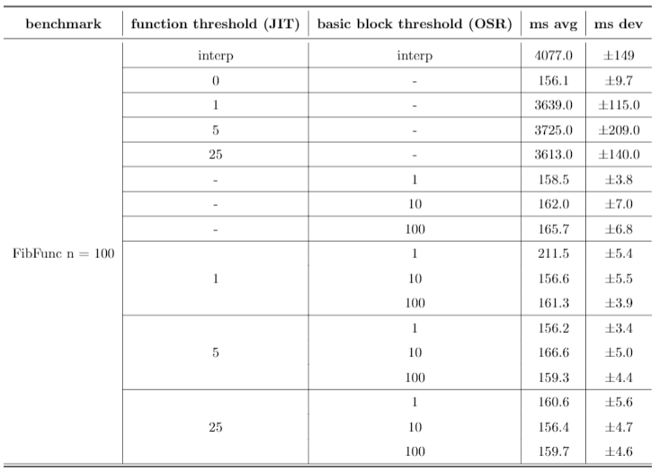
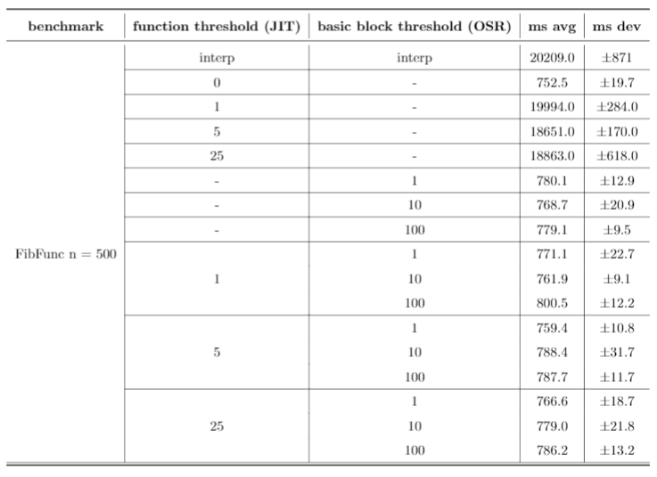
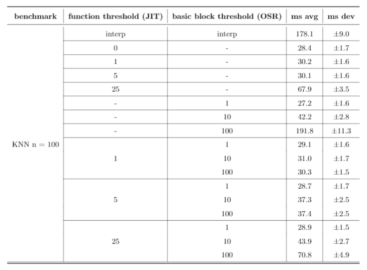
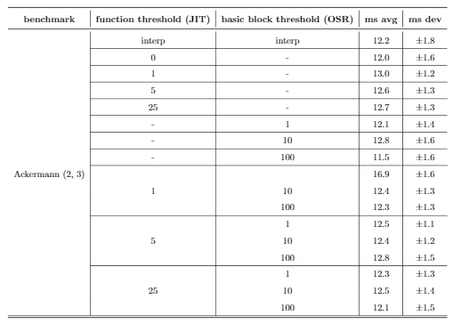

+++
title = "Bril JIT with On-Stack Replacement"
[extra]
bio = """
Gautam Mekkat, Mark Anastos, Eashan Garg and Sameer Lal are students at Cornell
University who collectively study 75% Electrical & Computer Engineering and 100%
Computer Science at a 25% graduate level.
"""
[[extra.authors]]
name = "Gautam Mekkat"
link = "https://github.com/Blue9"
[[extra.authors]]
name = "Mark Anastos"
link = "https://github.com/anastos"
[[extra.authors]]
name = "Eashan Garg"
link = "https://github.com/splashofcrimson"
[[extra.authors]]
name = "Sameer Lal"
link = "https://github.com/sameerlal"
+++

## Interpreters

Many widely-used programming languages such as Python and JavaScript rely
heavily on interpreters. Some representation of the source code is passed to the
interpreter, where the instructions are evaluated immediately.

Since interpreters do not translate source programs to machine code and they
only consider the subset of instructions that are actually evaluated at run time,
startup cost for a program is minimized. This is huge for developers who may
update and run programs hundreds of times over. So interpreters are fast for
source translation but overall have slow performance because they are not
optimized for the architecture itself.

## JITs and On-Stack Replacement

Ideally, we want to compile our program to machine code which will allow us to
perform platform specific optimizations. However, compilation can be costly and
in doing so, we lose the startup time benefit of an interpreter.

A just-in-time (JIT) compiler attemps to find the best of both worlds. Instead
of compiling source code ahead of time, a JIT compiler aims to compile code at
run time. There are three advantages to highlight with this approach:

1. Only the functions that the program executes at run time are compiled to
machine code. In addition, every compilation is much smaller in scope, so this
overhead is spread throughout the execution.
2. Run-time profiling information can be utilized for more advanced
optimizations that ahead-of-time (AOT) compilers cannot take advantage of.
3. By compiling at run time, users only need to install one version of a program,
as the JIT can dynamically resolve the architecture it needs to compile source
code to. For example, Java code is compiled to platform-independent Java
bytecode, which can then be executed by a platform-aware Java Virtual Machine
(JVM).

The main benefit of a JIT is the speed-up; the process that starts from source
code and ends with execution can often be completed faster with JIT compilation
than with interpretation or with regular compilation followed by execution.
While a basic JIT compiler will always compile a code fragment when it is
reached in the execution, more sophisticated versions can incorporate an
interpreter. The JIT will then decide to interpret a section of code if it seems
like the upfront time cost of compilation would not be made up for by the speed
gains of native execution over interpretation. This allows us to combine the
start-up benefits of an interpreter with the speed of a JIT.

One problem with traditional JITs is that they often compile code in fairly
large segments, typically at the function level or even entire files. This poses
a problem because a JIT compiler may decide to interpret a function based off of
its heuristic, when it should actually compile it for the best performance.
Furthermore, once the JIT has decided to, say, interpret a function, it cannot
change that decision until the next time the function is reached. If a function
being interpreted turns out to execute for much longer than expected, we have no
way to optimize it until it ends. As such, we need a way to retroactively decide
when to compile snippets of code.

The solution to this is **on-stack replacement** (OSR). In the middle of
executing a function in interpreted mode, we may decide to compile the function
to get better performance. This is different from a normal JIT, which will
either compile the entire function or not compile it at all.

Consider the following [Bril][] program:

```
main {
  one: int = const 1;
  b: bool = const true;
  c: int = const 0;
  max: int = const 1000;
loop:  
  c: int = add c one;
  b: bool = le c max;
  br b loop end;
end:
  # Rest of program
}
```

Naïvely, a JIT compiler may not compile the main function as it appears to be
short or not computationally intensive. However, upon execution, a JIT with OSR
will be able to see that the same snippet of code is running over and over
again, and will switch from interpreted mode to compiled mode to enhance
performance.

On-stack replacement is more complicated implementation-wise than normal
just-in-time compilation, as it needs to map the current state of execution from
the interpreter to the compiled execution. This includes placing the values of
variables in the correct positions, as well as resuming execution from the
correct program point. We use a heuristic marking code sections that are
frequently run as "hot," and then compiling a function with OSR if any section
in it is determined to be sufficiently hot. This allows us to switch from
interpreted to compiled code when it will likely be beneficial, and allows us to
get the benefits of both modes of execution.

[Bril]: https://capra.cs.cornell.edu/bril/

## Design Overview

In order to explore the use cases for JITs and on-stack replacement, we built
[Bril-OSR][]. Here's how it works.

At Bril-OSR's core is an efficient interpreter, with a series of arguments to
toggle its various features on and off. With the `-jit` flag turned on, the
interpreter will compile functions to x86-64 machine code at run time, and
execute them. The threshold at which the interpreter compiles functions can be
tuned by the programmer, representing the number of times a function must be
called before it is compiled. The `-osr` flag is similar, although it operates
at a basic block level. If a block is executed *n* times by the program at
run time, the function housing it will be compiled to machine code, and
evaluation will resume where the interpreter left off. The value of *n* is also
configurable as an argument to Bril-OSR.

**Note**: We decided to write Bril-OSR in Rust for two main reasons:
1. A compiled systems language, when used well, should give some exciting
performance boosts (especially when compared to the baseline TypeScript
interpreter, Brili).
2. The `dynasm-rs` crate is an awesome tool for code generation, and is built
with just-in-time compilers in mind!

[Bril-OSR]: https://github.com/splashofcrimson/jit-bril

### Building a Faster Interpreter in Rust
To provide a fair baseline to compare with both the JIT and the JIT with OSR, we
built an efficient interpreter in Rust.

First, we took advantage of the [Serde][] crate to deserialize Bril JSON into
native Rust structs that represent a Bril program. With
`#[derive(Deserialize)]`, this process is fairly automatic, and the generated
code is quite efficient as well! To make interpretation easier, the structs
implement the `From` trait to map Rust strings to specialized enums that
represent opcodes and types in Bril.

Interpretation is implemented by pattern matching by opcode, since each line in
Bril only has a single operation. Variables and their values are stored in an
environment map local to the function that is currently evaluating. On function
calls, Bril-OSR creates a new environment map with the function arguments, and
passes evaluation to the callee.

**Note**: We built off of our first project, [Bril()][], as we need to support
multiple functions, arguments, calls, and return values.

[Serde]: https://serde.rs/
[Bril()]: https://www.cs.cornell.edu/courses/cs6120/2019fa/blog/making-function-calls-work/

### Code Generation and JIT Compilation

To build a JIT compiler, we needed infrastructure for code generation. We used
[`dynasm-rs`][] to be able to write assembly code and have it dynamically
assemble and execute as part of the Rust program. Our translation from Bril to
assembly is rather simplistic, as we do not implement any sort of register
allocation or other optimizations.

We first create a standard assembly [function prologue][], which involves
storing the current base pointer, and allocating stack space for this function.
We allocate one 64-bit word of stack space for each unique variable that is
defined in the function or is an argument to the function.

Next, we iterate through the instructions of the Bril program and generate
assembly code for each. The assembly for most Bril instructions generally
follows the structure of getting a variable from the stack, applying some
operation to it, and then storing back on the stack. For example, the assembly
for an instruction `a: int = add b c` would look roughly like:

```
mov rax, [rbp - b_stack_position]
add rax, [rbp - c_stack_position]
mov [rbp - a_stack_position], rax
```

In order to implement the `print` instruction, we created basic Rust functions
to print an integer or a boolean, and then used standard calling conventions to
call these functions from the assembly code.

[function prologue]: https://en.wikipedia.org/wiki/Function_prologue
[`dynasm-rs`]: https://github.com/CensoredUsername/dynasm-rs

#### Function Calls

The most difficult part of code generation was implementing function calls (as
defined in the Bril() language extension). Because this is a just-in-time
compiler, a function being called may or may not already be compiled. As such,
we cannot simply call the other function using standard calling conventions.
Instead, we created another Rust function, `handle_call`, for the assembly to
call when encountering a Bril `call` instruction. To this function, the assembly
passes an integer identifying the Bril function that it wants to call.

This function can then see if the Bril function has already been compiled, and
run it if so, or otherwise decide whether to compile it now or interpret it.
However, to perform these actions, `handle_call` needs access to the internal
state of the compiler, and, as such, really needs to be a method of the main
compiler struct. And, to call a method, you need to pass in a reference to the
`self` variable. As such, the assembly Bril function needs to have a reference
to this struct. To solve this, we decided on a convention that every time an
assembly function is called, it is passed a reference to `self` as an argument.
That reference is then stored on the stack for later use.

Handling function arguments was quite tricky, as Bril() functions can have any
arbitrary number of arguments, and the Rust `handle_call` function must be able
to pass along these arguments. Because Rust does not support functions with
variable numbers of arguments, we decided to pass the Bril arguments in a Rust
vector to `handle_call`. It took considerable effort to figure out how to create
a vector from assembly, and pass it as an argument. Unable to find any
definitive information on how vectors are implemented, we resorted to
reverse-engineering vector uses. We heavily used the [Godbolt][] compiler
explorer to quickly see the assembly generated from Rust functions. We made
assumptions about how vectors work based on the outputs we saw, and based our
implementation of function arguments on those assumptions. Having done this, we
were able to construct Rust vectors from assembly and pass them to the
`handle_call` function, which then forwards them to the callee Bril function to
be deconstructed.

Implementing returning values from Bril functions was considerably easier, as
they can just be placed in the return register (`rax`), and then forwarded back
through `handle_call` to the caller.

[Godbolt]: https://godbolt.org

#### Combining the JIT with the Interpreter

To improve the performance of the JIT, we combined it with the interpreter. We
extended the interpreter to perform basic profiling. It maintains a counter for
each function, keeping track of how many times that function has run. Then, once
that counter reaches a fixed value, the program will then compile the function
instead of interpreting it. After that, every time the function is called, the
compiled version can be simply run.

### On-Stack Replacement

To implement on-stack replacement, we extend the profiling information from the
previous section to keep track of the number of times each basic block in a
function is executed. If a function is being interpreted and one of these
counters reaches a certain fixed value, OSR will be initiated immediately. Code
generation will then proceed as before, but with a few OSR-specific additions.
The basic structure of a function compiled via OSR is as follows:

```
osr_start:
    # prologue
    # move variable values to stack
    jmp osr_first_inst

regular_start:
    # prologue
    # ...
osr_first_inst:
    # ...
```

As such, the assembly has additional code at `osr_start` which will only execute
this one time for completing the on-stack replacement. Future calls to this
function will ignore all of that and start from the `regular_start`. In this new
section of the assembly, we move the current values of all of the variables to
their appropriate positions in the stack, and then jump to whatever instruction
the interpreter was about to execute.

## Evaluation

To evaluate Bril-OSR, we aimed to first verify its correctness using the
existing [brili](https://github.com/sampsyo/bril) interpreter as a benchmark,
and then its performance on a series of reasonably large-scale Bril tests.

All tests were run on an Intel Core i7-7700HQ CPU @ 2.80GHz with 16GB of RAM,
and using Ubuntu on WSL.

## Correctness Tests

First, we generated multiple programs that covered the breadth of Bril opcodes
from a configurable Python script. We ran the correctness suite on both the
interpreter and just-in-time code generation engine, and ensured that the
run-time effects matched those of Brili.

**Note**: Inspired by Alexa and Gregory's foray into
[Hypothesis](https://hypothesis.works/), we attempted to write property-based
tests for Bril-OSR using Rust's
[quickcheck](https://docs.rs/quickcheck/0.9.0/quickcheck/) crate. Unfortunately,
generating structures representing Bril programs was difficult, so we abandoned
this project. Still, this would be a cool extension to Bril-OSR's correctness
test suite.

## Performance Tests (Sensitivity Study)

In order to compare the performance of the various components of Bril-OSR, we
composed an ablation study.

The three benchmarks we used to evaluate against are as follows:

1. **FibFunc with `n` = 100, `n` = 500**: `n` functions each iteratively compute
a random, long-running Fibonacci sequence, and returns to main.
2. **KNN with `n` = 100, `n` = 500**: implementation of K=1 Nearest Neighbors in
Bril, with `n` training and testing points.
3. **Ackermann with `n` = 2, `m` = 3**: implementation of the Ackermann function.

Each benchmark was run against each of the following configurations at least 10
times, and the averages/deviations were computed with
[hyperfine](https://github.com/sharkdp/hyperfine) (shoutout to Wil and Daniel
Glus for the
[inspiration](https://www.cs.cornell.edu/courses/cs6120/2019fa/blog/faster-interpreter/)).

The first row for each benchmark runs just the Rust interpreter, the second row
runs the JIT on every function, and the remaining rows all run different
combinations of heuristics for both the function-level JIT and our
implementation of OSR. *Function threshold* is defined as the number of times a
function is interpreted before it is compiled, and *basic block threshold* is
defined as the number of times a basic block is interpreted before it is
compiled. All times are listed in milliseconds.







Bril-OSR's interpreter is typically at least 10x slower than any of the other
configurations, except interestingly with the Ackermann benchmark. This is most
likely because it's a smaller benchmark, and the compilation overhead offsets
any performance gains from machine code.

Solely using the function-level JIT performed well for both the KNN benchmarks
for smaller thresholds. As the threshold increased, however, performance began
to tank, and is almost 10x worse for n = 500 when the threshold is 25. In
addition, these configurations performed poorly against the FibFunc benchmarks,
presumably because they lack many calls to the same function.

Solely using on-stack replacement on a basic block level perfomed well on the
FibFunc and Ackermann benchmarks, and actually showed very similar performance
to the mixed configurations tested later. However, it performed relatively
poorly on the KNN benchmarks, presumably because they lack many loops.

Finally, the mixed configurations tended to work well universally when compared
to the others, and based on our benchmarks we lean towards concluding that both
function-level JITs and basic-block level OSR are effective for performance
gains. However, these results still are not very conclusive. JITing every single
function performs the best on every single benchmark, and so we can only really
conclude that compiling more often is better. Regardless, these strategies still
show promise - given more expansive benchmarks (on the level of SQL or a
similarly large project), the benefits of JITs and OSR could become more
apparent.

## Future Work

Bril-OSR succesfully implements examples of both just-in-time compilation and
on-stack replacement, but more importantly, it provides a framework to build
upon with more interesting heuristics and utilization.

First, we would love to incorporate more evaluators to the framework. We could
add an optimizing compiler and switch between all three evaluators based on more
complex heuristics. We can add arbritrary levels of evaluators like this, and do
a more in depth ablation study.

On the other hand, it would be awesome to design more interesting heuristics for
both OSR and JIT. We currently use simple counts as our heuristics, but there's
room to use strategies like run-time profiling to make these heuristics more
accurate.
