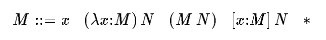
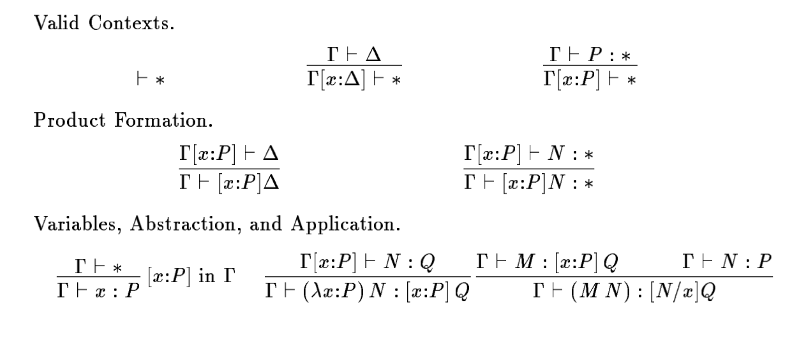
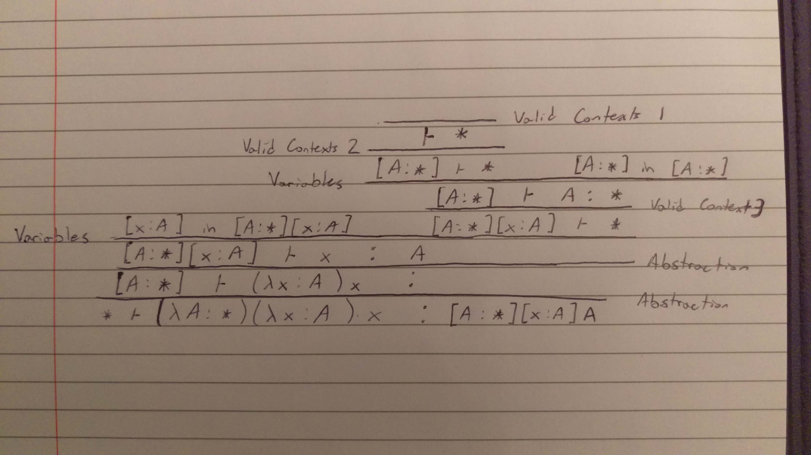
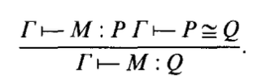

+++
title = "A Dependently Typed Language"
[extra]
bio = """
  Christopher Roman is a second semester MEng student in computer science. He is interested in compilers and distributed systems. He is also the best [Melee](https://en.wikipedia.org/wiki/Super_Smash_Bros._Melee) player at Cornell. :)
"""
latex = true
[[extra.authors]]
name = "Christopher Roman"
+++

## Overview
For this project, we implement the [Calculus of Constructions](https://www.sciencedirect.com/science/article/pii/0890540188900053) (CoC)
by Coquand and Huet, which is a lambda calculus that sits at the top of the [Lambda Cube](https://en.wikipedia.org/wiki/Lambda_cube). This means that
it includes polymorphism, type level operators, and dependent types. With the Simply Typed Lambda Calculus, terms are only
allowed to depend on terms. Polymorphism lets terms depend on types (e.g., generics). Type level operators allow types to
depend on types (e.g., `list` in OCaml). Dependent types allow types to depend on terms. Dependent types are rather
uncommon in most programming languages, so I'd suggest reading [these notes](https://www.cs.cornell.edu/courses/cs4110/2018fa/lectures/lecture31.pdf)
created by our very own [Adrian Sampson](https://www.cs.cornell.edu/~asampson/) for an introduction to how dependent types work.

Ultimately, dependent types allow us to make full use of the Curry-Howard ismorphism; that is, types correspond to
logical statements, and programs correspond to proofs of such statements. For example, consider the polymorphic
identity function $\Lambda A. \lambda x: a. x$, or written $(\lambda A : *)(\lambda x : A)x$ in CoC. The type of this program
is written $[A: *][x: A]A$, which represents the logical statement $\forall A. a \implies a$. By the Curry-Howard isomorphism,
the identity function serves as a proof for that statement because it inhabits the corresponding type. Through this,
we can write proofs and be assured that they are free of mistakes (or at least moreso than hand-written proofs).

The Calculus of Constructions provides a quite simple type system that allows us to write proofs through programming.
Our goal is to implement CoC and show the ability to write some proofs.

My implementation can be found on [GitHub](https://github.com/chrisroman/coc). Special thanks to [Vincent Imbimbo](https://github.com/Xaec6)
for talking through and learning with me how CoC worked.

## Design
Some of the design decisions about how to write CoC programs came from an [existing implementation](https://github.com/lambda-11235/ttyped)
of CoC. That implementation is well written and good for working with CoC, though it uses a *slightly* different syntax.

### The Grammar
[This paper](https://www.cs.cmu.edu/~fp/papers/mfps89.pdf) provides a concise grammar for CoC:



This formulation is much simpler to understand than what is presented by Coquand and Huet.

### Typing Rules
CoC makes a distinction between *contexts* and *objects*. Contexts are products over $*$, that is, terms
of the form $[x_1 : M_1] [x_2 : M_2] ... [x_n : M_n] *$. These terms are denoted as $\Gamma$ and $\Delta$.
All other terms are considered objects. The typing rules are presented as follows:



There are two typing judgements: one of the form $\Gamma \vdash \Delta$, which means that $\Delta$ is a valid
context given the valid context $\Gamma$, and $\Gamma \vdash M : P$, which means that $M$ has type $P$ in the
context $\Delta$. Since programs usually start assuming an empty context, we have $\vdash \Gamma$ meaning
$\Gamma$ is a valid context, and $\vdash M : N$ meaning that $M$ has type $N$.

Here is an example of a proof derivation for the type of the identity function $(\lambda A : *)(\lambda x : A)x$:



We can see the context is named for good reason: it keeps track of the types of variables. Interestingly, it
also doubles as a way to abstract over types. CoC enjoys nice properties like strong normalization.

In addition to the typing rules, we have $\beta$-conversion rules (denoted $P \cong Q$) that essentially provide a way to
reduce terms to a normal form. It is also necessary to prove that types are equivalent. The conversion
rules can be found on pp.101-102 in Coquand and Huet's paper. With these conversion rules, they introduce
a new typing rule that takes advantage of it:



### Additions to CoC
To make CoC easier to work with, we make a few additions to the language:

```
  | LET; UNTYPED; x = ID; EQUALS; t1 = term; IN; p = program
    { Let (Untyped, x, t1, p) }
  | LET; x = ID; EQUALS; t1 = term; IN; p = program
    { Let (Typed, x, t1, p) }
  | THEOREM; x = ID; EQUALS; t = term; WITH; PROOF; proof = term; SEMICOLON; p = program
    { Theorem (x, t, proof, p) }
```

The first was adding `let` expressions so that we can write longer, more useful CoC programs. This
is especially useful because the language can become very hard to parse by hand very quickly, so
breaking it up into `let` expressions allows us to build bigger abstractions. I added the option to
have the term be typed or untyped. I found this useful sometimes when there was a long term that
could be replicated across later terms but wasn't a valid expression on its own.

The second was adding a mechanism that allows us to state a theorem (i.e., a type) and give a proof
of that theorem (i.e., a program with that type). My implementation will make sure that the proof
actually has that type, or else the program will fail. This gives the user a slightly better experience
using the language to prove things.

## Implementation
I use OCaml for the implementation because pattern matching and functional programming is well suited
for language implementation.

For the parser I use a parser generator, namely Menhir, with OCamllex for the lexer. This made the grammar
straightforward to implement and extend with new constructs.

The typing judgement of the form $\Gamma \vdash M : P$ is quite simple to implement. I created a function
`typecheck_term` which takes the $\Gamma$ and $M$ and determines what the type $P$ is. The other judgement
of the form $\Gamma \vdash \Delta$ is a little different because just matching on $\Gamma$ is insufficient
for figuring out what $\Delta$ is. In other words, it is not syntax directed based just on the form of
$\Gamma$. Instead, I chose to write a function `typecheck_context` which takes both $\Gamma$ and $\Delta$
and checks if we can apply the inference rules to derive this statement, instead of directly deriving
$\Delta$ just from $\Gamma$.

Substitution was tricky to implement because I didn't use De Bruijn notation at all. Because of this,
it seems like there are still some bugs in substitution. This makes writing the programs somewhat more
tricky, but I found that if I expected something to typecheck when it really didn't, then I would change
some of the variable names so they are not being reused. In addition, because I didn't use De Bruijn notation,
I had to make sure I compared terms up to $\alpha$-equivalence when necessary.

It was also tricky to fold $\beta$-equivalence into the typing rules because I didn't know exactly how
to deal with some rules like reflexivity, symmetry, and transitivity. I wrote a function `beta_equiv`
that took $\Gamma$ and $M$ and tried to apply a single $\beta$-equivalence rule. Because all terms have
a normal form, I kept applying this function until no changes could be made.

Just like [ttyped](https://github.com/lambda-11235/ttyped), I created a simple REPL that I used for quick
testing to see the reduced value and type of various terms.

## Evaluation
For the evaluation, I decided to see what kinds of theorems I could prove from the Coq standard library.
I decided to choose theorems from the [Logic](https://coq.inria.fr/library/Coq.Init.Logic.html) library, which
seemed like one of the simplest libraries. This had definitions for things like True and False (or Top and
Bottom respectively), propositional or and and, if and only if, etc. I was able to state and prove a few
theorems.

First we can make some definitions that the library does:
```
let False = [a:*]a in
let True = [a: *][I: a]a in
let not = [A: *][_: A] False in
let sum = (\A: *)(\B: *) [R: *][f: [_: A]R][g: [_: B]R]R in
let or_introl = (\A: *)(\B: *)(\x: A)(\R: *)(\f: [_: A]R)(\g: [_: B]R)(f x) in
let or_intror = (\A: *)(\B: *)(\y: B)(\R: *)(\f: [_: A]R)(\g: [_: B]R)(g y) in
...
```
These are the same definitions as in Coq, with slightly less elegant syntax, especially because
inductive types have to be encoded.

Now here are some proofs about `and`:
```
let prod = (\A: *)(\B: *) [R: *] [_: [_: A][_: B]R] R in
let conj = (\A: *)(\B: *)(\x: A)(\y: B)(\R: *)(\f: [_: A][_: B]R)((f x) y) in

Theorem proj1 = [A: *][B: *][_:  ((prod A) B)]A with
    Proof (\A: *)(\B: *)(\p: ((prod A) B))((p A) (\x: A)(\y: B)x);

Theorem proj2 = [A: *][B: *][_:  ((prod A) B)]B with
    Proof (\A: *)(\B: *)(\p: ((prod A) B))((p B) (\x: A)(\y: B)y);
```
Here, `prod` represents propositional `and`, while `conj` is the constructor which produces a term
of that type. Then, Theorem `proj1` and `proj2` show that $\forall A, B. A \wedge B \implies A$ and
$\forall A, B. A \wedge B \implies B$. When we consider these terms as encodings of pairs, `proj1`
and `proj2` are simply the `fst` and `snd` functions like in OCaml.

Here are some more proofs relating to "if and only if":
```
let iff = (\X: *)(\Y: *) ((prod [_: X]Y) [_: Y]X) in

Theorem iff_refl = [A: *]((iff A) A) with
Proof (\A: *)((((conj [_: A]A) [_: A]A) (\x:A)x) (\x:A)x);

let swap = (\A1:*)(\B1:*)(\p1: ((prod A1) B1))
    ( ( ((conj B1) A1)
        (((proj2 A1) B1) p1)
      )
      (((proj1 A1) B1) p1)
    ) in

Theorem iff_sym = [A2: *][B2: *][_: ((iff A2) B2)]((iff B2) A2) with
Proof (\A2:*)(\B2:*)(\A_imp_B2: ((iff A2) B2))
    (((swap [_: A2]B2) [_: B2]A2) A_imp_B2);
```

`iff_refl` claims that if and only if is reflexive, while `iff_sym` claims that it is symmetric.
`iff_sym` was actually a case where bugs in substitution came up, so I just used different names for
abstractions/products.

Interestingly, the last two theorems actually took about a second to typecheck, which is quite
surprising because Coq can typecheck these terms extremely quickly. This may be because Coq is based on
the Calculus of *Inductive* Constructions, which is quite different from CoC because it introduces
universes. This increased expressivity probably allows for faster implementations.

Unfortunately I didn't have more time to try proving more theorems, though the current evaluation
shows that at least relatively simple proofs can be proved.

## Hardest Parts to Get Right
Two of the hardest things to get right were substitution and $\beta$-equivalence. These were the
main reasons why I had bugs in my implementation. Additionally, debugging became extremely
difficult as the programs increased in size simply because so many rules were being applied, it was
hard to see exactly where things were going wrong. While CoC is a relatively simple language, some of
the examples in Coquand and Huet's paper were very hard to follow, like the `inter` example. This made
it more difficult to get an intuitive understanding of how CoC worked.

## Further Work
With more time, I would have liked to implement a general framework for creating inductive types
in Coc explained by [this paper]((https://www.cs.cmu.edu/~fp/papers/mfps89.pdf)). With my implementation,
it is possible to write the encodings for inductive types like natural numbers and pairs, but we must
do the encoding by hand. One could also consider giving the language the style of an interactive theorem
prover by being able to manipulate proof/program state.

## Conclusion
Hopefully this project provides readers with a better understanding of how a dependently typed language
like CoC is implemented. It seems that things like System F$\omega$ get a lot of attention and are
well understood by many people, but CoC and dependent types aren't as mainstream. Formal verification
seems to be increasingly important, so learning CoC may prove to be useful.
