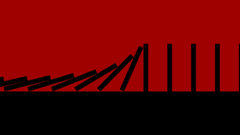
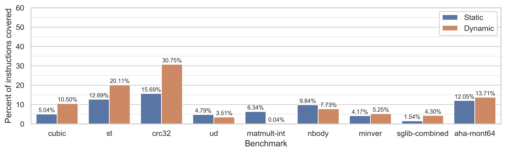

+++
title = "Finding Redundant Structures in Data Flow Graphs"
[extra]
bio = """
  [Oliver][] is a CS PhD student in theory at Cornell, who does decision theory and category theory.

  [Alexa][] is a second-year student interested in the intersection of compilers and formal methods. She also enjoys feminist book clubs and cooking elaborate [fish truck][] meals.

  [Greg][] is a second-year student working on machine learning and digital humanities.

[alexa]: https://www.cs.cornell.edu/~avh
[greg]: https://www.cs.cornell.edu/~gyauney
[oliver]: https://www.cs.cornell.edu/~oli
[fish truck]: https://www.triphammermarketplace.com/events/
"""
latex = true

[[extra.authors]]
name = "Oliver Richardson"
link = "https://www.cs.cornell.edu/~oli"
[[extra.authors]]
name = "Alexa VanHattum"
link = "https://www.cs.cornell.edu/~avh"
[[extra.authors]]
name = "Gregory Yauney"
link = "https://www.cs.cornell.edu/~gyauney"
+++

*The source code for this project and our profiling analysis can be found
[here][source].*

In a conventional [von Neumann architecture][vn], we might think of computation
at a high level as our computers faithfully carrying out a series of steps.
Like dominoes in a line, the program counter runs through each instruction once
its predecessor completes.

[vn]: https://en.wikipedia.org/wiki/Von_Neumann_architecture

Of course, this mental model is far from the truth—in modern [out-of-order][ooo]
processors, instructions are aggressively reordered to take advantage of
multiple processing elements at once. The major caveat here is that reordering
must respect the original program's _data flow_. That is, if an instruction
needs to use data that is generated by a previous instruction, then it cannot be
reordered to happen beforehand. From this perspective, we can think of
computation as dictating the flow of data through operations. Each instruction
is a node, and dependencies form edges that flows along. These dependencies form
a [_data flow graph_ (DFG)][dfg] for the program.

[ooo]: https://en.wikipedia.org/wiki/Out-of-order_execution
[dfg]: https://en.wikipedia.org/wiki/Data-flow_analysis

## Go with the flow 🌊

Analyzing the data flow graphs of programs allows us to think about the _shape_
of the computation, independent of the literal order a programmer used
to specify it. In particular, two separate programs are more likely to share
data flow structure than literal source code redundancy (since many reorderings
can maintain the same data flow). Even within the same source program, shared
structure in the data flow graph may indicate core computational patterns.

### Data flow graphs for computational acceleration

If our goal is to compile faster or more energy-efficient code, data flow graphs
can help show us where to focus. By identifying redundant subgraphs in the
structure of data flow graphs, we can find groupings of operations that we
expect to occur frequently enough to benefit from additional optimization
effort. What's more, the shape of the subgraphs is also a signal for how
_useful_ the acceleration might be: subgraphs that are wider, rather than simply
linear chains, indicate more opportunity for [_fine-grained parallelism_][fgp].
Our goals in this project are shaped by the domain of hardware acceleration with
[_heterogeneous computing_][hc], where a compiler's goal is to target multiple
processors, each with differing strengths and weaknesses.

For this project, we build on the [LLVM compiler infrastructure][llvm] to find
redundant structures in programs' static data flow graphs. Our goal is to find a
fixed number of subgraph structures that occur the most frequently (that is,
cover the highest number of instructions) throughout the program. We focus on
finding candidate subgraphs with high frequency, and leave analysis and
heterogeneous compilation of those subgraphs to later work.

[fgp]: https://en.wikipedia.org/wiki/Granularity_(parallel_computing)#Fine-grained_parallelism
[hc]: https://en.wikipedia.org/wiki/Heterogeneous_computing
[llvm]: https://llvm.org
[source]: https://github.com/avanhatt/dfg-coverings

## Building data flow graphs from LLVM

Data flow graphs exist at multiple levels of abstraction in a compiler
toolchain, and there are trade-offs to targeting any particular choice.

First, data flow graphs can either represent a program _statically_, purely from
the program's source code, or _dynamically_, from a program execution trace. A
static DFG has a one-to-one relation to the source code: each operation and its
dependencies are directly translated. The control flow of the program exists
only implicitly: if a data value's flow depends on the branching structure of
the program, the DFG would have back edges and cycles. A dynamic DFG captures a
single trace throughout the program, where operations are repeated each time
they are executed. In this case, the data flow graph remains acyclic (with
values only flowing "down"), and loops in the control flow repeat in the
subgraph for each time the loop is executed. However, dynamic data flow graphs
only represent a single execution of the program and may not even cover the
full program behavior. They also may be infeasible to generate ahead of time
for long-running applications, and they tend in practice to be so large
as to limit analysis to fragments of the full dynamic DFGs.

In addition, DFGs can target either the _intermediate representation_ level,
with LLVM-level operations, or at the _machine code_ level, with operations
corresponding to the exact instruction set architecture. The machine code
data flow graph corresponds more directly to the program's actual execution, but
is not as general across different targets.

For this project, we use LLVM to target the static DFG at the intermediate
representation level of abstraction. LLVM translates the program source to
[_static single assignment (SSA)_][ssa] form, where every variable name can only
be assigned to once. Because
LLVM's in-memory intermediate representation stores pointers to instructions'
operands, we can build a program's static data flow graph by inserting edges
to an instruction and from each of its operands. We narrow the project's scope
to only consider acyclic subgraphs by considering subgraphs only within basic
block boundaries, which lack branching control flow.

[ssa]: https://en.wikipedia.org/wiki/Static_single_assignment_form

## Matching fixed DFG stencils

To begin, let's imagine we already have some oracle that has given us a great
candidate subgraph (which we'll call a _stencil_), and our job is to find all
the redundant instantiations of that stencil. If we consider a large program
DFG `G` and a smaller stencil DFG `H`, the task is to find as many subgraph
isomorphisms of `H` and `G`. Here, the larger program DFG `G` is generated
directly from the LLVM in-memory representation as described above, but does not
include edges across control flow boundaries. Rather, `G` is a collection of DFG
components per basic block. In addition, we focus on operations that consume and
produce values directly (such as arithmetic and shift operations) rather than
those that read or write from memory or modify control flow (`load`, `store`,
`branch`, and `return`).

While graph isomorphism is a notoriously tricky problem, it is also a
common one, and we make heavy use of out-of-the-box graph algorithms. We employ
the [`networkx.isomorphism`][]  Python package, which provides tools for iterating
over matches (subgraph isomorphisms) between the program DFG `G` and a stencil DFG
`H`. There are two features of a matching which distinguish it from a subgraph isomorphism:
(1) nodes must be matched to nodes of the same `opcode`, which technically makes the problem
a _colored_ subgraph isomorphism (which fortunately makes the problem easier), and (2) we need to select
mutually exclusive subgraphs, where each node can be assigned to at most once
isomorphic instance (to model actual hardware acceleration).
In the case of a single stencil, we use a greedy heuristic to randomly choose isomorphisms until
there are no longer any remaining choices that are mutually exclusive. When
trying to match multiple stencils, our heuristic tries to find the largest
stencils first. We describe this search process in more detail in our
implementation section.

We started our testing by hand-picking chains of instructions found in our
benchmarking code. From the [Embench][] embedded programming benchmarking suite,
we used `matmult-int.c` to chose a few common chains of operations:

`mul` &rarr; `add` &rarr; `srem`

`shl` &rarr; `add`

`sdiv` &rarr; `mul` &rarr; `add`

As we expected, these small human-selected stencils subgraphs performed
especially poorly. On the original program, `matmult-int.c`, these stencils only
matched less than 4% of instructions.

[embench]: https://embench.org
[`networkx.isomorphism`]: https://networkx.github.io/documentation/stable/reference/algorithms/isomorphism.html

## Identifying common DFG stencils

Of course, finding the common subgraphs by hand is pretty antithetical to a
reasonable approach at compiling code. Our real goal is to automate the process
of finding the common DFG stencils to accelerate.

### Formal description of the task

In this context of ignoring control flow and considering data flows within basic
blocks, we can look at the problem purely graph-theoretically. For a single trace
through the program, the data flow graph $G$ is acyclic, and we would like to
cover as much of it as possible with subgraphs corresponding to the stencils
that we accelerate. Statically, we do not know what the final data flow graph
is, but we do know that we will be able to assemble one by connecting dangling
edges from control-flow-free components: basic blocks.

We would like to find a small collection of graph components $\mathcal H = \{H_i, \ldots, H_k\}$, which we can use to replace parts of and accelerate programs having basic blocks $\mathcal G = \{G_1,\ldots,G_n\}$, that maximizes the total saved time:

$$\mathcal S_{\mathcal H}(\mathcal G) := \max_{\mathcal C \in \text{Cov}(\mathcal G, \mathcal H)}~ \sum_{G \in \mathcal G} w_G \cdot  \sum_{H \in \mathcal C_G} f_H \cdot |H|$$

where:

- $\text{Cov}(\mathcal G, \mathcal H)$ is the set of all valid (partial)
    coverings of basic blocks with at most one stencil, that is, injective graph
     morphisms $\varphi: (\cup \mathcal G) \to \cup \mathcal H$.
- $\mathcal C_G$ is the component of the covering $\mathcal C$ of the
    total covering on the particular basic block graph $G$.
- $w_G$ is independent of $\mathcal H$ and proportional to the expected
    number of times $G$ is executed.
- $f_H$ is the expected speedup factor from accelerating the component $H$.

To consider this as a general learning problem, imagine that there's some
underlying distribution $\mathtt{Programs}$ of programs that people write; we
can now cast our work as a solution to the optimization problem of finding:

$$ \arg\max_{\mathcal H}\left( \mathop{\mathbb E}\limits_{\mathcal G\sim \texttt{Programs}}~ \mathcal S_{\mathcal H}(\mathcal G) - \text{Cost}(\mathcal H) \right)$$

where $\text{Cost}(\mathcal H)$ is the additional cost incurred by choosing to
accelerate the subgraph stencil $\mathcal H$, which is higher for larger
subgraphs. In this learning analogy, finding common DFGs for a particular
collection of programs is training data.

Rather than solve this optimization problem in closed form, we optimize for
the heuristics of finding candidate subgraphs based on specifying (1) the size
of each subgraph, and (2) the number of subgraphs we can choose. These two
heuristics are effectively regularization knobs that could be used in future
work to automate the entire optimization.

### Implementation strategy
We first instrument an LLVM module pass that writes out a JSON representation of
the DFG. Our Python module then explores candidate subgraphs using a combination
of our heuristics, and the out-of-the-box graph isomorphism tooling.

We implemented and compared two separate algorithms for finding the stencils
from static DFGs generated per-basic-block from LLVM programs.

In both cases, the general idea is to iterate over the DFG's connected
components, successively building larger subgraphs. Our first approach is
node-based, and exhaustively considers node subsets up to some size. The second
approach is edge-based, and uses smaller subgraph components to build graphs of
the desired size. In preliminary experiments we found the edge-based approach to
be slightly faster, so we used that approach for our evaluation.

More specifically, the edge-based subgraph stencil generation iteratively grows connected subgraphs.
For each $k$-edge subgraph in the DFG, the algorithm considers adding every edge in the DFG, keeping the new ($k+1$)-edge subgraphs that are connected.
It then finds which of these subgraphs are isomorphic to each other, and constructs a canonical stencil name for each isomorphic set.
These ($k+1$)-edge subgraphs are used for the next iteration of the algorithm.

#### Mutually exclusive matches

To generate a _valid_ choice of subgraph stencils, we need more than simply an
enumeration of all subgraphs in a program and a way to match them: we also have
to make sure the matches don't step on one another's toes—that is, we need to
throw out matches until each instruction is only covered by at most a single
component.

Finding the optimal one is difficult: it is related to the weighted optimal
scheduling problem (which [can be solved with dynamic programming](https://courses.cs.washington.edu/courses/cse521/13wi/slides/06dp-sched.pdf)
in $O(n \log n)$ time, but on a general directed graph, we get an exponential
factor in the branching coefficient). Rather than solve this problem optimally in
the general case, we implement the greedy biggest-first strategy, and focus
instead on searching for collections of matches which have higher coverage in
the first place.

After generating possible subgraph stencils, we choose a combination that achieves the highest static coverage of the DFG using only mutually exclusive matches.

### Search

Ultimately, we do not need to search the space exhaustively if we have reasonable heuristics that might cause us to believe that we're going in the right direction with certain stencils.
We can then do our search traversal in a different order, guided by the objective function.
This can be done in the form of a beam search: we only keep around the $k$ best subgraphs in the search frontier, and at each step try to expand one to a random neighboring node.
Though not used in our evaluation, beam search can speed up generating larger subgraphs in the future.

## Evaluation

We primarily look at what coverage (percent of
instructions matched by some subgraph over total instructions) we can get on a
given source program. We consider both static and dynamic coverage. In both
cases, 100% coverage is impossible because we exclude instructions with
control-flow implications (`phi`, `branch`, `return`) and those that read and
write from memory (`load` and `store`).

### Dynamic coverage instrumentation

To generate dynamic coverage information, we instrument our LLVM pass. The pass
adds annotation to each instruction that is matched specifying which stencil it
was covered by, along with the node-isomorphism. Because basic blocks execute
atomically (ignoring exceptions), we generate the count of matched and total
instructions per-block at compile time. We then link a C profiling module with
state for these dynamic counters. At the end of each basic block, our pass adds a call
to a function to increment the profiling counters by the
statically-determined amounts. We add a final function call to LLVM's global
destructors list to write the final profiling values both to standard out and an
auxiliary file. For convenience, we also save the static coverage the same way.

### Embench evaluation

We chose to use the [Embench][] embedded programming benchmarking suite because
it represents a small but fairly diverse set of programs that can be easily
compiled and executed with LLVM tooling.

For each benchmark, we generated all allowable three-node subgraphs and chose
the two that statically covered the most instructions in that benchmark's DFG.
Three-node stencil generation took between a few seconds and 17 minutes for each benchmark
on a 2017 MacBook Pro (2.3 GHz Intel Core i5, 8 GB RAM).

The following graphs show static and dynamic code coverage for each benchmark.
Note that each benchmark's coverage was calculated with the subgraphs generated
from that benchmark (and coverages are deterministic, rendering error bars unnecessary).

As stated above, a coverage of 100% is elusive because of our restrictions on
what instructions we consider. An interesting component of this profiling data
is that as expected, static and dynamic coverage correlate, but which is better
depends on the particular benchmark. From smaller scale experimentation, the
coverage also varies based on the compiler flags used to generate the original
LLVM IR. In particular, running at a more aggressive `-03` optimization level
(rather than the `-01` used here) changes the coverage metrics as loops are
statically unrolled, introducing more redundancy.

### Embench case study: `nettle-256sha`

Digging into `nettle-256sha`, the benchmark with the best coverage, we can see
that the following combination of three-node subgraph stencils was chosen out of 66
possible three-node subgraphs:

| Stencil | Number of static matches      |
|:--------|:-----------------------------:|
|`lshr` &rarr; `or` &larr; `shl`| 208 |
|`xor` &rarr; `xor` &rarr; `add`| 80  |

Here are a close-up and a closer-up (marked with a heavy black rectangle) view
of the DFG, with vertices matched to a stencil shown in bright red.
The latter shows three matches of the first stencil and one of the second.

### Stencil generalization

We also explored generating stencils from one benchmark and testing how well they generalized to the other benchmarks.
The three-node stencils generated and chosen from `minver`:
1. `fcmp` &rarr; `select` &larr; `fsub`
2. `getelementptr` &larr; `pointer` &rarr; `getelementptr`

were found at least once in all but five of the other Embench benchmarks, producing dynamic coverage ratios between 0 and 7.68% (with an average of 1.45% &plusmn; 2.35).

Stencils generated from other benchmarks achieved even less coverage on the rest of the benchmarks. For example, stencils generated from `edn`, `libwiki`, and `nbody` were not matched in any other benchmarks.

## Ongoing directions

While finding redundancies in DFGs within each basic block is a good initial
approach, this project could be extended in several directions.

We could build on existing literature in [extended basic blocks][ebb] to find
subgraphs that _speculatively_ occur. That is, in extended basic blocks, we
consider control flows that are likely to jump from one block to another in the
common case, and only fall back to different branches in the case that our guess
of the next block was wrong. In the context of hardware acceleration, we can
imagine building accelerators that handle these larger speculative subgraphs
when possible, and fall back to slower CPU execution if the control flow
differs.

In addition, it would be interesting to compare this project against dynamic
data flow graphs. For example, the [Redux][] paper essentially introduced the
formulation of dynamic data flow graphs as we describe them here, and outlines
how to efficiently generate them. From the perspective of hardware
acceleration, the [RADISH][] project (“Iterative Search for Reconfigurable
Accelerator Blocks with a Compiler in the Loop”) uses Python wrappers to
generate dynamic data flow graphs, and heuristic genetic algorithms to "fuse"
similar dynamic graphs together.

Like RADISH, we could extend our application to target _groups_ of applications
instead of single programs. The scale of this undertaking would require more
clever heuristics than our current search strategies, but would ideally help us
find more general subgraphs to accelerate.

Finally, the impact of this project could be more clearly explicated by
evaluating our subgraph identification with actual computational acceleration.
In particular, we hope this strategy will prove useful in conjunction with other
work that uses compile-time analysis for heterogeneous targets.

[ebb]: https://en.wikipedia.org/wiki/Extended_basic_block
[redux]: http://citeseerx.ist.psu.edu/viewdoc/download;jsessionid=7CE631B431BCCBA459061BC458D53E8F?doi=10.1.1.63.2083&rep=rep1&type=pdf
[RADISH]: https://ieeexplore.ieee.org/document/8509181
