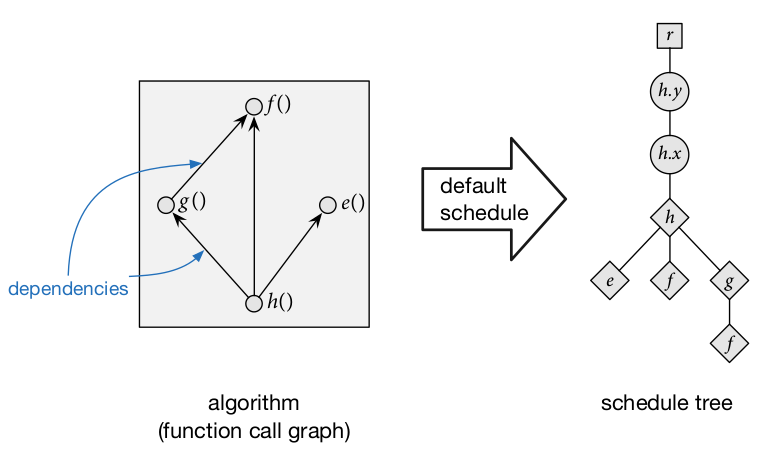
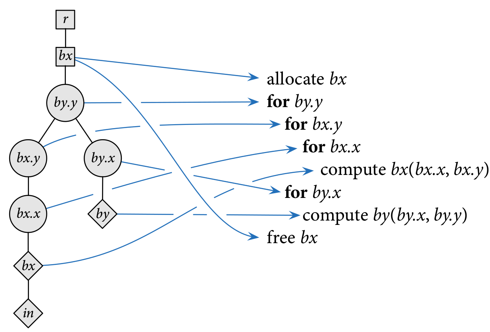
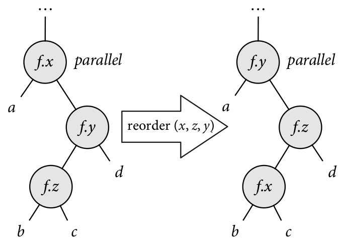
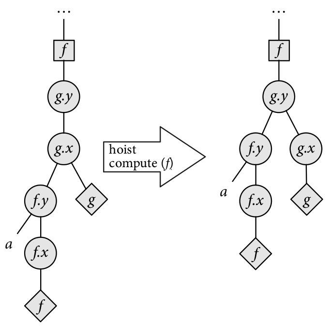
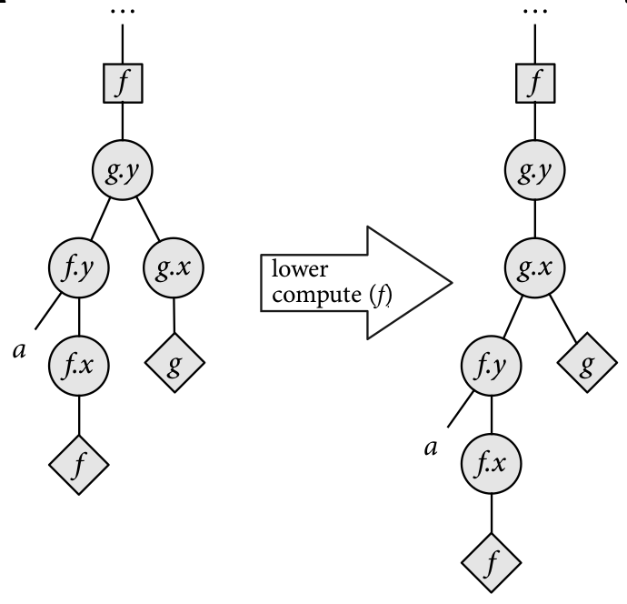
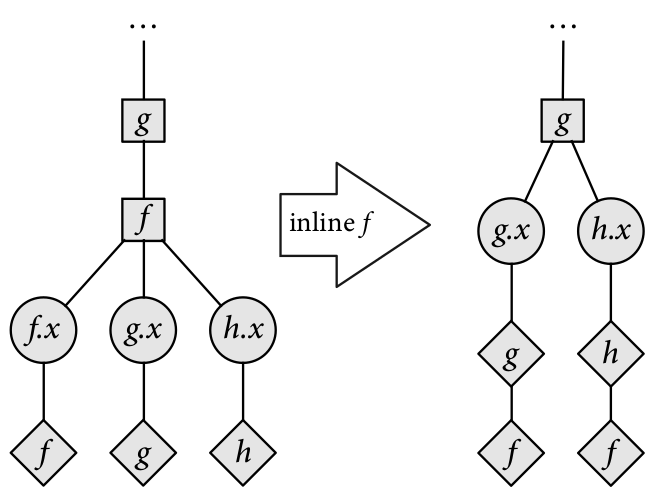
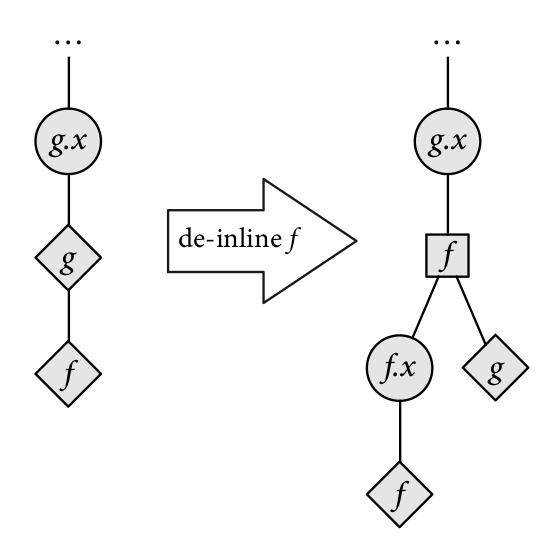

+++
title = "An Autoscheduler for Halide"
[extra]
bio = """
  Ela is a fourth-year graduate student. They should fill their bio here!
  Ryan is a PhD student at Cornell. He studies programming languages
  and verification.
  Rolph is a third-year graduate student studying the intersection of
  programming languages, security, and distributed systems.
"""
latex = true
[[extra.authors]]
name = "Gabriela Calinao Correa"
link = "https://twitter.com/elalaCorrea"
[[extra.authors]]
name = "Ryan Doenges"
link = "http://ryandoeng.es"
[[extra.authors]]
name = "Rolph Recto"
link = "https://rolph-recto.github.io"
+++

[Halide][halide] is a domain-specific language embedded in C++ for writing code
that processes images and, more generally, arrays.
The main innovation of Halide is that it separates *algorithm* --- the actual
function being computed -- from *schedule* --- the decisions regarding when
to perform computations and when to store intermediate results.
This allows developers to write the function that their image pipelines
implement once and then performance-tune the implementation by swapping out
schedules --- different schedules can be used for different platforms while
not modifying function code.

[halide]: https://halide-lang.org/

Writing an efficient schedule for Halide functions requires expertise in
performance tuning.
To alleviate this, in this project we create a toy autoscheduler for Halide
that attempts to automatically generate an efficient schedule
for Halide functions.
(Note that Halide has an autoscheduler built-in: see [this paper][autosched2019]
for more information.)

[autosched2019]: https://halide-lang.org/papers/autoscheduler2019.html

## Design Overview

The following presentation of schedules as trees manipulated by
schedule transformers closely follows Chapter 7 of Jonathan Ragan-Kelley's
[thesis][jrkthesis].
The images below are from that document. 

[jrkthesis]: https://people.csail.mit.edu/jrk/jrkthesis.pdf

In order to search for schedule, we represent them as *schedule trees*,
wherein the ancestry relationships between nodes represent ordering information.
Schedule trees have the following kinds of nodes:

- *Root nodes* represent the top of the schedule tree.

- *Loop nodes* represent the traversal of how the function is computed
  along a given dimension.
  Loop nodes are associated with a function and a variable (dimension).
  Since functions are assumed two-dimensional, by default functions have
  two variables: *x* and *y*.
  Loop nodes also contain information such as whether the loop is run
  sequentially, run in parallel, or vectorized.

- *Storage nodes* represent storage for intermediate results to be used later.

- *Compute nodes* are the leaves of the schedule tree, and they represent
  computation being performed.
  Compute nodes can have other compute nodes as children to represent
  functions that are inlined instead of loaded from intermediate storage.

Schedule trees are considered *well-formed* if they satisfy the
following criteria:

- The ancestry path from a function's compute node to the root node contains
  all the loop nodes and the storage node
  (if the function is not the output[^storage-output])
  for that function.
  Intuitively, this means that the traversal of how the function is computed
  is completely defined, and storage for the function's results is available.
 
- If a function calls another function and the callee is not inlined,
  the compute node for the callee must occur before the compute node of the
  caller in a depth-first traversal.
  Intuitively, this ensures that the callee's results are stored before
  the caller is computed.

[^storage-output]: By convention the output function does not have a storage
  node in the schedule tree since it is assumed that storage for the output
  has already been allocated and thus there is no decision to be made about
  the granularity with which to allocate it.

For any function we can define the *default schedule*, which traverses
the output function in row-major order and inlines all called functions,
like so:



We can give a semantics for schedule trees as nested loops.
Consider the schedule below for three functions, *in*, *bx*, and *by*, where
*by* calls *bx* and *bx* calls *in*.
The schedule tree on the left represents the nested loop on the right.




### Schedule Transformers

We can define transformers over schedule trees.

**Split** - split a function's variable into two. For example, we can split
  a function's `x` variable into `x_inner` and `x_outer`.
  Combined with *reorder*, *split* can represent schedules that *tile*
  computations.

**Change Loop Type** - change how the loop will be traversed; by default the
  loop type is `sequential`, but it could also be `parallel`, `unrolled`,
  or `vectorized`.
  For simplicity our implementation only supports `sequential` and `vectorized`.

**Reorder** - switch loop nodes for the same function.

**Hoist / lower compute** - change the granularity in which intermediate
  results are computed.

**Hoist / lower storage** - change the granularity in which storage for
  intermediate results is allocated.

**Inline / deinline** - inline functions into callers (don't store their results
  in intermediate storage) or deinline function out of callers.
  Intuitively, inlining functions trades off smaller memory usage for
  redundant computations, while de-inlining trades off higher memory usage
  for fewer redundant computations.


Below are some diagrams to give intuition to how these scheduler transformers
work.













### Bounds Inference

Now that we have a representation for schedules and a set of
schedule transformers, we are close to arriving at a search algorithm
for finding efficient schedules.
The last component that we need is a notion of *cost* for schedules.
In order to provide a cost model for schedules, we need to determine the
number of iterations performed by loops in the schedule.
This determines the number of times instructions inside the body of loops
will be executed, as well as the size of intermediate storage to be
allocated.
We determine this by computing the extent in which functions will be computed.
For the output function, we assume that the extent is given by a call to the
`realize` function.
For called functions that are not inlined, the extent is the dimensions of
the function that will be stored as intermediate results.
Because intermediate storage will be reused 

For example, consider the simple pipeline below that has one producer (`g`)
and one consumer (`f`):

`g(x, y) = x * y`

`f(x, y) = g(x, y) + g(x+1, y+1)`

Given that `f` is realized in a 512x512 box and a schedule where `g` is
computed in total before computing `f`, the extent of `g` is 513x513.

Computing the extent in which functions will be computed is hard in general,
but since Halide makes the simplifying assumption that all extents are
rectangular (as opposed to, say, polytopes in the polyhedral model),
there is a simple method for doing this:
we only need to check the maximum and minimum points of the caller functions
and check the arguments to the callee.

In the example above, the extent of `f` is defined by the box bounded by
`(1,1)` and `(512, 512)`.
The arguments to `g` at these points are:

* at `(1,1)`: `(1,1), (2,2)`
* at `(512,512)`: `(512,512), (513,513)`

Thus we can determine the extent of `g` to be 513x513.

We encode these caller-callee relationships into logical formulas and
use the [Z3][z3] SMT solver to a retrieve model that contains concrete values
for the arguments.

[z3]: https://github.com/Z3Prover/z3


### Search Algorithm for Schedules

Once loop sizes have been inferred, we have enough information to determine
important execution features of the schedule, such as how much memory
it will allocate and how many operations it will perform.
The *cost* of the schedule is then a weighted sum of these data points.

By default our implementation groups execution features into the following:

* *loads* - number of intermediate results loaded from storage

* *stores* - number of intermediate results stored

* *arithmetic operations* - number of `+`, `-`, `*` and `/` operations performed

* *mathematical operations* - number of `sin`, `cos`, `tan`, `sqrt` operations
  performed

Each of these groups has a weight that determines the importance of these
features with respect to the schedule's cost (see **Evaluation** below).

Now that we can give a notion of cost to schedules, we can search for efficient
schedules.
We use an (asexual) genetic algorithm to perform this search, with
the default schedule as the initial population and the schedule transformers
described above as mutation operators.
We perform roulette selection to select population members for reproduction.
We describe the concrete parameters used for search below in **Evaluation**.


### Conversion to Halide

Once we have a candidate schedule tree, we convert it into Halide.
We do this by checking the ancestry path from compute nodes:
this path determines whether a function's variables are split,
the traversal order for computing the function, and, for called functions,
the granularity at which the function is stored and computed.

Consider the schedule above for the functions `bx`, `by`, and `in`.
Converted into Halide code, the schedule looks like the following:

```
by.reorder(y, x);

bx.store_root();
bx.compute_at(by, y);
bx.reorder(y, x);
```


## Evaluation


We set the weights for execution features as follows:

Group       | Weight 
------------|---------------
loads       | 1.5
stores      | 1.5
arith ops   | 1.0
math ops    | 3.0


