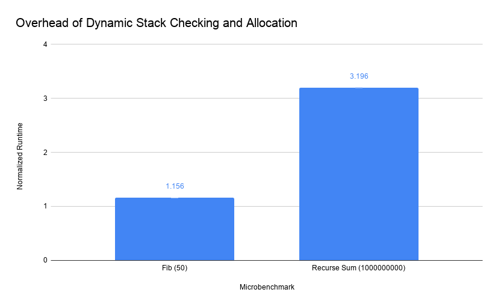
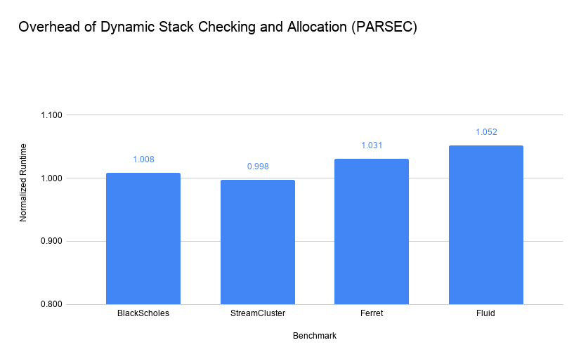
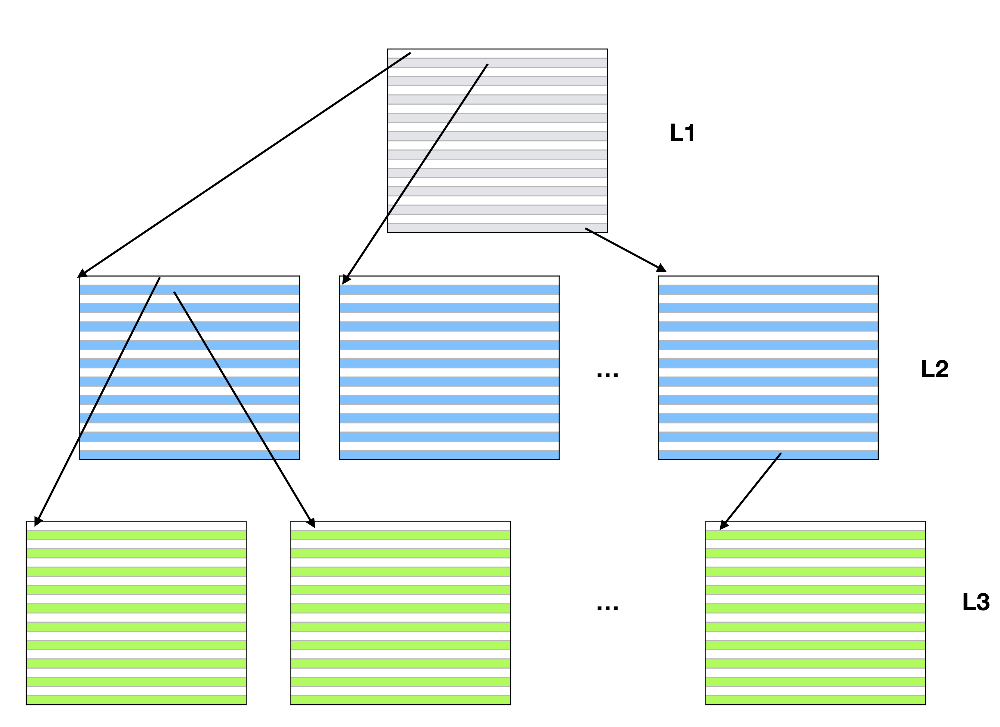
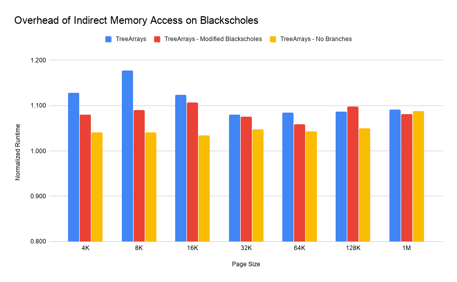
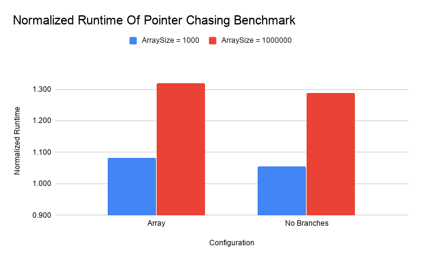

+++
title = "Evaluating the Performance Implications of Physical Addressing"
extra.author = "Drew Zagieboylo"
extra.bio = """
  [Drew Zagieboylo](https://www.cs.cornell.edu/~dzag/) is a 3rd year PhD student researching Security, Hardware Design, and Programming Languages. He enjoys rock climbing and gaming in his free time.
"""
+++

## Introduction to Virtual Addressing

Modern processors use [_virtual addressing_](https://en.wikipedia.org/wiki/Virtual_address_space)
to access _actual_ memory locations through a translation layer.
Only highly privileged software, such as the operating system (OS),
has access to physical memory addresses while all other processes
can only refer to memory via these virtual ones.
When a process requests memory (e.g., via `malloc`),
the OS will allocate physical memory in fixed size chunks, called pages,
and then map them into the process' virtual address space.
This allows the OS to allocate whichever regions of physical memory happen to be free despite the fact that the process may have requested a large, contiguous allocation.

Virtual addressing provides a few key abstractions for user-level software:
 1. A fully contiguous address space.
 2. A unique address space not shared by any other process.

The former enables software to easily calculate relative memory addresses;
accessing any element in an array requires only one or two instructions
to add the offset of the base pointer and then load from memory.
Similarly, locations on the program stack are computed relative to the current stack pointer.
Neither of these "pointer arithmetic" operations would be valid if
executed on the physical addresses.
The latter is a useful security primitive that enables
strong process memory isolation "for free," since there is no way for a process
to even reference memory owned by another process
(unless the OS maps some physical location into both address spaces).

## The Case Against Virtual Addressing

The translation of virtual addresses is accelerated by dedicated hardware
called the [Translation Lookaside Buffer](https://en.wikipedia.org/wiki/Translation_lookaside_buffer) (TLB).
This acts as a "translation cache" and hides most of the cost of virtual address translation,
except for when an address is not present in the TLB.
Missing in the TLB triggers a complex series of physical memory accesses
called "walking the page table" and tends to be extremely expensive
(especially if this has to be handled by software).

For workloads that allocate very large amounts of memory, the TLB can't actually "reach"
all of the necessary memory addresses, causing frequent
[TLB misses](https://research.cs.wisc.edu/multifacet/papers/isca13_direct_segment.pdf).
In these cases, it's not uncommon for the CPU to be running only a single application
which would like to manage its own memory anyway; the aforementioned advantages
of virtual addressing are significantly reduced but the cost in TLB misses can be devastating to performance.
The other major cause of TLB misses is frequent context switching between processes,
which typically triggers a complete flush of the TLB state. For multithreaded applications
which rely heavily on system calls (e.g., webservers), this can incur
[overheads of up to 20%](https://www.microsoft.com/en-us/research/wp-content/uploads/2016/02/osr2007_rethinkingsoftwarestack.pdf).

Furthermore, virtual addressing is not a requirement for memory security.
There are many different proposals (and even some usable implementations)
of _tagged memory_ architectures, where physical memory locations are associated with
_tags_ that control how those locations can be accessed by software.
Some examples include: the [CHERI capability architecture](https://www.cl.cam.ac.uk/research/security/ctsrd/cheri/);
the [PUMP processor for software-defined metadata](https://dl.acm.org/citation.cfm?id=2694383);
and the [secure information flow CPU, Hyperflow](https://dl.acm.org/citation.cfm?id=3243743).
Instead of relying on a process' inability to address memory,
these designs use hardware to efficiently check whether or not a memory access
is allowed by the system's security policy. In these designs,
the protection provided by virtual addressing is either mostly or completely redundant.

# Removing Virtual Addressing

Let us imagine that we are running code on one of these tagged memory architectures
and we want to eliminate virtual addressing and the overheads it entails.
In this world, we can still ask our OS for memory via `malloc`; however it returns
back to us a physically contiguous memory region (rather than virtually contiguous).
For the large memory applications described above that manage their own memory,
they would likely start by `malloc`-ing most of the computer's physical memory
and then never calling `malloc` again. Little would change for such programs
(except that the spatial locality assumptions their designers had originally
made about memory layout are more likely to reflect reality).

However, programs which request new allocations throughout their lifetimes
may no longer be able to execute correctly. Since `malloc` returns a physical memory region,
the OS needs to find a large enough space inside the memory to allocate. Due to the
presence of [fragmentation](https://en.wikipedia.org/wiki/Fragmentation_(computing)),
it is possible that no such region exists. In that case, `malloc` returns `0` and,
in all likelihood, the program explodes.

Remember that such fragmentation was present
with virtual addressing as well, but the OS could stitch together various fragmented segments
to form a single virtual allocation. Therefore, programs should strive to allocate memory in fixed-size chunks;
essentially, they should assume that the OS can only allocate them pages of physical memory
and it's _their job to stripe datastructures across them_.

# Experimental Setup

To evaluate the impact of software changes required in lieu of virtual addressing,
we ran experiments with the following configurations. First, we ran all of our tests
on a computer with 8 Intel i7-7700 CPUs clocked at 3.60GHz, with 32GB of physical memory, running Ubuntu 16.04.
Secondly, we followed the [guidlines](https://llvm.org/docs/Benchmarking.html) provided by LLVM to reduce
variance; in particular, every test was executed on a single, isolated processor core.
While we ran all of our tests ten times and report averages of our measurements, with
this setup we observed very little variance with typically less than 0.01% standard deviation.
Finally, we assumed that some reasonable amount of stack could be pre-allocated contiguously,
even on a physically addressed machine. We chose 32KB since that was approximately the smallest
sized stack required to execute the benchmarks normally.

Unfortunately, we could not actually execute any tests using physical addressing,
since there is no reliable method for allocating physical memory in user space.
While there are several [proposals](https://blog.linuxplumbersconf.org/2017/ocw/system/presentations/4669/original/Support%20user%20space%20POSIX%20conformant%20contiguous__v1.00.pdf) for how to implement these
features, they aren't currently supported in Linux.
While there are reconfigurations and workarounds that could enable
this evaluation the solutions are not lightweight.
Therefore, our results are overhead measurements that represent worst-case performance;
we don't actually expect any of our tests to result in speedups.

# Dealing With The Stack

The [stack](https://en.wikipedia.org/wiki/Call_stack) presents another potential issue.
Current compilers assume that stack-allocated variables can be addressed relative to the
stack pointer, which is stored in a register.
Obviously, while this is an efficient mechanism for address computation,
this scheme doesn't work if any given stack frame is not comprised of physically contiguous memory.

For certain applications, it is likely that we can allocate a single stack page at start-up
and then go on with our lives. In this case, the restrictions mentioned above aren't really
an issue. However, programs _may_ allocate large data structures on the stack, may recurse
deeply or may have dynamically sized stack allocations. In these cases, we can run into
the issues described above since the stack we've already allocated may not be large enough.

One solution to this problem is to dynamically allocate stack frames whenever a function call
is made. In this case, every function prologue needs to check the current stack and see if
there's enough space. If there is, then the function executes normally; otherwise,
the function asks the OS for a memory region big enough to store the current function's
entire stack frame before running. During the function epilogue, the program should
then `free` that memory.

It turns out that [gcc](https://gcc.gnu.org/) has implemented
exactly this functionality and calls it ["stack splitting"](https://gcc.gnu.org/wiki/SplitStacks).
You can check out that link for a detailed explanation of the `-fsplit-stack` option for
gcc, but it essentially implements the algorithm described above, modulo some tricks
for making the common case fast and maintaining its own small free list for stack pages.

## Overhead of Stack Checking

We evaluated the performance impact of using split stacks on two microbenchmarks
designed to be bottlenecked on function calls, which respectively do and do not
trigger run-time memory allocations.
The first microbenchmark was a naive program to compute the 50th
number in the Fibonnacci sequence without memoization; this did not require
a large amount of stack so we use it to measure the overhead of _just checking_
whether or not there is enough space.
The other microbenchmark naively recursively computes the sum of the first _n_ integers.
We executed this benchmark with `n=1000000000` so that it would trigger run-time allocations
by recursing very deeply.

This diagram plots the execution time of these two microbenchmarks with the `-fstack-split`
option enabled, normalized to regular execution (statically allocated stacks).
As you can see, our Fibonnacci benchmark has only about a 15% increase in runtime
caused by checking remaining stack space. While not an insignificant cost, most
programs will not execute nearly as high a density of function calls and should not
see such high overheads.
The recursive sum benchmark ended up executing 6410250 different run-time allocations
of 1544 bytes. While it had a very large performance impact, we could certainly tune
the stack allocation algorithm to request larger chunks of memory to reduce the frequency
of `malloc` system calls.

### PARSEC Benchmarks

While these microbenchmarks give us a good upper bound on worst-case overhead,
we wanted to evaluate some more realistic tests. We chose the [PARSEC](https://parsec.cs.princeton.edu/)
benchmarks, mostly because we used them for a prior project in this class and could test them easily.
The execution times for these benchmarks are the built-in "Regions of Interest" and exclude initialization
and warm up times for each program.

With these four benchmarks, there was almost no impact of applying the split-stack option.
We should note that the StreamCluster benchmark actually _sped up_ when using split-stack;
likely this is some sort of memory alignment effect à la [Mytcowicz et al.](https://dl.acm.org/citation.cfm?id=1508275).
In any case, we should probably consider this impact to be negligible.

Of these benchmarks, only Ferret actually required dynamically allocating stack space.
Each of these allocations was 618 KB, which is a potential concern. It is unclear, in a real
system using only physical addressing, whether or not allocations of this size would
be frequently servicable or not. I hypothesize that real systems with many gigabytes or terabytes
of memory with even severe fragmentation will be able to regularly respond to allocations
in the kilobyte range; however, evalutaing this is future work.

# Large Object Allocations

The other major modification to programs would be supporting large memory allocations.
Since it is probably unreliable to request very large contiguous memory regions, we must adopt a new
strategy. To evaluate the potential impact of these changes, we modified the Blackscholes
benchmark from the PARSEC suite. Blackscholes uses two dynamically allocated arrays,
which we replaced with custom `Array` objects that we implemented to use only fixed size
allocations. We chose to modify this application not only because it consists of a single,
easily-modifiable source file, but also because it iterates through large arrays
and is very likely to be negatively impacted by array access latency and spatial locality within the array.

## Custom Array Implementation

We implemented our `Array` using a tree-based datastructure that mimics
the functionality of page tables in a virtual address environment.
We support up to three levels of allocation, where the final
level contains data and all previous levels contain pointers to
other pages. In the following diagram, the **L1** page contains
pointers to **L2** pages, which contain pointers to the **L3** pages.
Each **L3** page contains the actual object array data.

As an optimization, the constructor for `Array` determines how many
levels of pages are required to store all of the data. For instance,
in the event the data fits in a single page, then the **L1** page will hold data
and no **L2** or **L3** pages will be allocated.

## Evaluating Tree Overheads

We had to modify the Blackscholes benchmark slightly to replace the calls
to `malloc` to use our C++ `Array` objects. This only involved modifying
the array allocation and deallocation since we overloaded the `[]` operator
for normal array dereferences.
Blackscholes only uses pointer arithmetic for allocation purposes so we didn't
need to modify any other instructions.

The main sources of overhead we anticipated from these datastructures
were not only the increased number of instructions to access data,
but also the reduced spatial locality of data within the array, which
depends on how big our physical allocations actually were.
Therefore, we evaluated a number of different configurations, where
our library used different sized "pages," ranging from 4KB to 1MB.

Furthermore, the original Blackscholes program used complicated pointer
arithmetic to allocate five contiguous arrays from a single call to `malloc`.
In our original modification, we treated these as five separate `Array` objects
since we can't guarantee address continuity. In the "Modified Blackscholes"
test, we re-wrote this to be a single array of `struct` objects so that
there might be more spatial locality between fields accessed around the same time.

We saw a worst-case overhead around 17% with 8 KB pages. Out of the
base `Array` object implementation, 32 KB performed the best. Intuitively,
it makes sense that larger pages start to provide diminishing returns once they
exceed L1 and L2 CPU cache sizes. We tried to confirm these intuitions using
performance counters but found that L1 cache miss rates were very close across
all configurations and LLC (last level cache) miss rates varied wildly even
across executions of the same configuration. Likely this was caused by interference
with processes running on other cores or the OS itself.

However, using other performance counters we did notice that both the
original and modified Blackscholes programs had very similar IPC (instruction per cycle)
values, indicating that CPU efficiency wasn't significantly impacted and
the primary overhead was simply caused by executing more instructions.

As a simple test of this, we modified the `Array` code to always use trees
of depth three (two layers of pointers and a single data layer), which removed
some of the runtime checks required to access data. The results for that test are
in the "No Branches" column above. Other than in the 1 MB case, this configuration
performed much better than the others, with only a 3% overhead in the 16 KB case.
In a robust implementation, one could achieve this effect by
using a ["factory"](https://en.wikipedia.org/wiki/Factory_method_pattern) pattern
to create the appropriate depth `Array` for the given allocation. Ideally,
we would be able to determine this requirement statically so that array accesses
could be in-lined; this would probably avoid the vast majority of the overheads
caused by using this data structure.

## Random Access Overheads

The Blackscholes benchmark primarily scans through large arrays; we wanted
to measure the overhead of a microbenchmark with significantly less spatial locality.
In addition, we wanted to compare the impact of our changes on a long running test
that used small arrays. To achieve both of these, we wrote a small benchmark that
initializes the values of an array to a set of pseudorandom values (generated by
multiplying the index by a large prime number). Then we execute a pointer chase
through the array by looking up the value at location 0 and then treating the value
as the next index to inspect (modulo array size).

Unlike the Blackscholes benchmark, this runs a large number of iterations but
can be configured to use a small or large array. The small test was
sized to fit into a single data page and therefore should not incur extra memory
accesses compared to the traditional array implementation. For this test, we
used 4KB pages. Like before, we include a "No Branches" configuration which is
precompiled to remove the run-time checks to determine the correct element look-up behavior.

We can see here that the random access cost on large arrays is, unsurprisingly,
expensive. In the linear access case, there is still quite a bit of spatial locality
and `Array` pointer pages are likely to be in cache for multiple data accesses. With random
access, the larger amount of memory required to store the data increases the cache pressure.
Small arrays do suffer from some overhead in this test but likely this is primarily
caused by the increase in dynamic instruction count (the "No Branches" case executes 1.5 times
as many instructions as the baseline).

# Conclusion

While our results are not completely easily explicable, they do at least somewhat
follow our intuitions. Memory allocation is a complex process dependent upon
a number of system variables and operating system implementation. In order
to better understand what is going on with these results, we must both
sample across more test benchmarks and measure performance in a more controlled
setting (e.g., by using [Stabilizer](https://emeryberger.com/research/stabilizer/)).

These preliminary results suggest that highly optimized datastructures,
tuned for physical memory allocation could impose very little overhead.
Furthermore, at least for programs which do not allocate large amounts of memory
on the stack, the cost of checking stack size and occasionally allocating new stack
frame pages would be negligible. All in all, if we could actually address physical
memory, we very well might see improvements in performance while also
simplifying much of the underlying hardware and operating system.

The source code for the `Array` object, the microbenchmarks and the instrumentation
modifications we made to libgcc can be found on [github](https://github.com/dz333/non-contiguous-mem).