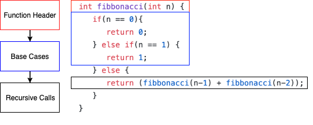
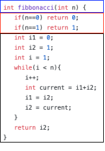
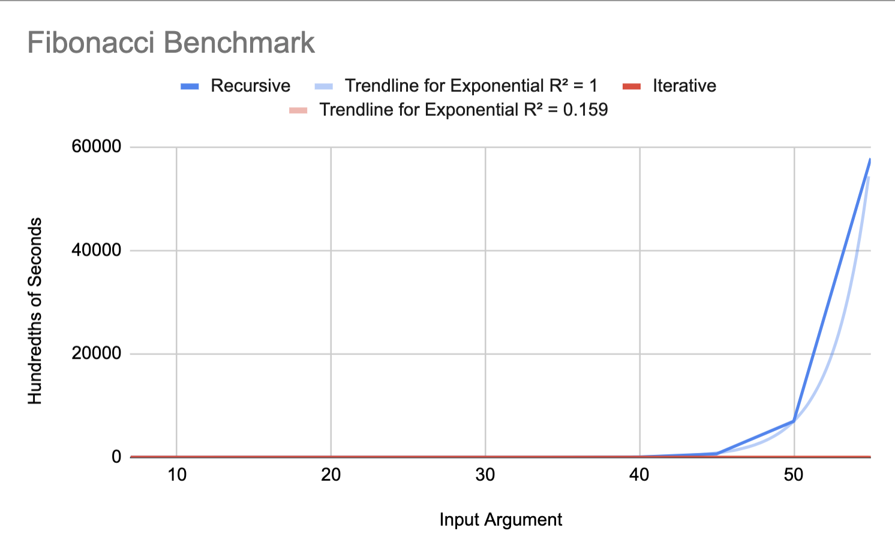
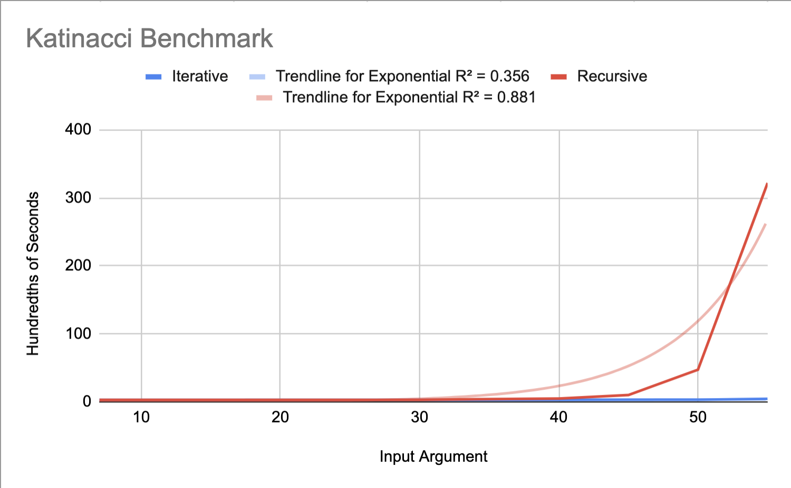
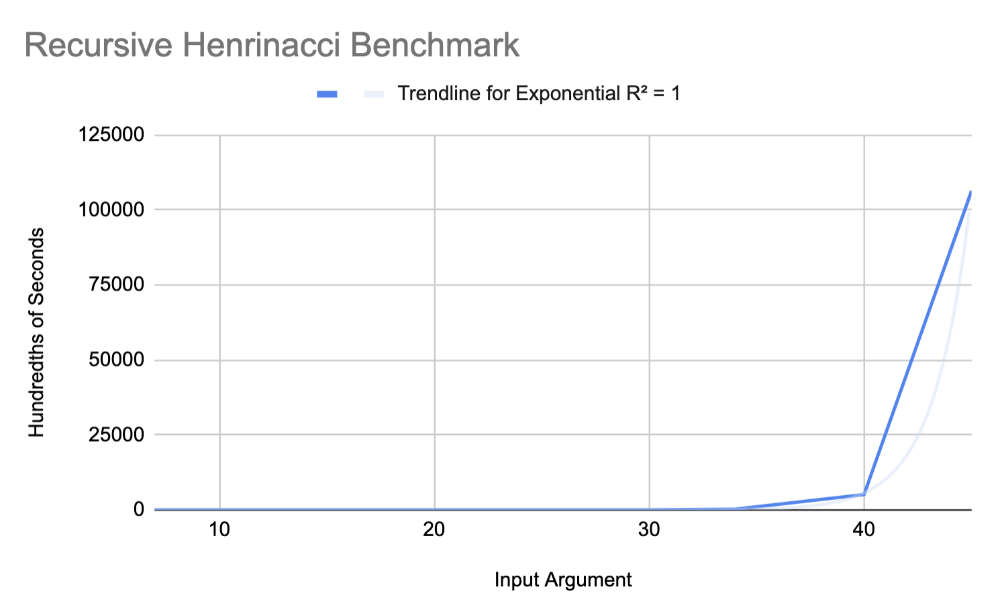
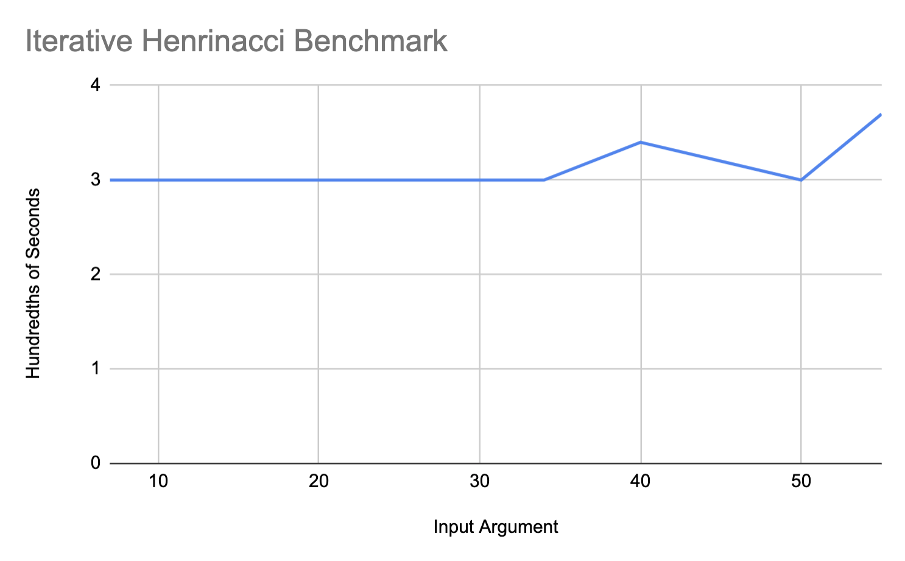

+++
title = "Internal Function Memoization"
[extra]
bio = """
  [Katy](https://github.com/kavoor) is a Senior interested in Compilers and Systems Programming. She enjoys playing soccer and exploring Ithaca in her free time.
  [Henry](https://www.linkedin.com/in/liuhenry4428) is a Senior interested in Compilers and Systems Programming. He enjoys playing video games and exploring different foods in his free time. 
"""
+++

The goal of this project is to transform a subset of recursive programs into their iterative counterparts. 

## Motivation
Execution time of a program is important. As a metric, execution time is relevant not just for saving loads of money from unnecessary compute, but is also relevant in terms of functionality. At the limit, writing faster programs can enable us to solve larger problems that require massive computational work in a tangible amount of time.
Compilers can make a given program run faster. Often, we tend to look at classic compiler optimizations as a way to iteratively speed up a given program.

However, the scope of the optimization pass model is limited, especially when the program is algorithmically inefficient. If we are able to transform programs with unnecessarily  $O(n)$ space cost into $O(1)$ space cost, or programs with $O(2^n)$ runtime into programs with $O(n)$ runtime, why couldn't a compiler?

One of the challenges of this idea is the notion of an _algorithm_. As humans, we can read the program, determine the task, and write a better program given the necessary computation. However, most compilers do not have a notion of the "goal" of a program. Similar questions arise in program synthesis when determining the "specification" of a program.

## Approach
In order to scope our project to tangible action items, we separated our idea into smaller milestones.

*V0.* Transform a recursive fibonacci program into an iterative program

*V1.* Transform a recursive program with an arbitrary combination of elements on return (e.g., fibonacci was f(n-1) + f(n-2))

*V2.* Expand scope of input set of valid programs to two-dimensional DP programs

## A First Program

Before digging in to any code, we spent time thinking deeply about recursive DP programs and their iterative counterparts. 
1. What are the distinguishing parts of the recursive implementation that can give rise to an equivalent iterative program?
2. Which parts of these recursive functions is the similar across them such that we can generalize? 
3. How do we know these are equivalent?

We decided to implement this at the LLVM-IR level so that our optimization would be source-language-independent.

It is common knowledge that there are [hard problems](https://en.wikipedia.org/wiki/List_of_unsolved_problems_in_mathematics) in the field of mathematics. Therefore, we avoid mathematics and endeavor on an ad-hoc approach. This also results in a more reader-friendly blogpost. 

We came up with several hypothesis that we then used to develop a model for _V0_.

### Hypotheses

##### Hypothesis: Memoized programs only need to store a number of values equal to the number of recursive calls.

##### Hypothesis: Memoized programs need to iterate on a monotonically incrementing value.

##### Hypothesis: Memoized programs and agnostic to the actual computation being done.

### Information Collection
Given a recursive, what information do we need to be able to generate a iterative version?
- Base Cases
- Loop induction variable and upper bound
- How these recursive calls are combined at return (i.e., fibonacci adds the results from the f(n-1) and f(n-2) together)
- The offset from our induction variable in the recursive calls (i.e., (n-1), (n-3), etc.)

Information collection posed many challenges due to the low-level of LLVMIR, and desire to generalize our solution.
#### Finding the Base Cases
To more formally define the term _base cases_, we required base cases to be comparisons with the input argument to the function, found at the top of a program, that resulted in returning a value within the body guarded by the comparison.
While humans have no trouble deciphering the base case given a program, it is much more challenging to find them when sifting through LLVMIR. We used an ad-hoc approach where we found the constant return values and then walked up the CFG to find the conditional statements that would have led to those constant outputs. From the condition instruction we extracted the function argument that would have led to that constant to be returned, and we end up with a list of argument-return pairs, which sufficiently describes the base cases of the function.

Doing this better would involve abstract interpretation. For a particular function argument, it could trigger a recursive call or it could not. With abstract interpretation, we could find all values of the argument such that the basic blocks with recursive function calls are not traversed. Those would be the base cases. 

#### Finding the Loop Induction Variable
For this project, we simply initialized the induction variable at the largest base case argument and incremented until it reached the function call's argument.

#### Finding the instructions that combine the recursive calls
We keep a running list of all recursive call instructions. For all instructions in the recursive function that use the result of a recursive call as an operand, we clone them and add the clone to a list of _dependents_ as they depend on the recursive calls. We clone instructions here so we can delete all instructions in the recursive function and insert our own. 

#### Finding Recursive Call Offsets
For each recursive call that we find, we look at the call argument and assert that it is a constant offset from the original function argument---i.e., of the form $(n-c)$ where $n$ is the original function argument and $c$ is a constant. We remember that $c$. 

### Creating a Model for Iterative Programs to use Collected Information
Once we have the information from the recursive program, we need to find a model such that given this information, can generate an iterative program. To determine what output we wanted, we wrote an iterative fibonacci program. Instead of writing a single transformation function $f$(Input Recursive Program) = Output Iterative Program, we break down the programs according to a layout. 

Consider the layout of recursive and iterative fibonacci programs below.

Here, we separate the base cases from the recursive calls in order to know which set of instructions will need to be in a loop, and which set will only need to be called once. It is important to note that in the black box, you can have any set of instructions to combine the recursive calls.

Consider the layout of the iterative version of the same program below.

Note: We keep the function header the same in order to more easily swap out invocations to fibonacci outside the function with our generated function.

### New Code Generation
To minimize changes to the overall code structure, we delete all blocks and instructions inside the original recursive function and insert our new instructions.

First we add all the base case conditionals. Next, we declare and initialize all the values we need for iteration and the incrementing iterator. After that, we create the while loop and clone in the instructions dependent on the original recursive calls (e.g., the add instruction in fib(n-1) + fib(n-2)). Lastly, we add the return statementment to which the while loop exits. 

Our code for the LLVM pass is available [here](https://github.com/liuhenry4428/llvm-pass-skeleton/tree/noauto).

<!-- We start of by 
#### Fibonacci
Consider the fibonacci algorithm. To compute number $n$, you only need the numbers (n-1) and (n-2). Any additional previous calculations can be thrown away. Is it possible to infer this information when given a program, such that we can alter a program to decrease its space consumption? If so, what are the cases to make this more generalizable, beyond optimizing a fiboncci program?

Consider the call tree for recursive fibonacci.

How extensible are these ideas? Consider the arbitrary one-dimensional programming problem below. Without specific knowledge of which recursive calls are required and their offsets from $n$, we must conservatively estimate a next call could use any previously computed elements.

## Evaluation
### Correctness
In order to evaluate correctness, we look at the programs generated for the set of valid benchmarks. During construction, we separate the domain by case into separate functions, each with a different result. These _separate functions_ are the base cases, each with their own code that exeutes and returns within the case. The \{domain $\setminus$ the domain of the base cases\} is input into the loop in the body of our function. Determining program equivalence can be broken down into equivalence of these separate functions.

However, function equivalence is an undecidable problem, as that would solve the [halting problem](https://en.wikipedia.org/wiki/Halting_problem). Therefore, to approximately validate our generated programs are correct, we test the bases cases, and a few arguments for the iterative case. 
We randomly generating a few integers between 2 and 35 as 1 is a base case, and 35 is the largest fibonacci number that still fits in a 32-bit integer.

A next step to improve correctness checking would be to utilize randomized testing, but instead, determine the space of valid inputs from the input program itself.

### Performance
To measure performance, we ran derivatives of the fibonacci program. We compare the execution time of the recursive program to the execution time of the iterative program.

Here are the results of running the fibonacci benchmark shown above. We see that the recursive benchmark follows an $O(2^n)$ execution time trendline as expected. We also see the iterative benchmark's trendline is very linear. By the data, the iterative trendline only varies between 3 and 3.5 hundredths of milliseconds between inputs 7 and 55. This is quite small. One reason this may be is that increasing n by 1 in the iterative benchmark, likely only increasing the number of add instructions by 1.

When interpreting these results, we considered the difference between these two programs. 
Consider the call tree for recursive fibonacci. As $n \longrightarrow \infty$, the number of calls in the call tree grow by $O(2^n)$.

In addition to the redundant computation, the recursive fibonacci program takes up more space, as it is not tail-recursive, and therefore requires many more stack frames for each computation.

Next consider Katinacci, a derivative of fibonacci, we created, with the recurrence: $$k(n) = k(n-1) + k(n-3)$$

Katinacci was designed to test recurrences with offsets that were not adjacent. We noticed that Katinacci does not follow the exponential trendline quite as closely as the rest of the benchmarks. One reason this may be, is that it approaches a base case much more quickly than the other benchmarks. Therefore, Katinacci may be a little bit lower on the graph than the exponential trendline, as shown.

Finally, Henrinacci, another derivative of fibonacci we created, with the recurrence: $$h(n) = h(n-1) + h(n-2) + h(n-3)$$

We see the recursive cases of these benchmarks follow the exponential trendline, while the iterative benchmarks look much more linear. While some of the graphs for the iterative benchmarks undulate a little, it's important to remember the time difference is quite small, and some of this could be noise from the moderately precise "time" command in bash.

### Discussion
We have hit our _V0_ goal of generating an iterative fibonacci from a recursive one. We have also satisfied our _V1_ goal of generalizing our implementation to recursive functions with any number of recursive calls with arbitrary constant offsets. 

Our results show that we have successfully reduced the original functions' time complexities from exponential to linear.

We were not able to satisfy our _V2_ goals as they were too technically challenging. 

## Next Steps
From Katinacci, we can see that it is not sufficient to save the same amount of values as the number of recursive calls as there are only 2 recursive calls and we need to save 3 values, thereby invalidating our first hypothesis. We now know that we need to store as many values as the furthest-back recursive call (i.e., the k(n-3) in Katinacci).

Furthermore, we are currently using an iterator that always increments by 1. This is not optimal when the recursion contains large holes as we do not need _all_ the values from the bases cases until $n$, such as $$f(n) = f(n-13) + f(n-17)$$
Instead, we need to somehow calculate the minimum number of computations. This can be done by "hopping backwards" from the desired $n$, where the hops are the offsets (in this case, 13 and 17). This then finds the minimum number of values, and also invalidates our second hypothesis that iteration needs to happy by increments of 1.

We have also only been considering functions with only 1 argument. The same principles should apply when extrapolating this algorithm to functions with multiple arguments. We found this much too technically challenging to implement. 

The end goal would be to mathematically identify all recursive programs that can be implemented in an iterative fashion and then have the LLVM pass produce that optimized version.

There is also no reason this pass needs to work only with integers. However, implementing this pass for functions with something like string arguments becomes difficult as strings require memory accesses which introduces pointer analysis and much complexity.

This seems like a very powerful optimization pass if implemented in full. Many coding challenge questions involve dynamic programming, and having a compiler that can optimize a naïve recursive solution into a iterative version seems desirable in all circumstances.

One thing that doesn't seem feasible is handing non-constant recursive call offsets (e.g., `f(n) = f(f(n-1))`, or recursive calls that are not unidirectional (e.g., `f(n) = f(n+3) + f(-n*2)`) even if they are valid programs due to their base cases.

## Primary Challenges
The primary challenge was using LLVM. The documentation is there but it is highly technical and it required a broad understanding of LLVM before things started "clicking". For example, we had immense difficulty with LLVM contexts (which were required for IRBuilder and basic block creation). Mix-and-matching LLVM contexts results in mysterious segfaults and correct usage was not obvious due to lack of examples. We eventually figured out that LLVMContexts cannot be saves to variables and instead must be passed along in function arguments. 

For example, `auto context = basicBlock->getContext();` is not legal but `someFunction(basicBlock->getContext());` is. 

It was also difficult to store and replay the instructions dependent on the recursive calls due to messy pointer management, specifically when setting the `Use` objects of those instructions to point at the new values we operate on for the iterative version. 

Code generation was also on the more tedious side as we were writing LLVM IR. This was find for our 1D functions, but for 2+D functions it seems like a better approach to generate higher level source code (such as C++ code) that implements our iterative function and then use Clang to compile it down to LLVM IR which we would then link in. This allows us to write code for complex things like multi-dimensional arrays in a higher-level language instead of LLVM IR. 
