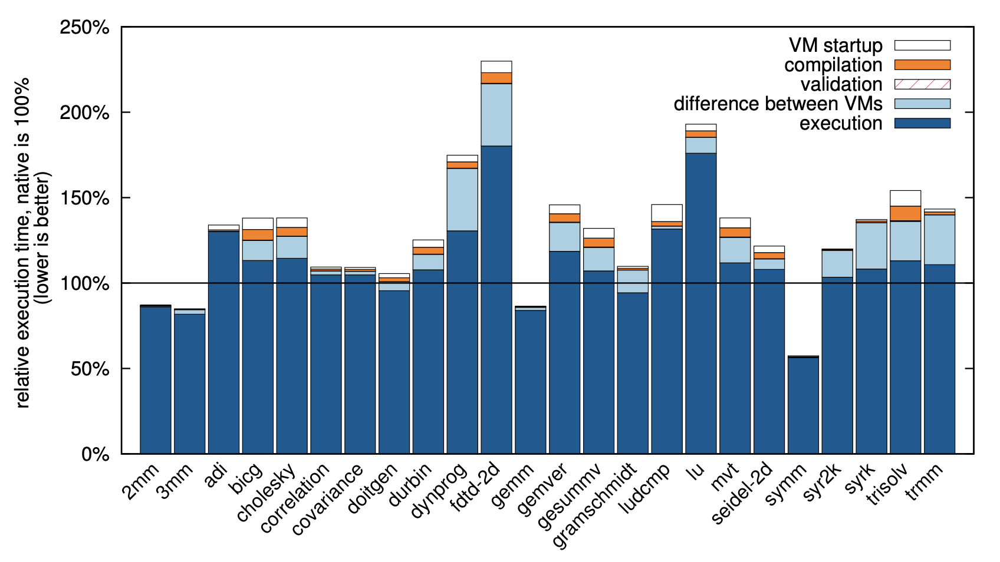
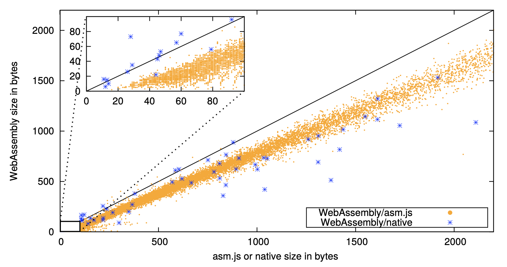

+++
title = "Bringing you up to speed on how compiling WebAssembly is faster"
extra.author = "Sachille Atapattu"
extra.author_link = "https://www.csl.cornell.edu/~sachille/"
extra.bio = """
  [Sachille][] is a third-year graduate student working across the stack to 
  make heterogeneous computing easier. Sachille also likes books (currently reading 
  Howards End by E.M. Forster) and philosophizing with friends.

[sachille]: https://www.csl.cornell.edu/~sachille
"""
+++

If you're a geography buff like me (you're probably not, but one can hope), 
you might remember the time when you downloaded an app to get the exhilarating
experience of zooming on top of a volcano, or onto an island in the middle of the 
Pacific, or onto the top of the Eiffel. Then do you remember when you 
could do these feats from the convenience of the Chrome browser? Well, 
then you might have just heard that now you can do it in (almost) any browser out there. 
For me, that's what WebAssembly brings.

In this article, I don't expect to talk much about the language (or binary code format) 
itself, but implications of its compilation which makes 
things like [Google Earth][earth] on a browser possible.

[earth]: https://www.google.com/earth/

## What is WebAssembly?
WebAssembly is a binary code format to transfer web applications from the 
server to the browser. It is incorporated in modern browsers to be used in 
tandem with existing JavaScript applications, and uses existing JavaScript 
engines to interpret and execute. It has taken the world wide web by storm a
- it is rolled out by four major browsers (Chrome, Edge, Mozilla and Safari)
i.e. platform independent
- it is programming model independent
- it is hardware independent

What this means is you could write a web application in C, compile it to 
WebAssembly and use it on any browser on any hardware. This gives much more 
performance in general than a JavaScript program, which has type 
classification overheads, performance implications based on which browser 
you target and how performant is your interpreter.

## Is WebAssembly just C on browsers?
WebAssembly does brings the performance of pre-compiled languages to web browsers. 
But it does so side-by-side with traditional javascript running on the same engines.
This allows browsers to have best of both worlds, drive the Ferrari on the race track- 
run performant WebAssembly when it needs performance, or drive the Prius to the 
grocery store- quickly getting a simple web application up and running.

With WebAssembly, you could use JavaScript for fast development, but also 
use C where you need performance. You could use C where static typing is
useful, but JavaScript where dynamic typing is a necessacity for productivity.
And you could combine these modules, to balance productivity and performance,
as both these styles can now be executed in the same compiler flow.
So WebAssembly is more than just C on browsers, it's a carefully coordinated, 
well-designed, massive engineering effort to reconcile two worlds at odds.

## Compiling for WebAssembly
Major component of speed up from WebAssembly comes from the compilation.
Using JavaScript, your JavaScript engine would go through the phases of 
parsing, baseline compilation, optimizing compiler, re-optimizing and 
bail out, execute and garbage collection to run an application. 
WebAssembly affects each of these stages to be more performant.

To begin with, WebAssembly is more compact than JavaScript source code, 
making it faster to fetch from the server. Then WebAssembly doesn't need 
parsing, it's already compiled down to virtual instructions which only 
need decoding like in actual hardware. The engine can do this decode 
much faster than parsing JavaScript code to an IR.

Then benefits of WebAssembly from actual compilation kick in. 
JavaScript needs to be compiled to multiple versions based on what types 
are in use(similar to any other dynamically typed language). WebAssembly 
code has its types encoded during offline compilation on to WebAssembly.
Therefore, it doesn't need monitoring (in the interpreter) to figure out 
the types, and maintain multiple versions. The JavaScript engine also 
doesn't need to do most optimizations, except for platform and hardware 
dependent ones, as everything else is already done in static compile time.

Since WebAssembly doesn't need assumptions (such as which type certain 
object is) during interpretting, the JavaScript engine doesn't  need to 
bail out and reoptimize as such errors never occur. 

Finally, WebAssembly also allow you to manage memory manually (it only 
supports manual memory management as of now, but automation is to be added
 as an option) which allows you to avoid expensive garbage collection 
during interpretation.

## Implementing WebAssembly compilers
WebAssembly is walking a tight rope between high performance (C world), and 
safety and portability(JS world). It is hard to theorize how to optimize for
it, so the WebAssembly team implemented extensions in different browsers to
validate that it is indeed possible to achieve the said goal.

V8 (from Chrome) and SpiderMonkey (from Firefox), reuse their optimizing JIT 
compilers to compile ahead-of-time. This provides them predictable high 
performance, as opposed to the unpredictable warmup times with JavaScript.
Chakra (from Edge) uses lazy translation and optimizes only hot code. This 
achieves faster startup time.

To permit efficient use of baseline JIT compilers, WebAssembly is desiged to
do fast validation and ability to track registers for allocation without IR
generation. To integrate well with optimizing JIT compilers, WebAssembly is 
designed to do direct-to-SSA translation. Moreover, structured control flow 
makes decoding simpler.

## How good is it?
Writing code in WebAssembly doesn't mean it'll be automatically faster. 
JavaScript can be in theory, more performant in execution (at least for now, 
where WebAssembly is interpretted using JavaScript enging). But this 
requires the programmer to know JIT compilation internals and constrain to 
one browser as each has different interpreters. WebAssembly is
already optimized statically (more time for the compiler to optimize) for 
the general case and each interpreter can leverage it's generality to do 
additional optimizations better than on generic JavaScript. So in practice
WebAssembly can be much more performant.

The following bar graph demonstrates how WebAssembly performs comparative to
native code (running a C application). Most benchmarks are within 10\% of 
native performance. 

An [article][spec] from some designers of WebAssembly suggests that WebAssembly 
can run at about 80\% performance of native applications. The paper also 
reports that performance compared to the state-of-the-art mechanism to 
execute native programs in a browser, asm.js, is about 33.7\% better.

This scatter plot illustrates WebAssembly benefits in terms of code size. They
are on average 37.5\% smaller than asm.js code and 14.7\% smaller than native code.

## What does this mean?
Well, as I said, Google Earth on any browser. Just in case that's not enough,
playing a game on a browser is going to be very similar to downloading an app
and running it natively, you can share your CAD design to someone over the web
and have them take a look at it without downloading the files or even having the
necessary tools installed, you'll see a lot more sophisticated features in 
websites such as social media, all you need is a device with a browser to 
experience almost any service, downloading an app is not going to be the same- 
why would you? when you get similar (in human perception) performance by running
them on a broswer without the overhead of installing.

## What's next?
WebAssembly has already achieved a lot in a short span of time (3 years 
since introduced in 2017). It is already supported in all major browsers 
and popular development kit [Emscripten][emscripten] offers compiling C down to `.wasm`
via `asm.js`. Personally, it has already enabled running Google Earth on 
any browser (what more do you need!!).

Yet, WebAssembly is in its infancy. The popular compiler toolchain, 
[the LLVM project][llvm], is adding a backend for it and developers are adding debug tools
to improve the WebAssembly eco-system.

More exciting and enabling future options to WebAssembly may include 
- stream compilation: start compiling as the bytecode is being downloaded, 
- shared memory concurrency: reduce synchronization by handling it 
efficiently on shared memory and 
- SIMD: to parallelize execution by sharing instructions among data. 

[emscripten]: https://emscripten.org
[llvm]: https://llvm.org

## How to learn more..
- [WebAssembly paper][paper]
- [A cartoon intro to WebAssembly][cart]
- [WebAssembly will finally let you run high performance applications in your browser][spec]

[paper]: https://people.mpi-sws.org/~rossberg/papers/Haas,%20Rossberg,%20Schuff,%20Titzer,%20Gohman,%20Wagner,%20Zakai,%20Bastien,%20Holman%20-%20Bringing%20the%20Web%20up%20to%20Speed%20with%20WebAssembly.pdf
[cart]: https://hacks.mozilla.org/2017/02/a-cartoon-intro-to-webassembly/
[spec]: https://spectrum.ieee.org/computing/software/webassembly-will-finally-let-you-run-highperformance-applications-in-your-browser

