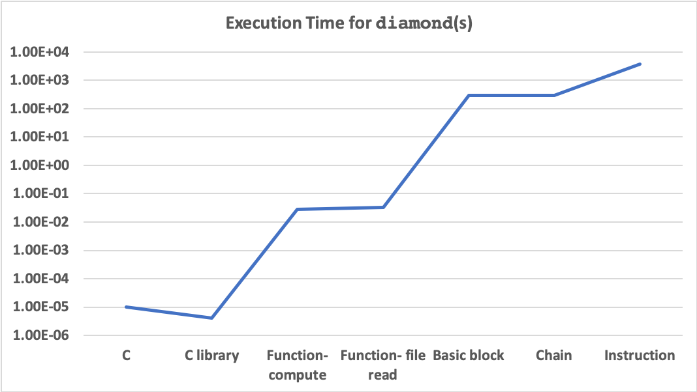
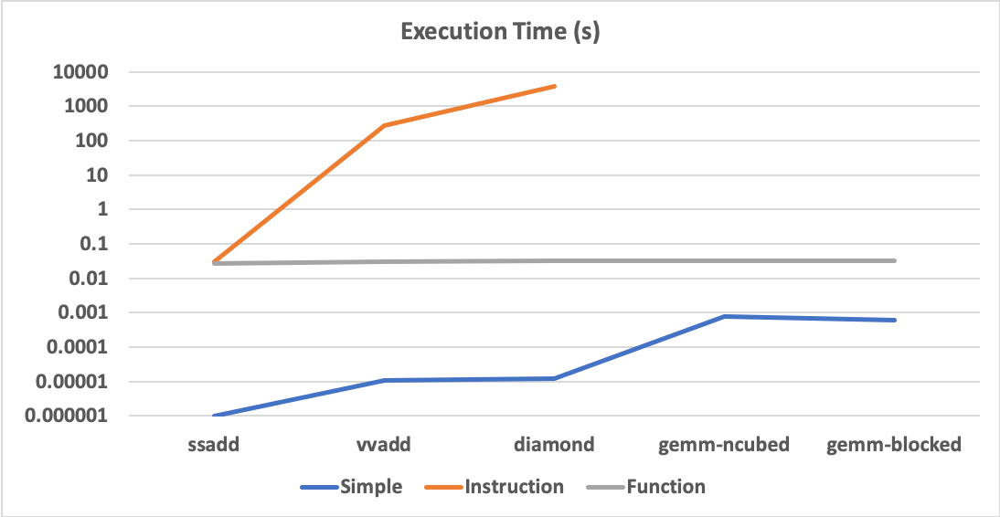

+++
title = "Framework to Include Runtime Functions to Your LLVM Pass"
extra.author = "Sachille Atapattu"
extra.author_link = "https://www.csl.cornell.edu/~sachille/"
extra.bio = """
  [Sachille][] is a third-year graduate student working across the stack to 
  make heterogeneous computing easier. Sachille also likes books (currently reading 
  Endure by Alex Hutchinson) and philosophizing with friends.

[sachille]: https://www.csl.cornell.edu/~sachille
"""
+++

This blog is relating experience of the author to efficiently and productively 
include runtime functions as an easy way to simulate hardware accelerators.

My research direction, which is to make heterogeneous architectures accessible to 
software programmers, requires implementing overall system solutions. This becomes
surprisingly tricky as implementing hardware is hard, some (most?) heterogeneous 
architectures have their own custom and close-sourced programming models and existing 
popular simulators also require limiting to conventional programming models. So, to try
out a new architecture idea, either you have to limit yourself to existing toolflow ([Dahlia][dahlia]),
or extend simulators with the programming models they support ([ParallelXL][parallelxl]). 
Me being a hardware programmer (and a newbie to the software end of the stack), 
I also have aversion to start implementing a full-stack solution without sufficient 
insight to justify I'm doing something sane.

An easy hack I came across is using runtime functions to do my simulations.
This way, I don't have to set my abstraction level in stone (baking into my compiler), as it's merely 
creating a new LLVM pass at a different level with the accompanying Python simulator, 
(which though non trivial, is still better than creating an extension for [gem5][gem5]).

In summary this report is to say, this is a great hack to gain intuition. However 
to make a truly general simulator framework may need a lot more engineering. And of 
course, running in Python is super slow.

[dahlia]: https://drive.google.com/file/d/13zJDMHOkymitZc6Zu4U7QXkRFSr99Lk_/view?usp=sharing 
[parallelxl]: https://www.csl.cornell.edu/~tchen/files/parallelxl-micro18.pdf
[gem5]: https://www.gem5.org

## Where to begin
[LLVM for grad students][grad] provides a basic skeleton to use runtime functions through LLVM.
This pass simply inserts a logging function in a C runtime library after an instruction. [Skeleton][skeleton]
provides a starting point for this framework, which I'm calling Leech. [Leech][leech] can be found here.

[grad]: https://www.cs.cornell.edu/~asampson/blog/llvm.html
[skeleton]: https://github.com/sampsyo/llvm-pass-skeleton
[leech]: https://github.com/sa2257/llvm-runtime-pass

## What this framework is targeting
I'm selecting some key levels to insert runtime function replacements.
- Instruction level
- Subgraph level
- Basic block level
- Function level
This framework will provide a pass for each of them and provide some rudimentary tools
needed for a replacement at each level. Ideally, these tools should be generic and complete.
However, the replacements are highly dependent on the program and the runtime function.
Hence this is an experiment to evaluate how robust replacements are at each level.

## Replacing instructions
Instructions provide a clearly defined interface for the runtime functions to call.
Therefore, replacing an instruction is probably the easiest pass to implement, and also 
the easiest to extend to a substantial benchmark suite. 

```c
    /* create the function call from runtime library */
    LLVMContext& Ctx = F.getContext();
    FunctionCallee rtFunc;
    rtFunc = F.getParent()->getOrInsertFunction(
        "ins_replace", 
        Type::getDoubleTy(Ctx),
        Type::getDoubleTy(Ctx), Type::getDoubleTy(Ctx), Type::getInt32Ty(Ctx)
        );
    // function call name, return type and argument types have to be known

    for (auto& B : F) {
        queue <Instruction*> workList; // collects replaced instructions within iterator
        for (auto& I : B) {
            /* Add runtime instruction selection here */
            
            /* End of selection algorithm */
                
            /* find the place to enter the runtime call */
            IRBuilder<> builder(I);
            builder.SetInsertPoint(&B, ++builder.GetInsertPoint());
            
            
            /* insert runtime call, collect return value */
            Constant *i32_config = ConstantInt::get(Type::getInt32Ty(Ctx), /* configuration */, true);
            Value* args[] = {I.getOperand(0), I.getOperand(1), i32_config};
            Value* ret =  builder.CreateCall(rtFunc, args);
            
            /* forward return to users */
            for (auto& U : I.uses()) {
                User* user = U.getUser();
                user->setOperand(U.getOperandNo(), ret);
            }
            
            /* mark instruction for deletion */
            workList.push(&I);
            I.dropAllReferences();
        }
        
        /* delete replaced instructions */
        while (!workList.empty()) {
            workList.front()->eraseFromParent();
            workList.pop();
        }
    }
```
Key limitations to note: runtime library has to be co-designed with the function declarations 
baked into the LLVM pass and of course, the instruction selection algorithm can get very complex
depending on how interesting the task is.

I wish to direct your attention also to the granularity of the replacements. The runtime functions
are essentially overloading the LLVM instructions here. This granularity is not particulary useful for
loosely-coupled accelerators, as communication between the accelerator and the CPU is at the highest.
This is reflected in the performance section.

## Replacing functions
In contrast to the instruction level, functions are a substantially coarser-grained abstraction 
for an accelerator to replace. Even a loosely-coupled accelerator can tradeoff the communication latencies
by efficient computation. 

```c
    /* create the function call from runtime library */
    LLVMContext& Ctx = F.getContext();
    FunctionCallee rtFunc;
    rtFunc = F.getParent()->getOrInsertFunction(
        "func_replace", 
        Type::getVoidTy(Ctx),
        Type::getDoublePtrTy(Ctx), Type::getDoublePtrTy(Ctx), Type::getDoublePtrTy(Ctx)
    );
    // function call name and argument types have to be known

    /* Add runtime function selection here */
    
    /* End of selection algorithm */
        
    queue <BasicBlock*> workList; // collects replaced function within iterator
    /* mark basic blocks for deletion */
    for (auto& B : F) {
        for (auto& I : B) {
            Instruction* ins = &I;
            ins->dropAllReferences();
        }
        workList.push(&B);
    }
    
    /* delete basic blocks in the function being replaced */
    while (!workList.empty()) {
        workList.front()->eraseFromParent();
        workList.pop();
    }
    
    /* collect function argumentsi */
    int i = 0;
    Value* args[3];
    for(auto arg = F.arg_begin(); arg != F.arg_end(); ++arg) {
            args[i] = arg;
            i++;
    }
    // requires knowlegde about arguments

    /* create new basic block */ 
    BasicBlock *pb = BasicBlock::Create(Ctx, "simple", &F);
    
    /* create the runtime function call */
    IRBuilder<> builder(pb);
    builder.CreateCall(rtFunc, args);
    
    /* create a return instruction from the return value */
    Instruction *retInst = ReturnInst::Create(Ctx, pb);
```
This looks easy, but there's a caveat. Unlike the instructions, which are very general,
now you have a specific function to replace. This turned out to be quite a challenge to
extend to all the benchmarks in MachSuite, even with a trivial function. (A function that
reads precalculated values and fills in the arrays.) Not only the function signature has to be
identical both in the LLVM pass and the runtime library, the size of the arguments had to be the
same size in the original program and the runtime function. 

Therefore, functions offer a performant tradeoff for an accelerator. But in terms of productive 
implementation, it is very program specific. The runtime library and the high-level 
programmer needs to follow ad-hoc set of rules to use this template, even though it is
possible to add some checks in the LLVM pass with some engineering.

## Replacing basic blocks
Replacing a basic block can be a middle ground between these two granularities.
A basic block can be considered as a collection of instructions, for the generation
of interfaces. Since the interfaces for an instruction are clear, basic blocks will be an extension.
It can be seen as a part of a function for the purposes of granularity. So a (loosely coupled) accelerator
can work at a higher granularity than an instruction.

```c
    /* create the function call from runtime library */
    LLVMContext& Ctx = F.getContext();
    FunctionCallee rtFunc;
    rtFunc = F.getParent()->getOrInsertFunction(
      "bb_replace", 
      Type::getInt32Ty(Ctx),
      Type::getInt32Ty(Ctx)
    );
    // function call name and argument types have to be known

    /* Add runtime basic block selection here */
    
    /* End of selection algorithm */
    
    /* Select a basic block */
    BasicBlock* workList = NULL; // collects replaced basic block within iterator
    /* mark basic blocks for deletion */
    for (auto& B : F) {
        for (auto& I : B) {
            workList = &B;
        }
    }
    
    /* collect information on the basic block */
    BasicBlock* predBB = workList->getSinglePredecessor();
    BasicBlock* succBB = workList->getSingleSuccessor();
    
    /* delete basic block being replaced */
    if (workList != NULL) {
        workList->eraseFromParent();
    }
    
    /* create new basic block */ 
    BasicBlock *pb = BasicBlock::Create(Ctx, "simple", &F);
    
    /* create the runtime function call */
    IRBuilder<> builder(pb);
    Constant *i32_configs = ConstantInt::get(Type::getInt32Ty(Ctx), /*configuration*/, true);
    Value* args[] = {i32_configs};
    Value* ret =  builder.CreateCall(rtFunc, args);
    
    /* create a jump to next block */
    Instruction *brInst = BranchInst::Create(succBB, pb);
    
    /* update jump from previous block */
    Instruction *brPred = predBB->getTerminator();
    brPred->setSuccessor(0, pb);
```
However, this also conflates challenges from both prior levels of abstraction.
Unlike a single instruction, it's highly program dependent how a basic block interacts with
rest of the program. Unlike a function, it is not clear what those program specific interfaces
are. And these interfaces have to be created at an intermediate-representation level. To make matters worse,
these interfaces are intermediate-repesentation specific. If you target a specific optimization
(say -O1), your pass will probably need updating for a different optimization.
This is all great, if you're focusing on the compiler optimizations. But for a hardware 
accelerator simulation nothing can be worse; now you are entangled in the compiler optimization
with the simulator for performance.

## Replacing chains of instructions
One way to strike the middle ground provided by basic blocks, without the baggage from a
particular compiler optimization, is to critically select a set of instructions to 
replace that gives you sufficient coarseness in granularity but also decouples from the 
intermediate representation.

I motivated this by selecting chains of floating point instructions.

```c
    /* create the function call from runtime library */
    LLVMContext& Ctx = F.getContext();
    FunctionCallee rtFunc = F.getParent()->getOrInsertFunction(
        "chain_replace", Type::getDoubleTy(Ctx),
        Type::getDoubleTy(Ctx), Type::getDoubleTy(Ctx)
    );
    // function call name and argument types have to be known

    for (auto &B: F) {
        list <Instruction*> Selected;
        for (auto &I: B) {
        /* Add runtime sub block selection here */
    
        /* End of selection algorithm */
    	}
    
        Value* args[4];
        /* Enter instructions to the new basic block */
        for (auto &I: Selected) {
            IRBuilder<> builder(I);
            builder.SetInsertPoint(&B, ++builder.GetInsertPoint());
            Value* ret =  builder.CreateCall(rtFunc, args);
    
            /* forward return to users */
            for (auto& U : I->uses()) {
                User* user = U.getUser();
                user->setOperand(U.getOperandNo(), ret);
            }
        }
        /* Done entering new instructions */
        
        /* Remove replaced instructions from the basic block */
        while (!Selected.empty()) {
            Selected.front()->eraseFromParent();
            Selected.pop_front();
        }
    }
```
The tradeoff with this approach is, this abstraction is an arbitrary one we have picked.
The program, nor LLVM provide any support. We have to create the interfaces and replacement
with lower level tools such as basic blocks or instructions. 

## Evaluation
I evaluated this framework by implementing passes for [MachSuite][mach]. I use a mix of unoptimizes and -O1
for the kernel code. I use clang version 11.0.0 for LLVM compilation and python3.7 for Python execution. 
I averaged results from multiple executions to make the tests more robust. However, for certain tests this proved
too tedious as the tests took a long time to complete.

For instructions, I replaced floating point instructions with a Python simulator of
a floating point accelerator. At this flexible granularity it was fairly straightforward to cover 
the entire benchmark. 

For functions, I created a vvadd function to test replacement for a vvadd benchmark. I also created 
a preprocessed results reading function for functions with 2 input arguments and an output argument of 
the same size. This function can only cover 3 microbenchmarks I wrote and 2 MachSuite benchmarks as 
the function signature doesn't match the rest of the suite. Extending the runtime library is fairly trivial,
but incomplete.

For basic blocks, I'm not maintaining functional correctness of the benchmarks. I'm replacing a basic block 
with a floating point operator with a runtime function call. I'm collecting results to how much coverage
this version has.

For sub blocks, I tested the pass on a specific microbenchmark I wrote (`diamond`). However, the runtime function was 
written to be functionally similar to the compuatation pattern in `diamond` which does not appear elsewhere in MachSuite
to insert functionally correct runtime function calls in other benchmarks. 

[mach]: https://breagen.github.io/MachSuite/

## Performance
First image illustrates performance at different abstraction levels for the `diamond` microbenchmark.


Results show instruction replacement has several orders of magnitude performance overhead.
(C program takes micro seconds while Python function calls consume minutes for a small benchmark.) Function replacement 
overhead is low, but still significant (in the order of milliseconds). Instruction block replacement lies in
betweent these two extremes. C runtime function call however, is more performant than the original program. I
suspect this is due to the library compilation at a higher optimization than the original program, which is
compiled in `-O1`.

Following graph shows all the benchmarks that the current function replacement functionally works. 



It is evident from this graph that for a benchmark suite as MachSuite, instruction level replacement is intractable.

## Conclusions
I think the initial goal of this exploration is successful: these templates do provide a basis to create passes
with runtime function insertion. However, it also provides two unsurprising insights:
- Python function calls are super slow compared to C, therefore such a simulation framework can only go so far.
- Even though function calls can be inserted at each of these levels with the framework templates,
it can be quite hard to come up with a selection algorithm to get something useful done.

Some other learnings from the project are:
- which version in Python to use for embedding in C turned out to be surprisingly hard.
- extending MachSuite to test kernel functions multiple times should have been trivial.
However I kept running into segmentation faults. This is yet to be debugged.
- which optimization level to use in LLVM has an impact on the LLVM passes. Some passes 
need to be completely reworked or substantially extended to cover multiple optimizations.

## References
- [skeleton][skeleton]
- [runtime templates][leech]

 
