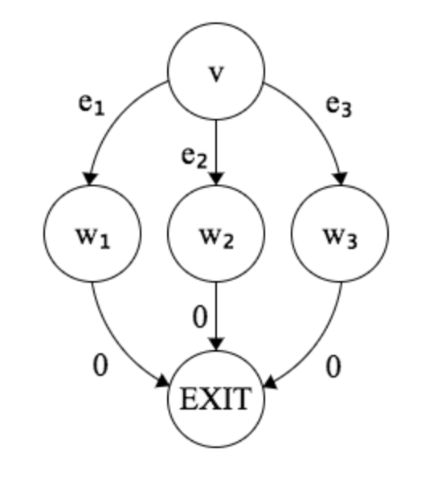

+++
title = "Efficient Path Profiling"
[extra]
latex = true
[[extra.authors]]
name = "Theodore Bauer"
bio = """
  [Theodore Bauer][http://tedbauer.github.io/] is a first year M.S. student at Cornell who is interested in programming languages and systems. He likes spending time outside and making Spotify playlists.
"""
link = "http://tedbauer.github.io/"
+++

Profiling a program provides important data that can guide program tuning, test coverage, compilation, and more. Researchers and engineers analyze various program aspects, like basic blocks and CFG edges. In particular, these two aspects are viewed as low-overhead although somewhat inaccurate with respect to path execution. Path profiling, which is at the level of sequences of basic block executions, can provide an accurate path perspective.

[Our reading today][pathprofiling] provides a novel algorithm for profiling path executions with tolerable program overhead, making a compelling case for using path profiling.

## The Algorithm

This algorithm instruments programs in such a way that, at the end of a program execution, we are left with generated integer numbers that we can use to infer the paths that executed. At a high level, the algorithm does this for a program by:

1. Assigning its CFG edges special weights
2. Optimizing this weight selection to reduce overhead
3. Adding instrumentation to its code that uses these weights to generate the path-identifying numbers.

Additionally, the paper gives us an algorithm that lets us recover paths from the generated integers. Now, we'll dive into how each of these parts of the algorithm work.

### 1. Assigning CFG edges special weights

The algorithm starts by assigning every edge in the program's CFG a weight in such a way that, the sum of the weights across every path through the CFG maps to a unique number (no two paths map to the same number) that's at least $0$ and less than the number of paths.

Put more formally, the algorithm assigns every edge $e$ in the CFG a value $\text{VAL}(e)$ such that every path's sum of $v(e)$s corresponds to a unique number in the range $0..\text{NUMPATHS}(v)$, and every vertex $v$ a value $\text{NUMPATHS}(v)$ that's the distance from $v$ to the graph sink. Here's pseudocode that accomplishes that, adapted from the paper:

```
foreach vertex v in reverse topological order:
  if v is a leaf vertex:
    NUMPATHS(v) = 1
  else:
    NUMPATHS(v) = 0
    for each edge e = v->w:
      VAL(e) = NUMPATHS(v)
      NUMPATHS(v) += NUMPATHS(w)
```

Basically, for every vertex $v$, $v$'s outgoing edges are assigned the sum of the number of paths to the CFG sink of the already processed going edges for $v$.

Inductively proving that this algorithm gives us a unique mapping from paths to numbers in the range $0..\text{NUMPATHS}(v)$ helps to illuminate why it works. Let's call the distance from a vertex to the sink $H$. We can prove this by inducting on $H$ of a vertex. For the base case $H=0$, that is, $v$ is the sink, $\text{NUMPATHS}(v)$ is $1$ which is correct, because there's only a trivial path that crosses no edges. This path also maps to $0$, as it doesn't cross any edges with any weights. For the inductive case, for some vertex $v$ with some height $H$, we can assume the inductive hypothesis for all successors, that is, for all successors $w\_1, ..., w\_n$, all paths starting at each successor $w\_i$ map uniquely to ranges $0..\text{NUMPATHS}(w\_i)$. As we've mentioned, each edge $v \rightarrow w\_i$ is assigned the sum of the weights of the already-processed successors $w\_1, ..., w\_{i-1}$. These edge weights will "shift" the numbers that the paths starting with each $w\_i$ mapped to in such a way that every path starting at $v$ will map to a unique number.

We can demonstrate this reasoning by trying it out on a real CFG:



In this picture, we've already labeled the edges from $w\_1$, $w\_2$ and $w\_3$ as $0$. We can use the algorithm to figure out the values for $e\_1$, $e\_2$ and $e\_3$ and see why they provide us  with the property that we want. First, the algorithm will assign $e\_1$ to $0$ (it doesn't matter the order that we process the edges, but the first one processed will be $0$). Next, if $e\_2$ is selected to be processed, it'll be assigned $\text{NUMPATHS}(w\_1)=1$ per the algorithm. Finally, $e\_3$ will be assigned $\text{NUMPATHS}(w\_1) + \text{NUMPATHS}(w\_2)=2$. So the range of values (just one $0$) that the paths starting at $w\_2$ produced is shifted by 1, and the paths starting at $w\_3$ are shifted by 2, and accumulating these ranges into one range gives us $0..2$.

### 2. Optimizing weight selection

The weights selected in step 1 could have suboptimal overhead. They are not selected with minimizing the number of weights in mind. Ideally we'd want fewer edges to have weights, so we have to do less computation when we're profiling a program execution. The next step of the algorithm helps to alleviate this by using [some related work on program event counting][eventcounting]. At a high level, the algorithm finds a maximum cost spanning tree, where the cost is the sum of the weights found in the first part of the algorithm. Each chord $c$ of this spanning tree is then assigned a new weight computed from summing the weights from the first part of the algorithm found in a cycle that contains $c$, the source and the sink of the graph. This transformation also preserves the properties we wanted in the first part of the algorithm, that is, that each path starting at $v$ still maps to a unique number in the range $0..\text{NUMPATHS}(v)$.

### 3. Instrumenting code

The algorithm augments the code we're profiling so that when we run the code, we have logic that tracks which edges are traversed and which weights are added to our running sum. 

### Regenerating paths

Finally, the paper provides a straightforward algorithm to recover a path from a number.

1. Initialize $R$ to have the generated path number, and $v$ to be the entry vertex of the CFG. Keep track of the starting vertex in $\text{PATH}$.
2. Find edge $v \rightarrow w$ that has the largest $\text{VAL}(v \rightarrow w)$ that's less than $R$. Set $R$ to $R-\text{VAL}(v \rightarrow w)$, and set $v$ to $w$. Append $v$ to $\text{PATH}$.
3. Stop when you end up at the sink. $\text{PATH}$ will contain a list of vertices.

## Augmenting CFGs with cycles

The algorithm described in this paper only works on directed acyclic graphs (DAGs). The paper describes a technique for modifying the CFG to transform it into a DAG but still provide accurate path profiling, which is crucial to profile programs with loops.

## Evaluation

The authors ran their path profiling implementation on a variety of benchmarks, as well as edge profiling to get a sense of the relative overhead and accuracy. In general, path profiling performance tended to be comparable to edge profiling, and even when benchmarks were large and required more memory intensive instrumentation for path profiling, the overhead was tolerably worse than that of edge profiling.

## Discussion Questions

- Are there examples of other performance metrics that are deemed to be too expensive, but could be useful?
- Could edge or basic block profiling be useful in some circumstances where path profiling is not?
- When is the overhead of a profiling technique worth its accuracy?

[pathprofiling]: https://dl.acm.org/doi/10.5555/243846.243857
[eventcounting]: https://dl.acm.org/doi/10.1145/186025.186027.
