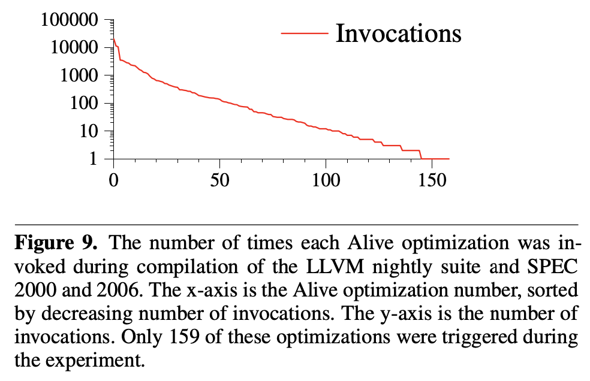

+++
title="Provably Correct Peephole Optimizations with Alive"
[extra]
bio = """
  Samwise Parkinson is a first-year graduate student of computer science at Cornell University, working on formal verification of network programming language implementations.
[[extra.authors]]
name= "Goktug Saatcioglu"
[[extra.authors]]
name = "Samwise Parkinson"
+++

Verification of "things computers do" come in many flavors. In the context of compilers, the [CompCert](compcert) project is one approach where compilers are proven to never compile incorrectly. However, this fully verified formal approach comes at the cost of not supporting all language constructs and cannot optimize as well as current compilers. [Random](diff-testing) [testing](comp-validation) is another approach where random test inputs are generated in an attempt to find [bugs](find-bugs-c). These approaches can be highly effective both in terms of finding bugs and ease of use but have no correctness guarantees.

This week's [paper](paper) attempts to combine the usability aspect from testing with the guarantees aspect of formal approaches. The proposed tool, Alive, formalizes our notions of compiler correctness to treat a source program as the ground truth and verify specific optimizations, namely peephole, that transform these programs. To be practical, Alive introduces a new domain-specific language (DSL) that is meant to resemble LLVM code which makes it easier to express what is meant to be verified.

The authors of Alive state the following as their main contribution.

> Alive’s main contribution to the state of the art is providing a usable formal methods tool based on the semantics of LLVM IR, with support for automated correctness proofs in the presence of LLVM’s three kinds of undefined behavior, and with support for code generation.

## Background

This paper pre-supposes a considerable familiarity with the [LLVM](llvm) library and IR in its exposition of new contributions. For context, LLVM (which is not an acronym) is a long-term software project that provides a plurality of tools for implementing compiler back-ends. The core of the software consists of a custom low-level IR and a library of optimization passes on this IR, both of which are thoroughly documented. Indeed, many of these optimization passes are rather familiar, such as dead instruction elimination, global value numbering, and loop-invariant code motion, to name a few. It also provides an end-to-end C compiler which utilizes these tools, and it has become a supporting library for countless compilers since the project began in 2002. Languages with compilers that use LLVM libraries range from Haskell to Ruby to Rust. Suffice to say, LLVM is deployed on countless devices worldwide today.

The most pertinent technical background for understanding the Alive optimization tool is related to the distinct features of the LLVM IR. LLVM code resembles a sophisticated sort of abstract assembly code. There is a type system and a module system designed to assist linking, along with a notion of well-formedness for an LLVM program. There is also a wide variety of annotations, meta-data, and variable renaming. However, most of the optimization in the scope of this paper occurs locally within the body of individual functions. The code is easy enough to read, but the difficulty lies in ambiguous instructions. 

## Contributions

This paper introduces Alive, a Domain-Specific Language designed for conveniently verifying LLVM optimizations. The Alive language provides a framework for encoding LLVM transformations of compiled code. The implementation uses a transformation encoding to generate preconditions and correctness conditions expressed in terms of predicates, which may then be automatically verified by an SMT solver. The result is a verified LLVM optimization in Alive, which also provides a tool for extracting the optimization into C++ code. As an additional feature, the language supports built-in predicates which are implemented by dataflow analyses.

The main difficulty with verifying LLVM opmtimizations is that the source code may have undefined behaviors. For this reason, many of the interesting design decisions for Alive are related to handling undefined behavior. In principle, Alive is intended to check that optimizations are *refining*, that is, that the set of behaviors of the target code is included in the set of behaviors of the source.

After introducing Aive, the paper turns toward more technical concerns. In particular, it proves two versions of a soundness theorem for Alive's verification method, first considering the language without memory and pointer concerns, then re-introducing pointer arithmetic. The theorem in essence states that if the Alive back-end accepts a given optimization, then the code transformation is semantics-refining.

## Detailed Summary

At a high-level, the process of verifying a peephole optimization in Alive is as follows:

1. Specify the transformation in Alive's domain-specific language (DSL).
2. Alive discharges SMT formulas that encode the semantics of LLVM operations and datatypes.
3. The formulas from step 2 are used as verification conditions and passed to an SMT solver.
3. SMT solver either verifies the optimization as valid or returns a counterexample showing why the optimization is wrong.
4. (Optional step) If optimization is correct, Alive synthesizes C++ code that can then generate the relevant optimization to optimize LLVM code.

### Alive's DSL

Optimizations in Alive are written as a transformation from a source (left hand side) to a target (right hand side). An example optimization is given below.

```
Pre: C1 & C2 == 0 && MaskedValueIsZero(%V, ∼C1)
%t0 = or   %B,  %V
%t1 = and %t0,  C1
%t2 = and  %B,  C2
%R  = or  %t1, %t2
=>
%R  = and %t0, (C1 | C2)
```

Here the left hand side is everything before the `=>` and the right hand side is everything after. The DSL abstracts LLVN semantics: anything beginning with a capital C is a constant, the pattern %t[num] are temporary registers and the lack of data-types indicates that this transformation is valid for all LLVM datatypes. The keyword `Pre:` allows the user of the DSL to specify a pre-condition which abstracts the results that an LLVM compiler may infer from dataflow analyses before applying a transformation. These predicates are hard-coded into Alive.

### Correctness of Optimizations

The goal of Alive is to prove that a target optimization refines the behavior of a source program under the presence of undefined behavior.  Undefined behavior is the result of the assumptions a compiler makes about certain instructions of a program. When an instruction with undefined behavior is used then the compiler may replace it with an arbitrary sequence of instructions or assume that such undefined behavior never occurs. For example, in `C` the instruction `x + 1 > x` can be replaced with `true` (i.e. any value `!= 0`) as signed overflow is undefined behavior. The guiding principle in Alive, and really for any other compiler, is:

*A compiler should never introduce new behavior when there is no undefined behavior but can produce new results in the presence of undefined behavior.*

A nice summary of Alive and a discussion on undefined behavior can be foundin this [blog post](alive-blog) by the authors of the paper.

#### undef and poison

In LLVM there are three types of undefined behavior. The first arises from the keyword `undef`. `undef` in LLVM represents any value (given a specific width) each time it is read from. For example, in the program

```
%z = xor i8 undef, undef
```

`%z` can be any value in the range `{0, ..., 255}` as we are taking the xor of any two 8-bit values. A more interesting example is

```
%z = or i8 1, undef
```

where the value of `%z` becomes any odd integer in the range `{0, ..., 255}`. `undef` allows the compiler to aggresively optimize a program as LLVM [makes the assumption](undef-val) that whenever an `undef` is seen "the program is well-defined no matter what value is used."

`poison` values are distinct from `udef` values as they are used to indicate that "a side-effect-free instruction has a condition that produces undefined behavior." There is no way to explicitly indicate that a value is `poison` in LLVM. As an example, the LLVM instruction 

```
%r = shl nsw %x, log2(C1)
```

causes `%r` to be a `poison` value as the left shift might cause `%x` to go from a positive value to a negative one. If the value of `%r` were to be used in an instruction with side-effects, such as memory stores, then we get true undefined behavior. Furthermore, `poison` values will taint any subsequent dependent instructions meaning `poison` is propagated throughout a program. `poison` values are deferred undefined behaviors and can only be identified through careful analyses.

Finally, instruction attributes allow the compiler to make assumptions about certain instructions. For example, `nsw` means "no signed wrap" which makes signed overflow undefined allowing us to perform the optimization where `x + 1 > x` is replaced with `true`.

### Refinement

By considering the types of undefined behavior in LLVM, the authors define what valid refinements of programs are. If there is an `undef` value then an optimization must produce a value that is subset of the `undef` value produced by the source as `undef` represents a set of possible values. Similarly, if the source program has a `poison` value then the target program may have a `poison` value but a target instruction cannot create `poison` values when there were none in the source program. Instruction attributes indicate when an instruction can be considered undefined behavior and when it must be considered as not being undefined (such as signed overflow vs unsigned overflow). So, the authors use the intuition that compilers should not introduce new undefined behavior to generate SMT formulas that capture the following correctness criteria:

> (1) the target is defined when the source is defined,
>
> (2) the target is poison-free when the source is poison-free, and
>
> (3) the source and the target produce the same result when the source is defined and poison-free.

The SMT formulas generated by Alive encode all possible types for the instructions in the source and target programs and also encode `undef`, `poison` and instruction attributes to model undefined behavior. Three main formulas corresponding to the correctness criterias above are generated and passed to the SMT solver for verification.

### Example

The optimization of replacing `(X << C1) / C2 ` with `X / (C2 >> C1)` whenever `C2 is a multiple of C1` can be written in Alive as follows

```
Pre: C2 % (1<<C1) == 0
%s = shl nsw i4 %X, C1
%r = sdiv %s, C2
  =>
%r = sdiv %X, (C2 / (1 << C1))
```

This optimization does not refine the source program when `C1 = width(C1) - 1` as `X << C1` may overflow. This is not obvious to see so Alive produces the following output 

```
ERROR: Mismatch in values of i4 %r

Example:
%X i4 = 15 (0xf)
C1 i4 = 3 (0x3)
C2 i4 = 8 (0x8)
%s i4 = 8 (0x8)
Source value: 1 (0x1)
Target value: 15 (0xf)
```

which gives a counterexample for `4`-bit unsigned integers. Here, the issue is that the optimization causes the target to produce a different result for a specific input that causes no undefined behavior in the source program. Note that the source program uses `nsw` to indicate that signed overflow is undefined behavior but assumes that unsigned overflow is not undefined behavior. This is why the counterexample produced by Alive uses unsigned integers.

The authors of Alive opened a [bug report](pr21245) and a fix was accepted where the pre-condition of the optimization was strengthened to 

```
Pre: C2 % (1<<C1) == 0 && C1 != width(C1)-1
```

## Alive's Impact

At the time of publication, Alive's authors manually translated 334 LLVM peephole optimizations (from [InstCombine](instcombine)) to Alive out of a possible 1028 instructions, meaning 694 were not processed for verification. Out of the translated optimizations, the authors found 8 bugs where the most uncommon bug was due to the introduction of undefined behavior. The authors state that most of the time Alive runs in a few seconds while for instructions with multiplication and division it "can take several hours or longer to verify the larger bit-widths" as most SMT solvers struggle with such inputs. The remaining optimizations could not be translated as they include instructions that were not supported by Alive at the time (such as floating-point operations).

In addition to verifying existing optimizations, the authors also created a LLVM+Alive version of the LLVM compiler where the optimizations verified by Alive were replaced by C++ code generated by Alive that performed the optimization. On average, code generated by LLVM+Alive was 3% slower than LLVM's -O3 (the most aggressive optimization option) despite covering a fraction of the optimization LLVM offers. This suggests that Alive could be a viable option for both verifying and synthesizing optimization code.

Interestingly, the authors also recorded the number of LLVM optimizations that were used when testing LLVM+Alive on the SPEC benchmark. Optimizations covered by Alive were used 87000 times and only a small number of optimizations were used. 159 of the 334 were used in some way and the top ten of those optimizations account for almost 70% of the total invocations. The figure given in the paper is shown below. We see that a few optimizations dominate in terms of the number of times they are used.



Finally, to the authors also state the following in the introduction.

> [...] we have prevented dozens of bugs from getting into LLVM by monitoring the various InstCombine patches as they were committed to the LLVM subversion repository. Several LLVM developers are currently using the Alive prototype to check their InstCombine transformations.

While we couldn't find any documentation on the LLVM website showing us that LLVM developers were using Alive, it is still nice that the authors were able to get their tool used and tested before publication. This comment suggests that Alive is not burdensome to use and verify optimizations.

### Alive2

Following this work, Alive's authors have improved on Alive in multiple ways including [floating-point support](alive-fp), a precondition [inference](alive-infer) tool for optimizations and the formalization of Alive, called [AliveInLean](alive-lean), in the [Lean](lean) theorem prover (this work assumes that "proof obligations are correctly discharged by an SMT solver"). Most recently, the authors of Alive have switched Alive to [maintenance mode](alive-git) and introduced a newer version of Alive, called [Alive2](alive2-git). A nice introduction to Alive2 can be found in a series of blog posts ([1](alive2-blog1), [2](alive2-blog2), [3](alive2-blog3)). Alive2 supports regular LLVM code in addition to the DSL of Alive along with bidirectional refinement (the `=>` of Alive can be replaced with `<=>`). So far, Alive2 has found 58 total [bugs](alive2-bugs) in LLVM & [Z3](z3).

### Contributions to LLVM (Detour)

Some of the authors of this paper (everyone except Santosh Nagarakatte) have pushed for the [removal of `undef`](remove-undef-llvm) from LLVM and introduce a new construct they call `freeze`. `freeze` is a compiler construct that stops the propagation of `poison` and instead forces the instruction to return an arbitrary value (similar to `undef`.) `freeze `was [added](freeze-twitter) to [LLVM](freeze-llvm) but `undef` was not removed.

The most interesting aspect for this work is Regher's blog post on why [undefined behavior is not always unsafe programming](undef!=unsafe). Recall that in LLVM the [undef](undef-val) is used to indicate that "the program is well-defined no matter what value is used" which gives an optimizer the freedom to optimize the program. Regher argues that exposing undefined behavior at the programmer visible abstractions level allows for more efficient programs and simpler compilers at the cost of program correctness. On the other hand, `undef` in LLVM "is an internal design choice" that need not be visible for the programmer to allow for better optimizations. If error-checking can be done at the higher-level and we can conclude that a program does not need such checks, then `undef` can be inserted into code at the LLVM level which then means these error checks can be factored out and more optimizations can be applied. 

In general, computer science education considers undefined behavior a harmful concept. However, we also contend with the fact that undefined behavior might be required for aggressive optimizations and speculative execution. Alive seems to take a third route as articulated in Regher's blog post and documented in the LLVM documentation: undefined behavior is ok as long as it "refines' ' the original (source) program in some way. Here are two quotes from the aforementioned article.

> Undefined behavior is the result of a design decision: the refusal to systematically trap program errors at one particular level of a system. The responsibility for avoiding these errors is delegated to a higher level of abstraction.
>
> ...
>
> The essence of undefined behavior is the freedom to avoid a forced coupling between error checks and unsafe operations.

## Analysis

This paper's task is no simple one--it endeavors to introduce a brand-new DSL. It must therefore motivate the need for a new language, develop the language design and implementation process, present meta-theoretic properties about the language semantics, and provide a compelling evaluation of the language's initial/potential impact. Indeed, the authors are mostly successful in each of these tasks.

The paper's strongest points are the expository method for the language features and meta-theoretic results. It tells a compelling and accessible story about the statement and proof of the soundness result, and motivates each distinct language feature persuasively. The only difficulty is with accessibilty in the presentation of the language. This section can be rather difficult to understand without a solid background in LLVM, which causes the DSL part of the paper to lose impact with broader audiences. Of course, it is not in the scope of the paper to provide such a background, and for this reason it is not a cricital flaw.

The evaluation section is underwhelming yet promising. While the numbers may appear disappointing at first glance, it does serve as a proof of concept that the Alive verification tool can effectively eliminate bugs in real programs. Of course, it is also the case that at the time of this paper's publication, only a small portion of LLVM optimizations had been encoded in the Alive framework. As cited above, this has improved significantly in later stages of the project. Also, it is important to note that the tool already had several users at the time of publication, which is rare for an academic project.

### Need for Alive

The paper's greatest shortcoming is with regard to motivation. Both the concept of verifying LLVM optimizations and the need for a new DSL are essentially taken for granted, and the paper moves right into the technical details. This is not a serious error in many cases since the target audience may be well-informed and familiar with these motivations already. Indeed, the need for verification seems to be in high demand considering the Alive users. However, the need for a new DSL was perhaps a small blunder considering that the project eventually moved away from a new language and focused on verifying tranformations directly from the source language. In general, there is a high threshold for needing to design a whole new programming language, and it seems that this threshold was not met in the case of this verification tool.

### Practicality of Alive

We may also consider the tool which accompanies the paper. The authors note that they hoped to create a practical verification tool that could be deployed in a real-world setting. This seems to have been acheived with some limitations. Indeed, since the release of this paper, the tool has been improved upon, gaining interest and users who seek guarantees for their usage of LLVM. The biggest limitation, which was the expensive operation of mannually encoding LLVM optimization passes into the Alive DSL, was also elided in future iterations of the tool by extracting conditions directly from the LLVM code. Today, Alive seems to be just as effective as the underlying SMT solver, which unfortunately can take hours to days to product a result on a few unlucky transformations.

## Discussion Questions

1) Should formal verification of compilers seek to be practically applicable? What are some of the limitations of verification tools and how might one argue we should adopt them in a pragmatic setting notwithstanding?

2) What are the tradeoffs of introducing/permitting undefined behavior in a language semantics? Should it be eliminated entirely, and if not what are some ways to tweak language design to protect a programmer from the negative effects of undefined behavior?

3) When applying formal methods to compilers, what are the tradeoffs of building your own end-to-end verified system such as CompCert versus a tool like Alive, which provides micro-verifications for software that is already widely deployed?

[paper]: https://dl.acm.org/doi/10.1145/2813885.2737965
[alive-blog]: https://blog.regehr.org/archives/1170
[alive-fp]: https://link.springer.com/chapter/10.1007/978-3-662-53413-7_16
[alive-infer]: https://dl.acm.org/doi/abs/10.1145/3062341.3062372
[alive-practical]: https://dl-acm-org.proxy.library.cornell.edu/doi/abs/10.1145/3166064
[alive-lean]: https://link.springer.com/chapter/10.1007/978-3-030-25543-5_25
[lean]: https://leanprover.github.io
[alive-git]: https://github.com/nunoplopes/alive
[alive2-git]: https://github.com/AliveToolkit/alive2
[alive2-blog1]: https://blog.regehr.org/archives/1722
[alive2-blog2]: https://blog.regehr.org/archives/1737
[alive2-blog3]: https://blog.regehr.org/archives/1837
[alive2-bugs]: https://github.com/AliveToolkit/alive2/blob/master/BugList.md
[z3]: https://github.com/Z3Prover/z3
[remove-undef-llvm]: https://lists.llvm.org/pipermail/llvm-dev/2016-October/106182.html
[freeze-twitter]: https://twitter.com/johnregehr/status/1191765816422760448?lang=en
[freeze-llvm]: https://github.com/llvm/llvm-project/commit/58acbce3def63a207b8f5a69318a9966
[taming-undef-behav]: https://dl.acm.org/doi/abs/10.1145/3140587.3062343
[undef!=unsafe]: https://blog.regehr.org/archives/1467
[undef-val]: http://llvm.org/docs/LangRef.html#undefined-values
[pr21245]: https://bugs.llvm.org/show_bug.cgi?id=21245
[instcombine]: https://llvm.org/doxygen/InstructionCombining_8cpp_source.html
[llvm]: http://llvm.org
[compcert]: http://compcert.inria.fr
[diff-testing]: http://citeseerx.ist.psu.edu/viewdoc/summary?doi=10.1.1.83.445
[comp-validation]: https://dl.acm.org/doi/abs/10.1145/2666356.2594334
[find-bugs-c]: https://dl.acm.org/doi/10.1145/1993316.1993532