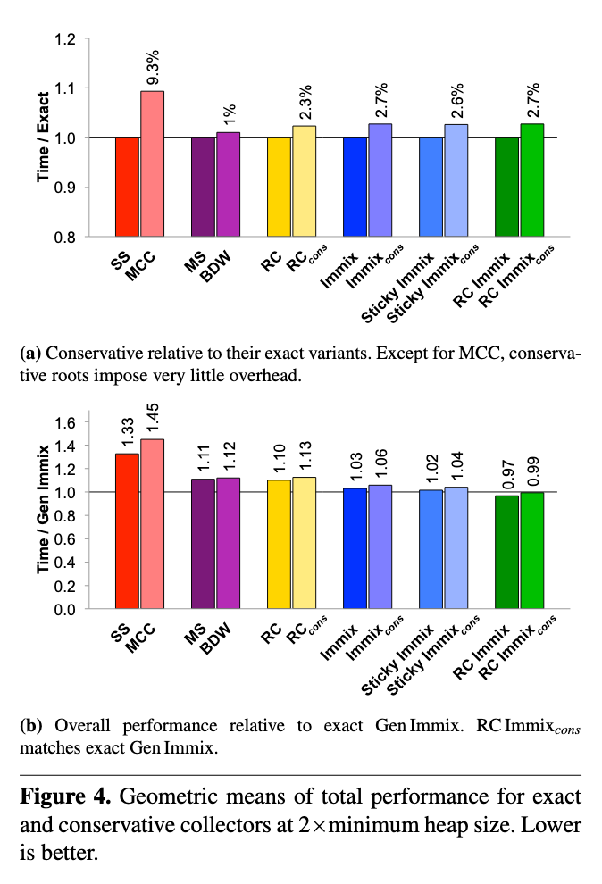

+++
title = "Fast Conservative Garbage Collection"
[extra]
bio = """
  Patrick LaFontaine is a senior undergraduate student interested in programming language design and implementation. He also enjoys backpacking and attempting to bake the perfect loaf of bread.
"""
[[extra.authors]]
name = "Patrick LaFontaine"
+++

_The talk for this paper given at Microsoft Research is linked [here](https://www.youtube.com/watch?v=x-CBUQxp1vE)._

# Fast Conservative Garbage Collection

Garbage collection relies on identifying a set of root pointers into the heap to keep track of live objects. Without compiler support to identify pointers, garbage collectors must overestimate how many pointers there are to objects on the heap. This leads to performance penalties either in the form of over-conservative garbage collectors with overheads of 12% to 45% or naive reference counting which adds more than 40% overhead. The contributions of this paper include: an extensive look at the current state of conservative garbage collection, the implementation of conservative versions of exact garbage collectors with optimizations to ambiguous reference filtering, and analysis that a conservative, reference counting, garbage collector has similar performance to the state-of-the-art.

## An Introduction to Conservative Garbage Collectors

The job of the garbage collector is to identify memory in the heap that is no longer pointed to by the user. The garbage collector is looking for so-called "Root Pointers" which are pointers that can be used by the user to access heap memory. However, when the garbage collector looks at a value, it is not always clear whether it is the value of a pointer into the heap or an integer that just so happens to have a value in that address range. This is called an "ambiguous reference" as the value may or may not represent a pointer.

At the programmer level, values are often distinguished by a type such as, `int` or `ptr` and in most languages, this type is maintained at run time. In this case, the compiler can tag which values are pointers so that the garbage collector can form a minimal set of root pointers. An exact garbage collector can then be used since it can know that all of the values in the root set that it will operate on are valid pointers. However, in a language that doesn't guarantee the run time type of its values or allows other types to be converted into pointers like C, the compiler is unable to mark which values are pointers. Here, a garbage collector must operate on a set of ambiguous references where it must be careful about what values are freed or moved and is therefore called a conservative garbage collector.

A conservative garbage collector operating on an ambiguous reference is constrained in three ways:

- The reference could be valid in which case whatever object it points to must be maintained. It could be the case that an object is dead but an integer happens to have a value that looks like it points to it so the object is kept around.
- The reference could also actually be a non-pointer value in which case it can't be changed. If you knew it was a pointer, the pointer could be changed and the object it points to in the heap could be moved to improve locality.
- The reference could be a pointer that doesn't point to the full object. For example, the compiler might create a temporary pointer to help index into an array. If you attempted to move the object pointed to by this pointer then the object would become corrupted.

A conservative garbage collector can attempt to filter ambiguous references by checking whether the reference points to a valid object on the heap. This can reject ambiguous references that do not point to an object and are therefore non-pointer values at the cost of some run time overhead. This does not however assert whether an ambiguous reference is a pointer.

However, there is one significant advantage with a conservative garbage collector. An exact garbage collector requires that the compiler identifies all of the pointers for the garbage collector. This often takes the form of tag bits on the values or a stack map which points out which values are pointers. Maintaining this stack map can be fairly challenging though the paper points out that most performant runtimes maintain a stack map for whenever garbage collection occurs.

## Previous Work

The straightforward implementation of a conservative garbage collector is the non-moving garbage collector. The paper describes a Boehm-Demers-Weise garbage collector which uses a list of free memory blocks, partitioned by size. When a block of memory is requested, a free block is chosen from the list holding the minimum size memory block that handles that request. Mark and sweep is then used to reclaim freed blocks. These kinds of garbage collectors do not attempt to move an object after it has been allocated and therefore suffer from memory fragmentation.

In contrast, the Mostly Copying garbage collector is a variation of the semi-space collector. In the exact version, there are two halves of the heap which reallocate live objects to the other half on cleanup, the conservative version cannot do this. Instead, the heap is divided up into a list of pages. Then when it is time to convert from from-space to to-space, instead of going from one-half to another, a new list is created and all of the live objects which cannot be moved from pages that contain them are passed to it. When an object cannot be moved from it's place in memory, it is said to have "pinned" itself or to have "pinned" the page/line it inhabits.

The rest of the previous work are variations on the [Immix](https://dl.acm.org/doi/10.1145/1379022.1375586) created by two of the authors. In the original implementation, the heap is divided up into blocks with each block subdivided into lines. The rest of its execution is like the Mostly Copying garbage collector except that memory allocations pin a series of lines in a block compared to pinning a whole page like was previously done. The most efficient of the variations listed is the [Reference Counted Immix](http://users.cecs.anu.edu.au/~steveb/pubs/papers/rcix-oopsla-2013.pdf). This adds a reference counter for each line instead of each allocated object. The counter sums the number of references to all valid objects in the line. When this number hits zero, the whole line is collected. However, this implementation must fall back on tracing to deal with cycles.

## Contributions

The main contribution of this paper is the novel combination of an optimized object map, the conservative Immix garbage collector, and delayed reference counting.

The object map is a representation of the heap in bitmap form. Each bit corresponds to a possible location for a valid object to be store. All bits start as 0 with an empty heap and are flipped when that bit's corresponding address is allocated to. Likewise, when an object is ready to be deallocated, the bit corresponding to that address is reverted to 0. This allows the garbage collector to quickly check if an ambiguous reference points to a valid object and discard it if it does not. Various optimizations are implemented on top of the bitmap including using hardware instruction support and object alignment.

Delayed reference counting can then be implemented in the conservative Immix collector by treating each ambiguous reference as a possible root. Instead of incrementing a counter on each allocation, you wait to do the counting of allocations pointed to from a possible root until you need to garbage collect. The method is then as follows: get the list of ambiguous references to valid objects, increment the counters of each line for each root reference that points to it, and free all zero count lines. Before the next round of garbage collection, decrement all of the lines that were increment this round by the amount they were incremented. In a way, this is like tracing only at the topmost objects of the heap. Then, only if one of the topmost objects dies do you iterate through its tree decrementing the reference count of lines looking for more objects to free.

## Evaluation

The evaluation for this paper is rather extensive and follows many of the guidelines we would hope for such as:

- describing the choice of benchmarks and why some were left out
- specifying the Java virtual machine used
- parameters like block and line size
- warmup periods
- a description of the hardware and software platforms being used
- reporting both averages and confidence intervals

The goal of their analysis is to show that conservative garbage collectors are not as limited as they might first appear and that a conservative garbage collector can be competitive against the state-of-the-art JVM garbage collector.

### Impact of Conservatism

Probably the most obvious concern with conservative garbage collection is that dead objects will survive in the heap due to an ambiguous reference that is actually a value. In practice, the paper found that these zombie references are not much of a concern. They measured the size of memory retained by undead objects over the memory size of live objects and found the average to be 0.02%. This would suggest that in most cases, the amount of extra objects maintained due to an ambiguous reference is minuscule. I suspect there are two reasons for this: the typical allocation size is small and Java programs do not create values that survive past the filtering process. The first reason is supported by the outlier benchmark "Compress" that has excess retention of up to 6.1% which the authors attribute to large array objects. Java does not allow its users to manipulate its pointers which most likely restricts how often user values are within the correct address range of the heap.

Similarly, since every ambiguous reference must be filtered against the object map, there may be a concern with the amount of overhead added to be conservative. Comparing exact Mark-Sweep with conservative Mark-Sweep, the paper found a 19.8% increase in overhead when garbage collecting. However, the effect on the total run time of the program was 3.7% which suggests that the overhead for just having to filter ambiguous pointers isn't huge. One reason for this is that the garbage collector is not triggered often in typical workloads. Even if filtering is a significant cost on each garbage collection cleanup, the overall run time of the program is dominated by user code. There could be many other factors involved including the number of ambiguous references live at any one time and how often values are created that fall within the address range of the heap.

### Performance

Figure 4 is probably the most important figure in the paper and sums up the performance analysis for conservative garbage collection.

Across the six exact garbage collectors with their conservative counterparts, all but one kept run time overhead below 3% in a straight-up comparison. The authors claim that MCC is an outlier here because of its poor pinning granularity as shown in the previous section. If that wasn't convincing enough, when compared against Gen Immix, the state-of-the-art garbage collector for Jikes RVM, the conservative Immix variations all performed within a few percent excess overhead. In the paper, each benchmark is broken down in detail to show that in all cases the conservative RC Immix stays below 5% overhead of Gen Immix. The paper also verifies that the RC Immix conservative garbage collector stays competitive as available heap size increases.

## Discussion Questions

  1. When might you choose conservative garbage collection over exact garbage collection?
  2. Are there other ways/metrics that garbage collectors should be analyzed for efficiency (the metrics in this paper include excess retention of memory, amount of false pinning, total run time overhead, and GC overhead)? Is the analysis in this paper conclusive?
  3. One possible implication of this work is that C/C++ could become an "efficient" garbage collected language. Would this be a good idea? Why or why not?
