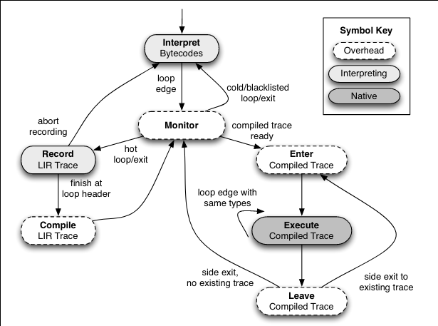
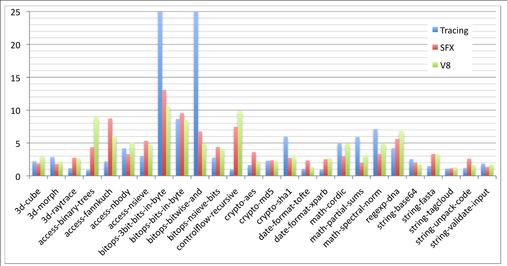
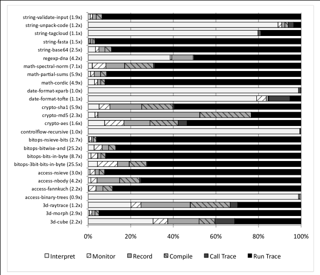

+++
title = """
TraceMonkey: Trace-based Just-in-Time Compilation for JavaScript and Other Dynamic Languages"""
[extra]
bio = """
Will is a senior undergraduate student interested in programming language implementation. He also enjoys autonomous robotics and music peformance."""
[[extra.authors]]
name = "Will Smith"
link = "https://github.com/Calsign/"
+++

This week's paper, [Trace-based Just-in-Time Compilation for Dynamic
Languages](https://dl.acm.org/citation.cfm?id=1542476.1542528) by Gal
et. al., introduces TraceMonkey, a type specialized tracing approach
to a JIT compiler for the SpiderMonkey JavaScript engine used in the
Mozilla Firefox web browser. This paper was the first introduction of
a tracing JIT compiler for a dynamic programming language, and the
contributions are generally applicable beyond the specific application
to JavaScript and SpiderMonkey.

## Background

SpiderMonkey was the first JavaScript implementation, and was
developed alongside the original specification of JavaScript at
Netscape [in
1995](https://developer.mozilla.org/en-US/docs/Glossary/JavaScript). Web
applications have gotten more involved over time, requiring more
capable JavaScript engines. At the time that this paper was published
in June 2009, the existing Firefox engine worked by transforming the
JavaScript syntax into a bytecode and then running an interpreter on
the bytecode. In September 2008, Google released their Chrome browser
and with it the [V8 JavaScript
engine](https://v8.dev/blog/10-years). V8 introduced just-in-time
(JIT) compilation of methods, which granted it a significant
performance boost over the competing JavaScript runtimes. This paper
seems largely driven by a need to respond in kind with Firefox's
engine.

Just-in-time compilation is a technique in which code is compiled into
machine code while it is being executed, rather than being compiled
upfront (e.g. C/gcc) or interpreted directly
(e.g. Python/CPython). JIT was pioneered with Java and the JVM in the
90's, but JIT found a new use case with V8 because it improved
performance of JavaScript which is distributed as source code and thus
cannot be compiled in advance.

Another benefit of using a JIT, as leveraged by this paper, is that in
general, JavaScript types are not known until runtime. For example,
the `+` operator in the following code could mean either number
addition or string concatenation.

```js
function ambiguous(a, b) {
    return a + b;
}
```

If this code were compiled ahead-of-time, it would have to include
checks on the types of `a` and `b` and select the correct operation to
perform, essentially encoding the interpreter logic in the compiled
code, which hampers efficiency. Perhaps a different approach would be
to compile different versions of the function for each possible typing
of the variables, but this approach would become intractable quickly
because the number of possible typings scales exponentially with the
number of variables. By using a JIT compiler, however, it is possible
to compile type-specific versions of the above function for only those
typings that are actually used by the program, and this is one of the
key contributions of this paper.

V8 used a method-based JIT compiler, which means that it detected
"hot" (frequently-executed) functions to compile, and the functions
are compiled as a unit much like in a normal ahead-of-time compiler. A
different approach, which was used by Gal et. al. in this paper, is a
trace-based JIT compiler, which detects hot traces through the
program, which are linear sequences of bytecode instructions that
cross branches and function invocations.

The authors chose to emphasize loops, and in fact these are the only
pieces of code that TraceMonkey compiles. The rationale for this
approach is that programs spend most of their time in loops, so this
is where the greatest performance improvements can be obtained. In
particular, the authors focus on effectively handling nested
loops. Consider the following example, an implementation of the Sieve
of Eratosthones taken from the paper:

```js
for (var i = 2; i < 100; ++i) { // outer loop
    if (!primes[i])
        continue;
    for (var k = i + i; i < 100; k += i) // inner loop
        primes[k] = false;
}
```

An issue with a naive trace-based JIT implementation is that the inner
loop becomes hot before the outer loop. When recording a trace that
starts in the inner loop, the inner loop will eventually terminate and
continue to the outer loop. The tracing will then continue into the
inner loop again, resulting in a separate trace from inner loop to
outer loop back to inner loop for each possible way in which the inner
loop can terminate (tail duplication). The number of different traces
becomes problematic quickly because we want to reuse the same compiled
trace as much as possible. This paper introduces a technique for
remedying this issue that the authors refer to as _nested trace
trees_.

## Design

Here is the high-level state machine diagram that the authors use to
explain the design of TraceMonkey:



The engine executes the JavaScript interpreter as normal until is
encounters a loop edge, a bytecode instruction marking the beginning
of a loop. The engine keeps track of the number of times it has
encountered each loop edge in order to determine when a loop edge has
become hot; the implementation presented in the paper does so the
second time that a loop edge is encountered (which seems quite
aggresive!).

When a hot loop is entered, TraceMonkey switches to monitor mode,
where it records the code being interpreted as a lowerer intermediate
representation (LIR) in SSA form, a format that is suitable for input
to the JIT compiler. Tracing stops at the end of the loop, or earlier
if some kind of error occurs.

When tracing completes successfully, the LIR is compiled by nanojit, a
small JIT compiler developed for TraceMonkey. The resulting compiled
code is stored in the trace cache. When the loop header is encountered
again, the compiled version can be used instead.

The LIR trace is linear, so for each branch (e.g. `if` statement), it
follows the path that was taken by the program when it was being
traced. This condition may not evaluate the same way each time through
the trace, so the trace also needs to keep track of _guard_s, which
essentially mirror the branches that they replace. The guard checks
the requisite condition and exits the execution of the compiled code
if it is not met.

Each guard in a trace is a potential new place to start a trace; such
traces are called _branch traces_. These branch traces can be traced
when the guards that spawn them themselves become hot. When taken
together, an original trace and its branch traces are referred to as a
_branch tree_. If a loop executes enough times, all of its branches
will be compiled, resulting in a fully native implementation of the
loop.

When tracing an outer loop, the tracing may encounter an inner
loop. In this scenario, if the inner loop has already been compiled,
then the outer loop simply invokes the compiled inner loop, resulting
in a nested trace tree. If the inner loop has not been compiled, then
the outer loop is aborted so that the inner loop can be traced. This
approach is the authors' solution to the issue with tail duplication
in nested loops described above.

## Implementation

### Trace cache

The trace cache stores compiled traces. Each trace tree in the cache
is uniquely identified by the loop edge that starts the tree and by a
trace map, which is a mapping from all variables to their types at the
beginning of the trace. The trace records LIR for the actual runtime
type of each variable, and the variables could have different types in
different executions, so it is important to only run the compiled
traces with the types that they were compiled for. Thus the trace
cache will eventually contain a separate compiled trace for each trace
map used by the program, but the number of trace maps will be bounded
by the number actually used by the program, so at the very least there
will not be unnecessary compiled traces. The authors liken the trace
map of a trace tree to the signature of a function.

### Type stability & convergence

When the trace of a loop body is completed and the control flow
returns to the start of the loop, if the present trace map matches the
trace map used to start the trace (i.e. the loop is _type stable_),
then the compiled trace can simply jump back to the start of the loop,
"tying the knot". The loop will not run forever unless the loop in the
original program ran forever because it will eventually cause a guard
to fail, breaking out of native execution and following a different
path of control flow.

Not all loops are type stable. Consider the following (admittedly
contrived) piece of code:

```js
var x;
for (var i = 0; i < 100; ++i) {
  x = 1;
}
```

The first time the loop is encountered, the type of `x` is undefined,
but the second time through it is now a number and remains that way
for the rest of execution. Thus this loop converges to type stability.

In such a situation, TraceMonkey will produce a seprate compiled trace
for each type map, but eventually it will be able to tie the knot as
the input and output types converge. Other more complicated
convergence patterns are possible, including topologies where the
control oscillates between two or more compiled traces, but these
scenarious are still handled elegantly by this approach.

### Integer specialization

JavaScript does not have a native integer type; instead, all numbers
are implemented as 64-bit floating point numbers,
i.e. "doubles". However, many use cases of numbers use them only as
integers, and processor integer instructions are considered cheaper
than their floating-point counterparts, so it is desirable to use
integer operations when possible.

To this end, TraceMonkey speculatively assumes that all numbers are
integers and backtracks if it is discovered that a particular variable
must instead be a float. When such backtracking occurs, TraceMonkey
records that that variable must be a float for the given trace in an
"oracle". When restarting the loop, the trace map is constructed in
part by referencing the oracle and not speculatively assigning any
variable to be an integer if the oracle says otherwise.

### Optimizations

After the trace is recorded as LIR, nanojit runs a simple set of
optimization passes followed by register allocation to produce machine
code. As the LIR is a linear sequence of instructions in SSA form, all
optimizations can be done in linear time and are straightforwardly
local.

The optimization passes are noticeably simpler than those used by
static compilers because it is important not to spend too much time
compiling while the program is executing. Other more recent JavaScript
engines, including V8, go back and re-compile the same code with more
sophisticated optimizations if it stays hot. TraceMonkey does not do
this; perhaps such things are future improvements, or perhaps it was
preferred to focus on the optimizations that deliver the best bang for
your buck.

In addition to the speculative integer conversion, the following
optimizations are performed by nanojit:

 - Common subexpression elimination, a standard optimization (forward
   analysis)
   
 - Constant folding, another standard optimization (forward analysis)

 - Some pinhole optimizations for identities described by the authors,
   e.g. `0 + x` being reduced to just `x` (forward analysis)

 - Dead data-stack store elimination, essentially removing unused
   stack-allocated variables (backward analysis)

 - Dead call-stack store elimination, essentially removing unused
   stack frames code as a result of function inlining (backward
   analysis)

 - Dead code elimination, a standard optimization (forward analysis)

The optimizations run in one forward pass and one backward pass, which
includes greedy register allocation.

Also worth mentioning is that tracing implicitly grants function
inlining for free because all traces follow function calls into
subroutines, so all of the above optimizations have the power of
interprocedural optimizations with the simplicity of local SSA
optimizations.

### Trace stitching

Just as a compiled trace can loop back to its own header, tying the
knot, to make the compiled code more efficient, it is beneficial to be
able to directly jump to a branch trace in the event of a guard
failure. It is in general difficult to perform this jump directly
without returning to the monitor because the register allocation was
performed separately.

Enter branch stitching. The idea is to recompile an entire tree
together when new branches are added, which allows the branches to be
simple jumps with excellent performance. The problem is that
recompiling the entire tree is expensive, especially for trace trees
with lots of short branches. The authors discuss this problem and
propose performing the recompilation in parallel, a technique which
appears to have been adopted by modern JavaScript engines today.

## Evaluation

The authors evaluate TraceMonkey by comparing its performance speedup
on the SunSpider JavaScript benchmark suite relative to the baseline
SpiderMonkey with two other implementations:

 - Google's V8 used in the Chrome browser, a method-based JIT compiler

 - Apple's [SquirrelFish
   Extreme](https://webkit.org/blog/214/introducing-squirrelfish-extreme/)
   (SFX) used in WebKit/Safari, an implementation with selective JIT
   and efficient interpreter engineering (as described by the authors)

Note that neither V8 nor SFX performed type specialization at the
time.

The SunSpider benchmark suite includes appears to have been the
standard benchmark suite in 2009. It included 26 short (less than
250ms runtime) tests covering tasks such as 3D rendering, bit-bashing,
cryptographic encoding, math kernels, and string processing. While
these tests may seem short, it could be considered appropriate in
light of the fact that most JavaScript executes in the first fraction
of a second when loading a web page.

The authors present their results compared to the other engines in the
following graph (TraceMonkey is labelled "Tracing"):



First, TraceMonkey executed 16 of the 26 benchmarks twice as quickly
as SpiderMonkey or faster, and only barely underperformed SpiderMonkey
on three benchmarks. Five of the benchmarks offered a performance
boost of more than 5x, and two of those were 25x. Clearly TraceMonkey
is a big improvement over SpiderMonkey already, but this was not at
all unexpected.

The true test of the tracing approach with type specialization is how
it compares to a method-based JIT like V8 and an efficient interpreter
like SFX. TraceMonkey is the fastest engine on nine of the benchmarks,
and performs worst on thirteen benchmarks. Yet most of the
performances are comparable to those of V8 and SFX; thus the authors'
work is successful because it is a valid alternative to the existing
efficient approaches.

Critically, the poor performances of TraceMonkey are due primarily to
limitations of its implementation that the authors planned to
fix. These limitations include the issue with trace stitching
described above, as well as the inability to trace across recursive
function calls, into regular expression subtitutions with lambda
functions, or through the usage of the `eval` function.

The following graph shows the fraction of time that the benchmarks
spent in each state from the high-level state machine:



As can be seen, the benchmarks that performed the best spent almost
all of their time running compiled traces, while those that performed
the worse either were unable to compile any traces at all (due to
languages features where tracing was not yet supported) or got bogged
down tracing/compiling (possibly due to the issue with trace
stitching). Thus the authors suspect that the performance will be
superior and perhaps exceed that of V8 or SFX once these issues are
ironed out. This paper is largely a proof of concept for tracing JITs
with type specialization, and it is not necessarily expected to
produce an implementation without quirks.

## Discussion

TraceMonkey was
[merged](https://developer.mozilla.org/en-US/docs/Mozilla/Projects/SpiderMonkey/Releases/1.8)
into SpiderMonkey in version 1.8.1 and
[released](https://wiki.mozilla.org/JavaScript:TraceMonkey) as part of
Firefox 3.5. Clearly the work was deemed successful and, eventually,
production-ready.

That being said, TraceMonkey was
[replaced](https://wiki.mozilla.org/JaegerMonkey) by a different
implementation, JaegerMonkey, in 2010. JaegerMonkey is a method-based
JIT with type specialization, rather than a tracing JIT. The current
implementation is [IonMonkey](https://wiki.mozilla.org/IonMonkey),
which is also a method-based JIT with type specialization. It seems
that the tracing never caught on, but the type specialization did.

The two main contributions of this paper are:

1. how to create a tracing JIT for a dynamic language like JavaScript

2. how to integrate type specialization in a JIT for a dynamic
   language like JavaScript

While both are very valuable, it seems that the type specialization is
the more durable contribution.

### Discussion questions

 - TraceMonkey has one pass of lightweight optimizations and a trivial
   register allocator, whereas more modern engines like V8 include
   several passes of increasingly complex optimizations. What kind of
   optimizations should be performed by JIT compilers for dynamic
   languages? When are the tradeoffs between compilation time and
   improved performance worthwhile?

 - Modern JavaScript engines use parallelization to improve
   performance, much like the authors of this paper described doing
   trace stitching in parallel. Yet TraceMonkey does not rely on
   parallelization and other JITs, like the JVM (at least in the
   past), don't seem to either. Are modern JavaScript JIT
   implementations tractable in non-parallel environments?

 - It seems that the major JavaScript engines began adding JIT
   implementations around the same time, circa 2008. Why did this
   transformation happen at that time, and could it have happened
   earlier?

 - Why might Mozilla have abandoned its trace-based JIT in favor of a
   method-based JIT?
