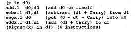

+++
title = "Super Optimization"
[extra]
bio = """
  Socrates Wong is a second year PhD student at Cornell who interest lies in Computer Archicture.
"""
latex = true
[[extra.authors]]
name = "Socrates Wong"
+++

## Background

Most compiler optimization (peephole, dead code elimination, constant propagation, loop invariant code motion, common subexpression elimination) focus on transforming the program in a systematic manner, and the step taken by the optimizer are backed by proofs that are both sound and complete.  Superoptimizer is a new radical way of preforming optimization.  Instead of taking the traditional approach optimizers of transforming the input program, superoptimizer converts the problem in to a search space and attempts to find the shortest program that is able to provide the equivalent output.
The paper we are discussing this week is ["Superoptimizer"][superopt] – A look at the Smallest Program” (Massalin), this paper explains the purpose of superoptimizer, which converts an optimizing problem to a search space, how to reduce the search space and comparison with other common optimization techniques that are common at the publication of the paper.

## Superoptimization

Superoptimization is finding the shortest program by exhaustive search inside a finite search space of the instruction set architecture (ISA).  Compare to other optimization techniques that focus on transformation and matching superoptimization takes it to a whole different level.  Most optimization techniques focus on the potential performance benefit on utilizing a transformation and ensuring correctness of the output by having proofs that the transformation does not affect the equivalence of the original program.  In modern compilers, this can ensure that the result is unchanged, but does not guarantee optimality of the output.  To address the need for the most optimal output, super optimization searches the entire sample spaces set of all possible outcomes) of the instruction set architecture for programs by generating all the possible combinations of instruction with various lengths by starting with the shortest length.

The super optimization performs a test of the generated program determine if the generated program is equivalent with the original program and if they are the same, then generated program will be the optimal program for the ISA.  Although this sounds simple, verifying the generated program is a non-trivial task.  One of the solutions proposed in the paper was Boolean test, which is a test that attempts to verify the logical operations done by the different instructions are equivalent.  However, as the minterms have the order of complexity of $2^31$, it has caused a constraint on the number of instructions that can be generated and verified in a reasonable time to be limited to 3 instructions at the time of publication.  Therefore although the Boolean test is intuitive, and correct an alternative test will be needed in order to test programs with larger amount of instructions.

The paper also has proposed a probabilistic execution test in which the superoptimizer picks a test vector and see if the output results are the same between the test and generated program.  Although this test is not comprehensive, the author claims that there was never a case where probabilistic execution test passes while Boolean test fails.  From a high level perspective, I found it believable.  Assuming a program has one 16-bit output for a given input, the probably of having the correct result by coincidence is $2^16$ in one test case, which is relatively unlikely. Furthermore, the time it takes for exhaustive search can be further reduced by utilization of pruning on the generated sequences that are equivalent to shorter sequences.  The pruning is a done primary by avoiding searching sub-optimal variants of shorter sequences that have been verified to not equivalent by using bi-tables.

## Results

One of the most interesting part of this paper is the results.  Although compare to other papers where they have a long comparison of performance, superoptimizer reported its result by comparing the execution of the input program and assembly.  For example, given the following signum program:

Getting signum program to be implemented in less then 9 assembly statements is already hard.  But superoptimizer managed to convert the program into a series of adds, subtracts, negation without any branches.  Resulting in the following results:

By removing branches and the number of instructions, this implementation has provide huge benefits to modern out of order processors (remove the need of branch predictions) and in both number of execution cycles.    Other results are similar interesting and that demonstrated clearly the different than what a regular compiler would generate.

## Limitations, Merits and Shortcomings

Limitation of super optimization would have been compiler time cost and the limitations on how much potential benefits that can be obtained at run time.  Although super optimization can ensure optimality, it does not necessarily ensure a performance bonus over existing solutions. That being said, this paper has a great impact in both LLVM and GCC communities.  Despite that it is  not being actively used in code compilation that they each have their own super optimization implementation [1](https://github.com/embecosm/gnu-superopt) [2](https://github.com/google/souper), which is partly inspired by this paper. Although this paper has strong merits on the grounds of creating optimal code in applications and usage, it is not very practical in most contemporary compiler.

## Connections to Modern Works

Super optimizations despite having good results has not be very wide adopted in for compilation framework since this paper has been written.  This concept has been reintroduced as papers such as ["Automatic generation of peephole superoptimizers" (Bansal, Aiken 2006)][autopep] Although the usage was vastly different from the original form of super optimization, this concept managed to endure the test of time and leave its make in peephole generation.

## Discussion Questions

- The landscape in the discipline of search has evolved greatly since the publication of the paper in 1987,  especially in aspects such as algorithms, and computational capacity of modern hardware.  To what extent does this affects superoptimizer, and what changes would see if this paper is written now?
- In the discipline of search in computer science, there exist a type of search called heuristics.  To what extent do you think it is acceptable to this topic?
- Although the two most common compiler infrastructure (LLVM and GCC) have a superoptimizer implemented for their infrastructure, it is not currently used in regular compiler sequence.  To what extent is it due to the performance at compilation time, the maturity of super optimizer, the lack of interest of finding the most optimal program, or some other reason that is blocking it from being adopted as a standard compilation tool?

[superopt]: https://courses.cs.washington.edu/courses/cse501/15sp/papers/massalin.pdf
[autopep]:https://theory.stanford.edu/~aiken/publications/papers/asplos06.pdf
